# Boxel CLI

**Bidirectional sync between your local command line agent and [Boxel](https://boxel.ai) workspaces.**

Edit Boxel cards locally with your IDE or AI agent, sync changes instantly, and collaborate seamlessly between web UI and local development.

> **Note:** Boxel CLI is developed and tested with [Claude Code](https://claude.ai/code). For the best experience, install Claude Code first and let it guide you through setup.

---

## Installation

```bash
git clone https://github.com/cardstack/boxel-cli.git
cd boxel-cli
npm install && npm run build
```

Now you can use `npx boxel` (or `boxel` after `npm link`):

```bash
npx boxel profile add              # Set up your account
npx boxel list                     # List your workspaces
npx boxel sync @user/workspace .   # Sync a workspace locally
```

### With Claude Code (Recommended)

If you have [Claude Code](https://docs.anthropic.com/en/docs/claude-code) installed, just start it in the repo:

```bash
claude
```

Claude will detect the Boxel CLI project and guide you through setup automatically.

### Global Command (Optional)

To use `boxel` directly without `npx`:

```bash
npm link
boxel profile add
boxel list
boxel sync .
```

---

## Features

- **Bidirectional Sync** - Push local changes, pull remote updates, resolve conflicts
- **Track Mode** - Auto-checkpoint local edits as you type in your IDE
- **Watch Mode** - Auto-pull server changes with configurable polling
- **Checkpoint History** - Git-based undo/restore with automatic snapshots
- **Multi-Realm Support** - Manage multiple workspaces (code + data separation)
- **GitHub Integration** - Share/gather for team collaboration via PRs
- **Claude Code Integration** - AI-assisted development with Boxel skills
- **Edit Locking** - Prevent overwrites while editing locally
- **Profile Management** - Switch between production and staging environments

## Architecture: Two Git Models

Boxel CLI uses git in **two fundamentally different ways**:

1. **Checkpoint System** (`.boxel-history/`) - Local-only git for undo/restore. Single-user, no remotes, continuous backup. Combined with server sync, can also act as a checkpoint / undo system for hosted Boxel usage.
2. **GitHub Collaboration** (`share`/`gather`) - Traditional branch/merge/PR workflow for team collaboration.

This separation is intentional: **Boxel Server is the source of truth** for your realm, not git.

```mermaid
flowchart TB
    subgraph cloud["☁️ Cloud Services"]
        boxel["🟣 Boxel Server<br/>(Source of Truth)"]
        github["🐙 GitHub Repo<br/>(Team Collaboration)"]
    end

    subgraph local["💻 Local Machine"]
        workspace["📁 Working Folder<br/>/my-workspace"]
        history["📍 .boxel-history/<br/>(Local Git)"]
    end

    %% Sync flow
    boxel <-->|"sync<br/>push/pull"| workspace
    boxel -->|"watch<br/>(pull server changes)"| workspace

    %% Track flow (local file watching)
    workspace -->|"track<br/>(monitor local edits)"| history
    history -->|"restore<br/>history -r"| workspace

    %% GitHub flow
    workspace -->|"share<br/>(export)"| github
    github -->|"gather<br/>(import)"| workspace

    %% Styling
    style boxel fill:#7c3aed,color:#fff
    style github fill:#24292e,color:#fff
    style workspace fill:#3b82f6,color:#fff
    style history fill:#6b7280,color:#fff
```



### Why Two Git Models?

| Aspect | `.boxel-history/` (Checkpoints) | GitHub (Collaboration) |
|--------|--------------------------------|------------------------|
| **Purpose** | Undo/restore safety net | Team code review & merge |
| **Scope** | Single user | Multiple collaborators |
| **Remote** | None (local only) | GitHub origin |
| **Workflow** | Automatic on sync/watch | Manual share/gather |
| **Branches** | Single linear history | Feature branches + PRs |
| **Source of truth** | Boxel Server | Boxel Server (via gather→sync) |

### The Flow

```
┌─────────────────────────────────────────────────────────────────┐
│  INDIVIDUAL WORKFLOW (You + Boxel)                              │
│                                                                 │
│   Boxel Web UI ◄───────► Boxel Server ◄────────► Local IDE     │
│       edit           sync/push/pull              edit           │
│                            │                       │            │
│                   watch ◄──┘                       │            │
│               (pull server changes)                │            │
│                                                    │            │
│                                              track │            │
│                                       (local edits)│            │
│                                                    ▼            │
│                                            .boxel-history/      │
│                                          (checkpoint/restore)   │
└─────────────────────────────────────────────────────────────────┘
                                 │
                    share ↓     ↑ gather
                                 │
┌─────────────────────────────────────────────────────────────────┐
│  TEAM WORKFLOW (Collaboration via GitHub)                       │
│                                                                 │
│   Developer A ──► branch ──► PR ──► review ──► merge           │
│   Developer B ──► gather ◄────────────────────┘                │
│                     │                                           │
│                     ▼                                           │
│              sync --prefer-local                                │
│                     │                                           │
│                     ▼                                           │
│               Boxel Server                                      │
└─────────────────────────────────────────────────────────────────┘
```

**Key insight:** Git is NOT the source of truth. Boxel Server is. Git serves two separate roles:
- **Locally:** Time machine for your work (checkpoints)
- **GitHub:** Collaboration layer for team publishing

---

## Authentication

### Option 1: Profile Manager (Recommended)
```bash
boxel profile add                    # Interactive setup (recommended)
boxel profile list                   # Show profiles (★ = active)
boxel profile switch username        # Switch profile

# Non-interactive (CI/automation only - avoid in shell history)
BOXEL_PASSWORD="pass" boxel profile add -u @user:boxel.ai -n "Prod"
```

> **Security Note:** Avoid passing passwords directly via `-p` flag as they may be exposed in shell history and process listings. Use the interactive wizard or environment variables for credentials.

Profiles stored in `~/.boxel-cli/profiles.json`

### Option 2: Environment Variables
```env
# Production (app.boxel.ai)
MATRIX_URL=https://matrix.boxel.ai
MATRIX_USERNAME=your-username
MATRIX_PASSWORD=your-password

# Staging (realms-staging.stack.cards)
MATRIX_URL=https://matrix-staging.stack.cards
MATRIX_USERNAME=your-username
MATRIX_PASSWORD=your-password
```

---

## Commands Reference

### Sync Operations

```bash
boxel sync .                      # Bidirectional sync (interactive)
boxel sync . --prefer-local       # Keep local on conflicts, sync deletions to server
boxel sync . --prefer-remote      # Keep remote on conflicts
boxel sync . --prefer-newest      # Keep newest by timestamp
boxel sync . --delete             # Sync deletions both ways
boxel sync . --dry-run            # Preview only

boxel push ./local <url>          # One-way push (local → remote)
boxel pull <url> ./local          # One-way pull (remote → local)
```

### Track & Watch

```bash
# Track LOCAL file changes (checkpoint as you edit in IDE)
boxel track .                     # Track local edits, auto-checkpoint
boxel track . -d 5 -i 30          # 5s debounce, 30s min between checkpoints
boxel track . -q                  # Quiet mode

# Watch REMOTE server changes (pull external updates)
boxel watch .                     # Watch single workspace (30s default)
boxel watch . ./other-realm       # Watch multiple realms
boxel watch                       # Watch all configured realms
boxel watch . -i 5 -d 3           # 5s interval, 3s debounce
boxel watch . -q                  # Quiet mode

# Stop all watchers and trackers
boxel stop                        # Stops all running watch (⇅) and track (⇆) processes

boxel status .                    # Show sync status
boxel status --all                # All workspaces
boxel status . --pull             # Auto-pull changes
```

**Track vs Watch:**
| Command | Symbol | Direction | Purpose |
|---------|--------|-----------|---------|
| `track` | ⇆ | Local → Checkpoints | Backup your IDE edits as you type |
| `watch` | ⇅ | Server → Local | Pull external changes from Boxel web UI |

### History & Checkpoints

```bash
boxel history .                   # View checkpoint history
boxel history . -r                # Interactive restore
boxel history . -r 3              # Quick restore to #3
boxel history . -r abc123         # Restore by hash
boxel history . -m "Message"      # Create checkpoint with message

boxel milestone . 1 -n "v1.0"     # Mark checkpoint as milestone
boxel milestone . --list          # Show milestones
```

### File Management

```bash
boxel edit . file.gts             # Lock file before editing
boxel edit . --list               # Show locked files
boxel edit . --done file.gts      # Release lock
boxel edit . --clear              # Clear all locks

boxel touch .                     # Force re-index all files
boxel touch . Card/instance.json  # Touch specific file

boxel check ./file.json           # Inspect file sync state
boxel check ./file.json --sync    # Auto-sync if needed
```

### Workspace Management

```bash
boxel list                        # List your workspaces
boxel create my-app "My App"      # Create new workspace
```

### Multi-Realm Configuration

```bash
boxel realms --init               # Create .boxel-workspaces.json
boxel realms                      # Show configuration
boxel realms --add ./code --purpose "Definitions" --patterns "*.gts" --default
boxel realms --add ./data --purpose "Content" --card-types "Post,Product"
boxel realms --llm                # Output file placement guidance
boxel realms --remove ./code      # Remove realm
```

### GitHub Workflows

```bash
boxel share . -t /path/to/repo -b branch-name    # Export to GitHub
boxel share . -t /repo -b branch --no-pr         # No auto-PR

boxel gather . -s /path/to/repo                   # Import from GitHub
boxel gather . -s /repo --branch feature          # From specific branch
```

### Skills (AI Instructions)

```bash
boxel skills --refresh            # Fetch skills from Boxel
boxel skills --list               # List available
boxel skills --enable "Name"      # Enable skill
boxel skills --export .           # Export to .claude/commands/
```

---

## Key Workflows

### Active Development (with auto-backup)
```bash
boxel track .                     # Start tracking local edits
# In another terminal or IDE, edit files...
# Checkpoints created automatically as you save

# IMPORTANT: Track creates LOCAL checkpoints only!
# When ready to push changes to Boxel server:
boxel sync . --prefer-local       # Push changes to server
```

**Remember:** `track` does NOT sync to server - it only creates local checkpoints for safety. Always run `sync --prefer-local` when you want your changes live.

### Active Development (with edit lock)
```bash
boxel edit . my-card.gts          # Lock file (if watch is running)
# ... edit locally ...
boxel sync . --prefer-local       # Push changes
boxel touch . Card/instance.json  # Force re-index
boxel edit . --done my-card.gts   # Release lock
```

### Undo Server Changes (Restore)
```bash
# STOP watch first (Ctrl+C)
boxel history .                   # Find checkpoint
boxel history . -r 3              # Restore to #3
boxel sync . --prefer-local       # CRITICAL: sync deletions to server
```

### Monitor Server While Working
```bash
boxel watch . -i 30 -d 10         # 30s poll, 10s debounce
# Checkpoints created automatically
boxel history .                   # Review what changed
```

### Collaborative with GitHub
```bash
# Share to GitHub
boxel share . -t /path/to/repo -b feature/my-work --no-pr
# Push via GitHub Desktop

# Teammate gathers
boxel gather . -s /path/to/repo --branch feature/my-work
boxel sync . --prefer-local       # Push to Boxel server
```

---

## Critical Patterns

### 1. Always Use `--prefer-local` After Restore
```bash
boxel history . -r 3              # Deletes files locally
boxel sync . --prefer-local       # Syncs deletions to server
```
Without this, deleted files won't be removed from server.

### 2. Stop Watch Before Restore
Watch will re-pull deleted files if running during restore.

### 3. Lock Files When Editing Locally
```bash
boxel edit . file.gts             # Lock before editing
# ... edit ...
boxel sync . --prefer-local
boxel edit . --done file.gts      # Release after sync
```

### 4. Touch Instances After Definition Changes
```bash
# After updating card-def.gts remotely
boxel touch . CardDef/instance.json  # Force re-index
```

### 5. Write Source Code, Never Compiled Output
When editing `.gts` files, write clean source code:
```gts
export class MyCard extends CardDef {
  static fitted = class Fitted extends Component<typeof MyCard> {
    <template>
      <div>...</div>
      <style scoped>...</style>
    </template>
  };
}
```
**NEVER** write compiled JSON blocks or base64-encoded imports.

---

## File Structure

```
workspace/
├── .boxel-sync.json          # Sync manifest (auto-generated)
├── .boxel-history/           # Checkpoint history (git-based)
├── .boxel-edit.json          # Edit locks (auto-generated)
├── .boxel-workspaces.json    # Multi-realm config (optional)
├── .realm.json               # Workspace config
├── index.json                # Workspace index
├── blog-post.gts             # Card definition (kebab-case)
└── BlogPost/                 # Instance directory (PascalCase)
    └── my-post.json          # Instance file
```

### Naming Conventions

| Type | Convention | Example |
|------|------------|---------|
| Definitions | `kebab-case.gts` | `blog-post.gts` |
| Instance dirs | `PascalCase/` | `BlogPost/` |
| Instance files | `kebab-case.json` | `my-first-post.json` |

### Module Paths (Critical!)

The `adoptsFrom.module` path is **relative to the JSON file**:

```json
// In BlogPost/my-post.json:
{
  "data": {
    "meta": {
      "adoptsFrom": {
        "module": "../blog-post",  // Go UP to parent
        "name": "BlogPost"
      }
    }
  }
}
```

| JSON Location | Definition | Module Path |
|--------------|------------|-------------|
| `root/Card.json` | `root/card.gts` | `"./card"` |
| `root/Card/instance.json` | `root/card.gts` | `"../card"` |

### Field Type Rules

| Field Type | In `.gts` use | In `.json` use |
|------------|---------------|----------------|
| Extends `CardDef` | `linksTo` / `linksToMany` | `relationships` |
| Extends `FieldDef` | `contains` / `containsMany` | `attributes` |

---

## Workspace References

Commands accept:
- `.` - Current directory (needs `.boxel-sync.json`)
- `./path` - Local path
- `@user/workspace` - By name (e.g., `@aallen90/personal`)
- `https://...` - Full URL

---

## Checkpoint System

**Classification:**
- `[MAJOR]` - New/deleted files, .gts changes, >3 files
- `[minor]` - Small updates to existing .json files

**Source indicators:**
- `⇆ LOCAL` (green) - Local edits (from `track` command)
- `⇅ SERVER` (cyan) - External change from web UI (from `watch` command)
- `● MANUAL` (magenta) - Restored

**Milestones:** Mark important checkpoints with `boxel milestone`

---

## Conflict Resolution

| Scenario | Flag | Result |
|----------|------|--------|
| Keep local | `--prefer-local` | Overwrite remote, sync deletions |
| Keep remote | `--prefer-remote` | Overwrite local |
| Keep newest | `--prefer-newest` | Compare timestamps |
| Sync deletions | `--delete` | Delete on both sides |
| Interactive | (default) | Prompt for each conflict |

---

## Understanding Boxel URLs

URLs like `https://app.boxel.ai/user/realm/Type/card-id` are **Card IDs**, not fetchable URLs.

| URL Part | Meaning |
|----------|---------|
| `app.boxel.ai` | Production server |
| `user` | User/organization |
| `realm` | Workspace name |
| `Type/card-id` | Card type and instance |

**NEVER use WebFetch** on Boxel URLs (realms are private). Look for local synced copy:
```bash
# Parse: Type/card-id → ./Type/card-id.json
cat ./Type/card-id.json
```

---

## Troubleshooting

| Issue | Solution |
|-------|----------|
| "Authentication failed" | Check `boxel profile`, verify web login works |
| "No workspace found" | Run `boxel list`, use full URL for first sync |
| Files reverting after restore | Stop watch first, use `--prefer-local` after |
| Watch not detecting changes | Check interval, verify workspace URL |
| Definition changes not reflected | `boxel touch . Instance/file.json` |

---

## Development

```bash
npm install                     # Install dependencies
npm run dev -- <command>        # Run CLI in development mode
npm run build                   # Compile TypeScript
npm test                        # Run tests
npm run lint                    # Check code style
```

> **Note:** Use `npm run dev -- <command>` during development (no rebuild needed). After build, use `npx boxel` or `boxel` (after `npm link`).

### Claude Code Integration

This repo includes Claude Code support in `.claude/`:
- `CLAUDE.md` - Project instructions and command reference
- `commands/` - Slash commands (`/watch`, `/restore`, `/sync`, etc.)

When you open this repo in Claude Code, it will guide you through setup and provide AI-assisted development.

---

## Contributing

PRs welcome! Please ensure:
- Code passes linting (`npm run lint`)
- New features have documentation
- Breaking changes are noted in PR description

---

## License

MIT - See [LICENSE](LICENSE)

---

## Links

- [Boxel](https://boxel.ai) - Main website
- [Discord](https://discord.gg/cardstack) - Community support
- [GitHub Issues](https://github.com/cardstack/boxel-cli/issues) - Bug reports & features
