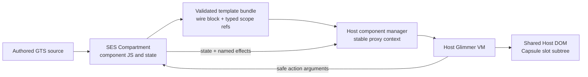

# Capsule execution through Glimmer and the Host DOM

**Status:** branch-specific implementation review for
`codex/boxel-execution-runtime-architecture`.

**Audience:** Ember and GlimmerVM maintainers evaluating whether Boxel's
Capsule renderer uses supported framework contracts, where it depends on
compiler/VM internals, and whether the shared-document containment argument is
sound enough to admit more unknown authored cards.

This is a companion to the
[execution runtime reviewer's guide](boxel-execution-runtime-reviewers-guide.md).
The normative Boxel boundary contract remains the
[Boxel Rendering Protocol](boxel-rendering-protocol.md).

## Executive assessment

A Capsule is **not a DOM sandbox** in the iframe sense. It is a JavaScript
authority boundary plus a constrained rendering bridge:

1. authored component classes, state, getters, and actions run in an SES
   `Compartment` with no ambient `window`, `document`, storage, or `fetch`;
2. Boxel captures the component's compiled Glimmer template descriptor inside
   that compartment;
3. it validates the serialized Glimmer block and rewrites every scope entry to
   one of three boundary references: another authored component, an approved
   trusted export, or JSON data;
4. the Host reconstructs a component definition with Ember's component-manager
   and template APIs; and
5. the Host's own Glimmer VM executes that template and mutates the shared Host
   document.

No live `Element`, `Event`, owner, service, Store, Loader, or authored function
is handed to authored Capsule JavaScript. Nevertheless, the compiled template
is a consequential channel: it is an instruction program interpreted by a
trusted Glimmer VM with access to the Host DOM. Containment therefore depends
on the completeness of Boxel's template, scope, trusted-export, event, and CSS
policies and on the stability of the Glimmer wire format they inspect.

The current design has valuable properties:

- one Host Glimmer runtime renders Direct and Capsule content;
- trusted Base/Cardstack components are reused by reference rather than
  serialized or reimplemented;
- component and DOM identity survive ordinary argument updates;
- authored actions receive reduced event data and can emit only named Host
  effects;
- nested authored fields and cards re-enter the same execution router; and
- unsupported browser behavior is promoted to an origin-isolated Sandbox
  iframe instead of being emulated by a generic DOM escape hatch.

The main concern is not an identified direct `document` leak. It is that Boxel
currently treats a partly validated, unversioned Glimmer compiler artifact as
an executable boundary format. Before expanding Capsule admission materially,
we should either obtain an Ember-supported portable-template contract or make
the present coupling explicit, versioned, exhaustively validated, fuzzed, and
fail-closed across Ember upgrades.

## The exact boundary

The phrase "Capsule renders into the Host DOM" can be misleading. The
authored component does not call DOM APIs remotely. Instead, two programs
cooperate across a synchronous membrane:



What crosses from the Capsule toward the Host:

- a protocol-versioned graph of template descriptors;
- serialized Glimmer `block` strings;
- typed scope references, never arbitrary scope functions;
- cloneable component state and getter return values;
- reduced action return values; and
- named effects such as `view-card` and `set`.

What crosses from the Host toward the Capsule:

- a membrane whose reads clone the current named arguments;
- cloneable render/model data;
- reduced action arguments; and
- stable closures for specifically granted effects.

What does **not** cross:

- live DOM nodes or native browser events;
- an Ember owner or dependency-injection container;
- the Host Card API instance, Store, Loader, network, or service objects;
- arbitrary callbacks from a template scope; or
- the Host's component class for a trusted portal.

Trusted components are resolved on the Host side. The Capsule bundle carries
only a `(module, export)` identity for them.

## End-to-end implementation

### 1. Routing chooses Capsule before any template runs

[`boxel-source-classifier.ts`](../packages/host/app/lib/boxel-source-classifier.ts)
classifies an authored module and its static import graph. Browser globals,
DOM-dependent libraries, arbitrary modifiers, dynamic inline styles, global
CSS, top-layer markup, and similar signals promote full formats to Sandbox.
Otherwise authored modules default to Capsule.

Classification is a compatibility decision and an early security layer, but
it is not the final verifier. The Capsule evaluator independently rejects
inadmissible template and scope content. This second check is important: a
classifier miss must become a visible refusal, not Host DOM authority.

The common runtime interface is
[`BoxelRuntime`](../packages/host/app/lib/boxel-runtime.ts):

```ts
export interface BoxelRuntime {
  readonly mode: 'direct' | 'capsule' | 'sandbox';

  loadBoxel(ref: CodeRef): Promise<BoxelTypeHandle>;
  createFromSerialized(
    resource: LooseCardResource,
    document: LooseSingleCardDocument,
    relativeTo: RealmResourceIdentifier | undefined,
    purpose: MaterializationPurpose,
  ): Promise<BoxelInstanceHandle>;
  buildRenderRecord(card: BoxelInstanceHandle): Promise<BoxelRenderRecord>;
  dispose(handle: RuntimeHandle): Promise<void>;
}
```

[`CapsuleBoxelRuntime`](../packages/host/app/lib/capsule-boxel-runtime.ts)
implements this contract with opaque handles and cloneable records. It caches
render slots per type, format, and explicit component provider. A missing
authored format returns a trusted Base render slot rather than copying Base's
default template into SES.

### 2. Authored modules execute in SES

[`CapsuleModuleEvaluator`](../packages/host/app/lib/capsule-module-evaluator.ts)
calls `lockdown()` once and creates a principal-named `Compartment`. The Host
currently chooses compatibility-oriented taming for the trusted start
compartment:

```ts
lockdown({
  evalTaming: 'unsafe-eval',
  consoleTaming: 'unsafe',
  errorTaming: 'unsafe',
  localeTaming: 'unsafe',
  overrideTaming: 'severe',
});
```

These settings preserve the existing Host Loader, diagnostics, locale
formatting, Monaco, and generated prototype code. They do not endow those
globals into the Capsule. The evaluator's ambient probe asserts that the
ordinary Capsule receives no `window`, `document`, `localStorage`, `fetch`, or
`XMLHttpRequest`. It receives hardened/pure facilities such as `Intl`, bounded
`structuredClone`, and URL parsing.

Dynamic import is rewritten by the Boxel Loader, so the evaluator supplies a
denial-shaped `import.meta.loader` rather than the real Loader:

```ts
loader: harden({
  import(): never {
    throw new Error(
      'CAPSULE_DYNAMIC_IMPORT_DENIED: dynamic import requires Sandbox execution',
    );
  },
  fetch(): never {
    throw new Error(
      'CAPSULE_DYNAMIC_FETCH_DENIED: resource fetch requires an explicit capability',
    );
  },
}),
```

Framework imports inside the compartment are explicit facades, not the Host
namespaces. Examples include a minimal Glimmer component base, tracking/action
decorators, `on`, template-only components, selected helpers, Card API data
semantics, and an explicit subset of runtime-common. Adding an export to the
real package does not automatically grant it to authored code.

### 3. Template registration is captured, not installed

The evaluator shims `@ember/component` and `@ember/template-factory`. Compiled
GTS still performs its normal registration calls, but the Capsule versions
capture the descriptor:

```ts
private emberComponentFacade() {
  return harden({
    setComponentTemplate: (factory, component) => {
      let descriptor = factory()?.parsedLayout;
      if (!descriptor) {
        throw new Error('Card template factory returned no layout');
      }
      this.templateByComponent.set(
        component,
        this.captureDescriptor(descriptor),
      );
      return component;
    },
  });
}

private templateFactoryFacade() {
  return harden({
    createTemplateFactory: (descriptor) =>
      harden(() => ({ parsedLayout: descriptor })),
  });
}
```

`captureDescriptor()` retains `id`, serialized `block`, `moduleName`, strict
mode, scoped stylesheet requests, and a lazy `scope()` closure. Scope must stay
lazy because compiled templates may refer to bindings declared later in the
module; eagerly calling it during `setComponentTemplate()` creates temporal
dead-zone failures that ordinary Ember does not.

The captured closure never leaves SES. `bundleFor()` invokes it only after
module evaluation completes and translates each returned value into a typed
boundary reference:

```ts
type CapsuleScopeReference =
  | { kind: 'authored-component'; component: string }
  | { kind: 'trusted-export'; module: string; name: string }
  | { kind: 'literal-value'; value: JSONValue };
```

An authored component is recursively included in the template graph. An
approved Cardstack/Base export becomes a Host-resolved identity. A literal is
JSON-cloned. Any other function or symbol is rejected:

```ts
if (typeof value === 'function' || typeof value === 'symbol') {
  throw new Error(
    'template scope contains an executable value without a trusted module identity',
  );
}
```

This translation is the most important protection against a template scope
becoming an arbitrary-code tunnel into the Host.

### 4. Boxel validates selected DOM effects in Glimmer wire format

Before a non-trusted template is bundled,
`validateTemplateDOMPolicy()` in
[`capsule-module-evaluator.ts`](../packages/host/app/lib/capsule-module-evaluator.ts)
walks the JSON-decoded block. Today it recognizes numeric Glimmer opcodes for
static and dynamic attributes and refuses:

- popover/command attributes that enter the browser top layer;
- dynamic inline style except the Host-owned `cssVar` helper;
- unvalidated literal inline style; and
- literal unscoped `<style>` elements.

Head output is handled separately by replacing literal tags with inert custom
elements before a trusted detached parser observes them.

This works, but the implementation is coupled to opcode numbers such as
`OpenElement = 10`, static attributes `14/24`, dynamic attributes
`15/16/22/23`, and the expression shape used for a helper invocation. Those
numbers and nested array shapes are the clearest private-API dependency in the
current implementation. The same concern applies to accepting `block` as an
opaque compiler string and recreating a scope array in positional order.

### 5. The Host reconstructs real Glimmer components

[`capsule-component.ts`](../packages/host/app/lib/capsule-component.ts) is the
Glimmer bridge. It uses:

- `capabilities()` and `setComponentManager()`;
- `createTemplateFactory()`;
- `setComponentTemplate()`; and
- a private Host definition object per captured authored component.

For each descriptor, the Host resolves the typed scope references, recreates a
template factory, and associates it with that private definition:

```ts
let scope = await Promise.all(descriptor.scope.map(resolveScope));
let template = createTemplateFactory({
  id: `${descriptor.id}-capsule`,
  block: descriptor.block,
  moduleName: descriptor.moduleName,
  scope: () => scope,
  isStrictMode: descriptor.isStrictMode,
});
setComponentTemplate(template, definition);
```

`authored-component` resolves to another private Capsule definition.
`trusted-export` resolves through the Host Loader. `literal-value` is cloned
again. Therefore Host Glimmer sees an ordinary strict-mode component graph,
but no authored constructor or scope closure has entered the Host realm.

The custom manager uses the public component-manager shape:

```ts
class CapsuleComponentManager {
  capabilities = capabilities('3.13', {
    destructor: true,
    updateHook: true,
  });

  createComponent(definition, args) {
    /* create SES instance handle */
  }
  getContext(state) {
    /* return stable Host proxy */
  }
  updateComponent(state, args) {
    /* swap live argument path */
  }
  destroyComponent(state) {
    /* release handle and styles */
  }
}
```

The manager and Glimmer VM live in the same Host JavaScript realm. There is no
async RPC in `getContext()`, which would be incompatible with Glimmer's
synchronous render protocol.

### 6. Component logic stays in SES while Glimmer reads a Host proxy

[`capsule-component-runtime.ts`](../packages/host/app/lib/capsule-component-runtime.ts)
creates one authored component instance in SES and one stable Host-owned
`CapsuleComponentContext`. The Host context installs property descriptors:

- state getters read the latest cloned state;
- authored getters synchronously invoke `readComponentProperty()` in SES; and
- authored actions synchronously or asynchronously invoke the named action in
  SES.

Argument updates do not recreate the authored component. The manager replaces
`argsBox.current`; the SES-side argument membrane reads the new Host value on
its next property access. This keeps local component state and DOM identity
stable.

Reactivity currently uses a tracked revision cell. Action results replace the
Host context's cloneable state and schedule one microtask increment:

```ts
this.state = descriptor.state;
if (!this.revisionPending) {
  this.revisionPending = true;
  queueMicrotask(() => {
    this.revisionPending = false;
    this.revision++;
  });
}
```

The deferral avoids Glimmer's backtracking assertion when an action or derived
state update occurs during a render that already consumed the revision. It is
effective in current tests, but it is an application-level scheduling
protocol, not a Glimmer-provided cross-runtime tracking primitive. We would
like maintainer guidance on the supported way to represent this dependency.

The corresponding SES argument object is a Proxy. Every read performs a JSON
clone into the compartment; it never returns the underlying Host value. The
`model` argument is a nested read-through membrane so a getter evaluated during
a Host render consumes the Host model's current tracked revision.

### 7. Events and writes return as data and named effects

Host Glimmer attaches the trusted `on` modifier. When it invokes an authored
handler, `projectCapsuleActionArguments()` converts a native `Event` into a
bounded `SafeEvent`: selected scalar coordinates, key/modifier values, target
value/check state, and dataset. It does not include the native event, target
element, composed path, view/window, or arbitrary object properties.

The evaluator invokes the action with a cloned argument array and clones its
return value. The only stable Host closures exposed to ordinary authored
components queue named effects:

```ts
effects.push({ type: 'view-card', target, format, options });
effects.push({ type: 'set', value: safeValue });
```

The Host dispatches those effects through the same navigation and canonical
write paths used by Direct rendering. Receiving projected data is not itself
write authority.

### 8. Trusted components are one-way portals

Base and `@cardstack/*` components are ordinary, evolving Ember programs. Boxel
does not serialize them. A trusted scope reference is resolved to the actual
Host export and invoked by Host Glimmer.

This is powerful and intentionally asymmetric. It preserves Base FieldDef
rendering, Rich Markdown, menus, icons, and other framework behavior without
building Capsule-specific copies. It is also a capability boundary: a trusted
helper, component, or modifier can do anything its Host owner and services
allow. The guarantee therefore depends on admitting only exports designed to
receive projected data—not exports that hand an element, owner, service, or
arbitrary callback back to authored code.

Nested authored fields use the Host-owned
[`boxel-field-portal.gts`](../packages/host/app/components/boxel-field-portal.gts).
The portal holds a tracked path to the canonical value and recursively invokes
`BoxelExecutionRenderer`. A Capsule parent can therefore contain a trusted
Base field, which can contain another authored card that is independently
routed to Direct, Capsule, or Sandbox. Trust does not become transitive merely
because the nodes share one visual tree.

### 9. The rendered subtree is a Host-owned slot

[`boxel-execution-renderer.gts`](../packages/host/app/components/boxel-execution-renderer.gts)
mounts the reconstructed component inside the same trusted `CardContainer`
used to apply Boxel themes and operator-mode tracking:

```gts
<CardContainer
  class='boxel-execution-capsule-slot'
  data-boxel-execution='capsule'
  {{surfaceElement this.capsuleSurface}}
>
  <this.capsuleComponent
    @model={{this.state.model}}
    @fields={{this.state.fields}}
    @viewCard={{@viewCard}}
    @set={{@set}}
    @context={{this.capsuleContextProjection}}
  />
</CardContainer>
```

The slot is a policy and diagnostics boundary, not a platform DOM boundary.
It does not create a shadow root, isolated event loop, separate custom-element
registry, or separate CSS origin.

### Glimmer render bounds are not access control

Glimmer normally records the bounds of a component invocation so that an
update or destructor operates on the nodes Glimmer created for that
invocation. That is renderer correctness and lifecycle ownership; it is not a
principal-aware DOM authorization check. Host Glimmer does not know that one
definition came from an SES Capsule, nor does it reject a helper, modifier,
component, custom element, or `{{in-element}}` destination merely because the
resulting DOM access is outside `.boxel-execution-capsule-slot`.

The present containment claim therefore comes entirely from the controls
around Glimmer:

- SES withholds `window` and `document` and constructs authored components
  without an Ember owner;
- the argument and event membranes withhold every live `Element`;
- arbitrary authored modifiers and browser-dependent constructs classify to
  Sandbox;
- executable scope entries must resolve to approved Host exports; and
- template and CSS policy reject known shared-document escape mechanisms.

If a trusted modifier handed its element to authored code, a trusted component
exposed an outside destination, a literal custom element mutated global DOM,
or a new declarative browser feature bypassed policy, Glimmer would not provide
a second security rejection. This is why the DOM vocabulary and trusted-export
registry must be complete before Capsule becomes the default for a broader set
of unknown code.

### 10. Authored styles are scoped and installed in the shared document

[`capsule-css-policy.ts`](../packages/host/app/lib/capsule-css-policy.ts)
requires compiler-produced `data-scopedcss-*` anchors, rejects selectors that
escape them, rejects network-bearing and document-global CSS, and prefixes
every admitted selector with a zero-specificity Capsule ancestor:

```css
:where(.boxel-execution-capsule-slot) .card[data-scopedcss-abc] { ... }
```

The Host then installs the validated CSS as a ref-counted ordinary `<style>`
element in `document.head`. This keeps styles reusable and preserves the
existing Glimmer scoped-CSS behavior, but it also means CSS correctness is
part of the shared-document security argument.

## Current Capsule admission boundaries

This section describes what the branch enforces today, not the larger set of
things that a future Rendering Protocol might express. There are three
different failure outcomes that are easy to conflate:

1. The source classifier sees a browser requirement and routes an applicable
   format to the iframe Sandbox before evaluation.
2. A source classified as Capsule reaches a second, fail-closed verifier and
   is rejected because the compiled artifact is not admissible.
3. An operation is simply absent from the Rendering Protocol, so authored code
   receives no object or method with which to request it.

The classifier is a usability optimization and early policy decision. The
Capsule evaluator, template verifier, protocol decoder, and Host capability
handlers are the security boundaries. A classifier miss must end in a
Capsule refusal, not expanded ambient authority.

### Boundary 1: JavaScript globals and module loading

**Current enforcement.**
[`boxel-source-classifier.ts`](../packages/host/app/lib/boxel-source-classifier.ts)
recognizes browser globals, DOM-acquiring calls, and known browser packages.
[`capsule-module-evaluator.ts`](../packages/host/app/lib/capsule-module-evaluator.ts)
then evaluates the admitted static graph in an SES `Compartment` with an
explicit endowment set. It does not endow `window`, `document`, `Element`,
`fetch`, storage, or a real Loader. Transpiled dynamic import receives the
`CAPSULE_DYNAMIC_IMPORT_DENIED` refusal.

Allowed today:

```ts
let label = new Intl.NumberFormat('en-US').format(this.args.model.total);
let copy = structuredClone(this.args.model.settings);
```

Classified to Sandbox or refused in Capsule:

```ts
document.querySelector('.host-chrome');
localStorage.setItem('token', secret);
await import(userSuppliedURL);
await fetch('/anything');
```

The RP permits the exact classified static module graph, ordinary hardened
JavaScript, and explicitly registered trusted modules. It does not provide an
ambient module-discovery or network API (RP-6.4, RP-15.2, RP-17.2).

**Harder Capsule option.** Version the exact endowment and trusted-module
manifest as protocol features, make export-level grants visible in the render
record, and require the evaluator to reject any unknown endowment. This is
worth doing because it makes existing Capsule authority auditable; it does not
add new authority.

**Sandbox line.** Code requiring a real browser global, arbitrary dynamic
module loading, arbitrary network access, storage, Worker creation, or a
third-party browser runtime belongs in the iframe. A future named Host
capability may satisfy one narrow use case, but Capsule must not grow a
facsimile of `window` or `document`.

### Boundary 2: Boxel data, model reads, and Host objects

**Current enforcement.** The Store remains Host-owned. The RP crosses an
`InstanceProjection`, field descriptions, linked-card references, and narrow
context records. The component bridge exposes read-through proxies whose
values are cloneable data. A live Store, Loader, Ember owner, service, CardDef,
or Host closure does not cross unless it is one of the few explicitly named
capability closures.

Allowed today:

```gts
<h2>{{@model.title}}</h2>
<p>{{@model.author.name}}</p>
```

Not available across the boundary:

```ts
this.store.search({ filter: userSuppliedFilter });
this.owner.lookup('service:anything');
this.model.constructor.cardApi;
```

Declared links and queries are materialized by trusted Boxel semantics and
delivered as bounded data. Receiving a card projection does not grant search,
write, or access to neighboring realm content (RP-7, RP-8.4, RP-14.1, RP-21).

**Harder Capsule option.** Make every projection carry an authorization scope,
path/schema allowlist, maximum depth and size, and provenance. Use opaque
resource and relationship references rather than strings where authority is
implied. This is essential authorization work, but it is orthogonal to
Capsule-versus-Sandbox containment.

**Sandbox line.** Moving code to an iframe must never expand what data it may
read. A request for an unbounded live Store or arbitrary search is denied in
both tiers. A non-cloneable Host object should become a narrow named
capability, remain Host-owned, or remain unsupported—not be smuggled through
the iframe.

### Boundary 3: the Glimmer template program

**Current enforcement.** The Capsule captures Glimmer's compiled block and
scope instead of installing it. The Host validates selected DOM effects and
reconstructs it as a `TemplateBundle`. Protocol decoding rejects unknown
dependency kinds. The current DOM verifier catches unscoped style elements,
top-layer attributes, and unsafe inline-style forms, but it is not yet an
exhaustive allowlist of Glimmer opcodes, elements, attributes, namespaces, and
properties.

Allowed today:

```gts
<section class='release'>
  {{#each @model.tracks as |track|}}
    <TrackRow @track={{track}} />
  {{/each}}
</section>
```

Classified to Sandbox or refused in Capsule:

```gts
<style>body { display: none }</style>
<button popovertarget='host-cover'>Cover the page</button>
<div style='transform: translate({{@model.x}}px)'></div>
```

The RP permits a validated, versioned `TemplateBundle` with typed dependencies
and requires an unknown dependency feature to fail closed (RP-14.1 through
RP-14.3).

**Harder Capsule option.** This is the largest and most important middle-zone
project: bind the bundle to compiler, VM, and DOM-policy versions; validate an
exhaustive opcode vocabulary; allowlist element namespaces and
attribute/property effects; reject unknown instructions; and add fixtures for
every admitted declarative DOM operation. An Ember/Glimmer-supported DOM
construction delegate would be preferable to permanently interpreting private
wire opcodes if one can enforce these rules without changing template
semantics.

**Sandbox line.** Any compiler instruction or declarative browser feature that
has not been assigned shared-document semantics must route to Sandbox. Unknown
must never mean “let Host Glimmer try it.”

### Boundary 4: executable template scope

**Current enforcement.** Scope entries are converted to a typed dependency
union. Authored components are recursively captured, trusted components and
helpers are resolved by Host export identity, and literal data is cloned.
Unknown executable functions, symbols, helpers, modifiers, and components are
rejected instead of crossing as callable values.

Allowed today:

```gts
<CardsGrid @cards={{@model.results}} />
<MyAuthoredRow @row={{row}} />
```

Here `CardsGrid` may be a trusted Base export installed by reference, while
`MyAuthoredRow` remains authored logic captured in the same Capsule bundle.

Refused today:

```gts
<SomeUnregisteredThirdPartyComponent />
<div {{arbitraryImportedModifier this.callback}}></div>
```

**Harder Capsule option.** Replace package-level trust with an export-level
registry. Each trusted export should declare its accepted argument schema,
effects, whether it renders outside its invocation bounds, and which named
Host capabilities it may use. Forbid trusted portals from returning Elements,
owners, services, native events, or arbitrary callbacks to authored code.

**Sandbox line.** An arbitrary third-party Glimmer component, modifier, helper,
or custom element that has not received an export-level capability review
belongs in the iframe. “Distributed in an npm package” is not a trust grant.
That iframe uses `credentialless` isolation where supported and an
`allow-scripts`-only opaque origin in Safari and Firefox; this browser
negotiation changes
transport mechanics, not the card's RP entitlement.

### Boundary 5: component lifecycle, reactivity, and Ember ownership

**Current enforcement.** A custom Host component manager owns the Glimmer
definition and maintains one SES component instance across compatible argument
updates. The Host proxy resolves property reads and action calls into the
Capsule. Capsule-authored instances have no Ember owner, so ordinary tracked
state and getters work while service injection and owner lookup do not.

Allowed today:

```ts
@tracked expanded = false;

@action toggle() {
  this.expanded = !this.expanded;
}
```

Unavailable today:

```ts
@service router;
get arbitraryService() {
  return getOwner(this)?.lookup('service:anything');
}
```

**Harder Capsule option.** Define a supported scheduler/tag bridge, explicit
destruction semantics, re-entrancy rules, and per-generation error handling.
Where a common service use case is legitimate, expose its minimum operation as
a versioned RP capability rather than attaching an Ember owner to authored
instances.

**Sandbox line.** Components that require arbitrary Ember DI, an application
owner, browser-service singletons, or unbounded synchronous work should not be
admitted to Capsule. Note that an iframe provides origin and DOM isolation but
does not guarantee CPU isolation; hard CPU budgets need a Worker or process
boundary.

### Boundary 6: DOM construction and mutation

**Current enforcement.** Host Glimmer creates ordinary DOM descendants inside
`.boxel-execution-capsule-slot`. The Capsule has no Element reference and no
generic DOM-request operation. Known direct-DOM imports, globals, methods,
modifiers, top-layer constructs, and unsafe styles classify to Sandbox or are
rejected by the verifier.

Allowed today:

```gts
<article class='proposal' aria-label={{@model.title}}>
  <input value={{@model.name}} {{on 'input' this.rename}} />
</article>
```

Not admitted as Capsule authority:

```ts
element.closest('.operator-mode').remove();
new MutationObserver(...).observe(document.body, ...);
canvas.getContext('webgl2');
```

There is no ShadowRoot, separate custom-element registry, or Glimmer
principal check. A literal custom element, an `{{in-element}}` destination,
or an insufficiently reviewed trusted modifier is therefore a policy gap, not
something Glimmer independently confines.

**Harder Capsule option.** Add an explicit declarative DOM vocabulary:
allowlisted HTML/SVG elements, URL-bearing attributes, reflected properties,
form behavior, custom-element rejection, `in-element` rejection, and strict
namespace rules. If the framework exposes a supported DOM operations delegate,
perform the same checks at element/attribute creation as a defense in depth.

**Sandbox line.** Direct Element access, custom elements, arbitrary modifiers,
portals outside the card slot, canvas/WebGL, observers, pointer lock, dialogs,
and browser-owned widgets remain iframe work.

### Boundary 7: browser events and authored actions

**Current enforcement.** Only the trusted Ember `on` modifier is reified.
Native events are reduced to the versioned `SafeEvent` record: event scalar
fields plus an allowlisted target projection containing values such as
`tagName`, `value`, `checked`, and `dataset`. Action arguments are cloned or
rejected. The live Event and Element never enter SES.

Allowed today:

```ts
@action choose(event: SafeEvent) {
  this.selection = event.currentTarget?.dataset?.id;
}
```

Unavailable today:

```ts
event.target.closest('[data-card]');
event.composedPath();
event.target.setPointerCapture(event.pointerId);
```

Calling `preventDefault()` is also not equivalent to receiving a native Event;
the current record reports `defaultPrevented` but carries no methods.

**Harder Capsule option.** Add narrowly named event effects—such as
`prevent-default`, `stop-propagation`, or pointer capture—only when their timing
and target identity can be validated synchronously by the Host. Define typed
drag, keyboard, input, and composition projections separately rather than
continually widening one event-shaped bag.

**Sandbox line.** Native Event identity, live targets, composed-path access,
unbounded `DataTransfer`, and arbitrary browser event methods stay in the
iframe unless a use case is captured by a small named effect.

### Boundary 8: CSS and presentation

**Current enforcement.** Capsule accepts compiler-produced Glimmer scoped CSS,
adds a Capsule ancestor, parses the result in the browser, and refuses escaped
selectors, network-bearing declarations, document-global rules, named global
layers, and top-layer/view-transition declarations. Literal inline styles are
parsed; dynamic inline styles are limited to the trusted `cssVar` helper.

Allowed today:

```gts
<style scoped>
  .summary { color: var(--boxel-highlight); }
</style>
```

Classified to Sandbox or refused in Capsule:

```css
:global(body) {
  overflow: hidden;
}
@font-face {
  src: url('https://example.test/font.woff2');
}
.card {
  view-transition-name: whole-page;
}
```

**Harder Capsule option.** Version the CSS grammar and policy, namespace
keyframes and other registries, define an exhaustive at-rule/property policy,
and test normalized browser CSS rather than relying only on source spelling.
Projected resource references could eventually support specific image/font
cases without granting general CSS network egress.

**Sandbox line.** Global CSS, page registries, top-layer effects, unrestricted
external resources, view-transition ownership, and styling that intentionally
escapes the card subtree belong in the iframe.

### Boundary 9: resource URLs and browser-initiated egress

**Current enforcement.** JavaScript network egress is absent from Capsule and
CSS network-bearing forms are refused. An authored `` under realm auth is
currently allowed to load natively in the shared Host document, as recorded in
the RP-21 capability matrix. This preserves existing cards, but it means
URL-bearing HTML attributes are a distinct authority channel from `fetch`.

Allowed today:

```gts

```

A potentially unsafe pattern that needs stronger policy is authored data being
assembled into an arbitrary request URL:

```gts

```

The Capsule cannot read the resulting DOM or response, but the browser request
can still disclose projected data. Similar analysis applies to `href`, form
actions, media sources, SVG resource attributes, and future browser features.

**Harder Capsule option.** Replace raw authority-bearing URL strings with an
opaque projected-resource reference. Validate and rewrite every URL-bearing
attribute at the Host boundary; define allowed schemes, origins, credentials,
referrer behavior, redirects, media type, and whether dynamic composition is
forbidden. This is high-payoff Capsule hardening because ordinary images are a
core card feature and do not intrinsically require an iframe.

**Sandbox line.** Arbitrary external egress, scripts, embedded documents,
plugins, or resources needing ambient cookies/origin authority belong in the
iframe. The iframe's gated transport must still enforce the same data and
network entitlement; isolation is not permission.

### Boundary 10: navigation, forms, and top-layer UI

**Current enforcement.** Card navigation is a named `view-card` effect whose
Host handler owns the actual transition. Top-layer attributes such as
`popover`, `popovertarget`, and command relationships are refused. Native
anchors and form semantics are not yet documented as a complete declarative
allowlist, so they belong in the DOM-policy hardening work.

Allowed today:

```ts
this.args.viewCard(linkedCard);
```

Refused today:

```gts
<button popovertarget='outside-card'>Open</button>
```

Potentially admitted today, but not yet covered by a complete declarative
navigation/form policy:

```gts
<a href='https://arbitrary.example/'>Leave Boxel</a>
<form action='https://arbitrary.example/' method='post'>...</form>
```

**Harder Capsule option.** Rewrite navigation and submission into typed intent
records. The Host validates the target, mounted surface, user gesture,
authorization, and destination before acting. Add focus, clipboard write, and
top-layer presentation only as separate named capabilities with revocable
surface grants.

**Sandbox line.** Native navigation control, arbitrary form submission,
unmediated clipboard or focus ownership, fullscreen, dialogs, and top-layer UI
remain iframe behavior until a specific operation has a protocol contract.

### Boundary 11: trusted portals and Boxel context

**Current enforcement.** Trusted Base and `@cardstack/*` components can be
installed into a Capsule template by Host reference. They may use the real
Glimmer and Boxel implementation, while authored code sees only their declared
arguments and output. The Capsule context facade exposes a small projection,
not the full Ember service container. This is how trusted NumberField,
CardContainer, RichMarkdown, and other Boxel building blocks can compose with
authored templates without cloning their implementations.

Allowed today:

```gts
<@fields.quantity />
<@fields.body @format='embedded' />
```

The dangerous shape is a trusted portal that accidentally returns a live
Element, owner, service, Loader, native Event, or outside-slot destination to
authored code. Glimmer will not reject that authority after the portal grants
it.

**Harder Capsule option.** Move from broad package provenance to an
export-level portal manifest, one-way argument schemas, explicit effects, and
adversarial tests for every portal capable of DOM work. A trusted export should
be reviewed as a capability adapter, not merely as code published by Boxel.

**Sandbox line.** Unknown community components, external UI packages, and any
portal that cannot prove one-way data flow and subtree-bounded effects run in
the iframe. Trust does not flow from a trusted child back into its authored
parent.

### Boundary 12: named Surface capabilities

**Current enforcement.** RP-16 defines exactly five Host-owned surface
operations: `presentation`, `layout`, `observe`, `view-card`, and `patch`.
Grants are attached to one mounted surface, use cloneable records and named
effects, and fail closed after release. They do not hand an Element or service
to the Capsule.

Allowed today:

```text
Capsule → presentation({ headerColor }) → Host validates mounted surface
Capsule → view-card({ cardId })          → Host validates and navigates
```

Not allowed today:

```text
Capsule → dom({ selector: 'body', method: 'append', value: ... })
Capsule → service({ name: 'store', method: 'search', args: ... })
```

**Harder Capsule option.** The deferred `surface*` family—pointer, focus,
style, transition, schedule, clipboard, haptics, slot, playback, viewport, and
canvas—can keep some future cards in Capsule when each operation has a small
typed request, a bounded response, surface-local authority, revocation, and
cross-tier conformance tests. Add an operation only after multiple real use
cases demonstrate the same semantic need.

**Sandbox line.** A generic selector/method channel, generic service invocation,
or a surface API whose useful payload is a live browser object is simply
`document` under another name and must not ship. Cards requiring that shape use
the iframe.

### Boundary 13: recursively nested composition

**Current enforcement.** Every authored node is routed independently. A
Capsule component may render a trusted Base field, which may render another
authored Capsule or an origin-isolated Sandbox child. The Host retains the
canonical graph and passes opaque handles and bounded projections at every
edge. A trusted descendant does not upgrade its authored ancestor, and an
iframe descendant does not expose its document to its parent.

Allowed today:

```text
Capsule card
  → trusted Base field portal
    → Capsule linked card
      → Sandbox media card
```

Forbidden authority flow:

```text
Sandbox child Element → trusted Base field → Capsule parent
Capsule parent closure → Sandbox child as an unrestricted callback
```

**Harder Capsule option.** Generate graph-shaped conformance tests—not only
pairwise tests—for tier alternation, formats, field delegation, lifecycle,
mutation, errors, focus, scroll, and teardown. Include principal and surface
identity in every handle so a capability from one node cannot be replayed by a
sibling.

**Sandbox line.** Routing remains per authored module and format. A parent
cannot force a browser-dependent child into Capsule for layout convenience,
and a child cannot cause the whole graph to inherit broader data entitlement.

## How large is the useful middle zone?

There is a real and worthwhile area between today's Capsule and “put it all in
an iframe,” but it is not an invitation to proxy the browser. It divides into
three groups.

### Group A: harden what Capsule already claims — do this

These changes reduce risk without materially increasing Capsule authority:

1. Version and exhaustively validate the Glimmer template/DOM vocabulary.
2. Validate or rewrite all URL-bearing attributes using opaque projected
   resources.
3. Replace package-wide trusted portals with export-level manifests and typed
   one-way argument/effect contracts.
4. Version the SES endowment, trusted-module, SafeEvent, and CSS policies.
5. Add graph-shaped and browser-version conformance tests that fail closed on
   an unknown compiler instruction or platform feature.

This is a medium-sized platform project, not an unbounded compatibility layer.
The difficult part is obtaining a stable Glimmer interception point; the
policy vocabulary itself is finite and Boxel's Card/Field APIs are already
tight. These improvements are worth doing before classifying substantially
more unknown code as Capsule.

### Group B: add narrow semantic capabilities when real cards converge

Several browser-shaped needs can be expressed without browser authority:

- focus a known surface-local target;
- observe a frozen viewport or size record;
- request pointer capture for the element associated with the current event;
- write explicitly supplied text to the clipboard after a gesture;
- coordinate playback with timestamps and commands;
- request a Host-owned transition, navigation, or presentation change; and
- resolve an authorized image, media, or download resource.

Each can be a revocable, typed `surface*` operation. They are good Capsule
features only when the Host can validate the request without accepting a CSS
selector, Element, callback, service name, arbitrary URL, or arbitrary method.
The protocol should gain these one at a time, backed by multiple use cases and
Direct/Capsule/Sandbox conformance—not as one generic bridge.

### Group C: browser/application emulation — do not add this to Capsule

The following should remain strong Sandbox signals:

- `window`, `document`, Element, ShadowRoot, native Event, and custom elements;
- arbitrary Ember owner/service injection or application container access;
- third-party modifiers and browser UI packages without a trusted adapter;
- Canvas/WebGL/WebGPU, map/3D engines, observers, pointer lock, fullscreen, and
  top-layer ownership;
- arbitrary fetch, storage, sockets, workers, dynamic imports, or external
  resource egress;
- global CSS, page registries, and cross-slot portals; and
- generic DOM, service, module, or callback RPC.

Trying to support these in Capsule would make the shared Host document the
security perimeter while rebuilding a partial browser membrane in application
code. That would be more complex and easier to get wrong than the
origin-isolated iframe. If hard CPU isolation is required as well, an iframe is
not sufficient by itself; that use case needs a Worker or separate process.

### Recommendation

Keep Capsule's identity as **data + declarative Glimmer + audited trusted
portals + named surface effects**. Complete Group A, add Group B only where the
real corpus supplies repeated semantics, and route Group C to Sandbox without
apology. This should admit a broad class of ordinary Boxel cards—forms, lists,
computed displays, nested fields, markdown, themes, navigation, and bounded
media—while retaining a simple explanation of why 3D engines, browser-native
widgets, and application-like cards get their own document.

## Framework API stability review

This table deliberately distinguishes an exported API from a stable boundary
artifact. An import can be public while the data shape supplied to it is still
compiler-private.

| Usage                                                                   | Current assessment                                    | Why it matters                                                                                                                     |
| ----------------------------------------------------------------------- | ----------------------------------------------------- | ---------------------------------------------------------------------------------------------------------------------------------- |
| `capabilities('3.13')`, `setComponentManager()`                         | Public component-manager API                          | Appropriate basis for a Host-side adapter, subject to normal manager-version migration.                                            |
| `setComponentTemplate()`                                                | Public association API                                | The usage is conventional once a valid template factory exists.                                                                    |
| Glimmer component base and `@tracked`                                   | Public                                                | Ordinary framework usage.                                                                                                          |
| `createTemplateFactory({ id, block, moduleName, scope, isStrictMode })` | Exported, but Boxel relies on compiler-output details | We need confirmation that external reconstruction from a captured descriptor is supported.                                         |
| Serialized `block` JSON                                                 | Glimmer compiler/VM wire format                       | Boxel treats it as a boundary program and inspects nested arrays/opcode numbers. No explicit compiler/VM version is carried today. |
| Lazy positional `scope()`                                               | Compiler-generated convention                         | Correctly preserves TDZ ordering, but scope position and expression encoding are VM/compiler coupled.                              |
| Numeric opcode checks in `validateTemplateDOMPolicy()`                  | Private/internal coupling                             | An opcode addition or semantic change can bypass a check or cause a false refusal unless upgrades fail closed.                     |
| Reading `args.named` in the custom manager                              | Low-level manager contract                            | Works in current Ember; maintainer confirmation on the supported typed access pattern would reduce risk.                           |
| Microtask-incremented tracked revision                                  | Boxel scheduling convention                           | Avoids current backtracking assertions but needs guidance for re-entrancy and future autotracking semantics.                       |
| Trusted component identity resolved to a Host export                    | Boxel policy layered on public Glimmer composition    | Safe only when the trusted-export registry is capability-aware.                                                                    |

## What the current implementation does well

### It keeps object authority narrower than the visual composition graph

The Host can render a deeply interleaved tree—authored Capsule component,
trusted Base FieldDef, another authored card, Sandbox child—without passing
live instances or DOM references between those owners. Opaque handles and
tracked paths preserve identity while the execution router is re-entered at
each authored node.

### It delegates rendering by reference, not by serializing component code

Trusted framework components stay native. Authored component constructors stay
in SES. The only code-like artifact crossing from authored code is the compiled
template block, whose scope is reconstructed from typed references. This is
smaller and more maintainable than attempting to proxy all of Ember or clone
arbitrary Glimmer components.

### It preserves the interaction properties users notice

The custom manager retains the SES instance and Host context. Data updates
change argument paths instead of remounting the component, which preserves
focus, selection, scroll position, local component state, and DOM identity in
the normal case.

### Its failures are explicit

Unknown executable scope values, unscoped styles, unsupported inline styles,
and unavailable browser APIs are refused rather than silently dropped. The
classifier sends known browser-dependent modules to Sandbox. There is no
generic `getElement()` or `runDOMCommand()` escape hatch.

### It has direct adversarial and composition coverage

Useful starting points for review are:

- [`capsule-boundary-probe-test.ts`](../packages/host/tests/unit/lib/capsule-boundary-probe-test.ts): ambient authority, object leakage, event projection, and the documented CPU-termination gap;
- [`capsule-module-registration-test.ts`](../packages/host/tests/unit/lib/capsule-module-registration-test.ts): template capture, trusted references, state/actions, getters, nested FieldDefs, and rejected scope values;
- [`capsule-css-policy-test.ts`](../packages/host/tests/unit/lib/capsule-css-policy-test.ts): selector, network, global CSS, and confinement cases;
- [`rp-realm-mirror-compatibility-test.gts`](../packages/host/tests/integration/components/rp-realm-mirror-compatibility-test.gts): realistic nested cards, relationships, Rich Markdown, formats, and Capsule→Sandbox composition; and
- [`rp-continuity-test.gts`](../packages/host/tests/integration/components/rp-continuity-test.gts): stable slot and DOM identity across updates.

## Shared-document channels and residual concerns

The following are concerns to evaluate, not claims that every row is currently
exploitable.

| Channel                                                | Current control                                                                              | Residual concern                                                                                                                                                                                                                                     |
| ------------------------------------------------------ | -------------------------------------------------------------------------------------------- | ---------------------------------------------------------------------------------------------------------------------------------------------------------------------------------------------------------------------------------------------------- |
| Template instructions                                  | Selected opcode/attribute validation; strict typed scope references                          | The validator does not define an exhaustive, versioned allowlist of every Glimmer instruction that can create a browser side effect. Compiler/VM drift is the highest-risk maintenance issue.                                                        |
| Elements and attributes                                | Classifier signals plus top-layer/style checks at bundle time                                | Resource-loading attributes, URL protocols, forms/navigation, focus/autofocus, SVG/MathML, `srcdoc`, and future declarative browser features need a systematic policy rather than an accumulating denylist.                                          |
| Custom elements                                        | Browser globals classify obvious uses as Sandbox                                             | A literal custom-element tag can invoke a constructor already registered in the Host document. The reifier currently has no explicit authored custom-element allowlist.                                                                              |
| Trusted exports                                        | Only recognized trusted module identities cross; authored functions refuse                   | Package-level trust is broad. A trusted modifier/component that passes a live element, owner, service, or capability-bearing object to an authored action would amplify authority. Trust should ultimately be export-level and capability-described. |
| Events                                                 | Native events become bounded `SafeEvent` records                                             | New event types and values require explicit projection. Trusted components must not bypass this path by invoking authored callbacks with arbitrary Host objects.                                                                                     |
| CSS                                                    | Scoped anchor validation, Capsule ancestor, network/global CSS rejection, ref-counted styles | CSS shares parsing, cascade, fonts, custom properties, layout, animation names, and performance with the Host. Browser parser differences, expensive selectors, and compiler keyframe namespacing need continuous testing.                           |
| Focus, selection, accessibility, and event propagation | Content is rooted under one slot                                                             | The slot is not Shadow DOM. Authored markup participates in the document focus order, accessibility tree, bubbling, IDs/names, form association, drag/drop, and selection. These need explicit accepted semantics and tests.                         |
| Layout and timing                                      | No direct DOM read in SES                                                                    | Shared main thread and rendering can expose coarse timing/layout side channels through interaction behavior and can degrade Host responsiveness. Capsule is not a confidentiality boundary against all same-process side channels.                   |
| CPU and memory                                         | SES removes ambient authority; handles are released on destroy                               | SES supplies no preemption. A non-terminating getter/action or pathological template/selector can freeze the Host. The adversarial test records this as a known gap.                                                                                 |
| Reactivity                                             | Live cloned reads and a tracked revision proxy                                               | A synchronous SES getter runs while Host Glimmer is rendering. Re-entrancy, tag consumption, exceptions, and action-driven updates rely on custom scheduling rather than a framework cross-realm primitive.                                          |
| Global SES lockdown                                    | One guarded call, narrow compartment endowments                                              | `lockdown()` mutates shared intrinsics and uses compatibility-oriented unsafe tamings for the trusted start realm. Ember/Monaco/library upgrades need start-realm compatibility tests.                                                               |
| Cached definitions and styles                          | Render-slot caches and ref-counted stylesheet lifetime                                       | Long-running multi-realm sessions need bounds and lifecycle tests so component definitions, captured bundles, modules, or failed promises do not become app-lifetime leaks.                                                                          |

### A useful threat-model distinction

Capsule is intended to stop authored presentation code from obtaining Host
object authority. It is not intended to provide:

- process isolation;
- CPU or memory quotas;
- a separate browser security origin;
- complete same-process side-channel resistance; or
- support for arbitrary DOM libraries.

Cards requiring those properties belong in Sandbox. Expanding Capsule should
mean broadening a reviewed declarative rendering vocabulary, not weakening
that distinction.

## Improvements required before materially broader Capsule admission

### Priority 0 — make the Glimmer artifact a real, versioned boundary

1. **Add a compiler/VM compatibility identity to every template bundle.** It
   should cover Ember/Glimmer version, template compiler version, Boxel DOM
   policy version, scoped-CSS compiler version, and required feature bits. The
   Host must reject an unknown combination before calling
   `createTemplateFactory()`.
2. **Obtain or define a supported portable-template API.** The ideal upstream
   primitive would carry a strict-mode block plus symbolic scope references
   and expose a supported validation/instantiation contract. If that is not an
   Ember goal, Boxel should isolate the current wire-format adapter in one
   versioned module instead of spreading opcode knowledge through classifier
   and evaluator code.
3. **Fail closed on unknown instructions.** Replace the current selected
   denylist with a complete instruction visitor for the pinned wire format.
   Every opcode must be categorized as pure render, data read, trusted
   invocation, DOM effect, or forbidden/unknown.
4. **Prefer source/AST capability analysis before compilation, then verify the
   compiled result.** Source analysis provides readable author diagnostics;
   wire validation catches compiler transformations and classifier mistakes.
   Neither should be the sole gate.

### Priority 0 — formalize the Host DOM capability vocabulary

5. Define allowlists for HTML/SVG/MathML elements, namespaces, attributes,
   property writes, URL-bearing attributes, and protocol schemes. Route
   unsupported constructs to Sandbox.
6. Refuse or explicitly allow custom elements. A Host-registered custom
   element is executable Host code even if the template contains no modifier.
7. Treat resource loads as capabilities. Prefer Host-projected, exact resource
   references or mediated URLs rather than letting arbitrary authored
   `src`/`href` values initiate browser requests from the Host origin.
8. Specify focus, form, navigation, selection, drag/drop, accessibility, and
   event propagation semantics at the Capsule slot. Add conformance tests for
   accepted behavior and visible refusal for the rest.

### Priority 0 — narrow trusted portals

9. Replace broad package trust at the rendering bridge with an export-level
   registry. Each admitted helper/component/modifier should declare the data it
   accepts and the named effects it may invoke.
10. Enforce one-way invocation mechanically: no authored callbacks as generic
    trusted-component arguments, no live owner/service/element results, and all
    trusted-to-authored action delivery through the SafeEvent/data projector.
11. Test recursive graphs, not only pairs: Capsule → trusted Base → Capsule →
    Sandbox → Host effect, with independently routed siblings and repeated
    formats.

### Priority 1 — align reactivity and lifecycle with supported Glimmer idioms

12. Ask Glimmer maintainers for the supported external-runtime reactivity
    primitive. Replace the ad hoc microtask invalidation if a stable tag or
    cache API exists.
13. Define re-entrancy semantics for SES getters invoked during render and
    actions that settle during a render turn. Errors must stay inside the
    component boundary and last-known-good output should remain visible.
14. Add bounds for template count, block bytes, scope entries, component
    instances, DOM nodes, action duration, getter duration, and selector
    complexity. Strong CPU availability cannot be achieved in same-process
    SES; workloads requiring it should route to Sandbox or a worker-backed
    design.
15. Key reconstructed-template caches by source hash plus every compiler and
    policy version, and test teardown/eviction over long cross-realm sessions.

### Priority 1 — make browser and upgrade drift observable

16. Differentially render a curated corpus through Direct and Capsule and
    compare semantics, interaction, DOM shape, accessibility, styles, and
    lifecycle behavior.
17. Fuzz template blocks and scope graphs at the evaluator/reifier boundary.
    Unknown or malformed artifacts must refuse without invoking Host Glimmer.
18. Run the containment suite on Chromium, Safari/WebKit, and Firefox. CSSOM
    normalization and declarative DOM behavior are browser-dependent.
19. Add an Ember/Glimmer upgrade gate that inventories changed opcodes,
    template descriptor fields, manager capabilities, and compiler output
    before dependency updates can merge.

## Questions for Ember and Glimmer maintainers

These answers determine whether the current bridge is a reasonable supported
extension point or a prototype that needs an upstream primitive.

1. Is constructing a template with
   `createTemplateFactory({ id, block, moduleName, scope, isStrictMode })`
   outside generated compiler output supported?
2. Is the serialized `block` shape versioned or documented anywhere, and can a
   consumer reliably determine the compiler/VM compatibility range?
3. Is there an official visitor or decoder for Glimmer wire format that lets a
   host enumerate every DOM-affecting instruction without copying opcode
   numbers?
4. Is rebuilding the strict-mode scope array with Host component/helper
   references a supported pattern? What invariants beyond positional order
   must Boxel preserve?
5. Is reading `args.named` in a custom component manager supported, or should
   Boxel use another public argument-access contract?
6. Is a stable Host proxy context whose getters synchronously call another JS
   realm compatible with Glimmer's render and autotracking assumptions?
7. What is the supported way to invalidate such a context after an external
   runtime changes state without triggering backtracking? Is a microtask-updated
   tracked revision acceptable?
8. Are nested dynamically created definitions—some reconstructed Capsule
   components and some ordinary trusted components—within the expected
   lifecycle/destructor semantics of the component-manager API?
9. Can Ember expose a portable strict-mode template artifact whose executable
   scope is symbolic rather than a live closure?
10. Would an upstream DOM-effect/capability description at the compiler level
    be useful, or should Boxel perform this analysis on Glimmer AST before
    compilation and treat postcompile inspection as a pinned private adapter?
11. Which parts of the current approach would prevent future SSR or hydration
    support for a Host-reconstructed Capsule component?

## Suggested maintainer review order

1. Start with
   [`capsule-module-evaluator.ts`](../packages/host/app/lib/capsule-module-evaluator.ts):
   `ensureCapsuleLockdown`, `emberComponentFacade`, `templateFactoryFacade`,
   `captureDescriptor`, `bundleFor`, `validateTemplateDOMPolicy`,
   `scopeReference`, `liveComponentArgs`, and action projection.
2. Read
   [`capsule-component.ts`](../packages/host/app/lib/capsule-component.ts): the
   custom manager, trusted scope resolution, `createTemplateFactory`, and
   stylesheet registry.
3. Read
   [`capsule-component-runtime.ts`](../packages/host/app/lib/capsule-component-runtime.ts):
   stable context, live argument path, getter/action calls, revision scheduling,
   and teardown.
4. Read
   [`capsule-css-policy.ts`](../packages/host/app/lib/capsule-css-policy.ts)
   and
   [`boxel-source-classifier.ts`](../packages/host/app/lib/boxel-source-classifier.ts)
   together. They are defense-in-depth layers that must not drift.
5. Finish at
   [`boxel-execution-renderer.gts`](../packages/host/app/components/boxel-execution-renderer.gts)
   and
   [`boxel-field-portal.gts`](../packages/host/app/components/boxel-field-portal.gts)
   to see where the Host DOM slot is mounted and how recursive composition
   re-enters policy.

## Bottom line

Capsule is a compelling middle tier when its contract is stated precisely:
authored JavaScript remains in SES, while a bounded declarative template
program is executed by trusted Host Glimmer inside a designated subtree. It
preserves native Ember composition and substantially better interaction and
startup characteristics than one iframe per compact card.

It should not be described as equivalent to origin isolation. The Host is
accepting an untrusted rendering program into a shared VM/document, and the
current program validator knows selected Glimmer internals rather than an
exhaustive, upstream-supported capability model. The right path to wider
Capsule use is to make that program format and its DOM authority explicit,
versioned, allowlisted, and tested—not to grow a collection of exceptions as
new cards are encountered.
