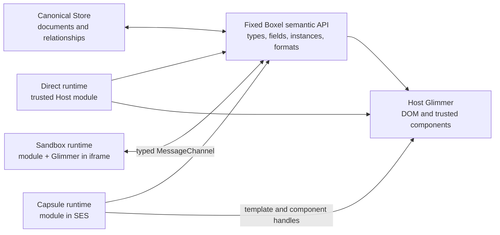
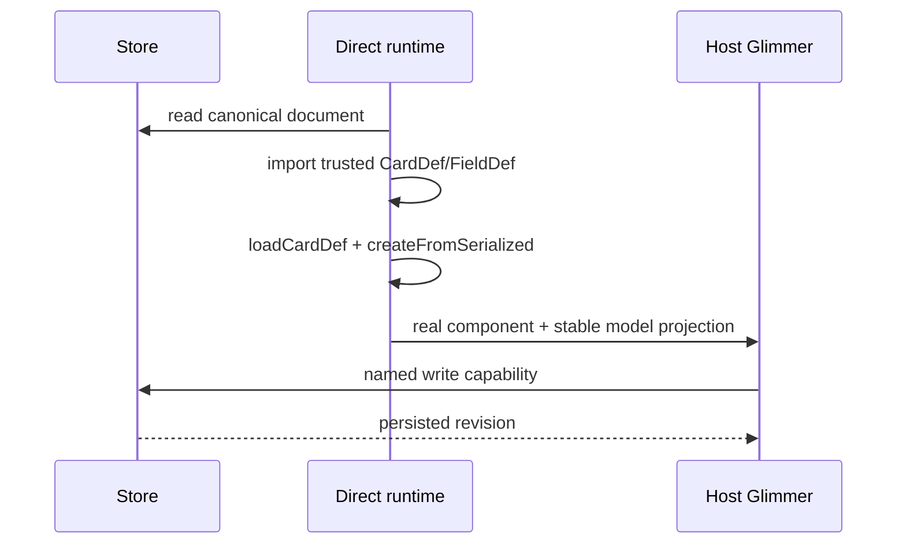
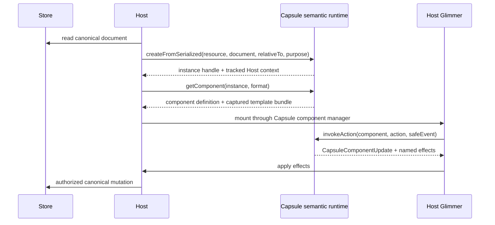
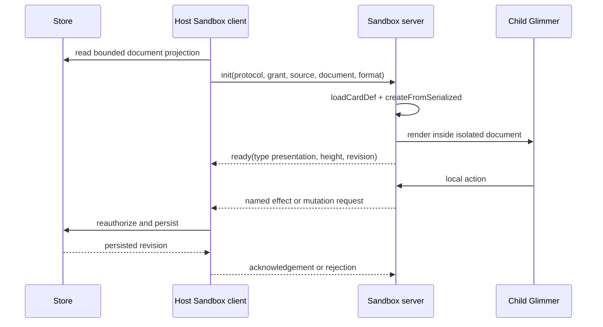

# Boxel execution runtime architecture

## Status and purpose

This document describes a target architecture for executing and rendering
Boxels through three execution tiers while preserving one authored API and one
user experience:

- **Direct** — trusted modules execute in the Ember Host.
- **Capsule** — user-authored modules execute in an SES Compartment and render
  through Host-owned Glimmer.
- **Sandbox** — user-authored modules execute and render in an origin-isolated
  iframe, communicating with the Host through `MessageChannel`.

It is a near-future implementation design, not a claim that the branch already
has every interface described below. It refines the boundary-record work in
[realm-sandbox-boundary-v2-plan.md](realm-sandbox-boundary-v2-plan.md) by
putting the fixed Boxel semantic API and the Glimmer rendering boundary into
one layered runtime model.

> **Current security architecture:** the presentation-containment topology in
> this design document was superseded by the document-first Direct/Sandbox
> implementation. Authored Sandbox modules no longer have a parallel canonical
> instance evaluated by the Host Loader. See
> [the Loader-boundary security reconciliation](boxel-execution-runtime-loader-boundary-reconciliation.md)
> for the current boundary, evidence, residual risk, and follow-up gates.

This document is intentionally self-contained for architectural review. It
includes the authored and implicit API inventory, the complete `surface*`
capability plane, the validation conclusions drawn from real applications, and
the one twelve-case cumulative acceptance suite. The working coverage,
compatibility, and real-example ledgers remain useful implementation records,
but a reviewer does not need them to understand or evaluate this design.

### Delivery approach: freeze the POC and rebuild from `main`

The production implementation starts on a new branch from `origin/main`. It
does not continue restructuring `codex/code-preview-instant-reload` in place.
That branch is the **frozen reference implementation**: it proves that Capsule
and Sandbox execution, staging-backed cards, editing, HMR, iframe sizing,
media, prerender placeholders, and compatibility shims can produce a useful
product experience.

At the decision point, the reference branch was 50 commits ahead of
`origin/main`, changed 242 files, and added approximately 42,500 lines. About
20,300 of those additions were Host production code, and the ten central
sandbox files alone contained approximately 13,350 lines. Its working behavior
is valuable; its aggregate ownership and review surface are not the target
architecture.

Freeze means:

- no new product features or architectural layers are added to the reference
  branch;
- only critical fixes needed to keep its preview and comparison corpus usable
  are accepted;
- its preview build, compatibility corpus, screenshots, import classifications,
  protocol/security tests, and observation ledgers remain available as the
  behavioral oracle;
- every delivery slice compares Direct and sandboxed output against both
  `main` and the frozen preview; and
- implementation code is ported only when its ownership already matches this
  architecture. Tests, fixtures, policies, and hard-won edge cases are ported
  more aggressively than orchestration code.

The canonical exploratory oracle is the staging-backed
[Sandbox Compatibility Corpus](https://realms-staging.stack.cards/ctse/sandbox-compatibility-corpus-20260803/index).
Runtime work must exercise that same Realm through both the deployed Host and
the branch's local Host; synthetic fixtures remain the deterministic CI layer,
not a replacement for this real-card comparison.

The new main-based branch is delivered as a sequence of independently
reviewable vertical slices. The smallest architectural slice—versioned Boxel
records, canonical projection, and a Direct adapter—should be roughly
2,000–3,000 production lines across 10–20 files, plus focused tests. It is
valuable before isolation ships because it removes implicit reflection and
makes Direct the conformance oracle. It is infrastructure, however, and is not
called a useful execution-runtime milestone by itself.

The second phase must deliver both untrusted adapters: Capsule execution
through Host Glimmer and Sandbox execution through an origin-isolated iframe.
The same bounded, interactive fixture must run through Direct, Capsule, and
Sandbox before the new runtime is considered useful. Capsule-only or
Sandbox-only delivery would leave the classifier and authored API unproven.
The cumulative Phase 1–2 target is approximately 6,000–9,000 production lines
plus focused tests.

The smallest honest implementation with the same important behavior as the
latest preview is expected to be roughly 9,000–14,000 production lines and
8,000–12,000 focused test lines across approximately 40–70 files. This is a
planning guardrail, not a line-count target: exceeding it requires explaining
which previously implicit Boxel semantic or lifecycle requirement was missing,
while beating it must not come from dropping compatibility, visual behavior,
editing, security, or cleanup.

The sequencing principle is **semantic spine first, then complete vertical
capabilities**. Do not define every future API before exercising it, and do not
build sandboxes around ad hoc snapshots that must later be replaced. Establish
one canonical Boxel interface and Direct behavior, then add the minimum
capability transport plus Capsule and Sandbox adapters as one useful vertical
slice. Mutation, HMR, additional Surfaces, and BXL authorization then extend
that same spine.

### Vocabulary: Boxel means Box Element

In this architecture, **Boxel** is the technical noun **Box Element**. It does
not mean the Boxel product as a whole. A Boxel is any visually present,
interactive building block derived from `BaseDef`, including `CardDef`,
`FieldDef`, `FileDef`, and future compatible kinds. A Boxel may be a persisted
card, a field renderer, a file-backed visual element, or a nested part of
another Boxel.

The narrower nouns retain narrower meanings:

- **Card** means a `CardDef` or its persisted Store document/instance.
- **Realm** means the server-side location and authorization boundary for data
  and modules. It is not the name of a Host rendering or execution service.
- **Module** means executable source and its dependency graph.
- **Surface** means a mounted presentation environment and its bounded visual
  or interactive capabilities.
- **Runtime** names who executes a Boxel: Direct, Capsule, or Sandbox.

Consequently, cross-kind runtime types use the `Boxel*` prefix. `Card*` remains
appropriate for Card JSON:API documents, Store operations, serialization, and
card-specific mutations. `Realm*` remains appropriate for Realm URLs, grants,
fetching, indexing, and cross-Realm authorization.

The names and pseudo-code in this document follow the conventions already used
by Boxel `main` and Ember/Glimmer:

- preserve the existing Card API verbs when the operation has the same
  semantics: `loadCardDef`, `createFromSerialized`, `getFields`, `getField`,
  `getComponent`, and `serializeCard`;
- use `Boxel*` for runtime contracts shared by CardDef, FieldDef, FileDef, and
  future BaseDef-derived visual kinds;
- use `Card*` only where the contract truly requires a CardDef or persisted
  card document;
- suffix opaque cross-boundary identities with `Handle` and cloneable
  descriptions with `Description`;
- suffix Ember services with `Service`, transport endpoints with `Client` or
  `Server`, and implementation adapters with their execution tier;
- reserve `ComponentManager` and its lifecycle hook names for their actual
  Glimmer meanings; and
- document exported authority-bearing interfaces with TSDoc, while keeping
  implementation commentary close to the mechanism it explains.

The snippets are target TypeScript, not a new author-facing Card API. Where a
boundary operation mirrors an existing Card API operation, its return value is
a handle or cloneable description of that same result rather than a differently
named semantic.

The naming and lifecycle choices were cross-checked against these existing
framework seams:

- Boxel's Card API in `packages/base/card-api.gts` and its field support in
  `packages/base/field-support.ts`;
- Boxel's current custom-manager pairs in
  `packages/host/app/lib/html-component.ts` and
  `packages/host/app/lib/hydratable-entry-component.ts`;
- Ember's public `setComponentManager` and `capabilities` exports in
  `packages/@ember/component/index.ts`; and
- Glimmer's public `ComponentManager` contract in
  `packages/@glimmer/interfaces/lib/managers/component.d.ts` and its adapter in
  `packages/@glimmer/manager/lib/public/component.ts`, plus the corresponding
  helper and modifier contracts in that same package family.

Those sources are the compatibility boundary. Glimmer VM implementation types
may explain the machinery, but they are not protocol vocabulary and must not
appear in Boxel's execution-runtime interfaces.

The same architecture is presented at four zoom levels. A reader can stop
after the level that answers their question:

1. **System overview** — the thirty-second model and non-negotiable rules.
2. **Runtime topology** — ownership and the complete Direct/Capsule/Sandbox
   flows.
3. **Protocols and Glimmer mechanics** — the interfaces, records, handles,
   reactivity, blocks, effects, mutations, and failure behavior.
4. **Implementation plan** — current-code mapping, migration sequence,
   testing, performance instrumentation, and deletion criteria.

---

## Zoom level 1: system overview

### The architecture in one paragraph

The Store owns the canonical card document. Each execution tier owns exactly
one executable copy of a module in its permitted environment. Every tier
exposes the same fixed Boxel semantic interface for loading card definitions,
creating instances from serialized documents, resolving fields, and selecting
formats. Direct and
Capsule rendering use one Host-owned Glimmer runtime; Direct component logic
runs in the Host while Capsule component logic remains behind stable handles
in SES. Sandbox rendering uses a Glimmer runtime inside an isolated iframe and
speaks the same semantic protocol over `MessageChannel`. Trusted Base and
Catalog components remain ordinary Ember/Glimmer programs loaded once in the
Host. Only inert values and named capabilities cross a trust boundary.



### Runtime matrix

| Tier    | Executable owners                                 | Semantic owner                             | Glimmer/DOM owner | Trusted Base presentation                                  |
| ------- | ------------------------------------------------- | ------------------------------------------ | ----------------- | ---------------------------------------------------------- |
| Direct  | Host Loader                                       | Host module                                | Host              | Shared Host module graph                                   |
| Capsule | Host canonical module + Compartment render module | Host canonical class + SES presentation    | Host              | Shared Host module graph through trusted component portals |
| Sandbox | Host canonical module + iframe render module      | Host canonical class + iframe presentation | Iframe            | Loaded in the isolated child as allowed by child policy    |

The shipped prototype deliberately keeps canonical Card API evaluation in the
Host while separately evaluating presentation code in its selected cage. A
consumer must not mix identities between those owners:

- trusted source has one executable Host module;
- authored Capsule/Sandbox source has a Host canonical constructor for
  deserialization, getters/computeds, relationships, and serialization;
- its render owner uses a separate Compartment/iframe module and receives only
  projected records/capabilities for presentation.

This is a presentation-containment boundary, not a claim that all authored
JavaScript is absent from the Host. Removing canonical authored evaluation
requires the larger store/Card API split described as future architecture.

### Two layers, not one giant sandbox service

```text
Layer 1 — Boxel semantics
  CardDef, FieldDef, fields, documents, getters, computeVia,
  configuration, relationships, format selection, mutations

Layer 2 — rendering
  captured Glimmer templates, component lifecycle, reactive cells, DOM operations,
  trusted component portals, events, blocks, modifiers, styles
```

The first layer is intentionally bounded because the Boxel Card API is
bounded. The second layer does not attempt to serialize or emulate arbitrary
Ember components. It lets trusted Base components execute natively and gives
untrusted component logic a Capsule component manager implemented with Ember's
public custom component manager API.

### The `surface*` capability plane

`surface*` is an explicit coordination plane attached to rendering. It is not
part of card schema, the Store, or type introspection, and it is not ambient
browser authority.

```text
Authored API
  @cardstack/boxel-ui/surface
    surfacePresentation, surfaceObserve, surfaceFocus, surfacePointer, ...
                         |
                         v
Render-tier adapter
  Direct/Capsule: trusted Glimmer token or modifier manager
  Sandbox: child SurfaceCapabilityClient over MessageChannel
                         |
                         v
Host SurfaceService
  registration, grants, validation, coordination, lifetime, cleanup
                         |
                         v
Host DOM/browser operation or coordinated notification
```

The Host service is the semantic owner. A mounted render generation gets
one Host-only `SurfaceRegistration` containing its root element, execution
identity, card, format, principal, grants, and cleanup scope. The card receives
only an inert surface id and the operations granted to that surface. Unmounting
or replacing the generation revokes the registration and all observers,
listeners, timers, captures, media coordination, and pending requests.

The public API belongs in Boxel UI because it is authored presentation code.
The transport-neutral request/response schema belongs in a small
runtime-common protocol module. The implementation and all browser authority
belong in a Host `SurfaceService`. Direct and Capsule calls dispatch to it
locally; Sandbox calls reach the same service through the iframe protocol.
Network, Store, Realm search, persistence, AI, and command authority remain
separate capability families because they are scoped to data principals rather
than a mounted surface.

The portable authored Surface vocabulary is finite and capability-specific.
There is no generic DOM request escape hatch:

| API                   | Portable semantic                                       | Important boundary rule                                                                             |
| --------------------- | ------------------------------------------------------- | --------------------------------------------------------------------------------------------------- |
| `surfaceRoot`         | stable mounted Surface identity and nested path         | Host registers the honest root element; authored code receives only an opaque id                    |
| `surfaceLifecycle`    | mount, readiness, suspend, resume, teardown             | callbacks are bounded component-handle messages, never Host functions                               |
| `surfaceObserve`      | size, visibility, and intersection records              | returns frozen numeric/boolean records and owns observer cleanup                                    |
| `surfaceFocus`        | focus, focus return, and bounded scroll intent          | requires a registered descendant target and mode-appropriate authority                              |
| `surfacePointer`      | pointer stream, capture, drag activation                | returns reduced pointer records; the browser event and DOM nodes remain Host-owned                  |
| `surfaceStyle`        | validated dynamic geometry/style values                 | allowlists properties and typed values; it cannot inject selectors or URLs                          |
| `surfacePresentation` | header and container/background presentation            | publishes validated presentation tokens; it does not clone arbitrary iframe body CSS                |
| `surfaceTransition`   | scoped view-transition intent and lifecycle             | transition names are namespaced by Surface/render-slot identity                                     |
| `surfaceSchedule`     | bounded timers, animation ticks, pause/resume           | Host owns clocks, quotas, cancellation, and background throttling                                   |
| `surfaceClipboard`    | user-activated copy/paste of typed Boxel placement data | no unrestricted clipboard read; payload re-enters the placement validator                           |
| `surfaceHaptics`      | bounded success/error feedback                          | optional result only; denial cannot change command semantics                                        |
| `surfaceSlot`         | placement into an approved Host presentation slot       | named slots only; never arbitrary Host selectors or component access                                |
| `surfacePlayback`     | media intent, leader/lease, position, rate, sequence    | group membership uses Host-issued ids and monotonic state, not guessed Surface ids                  |
| `surfaceViewport`     | pan/zoom intent and effective viewport state            | coordinate conversions are typed and scoped to one mounted viewport                                 |
| `surfaceLayout`       | intrinsic measurement and allocated rectangles          | parent allocation wins for fitted content; intrinsic formats report bounded size                    |
| `surfaceCanvas`       | safe canvas/graph drawing and input coordination        | Capsule receives a reviewed drawing/graph contract; arbitrary browser libraries remain Sandbox-only |

Foundation components consume this capability plane, but the first runtime
gate does not require every foundation Surface to ship at once. The cumulative
suite uses representative composites: RichMarkdown proves `Layout` and `Run`,
a data table proves `Table` and `Cell`, and a campaign board proves
`PosterBoard` and `Frame`. Further foundation components use the same contract
and add focused conformance coverage when they ship. Product content that is
or may become data-bound remains a Surface, including direct product children
of composite Surfaces. Raw HTML is limited to native local structure,
decoration, accessory chrome, or text inside an existing leaf Surface.

### Data, commands, Realm Script, and asynchronous AI

Long-running work does not belong in `surface*` and does not receive ambient
Host authority. A mounted Capsule or Sandbox may invoke a separately granted,
typed command. The Host owns command authorization, provider proxying,
credentials, file persistence, and Store writes.

Realm Script is another confined execution principal, not an extension of the
rendering Capsule. It receives bounded JSON input and named Realm operations,
produces schema-validated JSON, and is subject to input/result byte limits,
operation budgets, cancellation, and wall-clock timeout. Preview mode cannot
write. Commit mode still routes each mutation through an authorized Host
operation. The invoking harness selects the model; Realm Script cannot read or
override provider credentials.

The canonical asynchronous image path is:

```text
Authored action
  -> granted typed command
  -> one canonical Run/Job card with contained stages and logs
  -> capability-scoped Realm Script produces a validated generation plan
  -> Host provider command dispatches bounded requests
  -> Host binary-file command persists each successful result
  -> Store links durable ImageDefs and advances progress
  -> SSE/index messages acknowledge, but never overwrite, the active generation
```

Partial success is first-class. Results may finish out of order while their
requested slots remain stable. Cancellation, retry, timeout, duplicate
acknowledgement, and stale-generation rejection cannot erase already durable
outputs. UI surfaces show stable placeholders and each image as soon as it is
persisted; linting, indexing, and acknowledgement are subsequent state, not a
reason to hide or remount the local result.

### Non-negotiable rules

1. The Store remains canonical for card data and relationship identity.
2. User-authored TypeScript never executes in the Host.
3. Trusted Base component internals are not mediated; the whole component
   invocation is a trusted portal.
4. A live Store, Loader, service, constructor, component instance, callback,
   DOM node, Glimmer tag, or browser event never crosses an untrusted boundary.
5. Data crossing a boundary is bounded, validated, cloneable, and versioned.
6. Authority crosses only as a named, revocable capability whose Host handler
   rechecks authorization.
7. DOM-operation interception is necessary but not sufficient: component,
   helper, modifier, block, and dynamic-resolution paths are controlled too.
8. Unsupported protocol semantics fail atomically and retain last-known-good
   UI instead of partially rendering an unknown record.
9. Execution-tier selection is Host policy. A card may request stronger
   isolation but cannot request Direct execution.
10. Receiving a document, Surface registration, or render handle never grants
    Realm search, mutation, network, command, AI, or credential authority.
11. Long-running work is represented by canonical Run/Job state; progress,
    partial success, retry, and acknowledgement do not depend on keeping the
    initiating component mounted.
12. Client-side authorization may only reduce the server-authorized Boxel
    graph. It never grants access, and every read, search, relationship
    traversal, Command, and mutation is independently enforced by the server.

---

## Zoom level 2: runtime topology and ownership

### Canonical ownership

| Concern                                      | Owner                         | What other layers receive                                       |
| -------------------------------------------- | ----------------------------- | --------------------------------------------------------------- |
| Card documents and relationship identifiers  | Store                         | Versioned document projection                                   |
| Trusted Base/Catalog executable code         | Host trusted Loader           | Trusted component/type identity                                 |
| User code selected for Capsule               | Per-principal Capsule runtime | Semantic records, captured template bundles, component handles  |
| User code selected for Sandbox               | Isolated child runtime        | Typed protocol responses and effects                            |
| DOM for Direct and Capsule                   | Host Glimmer                  | Nothing; DOM remains Host-owned                                 |
| DOM for Sandbox                              | Iframe Glimmer                | Size, presentation, readiness, and named effects                |
| `surface*` coordination                      | Host `SurfaceService`         | Inert ids, bounded requests, responses, and notifications       |
| Guide cards and cascade order                | Store + trusted Guide runtime | Resolved labels, constraints, defaults, visibility, field order |
| Annotation, Actor, and Workflow documents    | Store                         | Authorized target/anchor/body/state projections                 |
| Run/Job progress and durable outputs         | Store                         | Versioned progress, logs, links, terminal state                 |
| Realm Script planning                        | Confined script runtime       | Schema-validated JSON result and bounded activity records       |
| Provider IO, binary writes, and credentials  | Authorized Host commands      | Durable FileDef/ImageDef identifiers, never credentials         |
| Authentication and server authorization      | Realm Server                  | Already-authorized resources and an upper-bound decision record |
| BXL UI authorization projection              | Host authorization service    | Frozen capability and redacted Boxel projection                 |
| Source generations and last-known-good state | Host orchestration            | Monotonic revision and acknowledgements                         |

### The common semantic contract

Host orchestration depends on the `BoxelRuntime` interface defined
below. Rendering is deliberately tier-specific because only Capsule needs to
bridge authored component logic into a different Glimmer owner.

The ownership distinction is deliberate:

```text
DirectBoxelRuntime
  Implements BoxelRuntime over the trusted Host module. Rendering uses
  the existing Card API getComponent() result directly.

CapsuleBoxelRuntime
  Implements BoxelRuntime in the principal's Compartment and exposes a
  CapsuleComponentRuntime adapter consumed by Host Glimmer.

SandboxBoxelRuntimeClient
  Implements BoxelRuntime and Sandbox surface lifecycle over the
  private port. It does not expose child Glimmer component state to the Host.

SandboxBoxelRuntimeServer
  Implements BoxelRuntime beside child Glimmer. The child uses its
  local Card API getComponent() result directly.
```

The Sandbox names must contain `Client` and `Server`. Using the same ambiguous
class name on both sides makes it too easy to invoke child authority in the
parent or treat a transport object as a local Glimmer runtime. In particular,
`getContext()` is never an iframe RPC: it is called synchronously by the
component manager in the same JavaScript realm as that Glimmer instance.

### Direct flow



The adapter is still important in Direct mode. It prevents Host features from
depending on constructor reflection that Capsule and Sandbox cannot reproduce.
Direct is the reference implementation of the semantic contract, not a bypass
around it.

### Capsule flow



The Capsule has no DOM. It owns authored classes, getters, actions, component
state, and pure computation. Host Glimmer owns rendering and creates only the
DOM permitted beneath the assigned render root.

Capsule runtimes are shared per realm principal rather than per card. Module
evaluation and pure runtime support are amortized across the realm, while
module identity and invalidation remain isolated from Base and other realms.

### Sandbox flow



The child can use a real browser document and packages such as Three.js. It
does not inherit parent credentials, Store access, or parent-origin storage.
The Host client implements the common runtime contract as asynchronous
transport operations.

### Trusted Cardstack components are one-way portals

Components exported from `@cardstack/*`, Base, and Catalog are arbitrary,
evolving Ember/Glimmer/TypeScript programs. They cannot be reproduced by
copying static properties or proxying every method. The boundary therefore
treats an approved trusted component as an atomic Host-owned portal:

```ts
interface TrustedComponentReference {
  kind: 'trusted-component';
  module: string;
  export: string;
}
```

When a Capsule template invokes that reference, the Capsule holds only an
inert module/export token. Host Glimmer resolves that token and runs the real
component from the shared trusted module graph. A Sandbox uses the equivalent
protocol reference and mounts the trusted child through a Host-owned slot.
Trust is deliberately one-way: trusted components may be composed into any
Capsule or Sandbox presentation, but authored constructors, closures,
services, Store objects, DOM nodes, and browser events cannot flow back into
the trusted module graph. Only projected inputs and named effects cross:

```ts
interface TrustedFieldInvocation {
  fieldType: CodeRef;
  fieldName: string;
  value: JSONValue;
  configuration: JSONValue;
  writable: boolean;
  setCapability?: CapabilityID;
}
```

The trusted component may use any trusted Host service internally. It must not
receive an authored function, live card instance, Store, or DOM value from the
Capsule or Sandbox.

### Server indexing and prerender

Realm Server execution is a consumer of the same semantic contract, not a
fourth browser execution tier. It materializes authorized computed values and
produces versioned prerender output. Browser Host code may use that output as:

- initial Host-mode HTML;
- inert last-known-good display;
- an immediate placeholder while a Sandbox becomes interactive;
- the materialized source for iframe-only computed values that must not open a
  browser merely to compute an index field.

### Guides and durable collaboration

A Guide is a canonical data card, not an authored callback surface. The trusted
Guide runtime resolves base, domain, realm, and inline layers and evaluates
JQXL against the authorized card projection. Direct, Capsule, and Sandbox
renderers receive the same bounded result: labels, helper text, constraints,
defaults, visibility, field order, and named Command affordances. They do not
receive the Guide engine, Store, or executable functions.

An Annotation is also canonical Store data. Its target and typed anchor
(field, text range, Cell, image region, timeline cue, or another supported
anchor kind) cross a boundary only after the target is authorized. Body,
author Actor, assignee, state, replies, and workflow step remain stable Boxel
identities. Reply, resolve, assign, and advance are typed Commands; mounting an
Annotation never grants mutation or neighboring-target access. This makes
human-to-agent review durable across Direct, Capsule, and Sandbox rather than
recreating it as component-local comment state.

Coordination ownership is also a Boxel semantic, not a property of the mounted
renderer. A single card may have an ordinary revisioned title, a Yjs-concurrent
rich-text field, Command-owned approval fields, temporarily frozen release
terms, and computed readiness. The Store and server project one bounded,
field-scoped coordination description for every execution tier. They never
send a Policy engine, Yjs document, Command executor, or live collaboration
service across the boundary.

The invariant is one write owner per field path at a time. Ordinary revision
writes, collaborative materialization, ordered Commands, and admitted atomic
snapshots all commit field-scoped patches through the same canonical document
revision. Policy custody is episodic and minimal: paths not named by the
active, versioned Policy retain their declared ordinary behavior, and custody
ends when the bounded term lapses. Cursor, selection, focus, and presence are
ephemeral awareness and never become Store data. An Annotation or message may
propose or explain a transition, but only a separately admitted typed Command
may enact consequential state.

AI source/data rewrites use snapshot compare-and-swap rather than pretending
to be CRDT operations. A current snapshot briefly fences affected bindings,
settles accepted collaborative updates, closes their epochs, installs the
candidate atomically, and starts new epochs for remaining collaborators. A
stale snapshot is rejected without overwriting official state. Published views
similarly observe two clocks: compatible instance data may follow the source
change feed, while code, schema, templates, theme, and projection policy stay
pinned until republish. Incompatible changes retain last-known-good output and
surface `republish-required`.

### BXL authorization projects the usable Boxel graph

The detailed companion contract is
[boxel-execution-runtime-authorization-projection.md](boxel-execution-runtime-authorization-projection.md).

BXL authorization is a Boxel semantic and data-capability concern, not a
`surface*` capability. `surface*` coordinates a mounted visual surface; BXL
decides which data and operations may enter that surface at all.

The clinical-access example demonstrates the intended shape. A patient record
links a policy, facility, people, and recursively nested teams. The policy
evaluates capabilities such as `ViewClinicalSummary`, `ViewInternalNotes`, and
`EditCarePlan` from a finite snapshot. A positive nested-team seat can grant
eligibility, while a separate `Seat.Suspended` refusal wins. Access to one
patient resource does not imply access to another. The current demo prepares
BXL and constructs the dashboard projection inside the card; the runtime
architecture moves that repeated work into a Host-owned
`BoxelAuthorizationService`.

The resource or owning application may link a BXL policy card, but that policy
reference is an input to the Host service, not authority handed to authored
code. The service resolves the authorized policy version, principal, resource,
bounded relationship graph, and request inputs; evaluates BXL synchronously
when a safe client snapshot is available; and returns a frozen projection. It
does not send the policy evaluator, live Store, hidden membership graph, or
unprojected resource values into a Capsule or Sandbox.

```text
resource + linked policy + principal + request input
                         |
                         v
            BoxelAuthorizationService
     server upper bound ∩ client BXL decisions
                         |
                         v
             authorization projection
       capabilities + visible Boxel graph
                         |
                         v
              buildBoxelRenderRecord()
                         |
             Direct / Capsule / Sandbox
```

"Client-side filtering" is therefore implemented as **client-side
projection**. Filtering after materialization is too late: a denied field must
not briefly appear, become a loading placeholder, affect a count, leak a title
or URL, or cross an execution boundary. Projection can remove:

- field values and FieldDef render slots;
- relationships, children, and query results;
- formats and presentation sections;
- Guide affordances and menu items; and
- Commands and mutation paths.

The server remains the security boundary. It must not send secrets merely so
the client can hide them, and it rechecks every fetch, search, relationship
traversal, Command, and mutation. A locally evaluated BXL result may only
intersect with and reduce the server-authorized upper bound; it cannot widen
it. Missing, stale, incompatible, or failed authorization projection fails
closed while preserving a non-sensitive last-known-good shell. Explicit BXL
refusal wins over positive eligibility in both client projection and server
enforcement.

Authorization changes are targeted semantic invalidations. Changing the
viewer, policy version, membership, resource state, or request input rebuilds
the affected projection and render slots without remounting unrelated Boxels.
The same projection record is consumed by Direct, Capsule, Sandbox, Code
preview, delegated rendering, Rich Markdown, fitted galleries, inspector
schema, and AI schema sharing, so a different execution tier cannot restore a
field or action that projection removed.

---

## Zoom level 3: protocols and Glimmer mechanics

### Semantic interface

```ts
type RuntimeHandle = string & { readonly __runtimeHandle: unique symbol };
type BoxelTypeHandle = RuntimeHandle & { readonly __boxelType: unique symbol };
type CardInstanceHandle = RuntimeHandle & {
  readonly __cardInstance: unique symbol;
};

/**
 * The execution-tier-neutral subset of the existing Card API.
 *
 * Implementations execute these operations in Direct, Capsule, or Sandbox.
 * Values returned to the caller are handles or cloneable records; live CardDef
 * classes and instances never cross an untrusted boundary.
 */
export interface BoxelRuntime {
  loadBoxel(ref: CodeRef): Promise<BoxelTypeHandle>;

  createFromSerialized(
    resource: LooseCardResource,
    document: LooseSingleCardDocument | CardDocument,
    relativeTo: RealmResourceIdentifier | undefined,
    purpose: MaterializationPurpose,
  ): Promise<CardInstanceHandle>;

  describeBoxel(boxel: BoxelTypeHandle): Promise<BoxelDescription>;

  getFields(
    boxel: BoxelTypeHandle | CardInstanceHandle,
  ): Promise<FieldDescription[]>;

  getField(
    boxel: BoxelTypeHandle | CardInstanceHandle,
    fieldName: string,
  ): Promise<ResolvedField | undefined>;

  serializeCard(
    card: CardInstanceHandle,
    options: SerializeOpts,
  ): Promise<LooseSingleCardDocument>;

  serializeCardPatch(
    card: CardInstanceHandle,
    changes: Record<string, JSONValue>,
  ): Promise<PatchData>;

  dispose(handle: RuntimeHandle): Promise<void>;
}
```

`MaterializationPurpose` is explicit. Indexing, Host display, command
validation, Code preview, and interactive editing do not receive authority
merely because they all call `createFromSerialized()`.

`serializeCardPatch()` is intentionally new rather than overloading
`serializeCard()`. The existing function serializes a complete card document;
the new operation accepts named edits and returns only canonical `PatchData`.
It never treats the richer render projection as a writable document.

### Type and field descriptions

The template inventory is open-ended. Formats shown here are examples, not an
exhaustive union embedded in the boundary record.

```ts
export interface BoxelDescription {
  protocolVersion: number;
  requiredFeatures: string[];
  ref: CodeRef;
  boxelKind: string;
  ancestors: CodeRef[];
  fields: FieldDescription[];
  formats: FormatDescription[];
  presentation: TypePresentation;
  executionHints: {
    prefersFullSandbox: boolean;
  };
}

export interface FormatDescription {
  format: string;
  provider:
    | { kind: 'authored'; ref: CodeRef }
    | { kind: 'trusted-base'; ref: CodeRef };
}

export interface ResolvedField {
  fieldName: string;
  fieldType: CodeRef;
  kind: 'contains' | 'containsMany' | 'linksTo' | 'linksToMany';
  value: JSONValue;
  resolvedConfiguration: JSONValue;
  presentation: Record<string, JSONValue>;
  writable: boolean;
}
```

Executable configuration providers run with their semantic owner. A Capsule
configuration function runs in the Capsule and returns validated data. The
Host never attempts to copy the function or rediscover field-specific statics
such as currency symbols. Trusted Base presentation consumes the resolved
record.

### Canonical Boxel render projection

Authorization has two records. The first is Host-internal input to the policy
service; the second is the cloneable result that render consumers may receive.
Capability names remain domain policy vocabulary rather than a hard-coded
clinical or music union.

```ts
export interface BoxelAuthorizationRequest {
  policy: CardIdentifier;
  principal: string;
  resource: CardIdentifier;
  resourceRevision: string;
  requestedCapabilities: string[];
  input: Record<string, JSONValue>;
}

export interface BoxelAuthorizationProjection {
  protocolVersion: number;
  policy: CardIdentifier;
  policyRevision: string;
  principal: string;
  resource: CardIdentifier;
  resourceRevision: string;
  inputHash: string;
  capabilities: Record<
    string,
    { effect: 'allow' | 'refuse' | 'not-applicable'; reasonCode?: string }
  >;
  visibleFields: string[];
  visibleRelationships: string[];
  visibleFormats: string[];
  visibleSections: string[];
  availableCommands: string[];
}
```

The Host may expose the frozen result through render context for custom
section composition, but this is descriptive state, not an authorization
closure. Generic Base templates consume the same field, relationship, format,
and Command lists without requiring card-specific conditionals. Explanations
use bounded reason codes; sensitive policy traces and membership paths remain
Host/server diagnostic data.

All tiers consume one record assembled by a pure Host pipeline. Boxel normally
uses `build*` for a pure record assembler, so the target name is
`buildBoxelRenderRecord()`:

```ts
buildBoxelRenderRecord({
  canonicalDocument,
  boxelType,
  projectedValue,
  relationshipProjection,
  authorizationProjection,
  cardInfoProjection,
  presentationProjection,
  policy,
}): BoxelRenderRecord;
```

The record contains no capability closures. Host-only capabilities are stored
separately and keyed by execution identity, Boxel identity, format, grant, and
lifetime. `canonicalDocument` is present for persisted cards; FieldDef,
FileDef, and future Boxel kinds can project a value without pretending to be a
card document.

### Mutation is a reverse projection

The detailed companion contract is
[boxel-execution-runtime-mutation-protocol.md](boxel-execution-runtime-mutation-protocol.md).

The rendered projection is deliberately richer than the writable document.
It may contain computed values, expanded relationships, presentation values,
and side-loaded data. It must never be sent back as a card PATCH.

```text
rendered projection
    | user edit
    v
named field changes
    | semantic runtime serializeCardPatch()
    v
canonical attributes + relationship identifiers
    | Host authorization and JSON-API validation
    v
Store PATCH
```

`serializeCardPatch()` rejects computed fields, presentation-only values,
foreign side-loaded resources, unknown relationships, and fields outside the
current write grant.

### Capsule component runtime

```ts
type CapsuleComponentHandle = RuntimeHandle & {
  readonly __capsuleComponent: unique symbol;
};

type CapsuleComponentInstanceHandle = RuntimeHandle & {
  readonly __capsuleComponentInstance: unique symbol;
};

export interface CapsuleComponentDefinition {
  component: CapsuleComponentHandle;
  template: CapturedTemplateBundle;
}

/**
 * Resolves Capsule components and implements their authored lifecycle.
 *
 * The Host's Glimmer ComponentManager delegates to this interface. Direct and
 * Sandbox rendering use their local Card API components and do not implement
 * this cross-owner bridge.
 */
export interface CapsuleComponentRuntime {
  getComponent(
    card: CardInstanceHandle,
    format: string,
  ): Promise<CapsuleComponentDefinition>;

  createComponent(
    definition: CapsuleComponentDefinition,
    args: RenderArguments,
  ): CapsuleComponentInstanceHandle;

  getContext(component: CapsuleComponentInstanceHandle): ComponentContext;

  updateComponent(
    component: CapsuleComponentInstanceHandle,
    args: RenderArguments,
  ): CapsuleComponentUpdate;

  invokeAction(
    component: CapsuleComponentInstanceHandle,
    action: string,
    event: SafeEvent,
  ): Promise<CapsuleComponentUpdate>;

  destroyComponent(component: CapsuleComponentInstanceHandle): void;
  dispose(handle: RuntimeHandle): Promise<void>;
}
```

`createComponent`, `getContext`, `updateComponent`, and `destroyComponent`
deliberately match Ember's public custom component manager hooks. Boxel's
manager delegate has `capabilities('3.13', { updateHook: true, destructor:
true })`; it must not implement or expose Glimmer's internal `getSelf`,
`getDestroyable`, VM `Program`, or state-bucket APIs.

The lifecycle hooks are synchronous because Ember's public manager contract is
synchronous. Any module loading, template capture, or policy negotiation must
finish in `getComponent()` before Glimmer receives the definition state. The
manager's `getContext()` returns a stable Host object backed by tracked cells;
it never waits on the Capsule or returns a Promise to the VM.

Boxel supplies `_CapsuleComponent` as the definition object passed to
`createComponent()`. `CapsuleComponentState` is the manager's private state
bucket. Neither object is serialized, stored in the Card boundary record, or
exposed to card authors.

### Captured template bundles

A captured template bundle contains validated Glimmer wire data and explicit
references. It never contains an executable authored closure in Host memory.

```ts
export interface CapturedTemplateBundle {
  protocolVersion: number;
  root: TemplateHandle;
  templates: Record<TemplateHandle, CapturedTemplate>;
  stylesheets: StylesheetReference[];
  dependencies: RenderDependency[];
}

type RenderDependency =
  | TrustedComponentReference
  | SandboxComponentReference
  | TrustedHelperReference
  | SafeModifierReference
  | SandboxBlockReference;
```

The Host validates the bundle before Glimmer sees it. Unknown required
dependency kinds reject the complete generation.

Glimmer needs both a component manager and a template factory. For every
validated entry in the bundle, the Host creates one private component
definition object, associates the common Capsule manager through its
prototype, and calls `setComponentTemplate()` exactly once on that definition
object:

```ts
import { setComponentTemplate } from '@ember/component';
import type { ComponentLike } from '@glint/template';

type TemplateFactory = Parameters<typeof setComponentTemplate>[0];

type CapsuleComponent = ComponentLike<{
  Args: Record<string, unknown>;
  Element: Element;
}>;

function createCapsuleComponentDefinition(
  runtime: CapsuleComponentRuntime,
  definition: CapsuleComponentDefinition,
  template: TemplateFactory,
): CapsuleComponent {
  let component = new _CapsuleComponent(runtime, definition);
  setComponentTemplate(template, component);
  return component as unknown as CapsuleComponent;
}
```

This is supported by Glimmer's public API: manager and template lookup both
walk the definition object's prototype chain, while a template may be
associated directly with an object. The Host caches the resulting definition
by runtime identity, component handle, source hash, and captured-template
signature. It never calls `setComponentTemplate()` twice on the same object,
which Glimmer explicitly rejects in debug builds.

A template factory is immutable for the lifetime of that definition. An HMR
generation that changes only component state or arguments reuses the
definition. A generation that changes the captured template creates a new
definition; the stable outer template island then adopts compatible serialized
DOM or replaces only that island. The public custom component manager API does
not provide a mutable-layout hook, so the architecture must not claim that the
manager alone can replace a template while preserving DOM.

### Host-owned Glimmer bridge

Capsule component logic stays in SES while Host Glimmer owns DOM and
reactivity. A custom component manager performs the bridge:

1. create a Capsule component instance and receive a stable handle;
2. create Host-owned cells for cloneable component state and getters;
3. render its validated captured template bundle;
4. dispatch actions to the Capsule with a reduced event record;
5. apply returned cell changes and dirty only the corresponding Glimmer tags;
6. execute named Host effects after policy checks;
7. destroy the component state on teardown.

```ts
export interface CapsuleComponentUpdate {
  generation: number;
  componentRevision: number;
  changed: Record<string, JSONValue>;
  effects: SurfaceEffect[];
}
```

Host-owned cells—not SES objects or tags—connect the component to Glimmer.
Synchronous action updates return in `CapsuleComponentUpdate`. Asynchronous
authored changes use a bounded invalidation channel naming a component handle
and changed paths; they never receive a Host Glimmer tag.

The manager itself should look ordinary to an Ember reviewer. The transport
and policy machinery stays behind `CapsuleComponentRuntime`:

```ts
import { capabilities, setComponentManager } from '@ember/component';

type ComponentManager = ReturnType<Parameters<typeof setComponentManager>[0]>;
type ComponentArguments = Parameters<ComponentManager['createComponent']>[1];

class _CapsuleComponent {
  constructor(
    readonly runtime: CapsuleComponentRuntime,
    readonly definition: CapsuleComponentDefinition,
  ) {}
}

class CapsuleComponentState {
  constructor(
    readonly runtime: CapsuleComponentRuntime,
    readonly handle: CapsuleComponentInstanceHandle,
  ) {}
}

class CapsuleComponentManager implements ComponentManager {
  capabilities = capabilities('3.13', {
    destructor: true,
    updateHook: true,
  });

  static create(_owner: unknown) {
    return new CapsuleComponentManager();
  }

  createComponent(definition: _CapsuleComponent, args: ComponentArguments) {
    let handle = definition.runtime.createComponent(
      definition.definition,
      renderArguments(args),
    );
    return new CapsuleComponentState(definition.runtime, handle);
  }

  getContext(component: CapsuleComponentState) {
    return component.runtime.getContext(component.handle);
  }

  updateComponent(component: CapsuleComponentState, args: ComponentArguments) {
    applyComponentUpdate(
      component.runtime.updateComponent(
        component.handle,
        renderArguments(args),
      ),
    );
  }

  destroyComponent(component: CapsuleComponentState) {
    component.runtime.destroyComponent(component.handle);
  }
}

setComponentManager(
  (owner) => CapsuleComponentManager.create(owner),
  _CapsuleComponent.prototype,
);
```

`renderArguments()` and `applyComponentUpdate()` in this sketch are private
adapter helpers. They reduce Glimmer's stable argument proxy to the bounded
runtime argument shape and apply returned values to Host-owned tracked cells.
They are not Card API methods, Glimmer extensions, or author-facing
capabilities.

This follows Boxel's existing `HTMLComponentManager` and
`HydratableEntryComponentManager` pattern: an internal component definition
value, a small manager delegate, `capabilities('3.13', ...)`, and
`setComponentManager()` on the definition prototype. The detailed runtime
does not pretend to be a Glimmer VM `InternalComponentManager`.

### Components, helpers, and modifiers

DOM interception alone is not a sufficient boundary. Resolution is also
explicit:

- trusted component references resolve through the trusted Host Loader;
- authored component references resolve through the Capsule component manager;
- trusted helpers receive cloneable arguments and return cloneable values;
- authored helpers execute in the Capsule through handles;
- safe modifiers are named Host capabilities with reviewed argument/result
  schemas and teardown;
- raw Ember modifiers from user code require Sandbox routing;
- dynamic component resolution accepts only a validated reference produced by
  the semantic runtime.

Boxel should use each public Glimmer manager for its actual purpose rather than
inventing one universal "sandbox manager":

| Glimmer seam                        | Public hooks Boxel implements                                                   | Boundary rule                                                                                                          |
| ----------------------------------- | ------------------------------------------------------------------------------- | ---------------------------------------------------------------------------------------------------------------------- |
| Component manager (`3.13`)          | `createComponent`, `getContext`, optional `updateComponent`, `destroyComponent` | Host state bucket contains only runtime/handle/cell references; authored instance stays in Capsule                     |
| Helper manager (`3.23`, `hasValue`) | `createHelper`, `getValue`, optional destroyable                                | Capsule helper returns a cloneable value through a helper handle; Host-owned tracking invalidates it                   |
| Modifier manager (`3.22`)           | `createModifier`, `installModifier`, `updateModifier`, `destroyModifier`        | The trusted Host manager owns the `Element`; Capsule receives only validated arguments and named `surface*` operations |
| Component template                  | `setComponentTemplate` once per definition object                               | Host attaches a validated `TemplateFactory`; authored code never receives the factory or wire data back                |

All of these hooks are synchronous. Module loads, dependency resolution, and
policy checks happen before Glimmer resolves the definition. A helper or
modifier that cannot satisfy the bounded synchronous contract routes the
format to Sandbox rather than blocking the Host render transaction. The
manager state buckets are destroyable lifetime records, not serialized Boxel
state.

### DOM and CSS boundary

Host Glimmer uses a sandbox-aware owner/resolver and DOM policy beneath a
stable render root. The policy covers:

- permitted elements and attributes;
- URL-bearing attributes and protocols;
- event listener ownership;
- literal and dynamic style values;
- stylesheet scoping, network-bearing declarations, global rules, and
  keyframes;
- lifecycle cleanup and reference-counted stylesheet removal.

The DOM policy complements source classification and captured-template
validation. No one layer is treated as the complete security boundary.

### Blocks and yields

No live block closure crosses between trusted and untrusted execution.

```ts
interface SandboxBlockReference {
  kind: 'sandbox-block';
  handle: TemplateHandle;
  parameters: JSONValue[];
}
```

When a trusted Base component yields, the Host projects and validates the
yielded parameters, then asks the Capsule component manager to render the
captured authored block. A block cannot recover the trusted component
instance, owner, Store, or original event through its parameters.

### Events and effects

Browser events are reduced to an allowlisted record:

```ts
interface SafeEvent {
  type: string;
  key?: string;
  code?: string;
  value?: string;
  checked?: boolean;
  clientX?: number;
  clientY?: number;
  dataset?: Record<string, string>;
}
```

Imperative behavior becomes a named effect rather than a method on a live
event or element. Examples include field mutation, navigation, focus, scroll,
selection, measurement, presentation, media, and playback. Each effect defines
its argument schema, result schema, lifetime, cleanup, and authorization rule.

### `surface*` registration, dispatch, and coordination

`surface*` capabilities are mounted-render capabilities. They do not belong on
`BoxelRuntime`, because loading a CardDef or creating a card instance
must not allocate DOM authority. `CapsuleComponentRuntime.createComponent()`
receives a Host-created surface context, and the Glimmer bridge makes its
granted author API available to the rendered component.

The Host-only registration is approximately:

```ts
interface SurfaceRegistration {
  surfaceId: string;
  executionId: string;
  renderSlotId: string;
  principal: string;
  cardId: string;
  format: string;
  generation: number;
  root: Element;
  grants: ReadonlySet<SurfaceCapabilityName>;
  abort: AbortController;
}
```

`root`, `grants`, and `abort` never cross the boundary. The transport record is
smaller:

```ts
interface SurfaceCapabilityRequest {
  protocol: 'boxel-surface-capabilities/1';
  requestId: string;
  surfaceId: string;
  generation: number;
  capability: string;
  operation: string;
  args: JSONValue;
  activation?: string;
}
```

The injected Host service owns the operation boundary. Boxel services are
default-exported concrete classes, so its public declaration follows that
convention rather than introducing a parallel `SurfaceCoordinator`:

```ts
/** Host authority for capabilities attached to a mounted card surface. */
declare class SurfaceService extends Service {
  registerSurface(registration: SurfaceRegistration): void;
  unregisterSurface(surfaceId: string, generation: number): void;

  request(
    request: SurfaceCapabilityRequest,
  ): Promise<SurfaceCapabilityResponse>;

  notify(notification: SurfaceCapabilityNotification): void;
}

export default SurfaceService;
```

The implementation is an ordinary concrete Ember service in
`services/surface-service.ts`; the declaration shows only its relevant public
contract.

`registerSurface()` and `unregisterSurface()` are Host-only. The author-facing
module exports capability-specific names such as `surfacePresentation`; it
does not expose this service or a generic `request()` escape hatch. The
Sandbox client serializes the same typed request that the Direct and Capsule
adapters pass locally.

The proposed code ownership is:

| Piece               | Location and responsibility                                                                                                   |
| ------------------- | ----------------------------------------------------------------------------------------------------------------------------- |
| Author imports      | `@cardstack/boxel-ui/surface`; typed modifiers/helpers/services with no Host objects                                          |
| Protocol records    | A runtime-common `surface-capability-protocol` module shared by Host and iframe child                                         |
| Host semantic owner | `SurfaceService`; registrations, grants, validation, rate limits, coordination state, cleanup                                 |
| Direct adapter      | Trusted Boxel UI implementation dispatches to the service for consistent semantics                                            |
| Capsule adapter     | Trusted Glimmer token/modifier manager dispatches directly to the service; callbacks return through Capsule component handles |
| Sandbox adapter     | Child `SurfaceCapabilityClient` sends requests over the private port; parent validates and dispatches to the service          |

Cross-card features such as synchronized playback are `SurfaceService`
concerns. They use a Host-issued coordination-group id and monotonic sequence/clock
state; cards cannot join a group by guessing another surface id. Pan/zoom,
selection, presentation, and playback can share this envelope while retaining
separate operation schemas and grants. A service notification contains only
bounded state such as `{ playing, position, rate, sequence }`, never a
media element or controller object.

Direct rendering should use the same public `surface*` semantics even though
it could touch the DOM directly. This makes behavior portable across tiers and
keeps a later Capsule/Sandbox classification change from changing the authored
contract. Trusted Host-internal components remain free to use private Host APIs
when they are not presenting an author-facing portable surface contract.

### Generation, HMR, and stable identity

Source generation, semantic instance identity, component identity, and DOM
identity are separate:

- a source hash identifies compilation and classification cache entries;
- a monotonic generation identifies a proposed module update;
- stable instance/component handles preserve state across compatible updates;
- stable render-slot keys preserve Glimmer and DOM identity;
- server/index echoes acknowledge an already-rendered generation;
- incompatible template bundles or explicit Reload Card create a new component
  generation;
- failed generations keep the last-known-good template bundle mounted.

Compatibility is decided by an explicit captured-template signature, not by
whether two generated JavaScript classes happen to be referentially equal.

### Protocol negotiation and failure behavior

Semantic records and iframe transport have independent protocol versions.
Every message or record includes:

- protocol version;
- required features;
- execution identity;
- card/instance identity;
- source generation;
- request correlation id where applicable.

An unsupported required feature rejects the complete operation. The Host keeps
last-known-good content visible, surfaces one actionable diagnostic, and does
not silently substitute `undefined` for a missing semantic.

### Resource lifetime

Every handle has an owner and release point. Runtimes track:

- module generations;
- instances;
- component instances;
- captured templates;
- blocks;
- style references;
- effect subscriptions;
- pending requests.

Per-principal Capsule runtimes are retained while they have active consumers
and evicted after an idle TTL. Settled loads and released handles are removed
immediately; runtime eviction is not the only cleanup mechanism.

---

## Zoom level 4: implementation and migration plan

### Frozen reference branch mapping

The reference branch is evidence and a source of focused tests, policies, and
proven algorithms. It is not the base of the production implementation. The
table maps its working POC responsibilities so that each can be deliberately
covered, ported, or replaced on the new main-based branch.

| Target responsibility                          | Current starting point                                                            |
| ---------------------------------------------- | --------------------------------------------------------------------------------- |
| Capsule module evaluation and Card API facade  | `packages/host/app/lib/realm-compartment-module-runtime.ts`                       |
| Per-principal runtime lifetime                 | `packages/host/app/lib/realm-sandbox-runtime-registry.ts`                         |
| Opaque records and symbols                     | `packages/host/app/lib/realm-sandbox-boundary.ts`                                 |
| Orchestration, classification, projection, HMR | `packages/host/app/services/realm-sandbox.ts`                                     |
| Common render entry                            | `packages/host/app/components/card-renderer.gts`                                  |
| Capsule rendering                              | `packages/host/app/components/realm-sandbox-render.gts`                           |
| Stable render island                           | `packages/host/app/components/realm-sandbox-template-island.gts`                  |
| Delegated trusted rendering                    | `packages/host/app/components/realm-sandbox-delegated-render.gts`                 |
| Contextual field rendering                     | `packages/host/app/lib/realm-sandbox-field-component.gts`                         |
| Sandbox parent component                       | `packages/host/app/components/realm-sandbox-iframe.gts`                           |
| Sandbox transport                              | `packages/host/app/lib/realm-iframe-sandbox-protocol.ts`                          |
| Sandbox child application                      | `packages/host/app/templates/realm-sandbox-frame.gts`                             |
| Height and media capabilities                  | `realm-iframe-height-service.ts`, `realm-iframe-media-bridge.ts`                  |
| First author-facing surface capability         | `packages/boxel-ui/addon/src/surface.gts` and `modifiers/surface-presentation.ts` |
| Current Capsule/Sandbox presentation adapters  | `realm-sandbox-render.gts` and `realm-sandbox-frame.gts`                          |
| Stylesheet policy/lifetime                     | `realm-sandbox-styles.ts` service and modifier                                    |

The legacy `RealmSandboxService` combines several of these concerns. Its name
describes the POC rather than the target architecture: Realm is a server-side
data/module location, not a Host execution service. Do not copy this service
and split it afterward. Port each proven behavior directly into its target
owner only when the corresponding vertical slice reaches it.

### Target module and symbol names

These are the intended names once behavior has moved behind the interfaces.
They follow Boxel's lower-kebab-case module names, named library exports, and
default-exported Ember service classes.

| Module                                                  | Principal exports                                                                                                                                 |
| ------------------------------------------------------- | ------------------------------------------------------------------------------------------------------------------------------------------------- |
| `packages/runtime-common/boxel-execution-protocol.ts`   | Cloneable `BoxelDescription`, `FieldDescription`, `ResolvedField`, handle ids, protocol requests, responses, and version checks; no Ember imports |
| `packages/host/app/lib/boxel-runtime.ts`                | `BoxelRuntime` and shared semantic handles                                                                                                        |
| `packages/host/app/lib/capsule-component-runtime.ts`    | `CapsuleComponentRuntime`, `CapsuleComponentDefinition`, and Capsule component handles; no iframe transport                                       |
| `packages/host/app/lib/direct-boxel-runtime.ts`         | `DirectBoxelRuntime`                                                                                                                              |
| `packages/host/app/lib/capsule-boxel-runtime.ts`        | `CapsuleBoxelRuntime`; selectively ports proven evaluator behavior without importing the legacy orchestration service                             |
| `packages/host/app/lib/sandbox-boxel-runtime-client.ts` | `SandboxBoxelRuntimeClient`; parent-side `BoxelRuntime`, surface lifecycle, correlation, and transport only—never Host Glimmer state              |
| `packages/host/app/lib/capsule-component.ts`            | `_CapsuleComponent`, `CapsuleComponentManager`, and its Glimmer definition/state wrappers                                                         |
| `packages/host/app/services/surface-service.ts`         | default `SurfaceService extends Service`; mounted-surface registrations and browser capabilities                                                  |
| iframe child module beside `realm-sandbox-frame.gts`    | `SandboxBoxelRuntimeServer`; child dispatch only                                                                                                  |

Do not introduce a `SandboxBoxelEnvironment`, `RemoteGlimmerProgram`, or other
parallel vocabulary. `Boxel*` identifies the cross-kind semantic boundary;
`Card*` is reserved for persisted Card documents and card-specific operations;
`Capsule*` and `Sandbox*` identify execution policy; and Glimmer lifecycle names
appear only on the component manager that actually implements them.

### Phase 0: freeze the reference and establish evidence

Create the delivery branch from `origin/main` and stop adding features to the
reference branch. Before implementation:

1. preserve a reachable reference preview and record its commit;
2. port the deterministic compatibility fixtures and boundary assertions before
   porting runtime code;
3. record Direct, Capsule, and Sandbox cold/steady render timings;
4. count module evaluations, cache hits, component remounts, DOM replacements,
   stylesheet installations, and active handles;
5. capture current green/red corpus results and representative screenshots;
6. freeze `Direct`, `Capsule`, and `Sandbox` vocabulary in diagnostics and
   tests; and
7. prohibit new constructor introspection in Host consumers.

The reference branch is an oracle, not a dependency. A delivery test passes
only when it proves the intended semantic and visible behavior; matching an
accidental POC implementation detail is not a goal.

### Phase 1: ship the semantic spine through Direct

Add versioned `BoxelRuntime` records, `ResolvedField`, stable Boxel/render-slot
identity, and `buildBoxelRenderRecord()` without changing visible rendering.
Implement `DirectBoxelRuntime` over the existing trusted Loader and Card API.
Direct rendering must continue through main's canonical `transpileJS()` and
Loader pipeline, including the existing `glimmer-scoped-css` transform. The
runtime adapter owns execution and semantic projection; it does not introduce
another stylesheet compiler, registry, or selector-rewriting path.

The canonical pipeline includes:

- inherited field metadata and configuration;
- per-usage configuration functions;
- getters, `computeVia`, and their dependency/error state;
- relationship identity and bounded hydration;
- `cardInfo`, theme, title, description, thumbnail, and presentation;
- an open-ended authored format inventory plus trusted Base fallback slots;
- writability and mutation schema; and
- reserved authorization and capability-projection fields, even though their
  services are implemented later.

Add a development-only missing-path diagnostic proxy. Move one Host consumer
at a time from constructor reflection to the adapter. Direct is the executable
conformance oracle: if a semantic cannot be expressed here, the interface is
incomplete before Capsule or Sandbox work begins.

This is the first independently mergeable slice. Its target is approximately
2,000–3,000 production lines across 10–20 files plus focused protocol, Direct,
and visual conformance tests.

### Phase 2: deliver Capsule and Sandbox as one useful vertical slice

Phase 2 is one milestone with three inseparable parts: the minimum Host
capability broker, the Capsule adapter, and the Sandbox adapter. Implementing
only the broker, only Capsule, or only Sandbox does not count as a useful
execution runtime. The same bounded authored fixture must execute through
Direct, Capsule, and Sandbox before this phase is complete.

First create the Host `SurfaceService`, execution identity, registration
lifetime, and shared request/response/notification envelopes. Do not implement
the full `surface*` catalog. The initial capabilities are only those required
for honest ordinary rendering:

- `surfacePresentation` for header/container intent;
- `surfaceLayout` for intrinsic and parent-allocated sizing;
- `surfaceObserve` for bounded size/visibility records; and
- the trusted modifier/manager path needed to bind those capabilities to the
  real Host element.

Direct uses a local dispatcher, Capsule uses trusted Glimmer managers, and
Sandbox uses a private `MessageChannel`; all three target the same Host-owned
service methods. Data access, authorization, and mutation remain outside
`SurfaceService`.

Then implement both untrusted adapters:

- `CapsuleBoxelRuntime` owns per-principal SES module lifetime,
  source/import classification, stable component handles, deterministic
  teardown, and the Host Glimmer component bridge;
- `SandboxBoxelRuntimeClient` owns parent-side correlation, capability
  admission, lifecycle, and last-known-good placeholder state; and
- `SandboxBoxelRuntimeServer` owns the origin-isolated iframe's child Loader,
  authored module, Glimmer runtime, and DOM.

Selectively port proven evaluator, classifier, and transport behavior from the
reference branch; do not port `RealmSandboxService`. The vertical fixture must
prove, in all three tiers:

1. text, tracked state, one action, scoped CSS, and asset loading;
2. a trusted Base field/component rendered as a native Host portal;
3. a yielded block, helper, and safe modifier through explicit managers;
4. FieldDef/CardDef/FileDef invocation records and field configuration;
5. contained and linked relationships plus delegated nested rendering;
6. `surfacePresentation`, intrinsic and allocated `surfaceLayout`, readiness,
   and observation; and
7. isolated, embedded, fitted, atom, head, edit, and Markdown fallback behavior
   sufficient to prove format routing and composition.

The Sandbox path must additionally prove origin isolation, a transferred
private port, a persistent compatible child, an immediate non-interactive
prerender placeholder, and zero fallback to Direct after child failure.
Semantic and transport protocol versions remain separate.

Support explicit `prefersFullSandbox` and classifier-required browser globals.
Classification remains module-based: if one executable module imports a
browser-global dependency, every format defined by that module is
Sandbox-classified. Authors split safe and browser-dependent formats into
separate modules to recover Capsule execution. Safe atom, head, fitted, or
Markdown formats must not pay for an iframe merely because another module in
the same card family requires one.

Special-case field/component shims are accepted only as temporary compatibility
adapters around canonical records. Phase 2 exits only when tier diagnostics
prove the intended route, visible output and the authored action agree across
Direct/Capsule/Sandbox, nested delegated rendering crosses mixed boundaries,
and neither untrusted adapter receives a live Store, Loader, service, CardDef
instance, or ambient Host object.

The cumulative Phase 1–2 target is approximately 6,000–9,000 production lines
plus focused protocol, security, visual, and interaction tests. This is the
first milestone called a useful new execution runtime; it is not yet full
editing or HMR parity.

#### Phase 2 implementation ledger

Phase 2 is implemented on `codex/boxel-execution-runtime-architecture` as one
vertical system, not as three independent prototypes:

1. **Rendering is wired through the Host boundary.** Ordinary card render
   entry points use `BoxelExecutionRenderer`, which asks `BoxelExecutionService`
   for one execution session and mounts the selected Direct, Capsule, or
   Sandbox-owned render slot. Indexed HTML is an inert, non-interactive loading
   placeholder; it is never treated as the live renderer.
2. **Capsule is end to end.** Authored modules evaluate in retained SES
   compartments without browser globals, produce cloneable type and instance
   records, retain authored component state, and emit only explicitly granted
   effects. Trusted Glimmer managers render the resulting component and scoped
   styles in the Host document.
3. **Sandbox is end to end.** Browser-dependent formats run in an
   origin-isolated iframe on the configured Sandbox origin: credentialless in
   supporting browsers, and an `allow-scripts`-only opaque origin in Safari and
   Firefox. A
   transferred private `MessageChannel` carries versioned render and Surface
   messages. Authored module fetches are Host-brokered, GET-only, recursively
   admitted from literal imports, bounded in size, and cancelled when the
   process is destroyed.
4. **Composition crosses mixed tiers.** `BoxelFieldPortal` is the Host-owned
   invocation capability for nested authored FieldDefs, CardDefs, and FileDefs.
   It recursively routes contained and linked Boxels through the same engine;
   trusted Base fields stay native. Child process teardown does not invalidate
   its Capsule parent or the Direct Base runtime.
5. **Format routing is explicit.** Isolated, embedded, and edit may use the
   iframe Sandbox when the module requires browser authority. Fitted, atom,
   head, and Markdown stay Capsule-rendered so compact composition never
   creates inline iframes. Missing authored formats use a Host-owned Base
   fallback over the same record instead of executing authored code Direct.
6. **One contract is exercised in all three tiers.** Acceptance coverage sends
   the same resource and render request through Direct, Capsule, and Sandbox and
   verifies the selected owner and cloneable render-record shape. Layered
   integration coverage adds getters and `computeVia`, field configuration,
   linked snapshots, scoped CSS, retained actions, nested mixed boundaries,
   Surface presentation/layout/observation, and the seven format decisions.
7. **Security and lifecycle are evidence, not assumptions.** Tests cover ambient
   browser denial in Capsule, stylesheet confinement, exact recursive Sandbox
   module authority, header stripping, origin and protocol validation,
   browser-negotiated iframe isolation, last-known-good retention,
   deterministic Surface release, iframe removal, and runtime eviction. No
   runtime request or record contains a live Store, Loader, service, CardDef
   instance, or Host DOM object.

`data-boxel-execution` on the mounted slot is a temporary development and test
diagnostic (`direct`, `capsule`, `sandbox`, or `prerender`), not a card-author
API. The runtime, not URL state or authored input, remains authoritative. Full
mutation parity, source volatility, and HMR intentionally begin in Phase 3 and
Phase 4.

### Phase 3: make editing canonical across every adapter

Implement the companion mutation protocol: write grants,
`serializeCardPatch()`, edit-session/generation identity, optimistic overlays,
structured rejection, and matching server/index acknowledgements.

Test primitive, compound, contained, contained-many, linked, and linked-many
edits. Test read-only denial, side-loaded-data pruning, relationship
replacement, stale revision rejection, save/reload identity, and no transient
read-only flash. Direct, Capsule, and Sandbox use the same request/result
semantics; no tier receives a Store-write shortcut.

### Phase 4: restore preview-speed behavior on stable identities

Add module volatility, source generations, source-hash classification and
transpilation caches, last-known-good output, persistent render islands, and
server acknowledgement handling.

Monaco, AI patches, Boxel CLI writes, and other out-of-band module updates enter
the same generation coordinator. Compatible CSS/template updates preserve the
render slot and authored DOM; an incompatible generation or explicit Reload
Card remounts deliberately. Matching SSE/index events acknowledge current state
and never restore an older generation.

Cover rapid file navigation, format switching, new/broken GTS recovery,
prerender handoff, and Code/Interact parity without making file trees or Monaco
wait for preview execution.

### Phase 5: add further `surface*` capabilities one at a time

Only after Capsule and Sandbox both exercise the shared capability broker, add
viewport, playback, canvas, transitions, focus/pointer coordination, clipboard,
slots, scheduling, and other capabilities required by the cumulative suite.

Each capability requires:

1. public Boxel UI types and author semantics;
2. request, response, and notification schemas;
3. Direct, Capsule, and Sandbox adapters where meaningful;
4. grant, rate-limit, user-activation, lifetime, and cleanup rules; and
5. positive cross-tier behavior tests and negative authority tests.

This avoids designing a large Surface API without real boundary pressure while
also avoiding one-off iframe bridges.

### Phase 6: add Host-owned BXL authorization projection

Implement `BoxelAuthorizationService` using the projection slot reserved in
Phase 1. Initially it may consume an explicitly linked policy card and bounded
finite snapshot matching the clinical-access example:

1. the server supplies the authoritative upper bound and independently
   enforces every operation;
2. the Host resolves the policy card and evaluates client BXL only over data
   the principal is already allowed to receive;
3. local decisions can only reduce the server upper bound;
4. `buildBoxelRenderRecord()` omits denied values and slots before rendering;
5. Direct, Capsule, Sandbox, inspector, query, and AI consumers receive the
   same frozen projection; and
6. policy/membership/input changes invalidate only affected projection keys.

Test nested usersets, `via(...)`, capability composition, request inputs,
resource-scoped grants, explicit refusal, stale policy revisions, and failure.
Authorization is intentionally not a prerequisite for proving basic sandbox
parity, but sensitive BXL-governed applications cannot ship until this phase is
complete.

### Phase 7: migrate all consumers and delete duplicates

Migrate:

- Interact card rendering;
- Code preview and Monaco HMR;
- inspector/schema/type presentation;
- trusted Base default templates;
- Rich Markdown and delegated rendering;
- format preview and fitted galleries;
- AI/tool schema sharing;
- indexing/prerender and Host-mode rehydration.

Delete a legacy path only when all consumers use the canonical interface, the
conformance matrix is green, and the frozen preview comparison shows no
unexplained visual or interactive regression. Likely deletion targets include
duplicated snapshot builders, stored custom-format booleans, direct constructor
introspection, generated component-class identity as an invalidation signal,
and per-feature static-property tunnels superseded by resolved semantics.

The full parity target is approximately 9,000–14,000 production lines and
8,000–12,000 focused test lines across 40–70 files. If the implementation grows
toward the POC's blast radius, stop and identify which owner has started
absorbing unrelated policy, rendering, mutation, HMR, or capability state.

### Validation basis

A separate working audit pressure-tested the architecture against real Boxel
Labs programs and realm applications. It initially found strong ownership for
eleven of twenty-three mechanism families, partial ownership for six, and no
deterministic owner for six. The gaps were concentrated at the execution
boundary: Surface modes/focus, inline-versus-lifted editing, typed placement,
structured Table/Cell mechanics, scheduling and collaboration, and
clipboard/haptics/view-transition behavior. Canvas/Scene, BXL mutation,
Host-tool authority, and asynchronous AI were only partial.

The design below assigns every one of those mechanisms to the single
cumulative suite. That closes a planning gap, not an evidence gap: a mechanism
is implemented only when its deterministic assertions pass in every applicable
tier and in the final nested graph.

### One cumulative twelve-case acceptance suite

This is one suite, not a primary suite plus add-ons. It grows one independent
music-release graph. Each case reuses actual Boxels from earlier cases, and the
final multimedia timeline composes them across Direct, Capsule, Sandbox, Store,
Surface, query, mutation, media, and asynchronous command boundaries.

| Case | Fixture growth                                            | Mechanisms that must be proved                                                                                                                                                                                                                                          |
| ---: | --------------------------------------------------------- | ----------------------------------------------------------------------------------------------------------------------------------------------------------------------------------------------------------------------------------------------------------------------- |
|    1 | Release identity                                          | primitive/Base fields, dates, percent, getters/computeVia, cardInfo, title/header/wide hint, isolated/embedded/fitted/atom/head/markdown/edit                                                                                                                           |
|    2 | CatalogMetadata, Guide, Credit, Price, VenueAddress       | FieldDef identity, contains/containsMany, nested paths, configuration, Guide/JQXL cascade, currency symbol, country options, writable compound values                                                                                                                   |
|    3 | DeluxeRelease, Theme, BrandGuide, cover assets            | inheritance, enum variants, tags, theme/CSS variables/scoped CSS, brand tokens and examples, ImageDef/URL fallback, polymorphic images                                                                                                                                  |
|    4 | MusicPlayer and Track                                     | audio FileDef, actions/tracked state, `surfacePlayback`, loading/error/cleanup, actual reusable player identity                                                                                                                                                         |
|    5 | Playlist and linked/query tracks                          | linksTo/linksToMany, relationship states, search projection, explicit Partner grant, nested Direct↔Capsule routing                                                                                                                                                      |
|    6 | Rich LinerNotes                                           | RichMarkdown, Mermaid, CodeMirror, recursive atom/embedded/fitted rendering, sanitization, Layout/Run composition, modes, keyboard/focus, accessories                                                                                                                   |
|    7 | ReleaseEditor                                             | custom/default edit, Guide-driven form behavior, primitive/compound/contained/linked writes, validation, optimistic state, canonical PATCH, stale/rejected saves, no read-only flash                                                                                    |
|    8 | Campaign PosterBoard and Frames                           | PosterBoard/Frame identity, paths and context; modes/focus/selection; inline/lift; x/y/w/h; pointer/keyboard/paste placement; denial, ghost, FLIP, transitions                                                                                                          |
|    9 | MerchArtifact, Canvas graph, Sandbox Scene                | split safe/browser modules, Three.js/3MF, iframe origin/protocol/height/prerender, Canvas nodes/edges/reconnect/minimap, Scene camera/effects, teardown                                                                                                                 |
|   10 | ReleasePlanningSheet and BXL access policy                | concrete music-release rows, complete query filters/sorts/pagination, nested membership and resource-scoped BXL projection, explicit refusal, narrow Store grants/revocation, Table/Cell identity, pinned/resized columns, typed cell editors, selection, lifted editor |
|   11 | Live production, approval Policy, async AI, volatile code | field-scoped CRUD/Yjs/Command/frozen ownership, Actor-attributed Annotation evidence, awareness, AI snapshot CAS, publication clocks, BXL paths, Host-tool grants, HMR/LKG, image generation, retry/timeout/acknowledgement                                             |
|   12 | Multimedia production timeline                            | actual player, notes, playlist, PosterBoard, Table, governed Release Approval Room, Annotation, generated assets, Canvas and 3D Scene; nested coordination, playback/viewport, lifted edit, revocation, failure isolation, cleanup                                      |

Every case requires five kinds of proof:

1. **Semantic** — correct values, identities, query membership, formats, and
   mutation payloads.
2. **Visual** — visible text/images/icons, CSS variables, background handoff,
   responsive geometry, loading/error/empty states, and no raw JSON or blank
   placeholder accepted as success.
3. **Interactive** — focus, typing, selection, pointer/keyboard placement,
   playback, pan/zoom, commands, progress, save, retry, and cancellation.
4. **Boundary** — expected Direct/Capsule/Sandbox routing, bounded grants, and
   no leaked constructors, functions, services, Store, credentials, events, or
   DOM nodes.
5. **Lifecycle** — stable render slots, generation acknowledgement,
   last-known-good behavior, no unnecessary remount, and complete release of
   styles, listeners, observers, ports, handles, media, timers, and WebGL.

CI uses deterministic providers, clocks, completion ordering, ids, and test
realms. External network availability is not part of acceptance. The async AI
test still runs the real Realm Script schema/limits, command authorization,
binary persistence, ImageDef linking, Store updates, acknowledgement state
machine, and visual progressive-results path.

### Acceptance-test matrix

Tests should generate a cross-product rather than rely only on hand-picked
examples.

| Axis          | Required cases                                                                                                                                                                      |
| ------------- | ----------------------------------------------------------------------------------------------------------------------------------------------------------------------------------- |
| Tier          | Direct, Capsule, Sandbox where compatible                                                                                                                                           |
| Definition    | CardDef, FieldDef, FileDef                                                                                                                                                          |
| Format        | isolated, embedded, fitted, edit, atom, head, markdown, unknown custom format                                                                                                       |
| Fields        | primitive, contains, containsMany, linksTo, linksToMany, polymorphic                                                                                                                |
| Behavior      | getter, computeVia, resolved configuration, action, async update                                                                                                                    |
| Presentation  | title, icon, header color, wide hint, theme, thumbnail, scoped CSS                                                                                                                  |
| Composition   | trusted component, authored component, yielded block, Rich Markdown embed                                                                                                           |
| Mutation      | writable, read-only, stale, side-loaded input, relationship update                                                                                                                  |
| Guide         | base/domain/realm/inline cascade, JQXL, visibility, constraints, defaults, field order                                                                                              |
| Authorization | server upper bound, linked BXL policy, nested membership, `via(...)`, resource scope, request input, explicit refusal, redacted UI graph, operation reauthorization                 |
| Collaboration | Actor, Annotation target/anchor/body/state, reply/resolve, workflow step; field-scoped ordinary/Yjs/Command/frozen ownership, ephemeral awareness, Policy term and Command receipts |
| Surface       | RichMarkdown Layout/Run, Table/Cell, PosterBoard/Frame, focus, lift, Canvas, Scene                                                                                                  |
| Async work    | BXL, Realm Script, command, progress, partial result, cancel, retry, acknowledgement                                                                                                |
| Lifecycle     | cold load, format switch, HMR, server acknowledgement, failure, reload, teardown                                                                                                    |

Each semantic fixture declares:

1. its semantic owner;
2. its boundary representation;
3. its Direct/Capsule/Sandbox consumers;
4. its expected DOM/state/effect result;
5. its security-negative assertions.

The tests compare observable Boxel behavior, not private implementation
objects or byte-identical DOM where Glimmer legitimately differs.

### Performance plan

Measure before assigning absolute budgets. Required metrics include:

- cold and warm module evaluation time by tier;
- time to first prerendered content and time to interactive content;
- semantic projection and field-configuration time;
- Glimmer initial render and update duration;
- action round-trip duration;
- component and DOM remount counts;
- format-switch latency;
- active runtime, instance, component, template bundle, style, and subscription
  counts;
- memory after long cross-realm navigation and after idle eviction.

Expected shape:

- Direct remains the lowest-overhead baseline.
- Capsule pays one per-principal startup cost, then uses module and captured
  template-bundle caches plus synchronous same-thread handle calls.
- Trusted Base remains one shared Host graph rather than one Base/Ember graph
  per principal.
- State updates batch changed cells rather than invoking one boundary call per
  template property.
- Sandbox pays child startup and transport costs but presents prerendered HTML
  immediately and retains the child across compatible format/source updates.

### Security review checklist

- Does any authored constructor or function execute in the Host?
- Can any captured reference resolve outside the audited component/helper/
  modifier vocabulary?
- Can a trusted component receive an authored callback, owner, service, Store,
  Loader, DOM node, event, or Glimmer tag?
- Can a record or guessed identifier expand Store authority?
- Can DOM/CSS values create network requests outside policy?
- Are yielded values, event records, action results, and configuration bounded
  and cloned?
- Does every capability recheck execution identity, grant, card, format,
  generation, and lifetime?
- Can Realm Script select a provider/model, read credentials, write during
  preview, exceed its operation/byte/time budgets, or return executable data?
- Can cancellation, retry, duplicate completion, or a stale index
  acknowledgement overwrite a newer or already durable async result?
- Does teardown release handles, observers, ports, object URLs, styles, and
  timers?
- Does a protocol mismatch retain last-known-good output and fail closed?

### Completion criteria

The architecture is complete when:

- all Host consumers use `BoxelRuntime` and the selected tier's render
  adapter rather than authored constructor introspection;
- Direct and Capsule share Host Glimmer without sharing authored executable
  objects;
- trusted Base components execute normally through generic portals;
- Sandbox uses the same semantic contract through an explicit client/server
  transport;
- field configuration, computed values, relationships, cardInfo, media, and
  mutations match Direct behavior in every compatible tier;
- compatible HMR updates preserve component and DOM identity;
- incompatible or failed updates preserve last-known-good UI;
- asynchronous commands preserve durable partial results and canonical Run/Job
  state across cancellation, retry, unmount, and delayed acknowledgement;
- all twelve cumulative cases and the generated semantic cross-product are
  green, with the fifty-example inventory mapped to passing owners or an
  explicit unsupported/denied decision;
- performance and long-navigation memory results are recorded and acceptable;
- duplicate projection, introspection, and render-selection paths are removed.

At that point, adding a Boxel semantic is mechanically incomplete until it
declares an owner, boundary representation, runtime consumers, Glimmer
behavior, and Direct/Capsule/Sandbox conformance proof.
