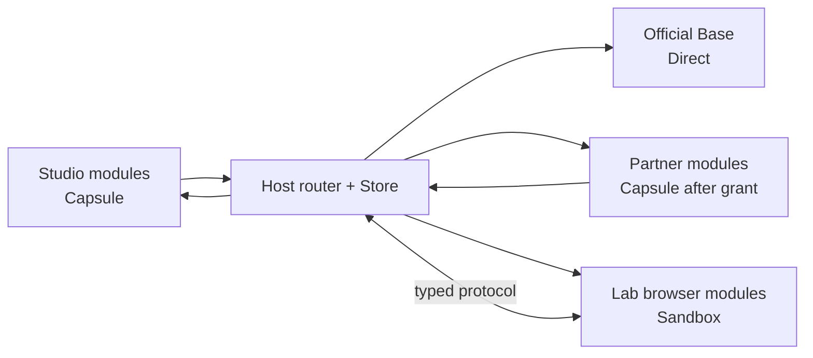
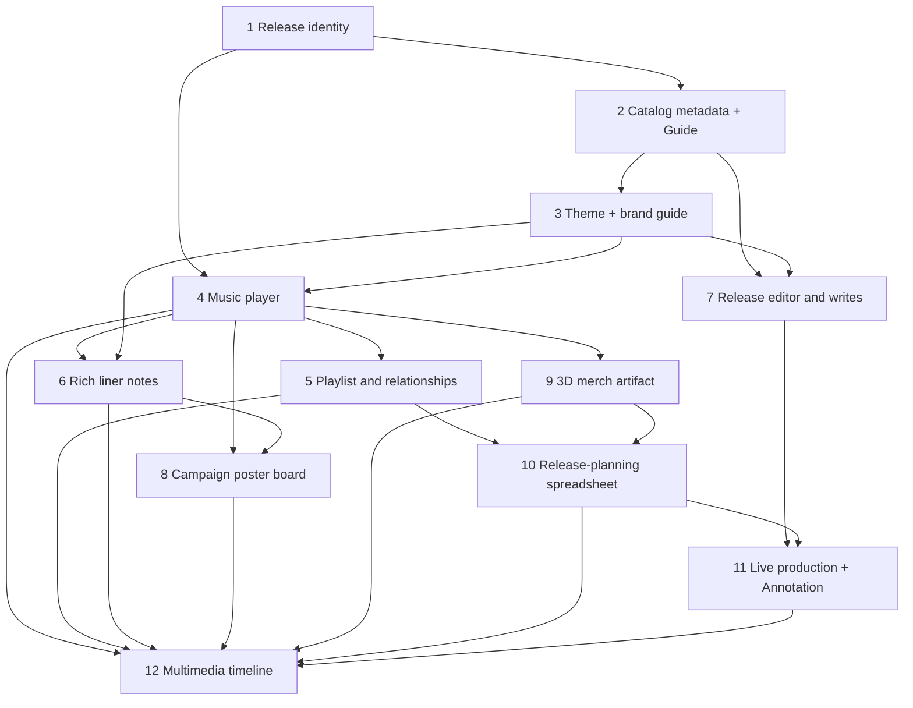

# Boxel execution runtime composition suite

## Purpose

This is the deterministic acceptance suite for the Boxel execution runtime.
It replaces a collection of isolated sandbox demos with one deliberately
interlinked graph that grows through twelve use cases. Each use case reuses
Boxels introduced earlier, adds one new semantic pressure, and proves both the
visual result and the behavior across Direct, Capsule, and Sandbox execution.

In this document, **Boxel means Box Element**: a visually present,
interactive `BaseDef`-derived building block. It does not mean the Boxel
product as a whole. CardDef, FieldDef, FileDef, and future compatible visual
kinds are Boxels. A persisted Card document is only one kind of Boxel state.

This suite is intentionally tighter than the exploratory compatibility corpus:

- the corpus remains useful for discovery, random sampling, and soak testing;
- this suite is small enough to run in CI on every change;
- every fixture is crafted locally and deterministic;
- every later use case composes actual earlier Boxels rather than copying
  their markup or behavior;
- visual and interactive expectations are part of correctness;
- each boundary crossing has an expected runtime route and authority;
- a passing placeholder, raw JSON dump, blank panel, or inert control is a
  failure even when no exception was thrown.

The architecture that this suite verifies is described in
[boxel-execution-runtime-architecture.md](boxel-execution-runtime-architecture.md).
The BXL projection and server-enforcement contract is specified in
[boxel-execution-runtime-authorization-projection.md](boxel-execution-runtime-authorization-projection.md).
Canonical edits and Commands are specified in
[boxel-execution-runtime-mutation-protocol.md](boxel-execution-runtime-mutation-protocol.md).
The broader inventory of current POC behavior is in
[boxel-execution-runtime-coverage-audit.md](boxel-execution-runtime-coverage-audit.md).
The fifty-example pressure test that selected the mechanisms in these twelve
cases is in
[boxel-execution-runtime-real-example-audit.md](boxel-execution-runtime-real-example-audit.md).

## What this suite must prove

The suite has seven non-negotiable outcomes:

1. **One authored API.** A Boxel author uses normal Boxel Card API, Field API,
   Glimmer, and approved `surface*` capabilities. The author does not write
   MessageChannel, SES, iframe, or boundary-record code.
2. **Composition survives a graph, not merely a pair.** A Capsule parent may
   delegate to a trusted Base field, which may render a linked Capsule card,
   whose isolated view may contain a Sandbox child. Each nested render
   re-enters the Host router without flattening identity or trust.
3. **Provenance selects execution.** A parent cannot weaken a child's
   isolation. Trusted Base can remain Direct; ordinary user source runs in a
   Capsule; browser-dependent source runs in a Sandbox.
4. **The Store remains canonical.** Execution runtimes receive bounded
   representations. Writes are explicit Host capabilities, re-authorized and
   committed through the Store.
5. **Visual parity is semantic parity.** Themes, images, CSS variables,
   layout, height, accessible roles, focus, loading states, and formatted
   values must match the Direct reference within declared tolerances.
6. **No partial unknown records.** Missing protocol features retain
   last-known-good output and show a diagnostic. They never degrade silently
   to `undefined`, blank UI, raw JSON, or the wrong format.
7. **Authorization reduces the graph before rendering.** A linked BXL policy
   projects only usable fields, relationships, query results, formats,
   sections, and Commands. The client can never widen the server-authorized
   graph, and denied values never cross Direct/Capsule/Sandbox boundaries.

## Fixture topology and provenance

The suite uses three deterministic test realms and trusted Base fixtures. The
word Realm is reserved for server-side data/module location and authorization;
it does not name a Host execution service.

| Source lane | Example URL root                                            | Default execution                           | Purpose                                                                  |
| ----------- | ----------------------------------------------------------- | ------------------------------------------- | ------------------------------------------------------------------------ |
| Official    | `https://cardstack.com/base/` and test-only trusted modules | Direct                                      | Base fields, trusted components, Host commands, standard format fallback |
| Studio      | `https://studio.test/album/`                                | Capsule                                     | Primary user-authored release workspace and most composition             |
| Partner     | `https://partner.test/licensed/`                            | Capsule after an explicit grant             | Cross-Realm authorization, inherited user code, linked media             |
| Lab         | `https://lab.test/artifacts/`                               | Sandbox when browser capability is required | Three.js/WebGL and other document/window-dependent programs              |

The test Store gives Studio no implicit access to Partner. A test chooser adds
one explicit Partner card link and a narrow read grant. A later test revokes
the grant. Lab data is similarly projected; loading a Sandbox does not grant
search access to the whole Store.



Every rendered node records a test-only execution trace containing:

- Boxel URL and type reference;
- source module generation and source hash;
- selected format;
- execution tier (`direct`, `capsule`, or `sandbox`);
- parent render-slot id and child render-slot ids;
- Store document revision;
- granted capabilities;
- component mount/unmount counts; and
- stylesheet acquisition/release counts.

The trace is diagnostic evidence, not an author-facing API and not permission
to introspect live constructors.

## The cumulative graph

The domain is an independent music release. It is visually rich enough to
exercise Boxel as an interactive system while remaining deterministic and
small. The final use case is a multimedia production timeline that reuses the
actual player, notes, playlist, poster, image, query, and 3D artifact Boxels
introduced earlier.



## Shared assertion vocabulary

Each case declares five forms of evidence. A test is incomplete if it checks
only the first.

| Evidence    | What it proves                                                                                                                       |
| ----------- | ------------------------------------------------------------------------------------------------------------------------------------ |
| Semantic    | Correct field values, computed values, relationship identity, query membership, format selection, and mutation payload               |
| Visual      | Required visible text, images, icons, formatted values, computed CSS variables, solid background handoff, and bounded geometry       |
| Interactive | Focus, typing, selection, pointer input, playback, drag/resize, commands, or save behavior changes visible state                     |
| Boundary    | Expected Direct/Capsule/Sandbox route, no leaked constructors/services/Store, and correct capability set                             |
| Lifecycle   | Stable render-slot identity, loading/error/last-known-good behavior, HMR acknowledgement, cleanup, and no duplicate listeners/styles |

High-value layouts use small screenshot regions in addition to DOM assertions.
Screenshot comparison is not used for rapidly changing browser chrome or font
antialiasing. The invariant manifest carries the durable visual contract:

```ts
interface BoxelVisualExpectation {
  format: string;
  visibleText?: string[];
  roles?: Array<{ role: string; name?: string }>;
  images?: Array<{ alt: string; loaded: boolean }>;
  cssVariables?: Record<string, string>;
  geometry?: Array<{
    selector: string;
    minWidth?: number;
    minHeight?: number;
    contains?: string;
  }>;
  interactive?: Array<'focusable' | 'editable' | 'draggable' | 'playable'>;
}
```

## Use case 1 — Release identity and primitive fields

### Boxels introduced

- `Release` CardDef in Studio.
- Official Base fields rendered through trusted Direct component portals.
- One `Release/opening-night.json` instance.

### Semantics exercised

- `@field` with `contains` for `StringField`, `NumberField`, `BooleanField`,
  `BigIntegerField`, `TextAreaField`, `EmailField`, `UrlField`,
  `PhoneNumberField`, `EthereumAddressField`, and `ColorField`.
- `DateField`, `DateTimeField`, `TimeField`, `DateRangeField`, and
  `DateTimeStampField`, with exact date-versus-datetime JSON shapes.
- `PercentageField` formatting.
- `cardTitle`, `cardDescription`, `cardInfo`, `headerColor`, and
  `prefersWideFormat` projection.
- `computeVia` for a short release status string and a chained ordinary getter.
- `isolated`, `embedded`, `fitted`, `atom`, `head`, `markdown`, and default
  `edit` format selection. The format set is data, not a closed enum.

### Visual and interactive contract

The isolated card shows coverless release identity, release date, availability
status, completion percentage, contact link, and an explicit color swatch.
Embedded is a compact two-row identity block. Fitted responds at badge, strip,
tile, and card container sizes without overflow. Atom is one readable pill.
Head supplies only head metadata. Markdown is stable copy, not `[object Object]`.
Default edit renders appropriate trusted Base controls and remains writable.

### Required assertions

- Capsule author code never runs in Host.
- Every Base field component is Direct and sees the same field value/config as
  the authored template would see without a boundary.
- `0`, `false`, empty string, null optional fields, and the BigInt transport
  codec do not collapse into one another.
- Date formatting does not throw and a wrong Date/DateTime fixture is rejected
  as a fixture error rather than becoming a blank preview.
- Header title is not `Untitled`; header color and wide-format preference match
  the Direct reference.

## Use case 2 — Catalog metadata FieldDef, configuration, and Guide

### Boxels introduced

- `CatalogMetadata` FieldDef contained by `Release`.
- `Credit` FieldDef used by `containsMany` with exactly two small entries.
- `Price` using `AmountWithCurrency` and linked `CurrencyField`.
- `VenueAddress` using `AddressField`, `CountryField`, and `CoordinateField`.
- `ReleaseGuide`, a data-authored Guide linked from `cardInfo.guide`.

### Semantics exercised

- FieldDef versus CardDef identity: contained metadata has no independent card
  URL and does not cross the Store as a fake card document.
- `contains(FieldDef)`, `containsMany(FieldDef)`, nested field paths, and
  delegated `<@fields.* />` rendering.
- Static field configuration, configuration callback using owner context, and
  per-use configuration override.
- `ConfigurationInput`, resolved field-configuration merging, invalidation of
  the per-instance field-configuration cache, and `enumConfig` callbacks.
- `CurrencyField.symbol` and nested getters across trusted Base FieldDefs.
- `@field`, `@model`, `@format`, `@context`, `@configuration`, and writable
  `@set` component arguments.
- Compound validation and fallback presentation.
- Guide cascade across base, domain, realm, and inline layers; JQXL-backed
  visibility, constraints, computed defaults, helper text, and field order.

### Visual and interactive contract

The metadata section is a two-column grid with producer, region, origin
country, farm/venue coordinate, process, price with currency symbol, and two
credits. Edit mode exposes a country selector, numeric price control, currency
selector, coordinate inputs, and configured labels/placeholders. It must never
remain on `Loading countries...` after the Base options resolve.
Changing the Guide changes help text, field visibility, ordering, constraints,
and suggested defaults without loading new authored TypeScript.

### Required assertions

- A nested edit updates the canonical Release document through one authorized
  mutation and retains unrelated fields.
- No side-loaded contained FieldDef is serialized as a card resource.
- Configuration callbacks run in the owning runtime and cross the rendering
  boundary as resolved configuration, not executable functions.
- Guide data and evaluated JQXL results cross the boundary as bounded records;
  no Guide introduces a callback, Store handle, or ambient authority.
- Scalar/list/field-order cascade rules produce the same form in Direct,
  Capsule, and Sandbox.
- `CurrencyField.symbol`, nested `computeVia`, and an undefined optional nested
  path produce their declared fallback, not `undefined 24`.

## Use case 3 — Enumerations, inheritance, theme, brand guide, and images

### Boxels introduced

- `DeluxeRelease extends Release` in Studio.
- `ReleaseTheme` CardDef using `CssValueField` and `TypographyField`.
- `ReleaseBrandGuide`, a local instance adopting the trusted `BrandGuide`
  definition and linked through `cardInfo.theme`; it is not a subclass.
- Cover image pair: `linksTo(ImageDef)` plus `contains(UrlField)` fallback.
- One linked `PngDef` and one polymorphic `WebpDef` fixture.

### Semantics exercised

- inherited fields, inherited formats, an overridden format, and a new field;
- `enumField` static scalar options;
- rich enum labels/icons;
- dynamic enum options resolved from owner state;
- per-use enum configuration override;
- null enum value and invalid-value validation;
- `Tag` cards through `linksToMany`;
- `cardInfo.theme`, theme inheritance, CSS-variable injection, `headerColor`,
  and authored scoped styles;
- the trusted Theme → StructuredTheme → StyleReference → BrandGuide behavior,
  with local values on one linked BrandGuide instance rather than copied token
  fields or a new subclass;
- BrandGuide palette-to-functional CSS-variable computation and `cssImports`
  font loading;
- the URL/ImageDef pair, polymorphic image links, and broken-image fallback.

### Visual and interactive contract

The deluxe release has a deliberate poster-like theme, cover art with alt
text, typography tokens, a stage pill from a rich enum, and visible tags. The
Brand Guide visibly demonstrates the same palette, type scale, spacing,
imagery treatment, and representative controls. Direct reference and Capsule
must have matching background, foreground, typeface family category, spacing
tokens, and loaded image. Styles may not leak into Host chrome or sibling
cards.

### Required assertions

- Inherited type metadata preserves the child's source provenance and does not
  promote it to Direct because its parent is trusted.
- Every declared/overridden format appears in `BoxelDescription.formats`.
- Theme and Brand Guide retain one canonical token source and render the same
  tokens in Direct and Capsule.
- Relinking `cardInfo.theme` to a rotated-palette BrandGuide changes every
  visible themed element without remounting the release or retaining a
  hard-coded color/font leak.
- Image identity, content URL, alt text, intrinsic dimensions, and load/error
  state survive the boundary.
- Enum option labels/icons and dynamic configuration are identical in Direct
  reference and Capsule rendering.

## Use case 4 — Music player

This Boxel is deliberately introduced early because use case 12 must reuse the
actual player, not a visually similar copy.

### Boxels introduced

- `Track` CardDef in Studio.
- linked audio `FileDef` fixture and linked cover `ImageDef` from use case 3;
- `MusicPlayer` component used by Track's isolated and embedded formats.

### Semantics exercised

- FileDef link identity, MIME type, filename, content URL, and metadata;
- `@tracked` play state, current time, duration, volume, and scrub position;
- Glimmer actions, modifiers, event cleanup, and derived display getters;
- `surfacePlayback` registration and commands: play, pause, seek, rate,
  current-time reporting, ended, and error;
- safe media element access through the Surface capability plane rather than
  ambient navigator/window authority;
- isolated, embedded, fitted, atom, and edit presentation.

### Visual and interactive contract

The player shows cover, track title, artist, play/pause control, elapsed and
duration text, seek bar, and volume control. Atom is a non-playing identity
pill; fitted is a bounded mini-player only when interaction is allowed by the
container. Edit changes Track metadata but does not duplicate audio bytes into
card JSON.

### Required assertions

- Clicking play advances time and changes accessible control name to Pause.
- Seek and volume changes round-trip once; no duplicate event listeners appear
  after format switches or HMR.
- Two player surfaces can be assigned to the same playback group and converge
  on play state/time within tolerance without recursively echoing commands.
- The player is Capsule-capable because it uses approved capabilities and no
  browser-dependent external package.

## Use case 5 — Playlist, relationships, and query fields

### Boxels introduced

- `Playlist` CardDef in Studio.
- Three Track instances, including one explicitly granted Partner Track.
- One deliberately broken relationship slot.
- A query-backed `recentTracks` field.

### Semantics exercised

- `linksTo`, `linksToMany`, indexed relationship JSON keys, null, loading,
  present, and broken states;
- `getRelationshipMembershipState(...).isLoading`, including the requirement
  that the template also reads the field;
- `undefined` holes without changing relationship-array length;
- defensive link traversal and `.filter(Boolean)` only where intended;
- query-backed `linksTo` and `linksToMany`, `$this`, `$REALM`, sort, and page;
- aggregate `computeVia` across loaded related values;
- delegated Track rendering in atom, fitted, and embedded formats.

### Visual and interactive contract

The playlist has ordered rows, cover thumbnails, duration, and play controls.
While loading, it shows the existing Boxel spinner and stable row geometry.
A broken slot shows a bounded unavailable-row state rather than disappearing,
throwing, or shifting later row identity. Query refresh visibly returns to a
loading state and then preserves sort order.

### Required assertions

- The Partner Track is unreadable before the explicit grant and readable after
  it without granting search over the Partner realm.
- Query-backed fields are materialized for rendering but omitted from PATCH.
- The child Track runtime is selected from the Track module's provenance, not
  inherited from Playlist.
- Nested path is at least Capsule Playlist → Host router → Direct Base field →
  Host router → Capsule Track.

## Use case 6 — Rich liner notes and recursive delegated rendering

### Boxels introduced

- `LinerNotes` CardDef in Studio using `RichMarkdownField`.
- Markdown fixture containing headings, lists, a table, a Mermaid diagram,
  cover image, Track atom, Track embedded player, Playlist fitted card, and a
  link to the Release.

### Semantics exercised

- MarkdownField and RichMarkdownField rendering and editing;
- trusted CodeMirror and Mermaid shims distributed by Boxel;
- Boxel-flavored Markdown embeds through `viewCard`/delegated rendering;
- nested format propagation and stable child identities;
- image/file embeds and sanitization;
- editable body mutation through the trusted Base RichMarkdown editor;
- a RichMarkdown-owned Layout → Run projection of the same canonical document;
- Surface use/change/inspect mode propagation, keyboard traversal, and focus
  return through the outline and editor; and
- cue label, description, status, and accessory semantics as non-product
  chrome.

### Visual and interactive contract

Read mode shows formatted prose, a rendered Mermaid SVG, a loaded cover image,
and visibly distinct atom/embedded/fitted child formats. Edit mode shows a
working rich editor with the full body loaded, toolbar, slash menu, and live
preview behavior. Raw Markdown, raw Mermaid source, and raw JSON are failures.

### Required assertions

- CodeMirror and Mermaid execute as explicitly trusted shim modules, not as
  ambient Host imports granted to all authored code.
- Markdown → Base RichMarkdown Direct portal → Host router → Capsule Track →
  Base media component proves the recursive graph.
- Focus, selection, and edits remain stable when a nested child finishes
  loading.
- RichMarkdown Layout and Run nodes project into stable Surface paths without
  copying their content or creating a second document state.
- A nested iframe is never created for atom/head/markdown merely because the
  same card type has a Sandbox-only isolated renderer in another module.

## Use case 7 — Release editor, writable fields, and canonical PATCH

### Boxels introduced

- `ReleaseEditor` custom edit component in Studio.
- `BoxelSelect` for rich enum selection.
- Save and validation status components.

### Semantics exercised

- custom versus default edit templates;
- writable `@set` for primitive, compound, contained, and linked fields;
- BoxelSelect delegated rendering;
- validation errors, dirty state, optimistic local state, server
  acknowledgement, and last-known-good rollback;
- cardInfo aliases without duplicate synthetic fields;
- canonical Boxel JSON:API PATCH shape and removal of query-backed fields;
- read/write capability independent of execution tier; and
- `ReleaseGuide` remains the source of labels, constraints, ordering, and
  conditional visibility in both default and custom edit formats.

### Visual and interactive contract

Edit is visibly an editor: labels, controls, validation, save status, and no
read-only flash while authority settles. A successful local edit appears
immediately. Server acknowledgement does not remount or revert it. A rejected
save keeps the draft, restores the last valid preview, and shows an actionable
error overlay in the standard bottom position.

### Required assertions

- A field writable Direct remains writable in Capsule or Sandbox when the
  capability is granted; sandboxing alone cannot turn it read-only.
- The Host rejects side-loaded non-card resources and unauthorized links.
- Mutation intent contains changed field path/value and expected document
  revision, not a live Store object or authored instance.
- Reauthorization happens on every mutation, including after a grant is
  revoked.

## Use case 8 — Release campaign PosterBoard and Frame coordination

### Boxels introduced

- `CampaignBoard` CardDef in Studio.
- `PositionedCardField` entries referencing Release, LinerNotes, Track, and
  ImageDef, each with x/y/width/height.
- a trusted `PosterBoard` Surface containing one `Frame` per campaign asset;
- two ordered placement lanes and one positioned target.

### Semantics exercised

- `PositionedCardField` identity and geometry;
- `surfacePresentation` background/header presentation;
- `surfaceViewport` pan, zoom, focus, and coordinate conversion;
- `surfaceLayout` allocated rectangles and intrinsic-size reporting;
- `surfaceObserve`, `surfaceStyle`, `surfaceFocus`, `surfacePointer`, and
  `surfaceSlot` where already shipped or explicitly stubbed by the fixture;
- drag/resize mutation through a Host-authorized capability;
- theme variables and scoped authored CSS in nested render slots;
- stable PosterBoard/Frame identity/path, parent context, coordinate source, and
  use/change/inspect posture propagation;
- keyboard focus ladder, one selected Frame, and inspect hover;
- inline-versus-lifted editing with anchor geometry, commit/cancel, and focus
  return;
- CSS-like Surface rule matching by specificity/order and component choice;
- self/children/descendants/subtree directive scope and posture inheritance;
- typed cross-container placement shared by pointer, keyboard, and paste; and
- placement ghost, insertion wedge, structured denial, autoscroll, and scoped
  FLIP/view-transition lifecycle.

### Visual and interactive contract

The board is a designed poster canvas, not a list. Cards have deterministic
positions and sizes, cover images load, pan/zoom retains crisp geometry, and
selection/focus is visible. Embedded children fit their allocated rectangles.
Background presentation avoids the double-frame effect without copying
untrusted arbitrary CSS into Host chrome.

### Required assertions

- x/y/width/height cross the boundary as typed values and persist after drag.
- Surface capabilities are issued per mounted render slot and revoked at
  teardown; they do not live on the Boxel semantic runtime.
- Nested styles cannot select Host chrome or sibling slots.
- A child asking for intrinsic height cannot override a parent-allocated
  fitted rectangle.
- Move and reference placement preserve stable Card identity and commit the
  exact ordered index requested by the target.
- Pointer capture, drag observers, lifted planes, transition names, and
  temporary ghosts are released after commit, cancel, error, and teardown.

## Use case 9 — Split-module 3D merchandise artifact

### Boxels introduced

- `MerchArtifact` CardDef in Studio with safe metadata/formats.
- `merch-artifact-canvas.gts` in Lab importing Three.js and a 3MF loader.
- linked 3MF FileDef, poster ImageDef, and thumbnail formats.
- a safe editable Canvas graph with two nodes and one edge whose canonical
  node state is also consumed by the Sandbox Scene.

### Semantics exercised

- format implementation split across modules;
- natural classifier behavior: the safe GTS is Capsule and the Three.js GTS is
  Sandbox because of its browser-dependent import;
- literal `static prefersFullSandbox = true` as an explicit minimum-isolation
  request where present;
- format-aware selection without pretending module-level imports are
  format-local;
- `surfaceCanvas`, pointer input, allocated/intrinsic sizing, body/container
  presentation, prerender placeholder, readiness spinner, and teardown;
- safe thumbnail/atom/head/fitted rendering without inline iframes;
- Canvas node drag/resize, handles, connection/reconnection, edge label,
  minimap, and viewport portal; and
- Scene camera drag, wheel momentum, node motion, and one deterministic visual
  effect without granting ambient DOM authority to the Capsule.

### Visual and interactive contract

Isolated and embedded show the interactive rotating artifact in an
origin-isolated Sandbox. Edit exposes metadata controls and a bounded preview.
Fitted, atom, head, and markdown use the safe poster/thumbnail module in a
Capsule. Prerendered format-correct HTML appears immediately while the iframe
loads; the standard spinner sits beside the realm icon until interaction is
ready. Replacement causes no content jump beyond a declared tolerance.

### Required assertions

- The same source module is never classified differently merely because a
  different format was requested. Separate modules are the optimization seam.
- If the author imports Three.js into the main module, all executable formats
  from that module use Sandbox; non-executable prerendered thumbnails remain
  possible but are not hydrated as Capsule code.
- Sandbox origin, CSP/fetch policy, MessageChannel version, and height mode are
  verified.
- Canvas and Scene agree on coordinate conversion while retaining independent
  mounted presentation state.
- WebGL contexts, observers, animation frames, listeners, and object URLs are
  released on teardown.

## Use case 10 — Release-planning spreadsheet and explicit grants

### Boxels introduced

- `ReleaseCollection` in Studio.
- `ReleasePlanningSheet` in Studio, backed by the collection's canonical query
  and rendered with trusted `Table` and `Cell` components.
- `LicensedTrack extends Track` in Partner.
- `ReleaseAccessPolicy`, a linked BXL policy for resource-scoped release
  visibility and Commands.
- label, release-team, rights-team, finance-team, suspended-collaborator, and
  guest principals, including one recursively nested release team.
- query result sections rendered through `@context.searchResultsComponent`.
- one granted Partner image and one ungranted sibling.
- rows for each Track with title, artist, ISRC, rights status, launch date,
  territory, price, rating, and campaign-ready state.

### Semantics exercised

- `RealmField`, `CodeRefField`, and `AbsoluteCodeRefField`;
- `codeRef(here, path, name)` and injected `realmURL` identity;
- type, eq, in, contains, range, matches, any, every, and not filters;
- custom-field sort with `on`, general sort without `on`, and pagination;
- `@context.searchResultsComponent`, `getCards`, and query-backed fields as
  three distinct query consumers;
- `searchable` relationship projection;
- user-selected cross-Realm links and narrow Store grants;
- Host-owned BXL projection from a finite, already-authorized relationship
  snapshot;
- nested team membership, `via(Resource.Label; ...)`, capability composition,
  request inputs, and explicit refusal that wins after positive eligibility;
- resource-scoped field, relationship, query, section, and Command visibility;
- inheritance across provenance boundaries;
- stable Table/Cell identities under virtualization, pinned/resized columns,
  keyboard cell traversal, selection, and deterministic bulk status changes;
- trusted number, date, currency, enum/status, checkbox, and rating cell
  widgets; and
- lifted cell editor and context menu focus/commit/cancel behavior.

### Visual and interactive contract

The release-planning spreadsheet has stable sections for new releases,
high-rated tracks, launch windows, text matches, and explicitly licensed
Partner content. Its visible columns and editors are meaningful to music
release operations rather than a generic Grid demonstration. Each result uses
its declared child format and shows title, image, and release status. Empty
authorized results show an empty state; unauthorized results show no leaked
title, count, URL, or timing-dependent placeholder.

The same sheet is projected for several viewers. The artist sees identity,
catalog, and submission controls. A rights-team member sees territories,
licenses, and rights approval. Finance sees pricing and revenue fields without
unreleased media or internal notes. A guest sees a release locator and
request-access control only. A suspended collaborator remains a member of a
nested release team, but an explicit refusal removes internal notes and every
mutation. Switching viewers updates only authorization-dependent columns,
sections, rows, and Commands; unaffected Table/Cell and child render-slot
identity remains stable.

### Required assertions

- A bare `{ on: ref }` fixture is rejected by fixture validation rather than
  silently passing with zero rows.
- Custom sort without `on` is rejected; `lastModified`, `createdAt`, and
  `cardURL` remain valid general sorts.
- Granting one linked Partner card does not grant arbitrary search, neighboring
  card access, module source, or Realm enumeration.
- A grant or nested membership on one Release resource does not grant another
  Release, and `via(...)` exposes only the declared label capability.
- Denied fields, relationships, rows, totals, titles, URLs, menu items, and
  Commands are absent from the render record and DOM rather than hidden after
  materialization.
- Client BXL decisions can only reduce the server upper bound; forged `allow`,
  stale policy/input revisions, and direct Command attempts are refused by the
  Host/server.
- Explicit refusal wins over nested-team eligibility in Direct, Capsule, and
  Sandbox consumers.
- Revocation invalidates only affected render/query consumers and retains
  unaffected Direct/Capsule slots.
- Query refresh preserves Table selection, focus, geometry, and unrelated Cell
  mount identity.

## Use case 11 — Live production, Realm Script, async AI, and volatile modules

### Boxels introduced

- `ProductionConsole` in Studio.
- a typed `PublishReleaseCommand` with a run card and progress.
- a volatile Track format module edited by Monaco and by an out-of-band write.
- `CampaignImageRun` with contained stages/logs and four generated
  `CampaignAsset` image links.
- a capability-scoped Realm Script that resolves release data into a validated
  image-generation plan; provider IO and binary persistence remain Host
  commands.
- `ReleaseReviewAnnotation` with target, typed Field/TextRange/Cell anchor,
  body, author Actor, assignee, state, and a linked approval workflow.
- `ReleaseApprovalRoom`, a concrete mixed-ownership card governed for a bounded
  review window by a versioned `ReleaseApprovalPolicy`:
  - liner notes are a Yjs-concurrent rich-text field;
  - publication state, rights approval, and approver are Command-owned;
  - release date and territories are frozen after the review window opens;
  - cover artwork remains an ordinary revisioned ImageDef link;
  - readiness is computed; and
  - discussion and `ReleaseReviewAnnotation` records are evidence, not
    authority.

### Semantics exercised

- Command input/output/progress and Host command capabilities;
- source classification and transpilation cache by source hash;
- volatile module generation, local draft, server acknowledgement, and
  last-known-good state machine;
- HMR for Capsule formats and persistent Sandbox protocol for Sandbox formats;
- error overlay, reload action, and explicit execution signage;
- source navigation independent from preview readiness;
- BXL patch result paths, deterministic scheduling, and two-client replay
  convergence;
- Realm Script preview-versus-commit, JSON-schema output validation, input and
  result byte limits, cancellation, and wall-clock timeout;
- an optimistic asynchronous image pipeline: resolve voice/prompt, dispatch
  four provider jobs, persist each binary as it completes, link ImageDefs,
  then settle indexing acknowledgements;
- partial success, out-of-order completion, cancellation, retry, idempotency,
  and stale-generation rejection; and
- exact Host-tool grants and import denials rather than ambient AI, Store,
  network, filesystem, or credential access;
- durable Annotation creation, assignment, reply, resolution, and query-backed
  review state through typed Commands with Actor attribution; and
- ordered workflow advancement using canonical Annotation and Command state,
  never UI-local comment state;
- episodic, field-scoped coordination: one current write owner per path,
  minimal Policy custody, and automatic return to ordinary revisioned writes
  when the approval term lapses;
- lazy Yjs epochs for the declared rich-text field, with cursor, selection,
  focus, and presence carried as ephemeral awareness rather than card state;
- typed Command admission, sequencing, idempotency, and receipts for
  consequential approval fields, with every accepted field patch joining the
  same canonical card-revision boundary as ordinary and collaborative writes;
- atomic AI snapshot compare-and-swap while collaboration is active: settle
  accepted Yjs updates, fence and close the affected epoch, install the
  candidate only if its base revision is current, and start a new epoch for
  connected collaborators; and
- publication's two clocks: compatible instance-data revisions follow the
  source change feed while code, schema, templates, theme, and projection
  policy stay pinned until republish.

### Visual and interactive contract

Monaco/file navigation displays source as soon as fetched and never waits for
preview classification/rendering. Valid text or CSS edits update the preview
without destroying the render slot or unrelated Store state. The first
canonical-to-volatile transition may show one loading flash; subsequent
compatible generations do not. A syntax error keeps last-known-good output and
floats the standard error panel over the bottom of the card.

The image run shows four stable aspect-ratio placeholders, per-stage progress,
and each successful image as soon as its binary is durable. A failed variant
remains an actionable retry tile; it does not hide the three successful
results or block Monaco, playback, or navigation.

The review Annotation is visibly attached to the release field,
release-planning Cell, or liner-notes text range it addresses. Its body,
author, assignee, status, replies, and workflow step survive navigation and
render in Capsule and Sandbox without exposing the target's ungranted
neighboring data.

The Release Approval Room shows the ownership model rather than hiding it in a
protocol test. Two collaborators can edit liner notes and see each other's
presence. Approval controls show admitted, refused, duplicate, and completed
Command receipts. Frozen release terms remain legible but unavailable, while
an ungoverned title correction and artwork replacement remain writable. A
review Annotation can recommend approval but cannot change publication state.
When the bounded Policy term closes, its custody indicator disappears and the
formerly governed paths return to their declared ordinary behavior.

### Required assertions

- Matching SSE/index echoes acknowledge the active generation; they do not
  reload the preview or revert to older source.
- An out-of-band Boxel CLI write to the displayed module joins the same
  volatile pipeline until the card unloads.
- A manual Reload Card action deliberately remounts only the selected render
  slot and resets its volatile runtime generation.
- Command authority is explicit and cannot be acquired merely by importing a
  Host tool module from authored code.
- Annotation targets and anchors retain stable Boxel identities, Actor
  attribution, and authorization across Direct, Capsule, and Sandbox; resolve
  and reply are mutations, not local component state.
- At most one of ordinary revision writes, Yjs, Command authority, frozen
  custody, or atomic snapshot installation owns a field path at a time; the
  Host never infers ownership from which component happens to be mounted.
- A direct write to a Command-owned or frozen path is refused, while an
  unlisted path on the same card remains writable. Duplicate or out-of-order
  approval Commands produce exactly one accepted transition and stable
  receipts.
- Two Yjs clients converge on the same liner-notes content; awareness never
  appears in serialized card JSON, indexing, search, prerender, or PATCH.
- A stale AI snapshot cannot silently replace collaborative work. A current
  snapshot changes the epoch without replacing Command-owned fields that were
  outside its admitted scope.
- Annotation bodies, local messages, and federated evidence cannot mutate the
  approval projection without an independently authorized local Command.
- A compatible data change reaches a published view without republishing its
  executable definition. An incompatible schema change retains last-known-good
  output and reports `republish-required` instead of partially rendering.
- CI uses a deterministic fake image provider with controlled completion
  order; the contract test still exercises the real Realm Script, command,
  binary-file, ImageDef, Store, indexing-acknowledgement, and rendering path.
- Realm Script cannot select its model, read provider credentials, issue an
  ungranted request, write in preview mode, or smuggle an executable function
  through its schema-validated result.
- A BXL mutation and two-client scheduled event log converge exactly once
  after duplicate, delayed, and out-of-order acknowledgements.

## Use case 12 — Multimedia production timeline

This is the graph acceptance test. It reuses the exact Boxels from earlier
cases:

- MusicPlayer and Track from use case 4;
- Playlist from use case 5;
- LinerNotes from use case 6;
- ReleaseEditor state from use case 7;
- Campaign PosterBoard and Frames from use case 8;
- MerchArtifact from use case 9;
- federated Partner content from use case 10;
- command/volatile state, generated CampaignAssets, and the still-queryable
  CampaignImageRun from use case 11; and
- the unresolved release-review Annotation and approval workflow from use case 11.
- the active Release Approval Room, including its collaborative liner notes,
  field-custody projection, Command receipts, and bounded Policy term from use
  case 11.

### Boxels introduced

- `TimelineEntry` FieldDef with time, duration, lane, format, and linked Boxel;
- `MultimediaTimeline` CardDef in Studio;
- one video FileDef and synchronized audio/video surfaces.

### Semantics exercised

- heterogeneous CardDef/FieldDef/FileDef visual graph;
- repeated rendering of the same Card instance in different formats;
- nested Capsule → Host → Direct → Host → Capsule and Capsule → Host →
  Sandbox paths;
- playback group synchronization, viewport synchronization, focus, pointer,
  layout, presentation, intrinsic/allocated height, and slot coordination;
- simultaneous relationship/query loading and a later grant revocation;
- cycle detection, render budgets, stable identities, and teardown;
- edit and command mutations while media remains mounted;
- pointer/keyboard/paste placement of earlier Boxels, lifted metadata editing,
  use/change/inspect mode switching, and one Surface-scoped view transition;
  and
- generated image arrival and failed-variant retry while the timeline remains
  mounted; and
- a TimelineAnchor Annotation on a cue, resolved without replacing the
  Annotation card or interrupting playback; and
- concurrent liner-notes edits and an approval Command crossing distinct
  nested render paths without either writer replacing the other's field-scoped
  canonical patch.

### Visual and interactive contract

The timeline has visible time rulers and lanes for audio, video, notes, poster
composition, and 3D artifact. The use-case-4 MusicPlayer is mounted in the
audio lane and remains the controller of its media state. Seeking the timeline
updates player and video; playing either approved leader synchronizes the
group. Notes and board elements retain their authored theme. The Sandbox 3D
entry receives an allocated viewport while atom/fitted references use safe
thumbnails. Editing release metadata updates all relevant labels without
resetting playback, pan/zoom, focus, or the iframe.
The campaign lane reuses the case-11 image assets: successful variants appear
in completion order without changing their requested slot order, and retrying
the failed variant does not remount the player or the board.

### Required assertions

- The expected execution graph includes at least one route with five boundary
  transitions and preserves the original Card/Field/File identities.
- Duplicate views share canonical Store data but have independent mounted
  presentation state unless explicitly joined by a `surface*` group.
- No child can search, mutate, navigate, or read media beyond its capabilities
  and explicit Store grants.
- One child error or revoked grant does not blank the timeline.
- Dragging the case-4 player from the release-planning Table into a timeline lane uses the
  same typed placement command for pointer, keyboard, and paste. A lifted
  editor can modify it without interrupting playback.
- Grant revocation and generated-image acknowledgements preserve unrelated
  focus, playback, Table selection, Canvas viewport, and Sandbox state.
- Policy expiry, Yjs epoch transition, and approval receipts update every view
  of the Release Approval Room without remounting the player, Sandbox Scene,
  RichMarkdown editor, or unrelated Direct Base fields.
- After teardown there are zero active timeline surface registrations, media
  subscriptions, iframe ports, Capsule component handles, styles, observers,
  or animation loops.

## Boxel semantic cross-product

The twelve cases are the narrative fixtures. The following table is the
boring-but-load-bearing checklist generated from the Boxel skills glossary.
Every row must map to at least one fixture assertion and one boundary codec or
explicit statement that the value never crosses a boundary.

### Base field catalog

| Family           | Required coverage                                                                                                                  | Primary use case             |
| ---------------- | ---------------------------------------------------------------------------------------------------------------------------------- | ---------------------------- |
| Primitive/string | String, Number, Boolean, BigInteger, TextArea, Email, URL, PhoneNumber, EthereumAddress, Color; null/empty/zero/false distinctions | 1                            |
| Time             | Date, DateTime, Time, DateRange, DateTimeStamp; exact JSON formats and formatter output                                            | 1                            |
| Money/quantity   | Percentage, AmountWithCurrency, Currency and nested `symbol` getter                                                                | 1, 2                         |
| Geographic       | Address, Country option loading, Coordinate round-trip                                                                             | 2, 8                         |
| Markdown         | Markdown read/edit and RichMarkdown read/edit/BFM/Mermaid                                                                          | 6                            |
| File-backed      | generic FileDef, ImageDef polymorphism, PNG, JPG, WebP, GIF, AVIF, SVG, Markdown, CSV, JSON, GTS, TS, Text                         | 3, 4, 6, 9 plus codec matrix |
| Metadata/schema  | CodeRef, AbsoluteCodeRef, Realm, CssValue, Typography                                                                              | 3, 10                        |
| Enum             | static, rich, dynamic, per-use override, null, invalid                                                                             | 3, 7                         |
| Special          | Tag, PositionedCardField; Base64Image explicitly rejected for new fixtures                                                         | 3, 8                         |

The narrative cases need not render a separate large card for every file
subtype. A parameterized file-codec contract test covers all listed subtypes;
the visual graph uses representative image, audio, video, 3MF, Markdown, and
source files.

### Field and relationship semantics

| Semantic            | Required variants                                                                                      | Primary use case |
| ------------------- | ------------------------------------------------------------------------------------------------------ | ---------------- |
| Field declaration   | contains, containsMany, linksTo, linksToMany                                                           | 1, 2, 5          |
| Field kind          | CardDef, FieldDef, FileDef, polymorphic target                                                         | 2, 3, 4          |
| Configuration       | `ConfigurationInput`, static/callback, cache invalidation, inherited/per-use merge, `enumConfig`, null | 2, 3             |
| Computation         | ordinary getter, computeVia, chained dependency, nested Base getter, null/error/cycle                  | 1, 2, 5          |
| Relationship state  | unloaded, loading, present, null, broken, undefined hole, live-query reload                            | 5                |
| Search projection   | contained always, linked opt-in with searchable path(s), non-searchable query rejection                | 5, 10            |
| Inheritance         | inherited fields/formats, override, child provenance, polymorphism                                     | 3, 10            |
| Delegated rendering | `@fields`, `viewCard`, searchResultsComponent, atom/embedded/fitted recursion                          | 2, 5, 6, 10      |
| Component context   | model, field, format, context, configuration, set                                                      | 2, 7             |

### Query semantics

| Query feature                | Required assertion                                                    | Use case 10 section |
| ---------------------------- | --------------------------------------------------------------------- | ------------------- |
| type                         | adopts-from match without `on`                                        |
| eq/in/contains/range/matches | each has a valid `on` scope and returns known rows                    |
| any/every/not                | OR, AND, and negation preserve result identity/order                  |
| sort                         | custom field includes `on`; general metadata sort may omit it         |
| page                         | stable page size and cursor/offset behavior used by implementation    |
| refs                         | `codeRef(here, ...)`, `.gts` module path, injected `realmURL`         |
| substitutions                | `$this` and `$REALM` resolve in the owning runtime                    |
| consumers                    | searchResultsComponent, getCards, query-backed linksTo/linksToMany    |
| persistence                  | query fields never enter card PATCH payload                           |
| refresh                      | loading state re-enters and matching acknowledgement does not remount |

### Authorization semantics

| Authorization feature | Required assertion                                                                                         |
| --------------------- | ---------------------------------------------------------------------------------------------------------- |
| server upper bound    | client projection can remove an allowed capability but cannot add a denied one                             |
| linked BXL policy     | Host resolves the authorized policy revision; authored code receives no policy evaluator                   |
| nested userset        | recursive team membership is cycle-safe, bounded, and grants only the named resource seat                  |
| `via(...)`            | a declared parent-resource capability projects without exposing unrelated parent data                      |
| composition           | one capability may depend on another without leaking the intermediate policy graph                         |
| request input         | break-glass-like input updates the projection only when all policy predicates hold                         |
| explicit refusal      | refusal wins after positive eligibility and removes both data and Commands                                 |
| resource scope        | membership/grant on one Release does not authorize a sibling Release                                       |
| UI projection         | denied values, relationships, query rows, totals, formats, sections, menus, and Commands never materialize |
| reauthorization       | every fetch, search, traversal, Command, and mutation is independently checked by the Host/server          |
| lifecycle             | policy, membership, principal, resource, or input changes preserve unrelated render-slot identity          |

### Presentation, Surface, and lifecycle semantics

The suite must enumerate every shipped or planned `surface*` contract in the
architecture capability ledger. At minimum it assigns fixtures for:

- `surfacePresentation` — header/background intent and iframe container match;
- `surfaceLayout` — intrinsic size and parent-allocated rectangles;
- `surfaceViewport` — pan, zoom, coordinate conversion, viewport observation;
- `surfacePlayback` — play/pause/seek/rate/time/error and group leadership;
- `surfaceCanvas` — 2D/WebGL target and lifecycle;
- `surfaceFocus`, `surfacePointer`, `surfaceObserve`, `surfaceStyle`, and
  `surfaceSlot` — only when their contract is declared in the runtime plan.

Capabilities belong to a mounted Surface registration, not `BoxelRuntime`.
They are scoped to a render-slot id, revocable, and reauthorized at every
mutating operation. A capability named in this document but not yet shipped is
marked `design` in the implementation ledger and cannot be counted as a pass.

## Boundary graph rules

These rules make the suite about composability rather than one-hop transport:

1. Every nested render request returns to the Host router with Boxel identity,
   format, parent slot, and provenance.
2. The router independently selects Direct, Capsule, or Sandbox for the child.
3. Trusted Base components execute Direct even inside a Capsule presentation;
   the Capsule receives no live component constructor or Ember service.
4. A Sandbox owns its document and Glimmer runtime. It receives bounded Store
   projections and capabilities over the protocol.
5. A CardDef, FieldDef, or FileDef may appear at any depth. Boundary records
   distinguish kind without forcing non-card Boxels into Card JSON:API.
6. Repeated Card documents share canonical Store state, not component state.
7. Format is passed on every delegated render; it is never inferred from an
   ancestor after the first selection.
8. The graph has cycle and depth budgets with a visible bounded diagnostic.
9. Runtime/cache invalidation is keyed by affected module generation, not one
   global Realm revision.
10. Teardown walks the graph and releases children even after partial failure.

## CI suite layout

The intended deterministic fixture location is a test-only realm under the
Host test fixtures, with source organized by the twelve use cases rather than
copied from staging. The exact path should follow the existing Host fixture
convention at implementation time.

### Layer A — protocol and codec tests

Fast unit tests, no browser:

- clone/reject each primitive and compound value;
- BoxelDescription formats/kind/cardInfo/theme metadata;
- BoxelRenderRecord projection and mutation sanitation;
- all Base file subtype metadata codecs;
- missing-path diagnostics;
- protocol feature/version negotiation;
- capability ids are opaque and unforgeable;
- no live constructor, Store, service, loader, DOM node, function, or Proxy is
  cloneable across the boundary.

### Layer B — semantic conformance adapter tests

Run the same semantic contract against Direct, Capsule, and Sandbox adapters
where the fixture is eligible:

- describe Boxel;
- instantiate Card from canonical document;
- resolve fields/configuration/getters/computeVia;
- resolve relationships and query fields;
- select and render formats;
- authorize and commit mutations;
- reload/acknowledge generations;
- release all handles.

Sandbox-only browser dependencies are not forced through Capsule merely to
fill a matrix cell. Instead, use case 9 proves that safe and browser-dependent
modules compose at the format boundary.

### Layer C — browser composition acceptance tests

Run the twelve cases in order in one browser suite. Each case may assume the
fixture definitions from earlier cases but resets Store documents and runtime
registries. Browser tests assert semantics, accessible DOM, computed styles,
geometry, interactions, trace route, and lifecycle counts.

High-value screenshot regions:

- use case 3 themed isolated and fitted views;
- use case 6 RichMarkdown read and edit views;
- use case 8 poster board before/after pan;
- use case 9 prerender-to-Sandbox transition;
- use case 12 complete timeline.

### Layer D — navigation/HMR acceptance tests

Use case 11 and 12 add focused tests for:

- immediate file-tree and recent-file navigation;
- Monaco source display independent from preview readiness;
- valid local edit, invalid edit, recovery, SSE acknowledgement, out-of-band
  write, format switch, manual reload, and unload;
- one flash when entering volatile mode, no compatible-generation remounts;
- no stale generation replacing a newer local draft.

### Layer E — soak and compatibility sampling

This is not a per-PR blocker initially:

- navigate all twelve cases across all meaningful formats for 30 minutes;
- open/close repeated Sandbox instances;
- change grants and themes;
- perform 100 compatible HMR generations;
- assert bounded module/runtime/template/style/handle/media growth;
- then sample the larger compatibility corpus and ten recent staging cards.

## Pass criteria

The suite is green only when:

- all twelve cases pass their semantic, visual, interactive, boundary, and
  lifecycle assertions;
- the expected execution graph matches exactly;
- there are no console exceptions, blank panels, raw JSON fallbacks, missing
  required images, perpetual loading labels, or `Untitled` headers;
- Direct reference and Capsule/Sandbox output meet each case's declared visual
  parity tolerances;
- writable controls remain writable with authority and fail closed without it;
- one case's module update does not remount unrelated Boxels;
- all handles, ports, Surface registrations, styles, and media resources are
  released after teardown; and
- no existing regression test was weakened merely to accommodate the runtime.

## Implementation order

1. Build use cases 1–3 and the protocol/semantic adapter harness. This is the
   ordinary Boxel API foundation.
2. Add use case 4 once and expose it as a reusable fixture dependency.
3. Add use cases 5–7 to prove relationships, RichMarkdown, and writes.
4. Add use cases 8–9 for Surface coordination and true browser isolation.
5. Add use cases 10–11 for grants, queries, commands, and HMR.
6. Assemble use case 12 exclusively from the earlier reusable Boxels.
7. Turn the cross-product tables into machine-readable coverage metadata and
   fail CI when an API row has no test owner.
8. Keep the larger compatibility corpus as an independent discovery/soak gate;
   do not substitute it for this deterministic graph suite.

The final design test is simple: if use case 12 requires a copied player,
copied card markup, a special one-off iframe API, or a trusted Host import in
user code, the architecture has failed the composition goal even if the page
looks correct.

## Glossary sources and maintenance rule

The ordinary semantic checklist is derived from the author guidance shipped
with Boxel CLI, especially:

- [the Base field catalog](../packages/boxel-cli/plugin/skills/boxel/references/base-field-catalog.md);
- [enumerations](../packages/boxel-cli/plugin/skills/boxel/references/enumerations.md);
- [query systems](../packages/boxel-cli/plugin/skills/boxel/references/query-systems.md);
- [relationship loading state](../packages/boxel-cli/plugin/skills/boxel/references/relationship-loading-state.md);
- [delegated rendering](../packages/boxel-cli/plugin/skills/boxel/references/delegated-rendering.md); and
- the main [Boxel skill glossary](../packages/boxel-cli/plugin/skills/boxel/SKILL.md).

When that glossary adds a field family, relationship/query semantic, format,
component argument, or author-visible capability, the same change must name a
row and owning use case here. Conversely, a POC-only transport mechanism does
not enter the author glossary merely because the runtime needs it internally.
