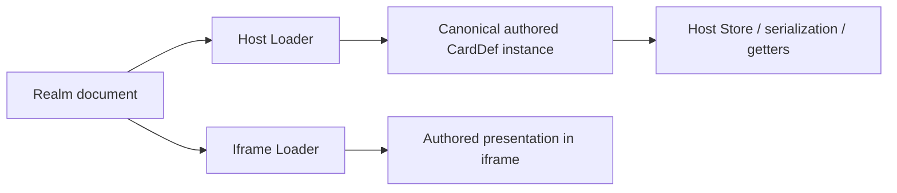
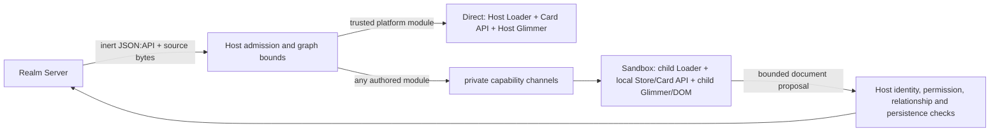

# Boxel execution runtime: Loader-boundary security reconciliation

## Status and conclusion

This document reconciles the original Sandbox security review with the
document-first Direct/Sandbox implementation now present on this branch. It is
an architecture and evidence record, not a claim that the branch is ready for
production.

The main point is **not that the original Sandbox lacked a Loader inside the
iframe**. It already had one. The defect was dual evaluation: the child Loader
evaluated the authored module for presentation while the Host Loader also
evaluated that module to construct the Store's “canonical” instance and obtain
metadata and semantics. Capsule used the same split, with SES owning authored
presentation execution while a parallel authored class still ran in the Host.

An iframe that contains only one of two authored evaluations is not a
code-containment boundary. Constructors, static initializers, getters,
`computeVia`, field configuration, metadata hooks, and serialization hooks are
executable authored code. If the Host-side copy runs any of them, a malicious
card does not need to escape its render iframe; it already has Host authority.

The current branch takes a materially different path for the new
document-first entry:

- the Host starts from an inert JSON:API document and source bytes;
- trust is decided before authored module evaluation;
- only trusted platform modules may enter Direct;
- every document graph containing authored modules is routed to Sandbox;
- the authored Loader, Card API instance, getters/computeds, metadata,
  commands, Glimmer, and DOM live in the child;
- the Host retains document, policy, persistence, and capability authority,
  but no executable authored card instance; and
- Direct consumes the same document-shaped API, while using the Host Loader
  only because its module provenance is trusted.

The Host receives cloneable type, field, format, icon, menu, and presentation
descriptions from the child over the runtime `MessageChannel`. It does not
re-import the authored module to answer those UI questions. The Host may broker
the exact authorized module bytes to the child, but byte transport is not
Host-side Loader evaluation.

This resolves the architectural contradiction in the original design for
surfaces that enter through `BoxelDocumentRenderer`. It does not yet prove
that every legacy Host callsite has migrated, every compatibility behavior is
complete, or every deployment and adversarial gate is green. The defensible
current statement is therefore:

> The document-first path is a credible code-containment architecture and has
> focused proof that an authored Sandbox module does not execute in the Host.
> Production readiness still depends on proving that no product entrypoint can
> bypass that path and on completing the adversarial, browser, mutation, and
> deployment gates below.

This document intentionally records only the technical finding and response.
It does not reproduce private discussion, names, or verbatim review messages.

## Evidence vocabulary

The following labels keep implementation facts separate from conclusions and
future proposals:

- **Observed** — present in the current source or demonstrated by a named
  automated/browser test.
- **Inferred** — a consequence of the observed design, but not a standalone
  proof of all entrypoints or attackers.
- **Proposed** — required future hardening or compatibility work.

The normative protocol is
[boxel-rendering-protocol.md](boxel-rendering-protocol.md). The original target
architecture in
[boxel-execution-runtime-architecture.md](boxel-execution-runtime-architecture.md)
and parts of the older
[reviewer's guide](boxel-execution-runtime-reviewers-guide.md) describe the
superseded presentation-containment model. Where they disagree with the
current branch profile in RP-0.6 or with this implementation evidence, they
are historical rationale rather than the current security claim.

### Corpus reconciliation

| Corpus document                                                                                                   | What remains authoritative                                                                                                                    | What this redesign supersedes or narrows                                                                                                                                                                                            |
| ----------------------------------------------------------------------------------------------------------------- | --------------------------------------------------------------------------------------------------------------------------------------------- | ----------------------------------------------------------------------------------------------------------------------------------------------------------------------------------------------------------------------------------- |
| [Rendering protocol](boxel-rendering-protocol.md)                                                                 | RP-0.6's current two-model profile; cloneable records; origin/transport, fitted prerender, capability, lifecycle, and containment invariants. | Three-tier routing rules describe the broader protocol vocabulary. Current authored documents do not select Capsule. Instance-first Store synchronization clauses do not by themselves describe document-first Sandbox persistence. |
| [Execution runtime architecture](boxel-execution-runtime-architecture.md)                                         | The fixed semantic interface, explicit ownership, Surface/capability plane, Direct conformance goal, and compatibility matrices.              | The “Host canonical authored module plus confined presentation copy” topology is the rejected dual-evaluation model.                                                                                                                |
| [Reviewer's guide](boxel-execution-runtime-reviewers-guide.md)                                                    | Private-channel mechanics, browser isolation, resource gates, lifecycle, and many operational details.                                        | Layer 0's claim that the Host evaluates every authored canonical instance is historical and is now marked as such.                                                                                                                  |
| [Boundary v2 plan](realm-sandbox-boundary-v2-plan.md)                                                             | Separate records from capabilities; one projection vocabulary; explicit owners and consumers.                                                 | A Host placeholder that preserves authored class/prototype behavior is not used. The Host keeps the document, not a proxy for the child executable object.                                                                          |
| [Card API compatibility ledger](realm-sandbox-card-api-compatibility.md)                                          | The inventory of legitimate card-facing APIs and the rule that executable hooks stay with their semantic owner.                               | Any row that assumes Host-side authored metadata/getter evaluation must be fulfilled by child descriptions or bounded data instead.                                                                                                 |
| [Mutation protocol](boxel-execution-runtime-mutation-protocol.md)                                                 | Parent-authorized mutation intent, identity, ordering, and future revision/conflict goals.                                                    | Its minimal patch/revision design is still a target. Current document-first Sandbox writes propose a constrained complete document.                                                                                                 |
| [Graph testing](boxel-execution-graph-testing.md) and [coverage audit](boxel-execution-runtime-coverage-audit.md) | Composition must be tested as recursive owner/policy graphs, not only pairwise adapters.                                                      | Current branch routing reduces the live authored node set to Sandbox; Capsule graph cases are historical/future unless explicitly reintroduced.                                                                                     |
| [Real-card URL smoke matrix](boxel-execution-runtime-wild-corpus.md)                                              | Cold/warm, visual, interaction, editing, media, recovery, and staging-parity gates remain required.                                           | A successful iframe paint is not security evidence and does not override the Host Loader tripwire.                                                                                                                                  |

The corpus therefore contains both valuable requirements and an architectural
fossil record. Reviewers should preserve the former without accidentally
reviving the latter.

## 1. What was the gap?

The earlier design had two executable representations of an authored module.
The inner Loader was already present; the unsafe part was retaining the outer
authored evaluation as well:

The iframe isolated the second representation's DOM, but the first
representation had already executed with the Host's ambient authority. That
made the system **presentation containment**, not authored-code containment.

The concrete violated invariant was:

> No constructor, static initializer, getter, `computeVia`, configuration
> function, command, or other function from an authored module may execute in
> the Host process.

The old design could not satisfy that invariant because the Store relied on a
live authored class for deserialization, prototype navigation, computed
semantics, rendering metadata, and serialization. A render-only sandbox could
not repair an instance that was already unsafe.

The issue was structural rather than a missing denylist:

1. classification happened after or alongside Host materialization;
2. Store identity and executable class identity were coupled;
3. Host consumers expected constructors and prototypes, not inert type/data
   records;
4. an iframe was treated as the boundary for rendering, while the more
   important evaluation boundary remained in the Host; and
5. there was no adversarial tripwire proving that top-level authored code and
   Card API hooks stayed out of the Host.

Adding more message validation around the iframe would not have closed this
gap. Neither would SES around only a second presentation copy. The fix is to
remove the parallel Host evaluation and make the child Loader the authored
module's only executable owner. The first evaluation of the module is the
relevant boundary.

## 2. What is the new approach?

The new approach is **document first, classify before evaluation, materialize
once in the selected runtime**.

### Trust is now the routing decision

**Observed:** `documentExecutionModeFor()` in
[`trusted-modules.ts`](../packages/host/app/lib/trusted-modules.ts) has only two
outcomes. Trusted platform modules run Direct; every other entry module runs
Sandbox. Static source analysis still discovers the exact module graph the
child may read, but it no longer promotes an authored module into Capsule or
Direct.

Trust is narrow:

- `@cardstack/*` platform packages and the Base realm are trusted Direct
  module provenance;
- framework/package/catalog imports may be trusted dependencies without
  promoting their authored importer;
- deployment configuration may grant exact trusted module identities, not a
  user-publishing realm root; and
- the documented BXL prototype exception is an exact Sandbox-readable module,
  not a Direct trust grant.

### Admission happens before Host evaluation

**Observed:** `prepareDocument()` in
[`boxel-execution.ts`](../packages/host/app/services/boxel-execution.ts) calls
`denyHostModuleEvaluation()` for the authored entry before its first graph
classification await. `BoxelModuleGraphClassifier` announces each newly
resolved authored dependency before awaiting its source, so sibling and
transitive edges are denied before asynchronous graph work yields to another
Host task.

**Observed:** [`loader-service.ts`](../packages/host/app/services/loader-service.ts)
enforces the boundary inside the Host Loader itself. It refuses untrusted or
explicitly denied modules before fetch/transpile/evaluation. Admission also
refuses if the module is already loaded, because classification that occurs
after evaluation cannot support a containment claim.

The Host does parse and classify authored source bytes. That is intentionally
not equivalent to executing the module. Parser/transpiler denial-of-service or
memory-safety defects remain a separate attack surface, but ordinary authored
JavaScript side effects do not run during classification.

### The executable Card API moved with the Loader

**Observed:** the child creates its own `Loader`, local
`CardStoreWithGarbageCollection`, Card API runtime, and Glimmer render tree in
[`boxel-sandbox-runtime.gts`](../packages/host/app/components/boxel-sandbox-runtime.gts).
`SandboxBoxelRuntimeServer` dispatches `createFromSerialized`, field/type
description, rendering, serialization, commands, and disposal beside that
child-local runtime. The Host holds opaque handles and cloneable records, not
the authored class or instance.

This keeps the Loader that was already inside the iframe and removes the
authored Loader use that was outside it. Metadata does not disappear with the
Host instance: the child evaluates it and publishes a bounded description over
the same private protocol used for semantic operations. Host chrome consumes
that record; it never asks the Host Loader for the authored constructor as a
metadata shortcut.

This is the important Store split: the Host remains authoritative for the
persisted **document**, permissions, and writes; the child owns the executable
**semantic instance** used for getters, computeds, templates, actions, and
serialization proposals. We did not attempt to preserve Host prototype
navigation with a two-way proxy. Consumers that need type, field, format,
icon, menu, or presentation information receive explicit descriptions through
the protocol.

### Reads and writes are capabilities, not shared objects

**Observed:** the Host expands only document-declared relationship links into
a bounded inert graph. The child receives that document plus exact module,
resource, media, context, navigation, and command lanes. It does not receive
the Host Store, Loader, owner, services, credentials, or parent DOM.

**Observed:** a Sandbox edit serializes its current root state and proposes a
complete document over `SandboxWriteClient`. The Host receiver in
`connectSandboxDocumentSync()` rechecks the root id, constrains relationship
targets to the originally authorized document graph, replaces incoming
included data with the authorized projection, and performs the authenticated
PATCH. The card proposes; the Host disposes.

### One root surface owns one child

**Observed:** an authored edit template and its complete `@fields` tree stay
inside the already-selected child. Trusted Base field components run there
with the child's reduced authority. A large `containsMany` allocates Glimmer
components, not one iframe per field. A separate stack card is a separate root
surface and may receive its own process. Fitted galleries use inert indexed
HTML rather than live iframes per tile.

The retained iframe is also the lifetime of child-local instance handles.
Format changes transfer mount ownership before releasing the predecessor, so
isolated/edit transitions do not destroy the child document and then reuse
dead handles.

## 3. How does this relate to the architecture we already had?

The redesign changes the trust boundary without discarding the useful Boxel
machinery.

| Existing architecture                                      | How the new path uses it                                                                                           |
| ---------------------------------------------------------- | ------------------------------------------------------------------------------------------------------------------ |
| JSON:API card documents and Realm persistence              | Become the neutral boundary representation and canonical persistence authority.                                    |
| Card API `createFromSerialized` and `updateFromSerialized` | Run in the selected runtime. Direct uses them in the Host for trusted modules; Sandbox uses them in the child.     |
| `BoxelRuntime` semantic interface                          | Remains the common protocol for loading, materializing, describing, rendering, serializing, and disposing a Boxel. |
| Direct runtime                                             | Becomes the conformance implementation of the same document entry, not a separate legacy rendering bypass.         |
| Sandbox client/server and private `MessageChannel`         | Carry handles, descriptions, rendering generations, context, writes, commands, navigation, media, and diagnostics. |
| Host Store and services                                    | Retain trusted Direct instances and product authority. They are not reflected or proxied into an authored child.   |
| Prerender/indexed HTML                                     | Supplies inert fitted composition and last-known-good/loading presentation without hydrating an iframe per tile.   |
| Surface identity and retained runtime registry             | Give each root interactive surface a stable child lifetime and bounded teardown.                                   |

Of the three alternatives considered during review, the implementation is a
deliberate combination:

1. **Loader inside Sandbox — selected, without live two-way Store proxies.**
   A document protocol and child-local semantic instance replace proxying a
   Host-authored object graph.
2. **Prerendered HTML — selected for non-interactive fitted composition and
   last-known-good presentation.** It is not used as a substitute for an
   interactive root once the user opens the card.
3. **Iframe around privileged data — not selected as the primary model.** The
   Host instead withholds credentials and ambient data from the untrusted
   iframe and mediates named capabilities. Particularly sensitive future
   workflows may still choose stronger privileged-UI isolation, but that is a
   separate phishing/consent design question.

Capsule remains in the repository as an experimental adapter and as protocol
design history. The current document-first branch profile does not select it
for authored documents. Reintroducing Capsule would require the same
first-evaluation invariant: authored semantic instances must live in the
compartment, not in a parallel Host canonical class.

## 4. What is the current state and solution?

### Implemented boundary

| Claim                                             | Current implementation evidence                                                                                                                                                                         |
| ------------------------------------------------- | ------------------------------------------------------------------------------------------------------------------------------------------------------------------------------------------------------- |
| Product surfaces can begin from an inert document | [`BoxelDocumentRenderer`](../packages/host/app/components/boxel-document-renderer.gts) accepts a document or card URL and never accepts an authored `BaseDef`.                                          |
| Trust is decided before materialization           | `BoxelExecutionService.prepareDocument()` resolves `adoptsFrom`, installs Host Loader denial, classifies the graph, hydrates declared documents, then builds the runtime request.                       |
| Authored graphs cannot be forced Direct           | `prepareDocument()` rejects a Host Direct request for an untrusted root or a document containing any untrusted declared module.                                                                         |
| Host Loader denial is structural                  | `LoaderService.createLoader()` supplies `assertModuleEvaluationAllowed`; direct imports of authored realm modules fail before fetching or registering them.                                             |
| Sandbox owns the first authored materialization   | `BoxelExecutionSession.materialize()` sends the document to `SandboxRuntimeProcess.createFromSerialized()`; the runtime RPC is dispatched inside the child.                                             |
| Child module reads are bounded                    | `SandboxModuleAuthority` grants the classified graph and grows only through literal ESM edges observed in an admitted response. Redirects and unrelated URLs do not become ambient authenticated fetch. |
| Child data/resource reads are bounded             | Relationship, file, media, query, and presentation data cross through distinct projected lanes rather than a general Host fetch or Store capability.                                                    |
| Child writes cannot name arbitrary roots          | `connectSandboxDocumentSync()` and `constrainSandboxWriteDocument()` recheck identity and the authorized relationship neighborhood before persistence.                                                  |
| Direct uses the same document protocol            | Trusted documents omit a pre-materialized card and are materialized by `DirectBoxelRuntime.createFromSerialized()` through the same engine request shape.                                               |
| Nested edit trees do not multiply iframes         | Delegated fields remain in the selected parent runtime; the root Sandbox iframe owns Base and authored field editors.                                                                                   |

### Existing proof

**Observed automated proof:** `Integration | rp-sandbox` contains an
adversarial module whose top-level code marks the global in which it executes.
The document-first test verifies that the mark never appears in the Host,
the module never enters the Host Loader cache, later Host import remains
denied, and a real child environment paints the same module in Sandbox.

**Observed engine proof:** the document-first engine test asserts that Direct
and Capsule materialize zero instances while Sandbox receives the raw primary
resource and document, with no `canonicalCard` present in the request.

**Observed Loader proof:** a Host import of an arbitrary authored module is
rejected before fetch, transpilation, or registration.

**Observed composition proof:** the large nested edit fixture contains 64
rows, authored row and nested FieldDef editors, and trusted Base primitive
editors. It asserts one root iframe and no nested execution surfaces. The
semantic companion verifies first, middle, and last indexed field writes.

**Observed real-card proof:** the staging-backed RecipeFlow custom editor
rendered locally with one Sandbox iframe, zero nested iframes, 117 textboxes,
seven repeated ingredient sections, and seven recursive step sections. It
scrolled to the deepest editor. Three isolated-to-edit-to-isolated cycles kept
one iframe and produced no render error. That exercise found and repaired an
ownership-order bug that had destroyed child handles during a format change.

### What is not yet proven

The current evidence does **not** establish all of the following:

- every product callsite and background consumer enters through the
  document-first API;
- all fifty real-card smoke cases and the complete compatibility corpus pass
  cold and warm in each supported browser;
- every authored hook, dynamic import, FileDef, query, command, edit, HMR, and
  code-mode path has an adversarial no-Host-execution test;
- the deployed Sandbox origin, headers, cookie/storage behavior, redirect
  checks, and fallback isolation are correct in every environment;
- last-write-wins full-document persistence is adequate under concurrent
  editors;
- malformed or hostile source/records cannot exhaust Host parsing,
  classification, graph hydration, transport queues, memory, or child CPU;
- Realm Server indexing/prerender execution has the same code-containment
  property. Browser containment does not secure server-side authored-code
  evaluation automatically; and
- the retained Capsule and instance-first code can no longer be reached by a
  production authored-card path. The global Loader denial is a strong backstop,
  but callsite elimination still needs an explicit audit.

For those reasons, the solution is architecturally reviewable but should not
yet be described as production-ready.

## 5. What are the implications?

### Security becomes simpler and stricter

Trust provenance, not source cleverness, decides Direct versus Sandbox. An
authored card cannot remove its DOM usage to earn more authority. Static
analysis limits what the child may load; it is not asked to prove that
arbitrary authored JavaScript is safe enough for the Host.

The iframe now contains both semantics and rendering. Browser-origin isolation
therefore protects against the original evaluation problem as well as parent
DOM access. The private port remains security-sensitive because it is the only
authority-bearing channel; every new lane must be explicit, bounded, identity
checked, and independently authorized.

### The Host cannot rely on authored constructors

Chrome, code mode, schema inspection, titles, icons, menus, fields, and format
selection must consume document metadata or runtime descriptions. Prototype
navigation across the boundary is intentionally gone. A missing description
is a protocol/compatibility gap, not a reason to import the authored module in
the Host.

### Store ownership is document ownership, not executable ownership

The Host can remain the source of truth for permissions, persistence,
relationship authority, synchronization, and conflict policy without holding
a live authored `CardDef`. This is a distributed-system boundary: the child
has a local materialized copy; changes and context have ordering, identity,
timeouts, acknowledgements, stale generations, recovery, and teardown.

### Compatibility work moves into explicit records and capabilities

The cost of real containment is that implicit Ember owner/service access and
live object sharing are unavailable. Existing cards remain viable only when
their legitimate needs map to documented data or named effects. This makes the
platform contract reviewable, but it also means compatibility failures should
be fixed at a generalized protocol seam—not with a Host import escape hatch.

### Nested cards and fields need monotonic containment

A Sandbox root cannot contain a Direct DOM island inside its document. Trusted
Base code may run child-local with less authority; authored nested fields stay
in the same child. Only a separately opened root surface re-enters Host policy
and receives its own runtime. This bounds iframe count by visible root surfaces
rather than collection cardinality.

### Performance costs move to cold runtime startup

Sandbox now pays for a child Loader, Card API, local Store, framework graph,
and Glimmer. Retaining a process across compatible format changes, caching
immutable trusted modules, sharing in-flight fetches, and using prerendered
HTML for galleries are therefore important. They must be optimized only after
the containment and lifecycle invariants remain green.

### Visual isolation is not equivalent to product authenticity

An iframe cannot read or modify Host DOM, but it can still imitate trusted UI
inside its allocated rectangle. Trusted Host chrome, clear execution
diagnostics, constrained navigation, permission prompts, and dedicated
high-risk approval surfaces remain necessary. We should never communicate
trust solely through pixels an authored card controls.

## 6. What future work should be done?

### Priority 0 — prove there is no alternate first evaluation

1. Inventory every browser entry that obtains a card, field, file, schema,
   title, icon, menu, preview, or edit component. Require authored entries to
   use a raw document plus `BoxelDocumentRenderer`/`BoxelRuntime` description.
2. Add a production assertion/telemetry event for every attempted authored
   Host Loader evaluation, with no automatic fallback to Direct.
3. Delete or make unreachable the authored instance-first render path. Keep
   Direct instance retention only for already-trusted Host objects.
4. Prove cold and warm admission. A module loaded by any prior interaction
   must either be trusted or cause a loud failure; it must never silently
   weaken the next Sandbox boundary.
5. Keep Capsule disabled for document-first authored cards until it satisfies
   the same semantic-instance ownership invariant.

### Priority 0 — expand adversarial coverage

Create fixtures that attempt side effects from every executable authored
location: top-level statements, static initializers, constructors, getters,
`computeVia`, field configuration, custom serialization, menu discovery and
execution, modifiers, commands, dynamic imports, HMR, and nested FieldDefs.
Each test must prove both halves: the effect is absent from the Host and the
legitimate behavior executes in the child.

Add race and normalization cases:

- concurrent classification and legacy import;
- sibling/transitive graph discovery across awaits;
- redirects, encoded path traversal, URL aliases, fragments, and query forms;
- an already-loaded authored module;
- a trusted root document that declares an untrusted nested type;
- invalidation, HMR, failed child boot, and retained-runtime reuse; and
- guessed runtime, instance, command, resource, and mutation identifiers.

### Priority 0 — make deployment isolation a release gate

Run the same boundary suite in Chromium's credentialless mode and the
Safari/Firefox opaque-origin fallback. Assert distinct origins, no ambient
cookies or storage, exact `WindowProxy`/bootstrap binding, CSP and referrer
policy, asset CORS/CORP behavior, private-port exclusivity, and fail-closed
behavior when any prerequisite is absent. A preview that paints after relaxing
these properties is a failure, not a workaround.

### Priority 1 — harden the protocol as a hostile network boundary

- Fuzz every envelope and cloneable record.
- Apply depth, count, byte, concurrency, and time budgets to source graphs,
  document graphs, queries, media, diagnostics, menu descriptors, commands,
  and mutation proposals.
- Preserve monotonic generations and reject late replies after timeout.
- Add explicit process health, first-paint, crash, unhandled rejection,
  teardown, and recovery assertions.
- Add correlation identifiers spanning admission, semantic RPC, render,
  capability, mutation, and persistence logs without logging document data,
  credentials, or private response bodies.
- Treat child CPU exhaustion as a process-failure problem. Parent timeouts can
  stop waiting, but reliable termination and browser-process isolation need
  their own validation.

### Priority 1 — strengthen canonical mutation and collaboration

The current complete-document write lane is simple and self-healing, but it is
last-write-wins. Add a canonical revision or equivalent compare-and-apply
contract, structured conflict results, and tests with multiple Direct and
Sandbox views editing the same card. Continue to reauthorize every proposal at
the Host and server; child state is never proof of permission.

### Priority 1 — finish compatibility through the protocol

Complete the cold/warm real-card matrix for queries, links, FileDefs, media,
3D/browser libraries, recursive fields, custom/default edit, text entry and
persistence, commands, code-mode metadata, HMR, scrolling, focus, and teardown.
When a card fails, classify the gap as admission, document projection,
semantic description, capability, mutation, child rendering, or lifecycle.
Do not add card-specific Host execution exceptions.

### Priority 1 — separately secure server-side execution

Inventory where indexing, prerender, search extraction, and Realm Server hooks
evaluate authored modules. Apply an equivalent first-evaluation threat model
there, using an appropriate worker/process/container boundary and capability
set. A secure browser iframe does not reduce the authority of server-side
JavaScript.

### Priority 2 — optimize after the gates hold

Measure Direct versus Sandbox cold start, warm navigation, memory, iframe
retention, module fetch duplication, large `containsMany` editors, media, and
long-session teardown. Prefer immutable framework/Base artifacts, content
addressed caches, and retained healthy runtimes when they do not broaden
authority or preserve stale executable state. Every optimization must rerun
the Host Loader tripwire and adversarial suite.

## Decision record

The original stop-the-line decision was appropriate for the presentation-only
architecture. The current document-first design addresses that exact issue by
moving the first authored evaluation, semantic instance, and rendering into
the isolated child while keeping trusted document authority in the Host.

We should continue with this two-model architecture—Direct for trusted
platform modules and Sandbox for all authored modules—through security and
compatibility review. We should not revive the earlier dual-evaluation model,
and we should not classify an authored path as secure merely because its final
template paints inside an iframe.

The next readiness decision should be based on the Priority 0 evidence, not on
visual parity alone.
