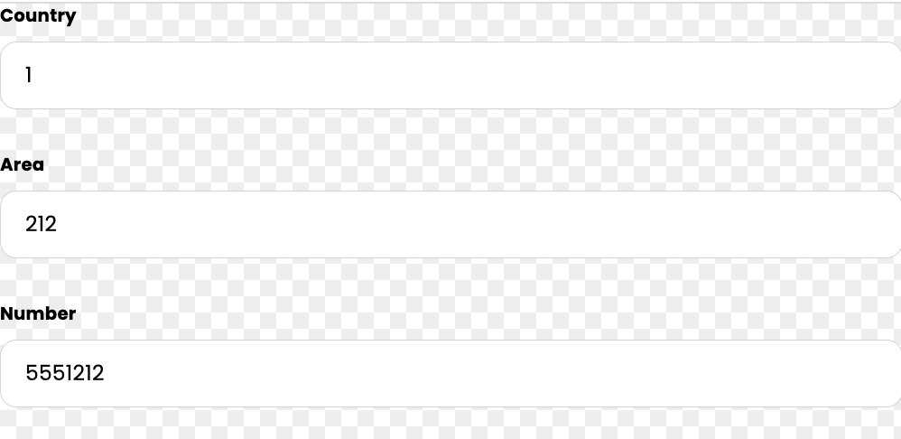
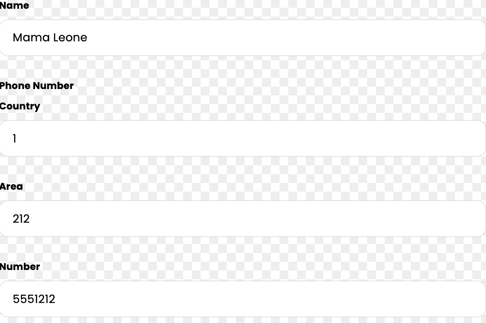
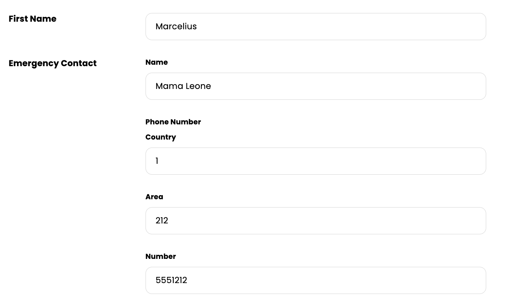
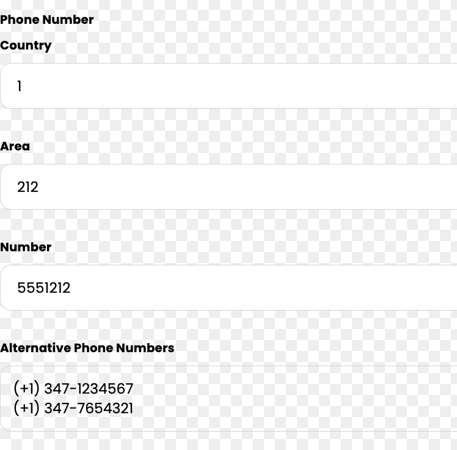
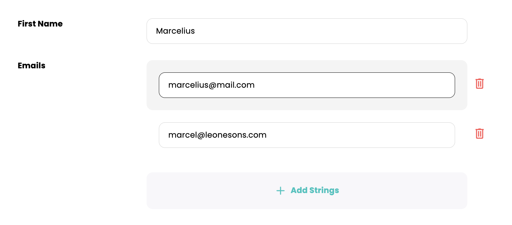
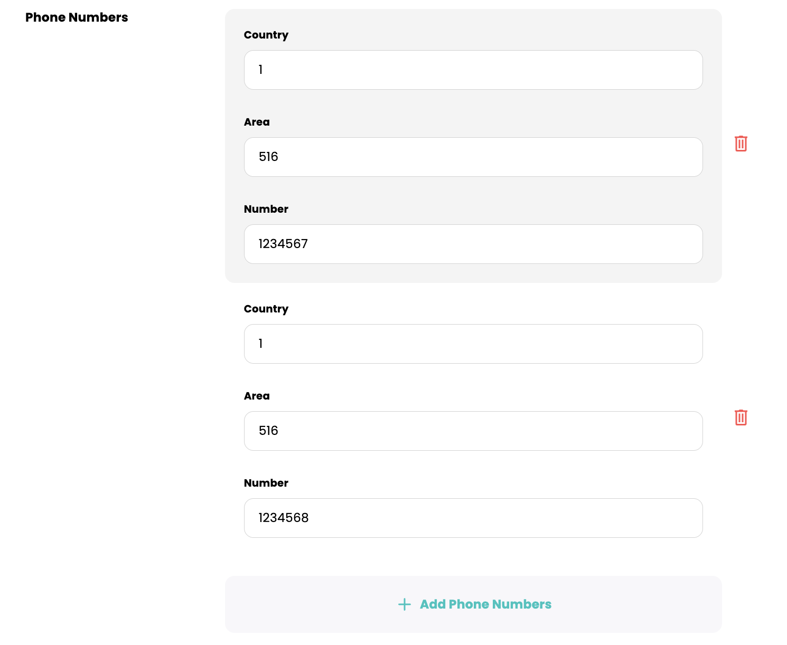
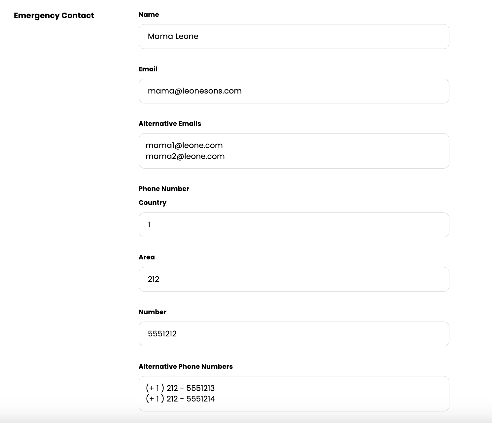
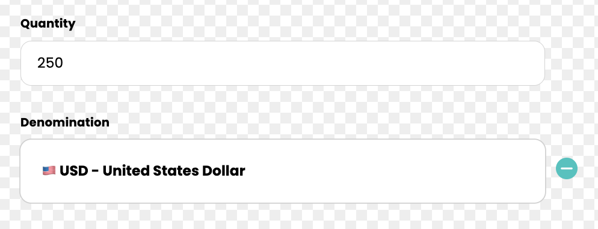
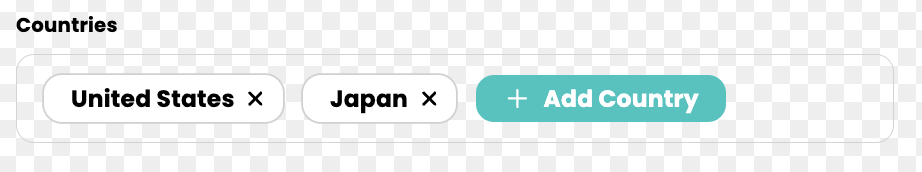
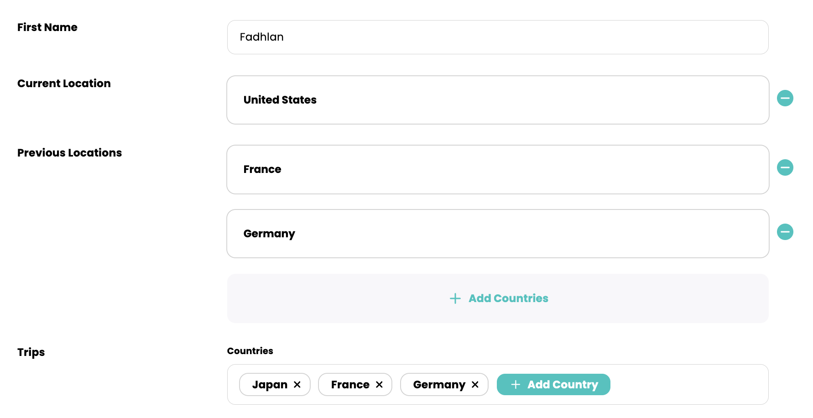

# CardDef and FieldDef Relationships

A **primitive** field is a field that not have any fields of its own. The `StringField`, `NumberField`, or `BooleanField` classes provided by the `card-api` are examples of primitive fields.

A **compound** field (also called a **composite** field) is a field that has other fields. An example is an `author` field with `firstName` and `lastName` fields.

Also see: [CardDef-FieldDef relationships tests](https://github.com/cardstack/boxel/blob/main/packages/host/tests/integration/components/card-def-field-def-relationships-test.gts)

## 1- Primitive and compound field (singular) contained in FieldDef (`contains`)

```typescript
class PhoneField extends FieldDef {
  // primitive field contained in FieldDef
  @field country = contains(NumberField);
  @field area = contains(NumberField);
  @field number = contains(NumberField);
}
```

In the `PhoneField` class above, `country`, `area`, and `number` fields are each primitive fields because `NumberField` refers to a primitive field definition. They are the fields of `PhoneField` field definition.

Rendering a `PhoneField` instance in `edit` format:


```typescript
class EmergencyContactField extends FieldDef {
  // primitive field contained in FieldDef
  @field name = contains(StringField);

  // compound field contained in FieldDef
  @field phoneNumber = contains(PhoneField);
}
```

The `EmergencyContactField` field definition contains one primitive field (`name`), and one compound field (`phoneNumber`). The `phoneNumber` field contains `PhoneField`, which refers to a field definition.

When an instance of `EmergencyContactField` is rendered in `edit` format, primitive and compound fields contained in a `FieldDef` appear _vertically_ by default, where the field label appears above its input in the UI. The fields are editable.



## 2- Primitive and compound field (singular) contained in CardDef (`contains`)

```typescript
class ContactField extends CardDef {
  // primitive field contained in CardDef
  @field firstName = contains(StringField);

  // compound field contained in CardDef
  @field emergencyContact = contains(EmergencyContactField);
}
```

When an instance of `ContactField` is rendered in `edit` format, primitive and compound fields contained in a `CardDef` appear _horizontally_ by default, where the field label appears to the left of its input in the UI. The fields are editable.

The fields nested inside the `emergencyContact` field will render vertically, as expected from a field contained in a `FieldDef`.



## 3- Primitive field (plural) contained in FieldDef **(read-only)** (`containsMany` field)

```typescript
class EmergencyContactField extends FieldDef {
  // primitive field contained in FieldDef (singular)
  @field email = contains(StringField);

  // primitive field contained in FieldDef (plural)
  @field alternativeEmails = containsMany(StringField);
}
```

When an `EmergencyContactField` FieldDef instance is rendered in `edit` format, the primitive `containsMany` field is read-only.


## 4- Compound field (plural) contained in FieldDef **(read-only)** (`atom` format, `containsMany` field)

```typescript
class PhoneField extends FieldDef {
  @field country = contains(NumberField);
  @field area = contains(NumberField);
  @field number = contains(NumberField);

  // providing a `title` is necessary to render the default atom template
  @field title = contains(StringField, {
    computeVia: function (this: PhoneField) {
      return `(+${this.country}) ${this.area}-${this.number}`;
    },
  });
}

class EmergencyContactField extends FieldDef {
  // compound field contained in FieldDef (singular)
  @field phoneNumber = contains(PhoneField);

  // compound field contained in FieldDef (plural)
  @field alternativePhoneNumbers = containsMany(PhoneField);
}
```

When an `EmergencyContactField` instance is rendered in `edit` format, the compound `containsMany` field is read-only, and it renders in `atom` format. We must either provide a `title` field or a custom `atom` layout. This is because the `atom` format, by default, renders the `title` field, unless there is a custom `atom` template available.



## 5- Primitive or compound field (plural) contained in CardDef (`containsMany`)

In the example below, `emails` is a primitive `containsMany` field in `ContactCard` card, and `phoneNumbers` is a compound `containsMany` field in the same card. In edit format, these top level fields are editable.

The `alternativeEmails` and `alternativePhoneNumbers` fields in `EmergencyContactField` field definition are nested `containsMany` fields, and are read-only fields, as seen in items (3) and (4) above.

```typescript
  class PhoneField extends FieldDef {
    static displayName = 'Phone Number';

    @field country = contains(NumberField);
    @field area = contains(NumberField);
    @field number = contains(NumberField);

    // this provides a custom atom template layout
    static atom = class AtomTemplate extends Component<typeof this> {
      <template>
        (+<@fields.country />) <@fields.area />-<@fields.number />
      </template>
    };
  }

  class EmergencyContactField extends FieldDef {
    @field name = contains(StringField);
    @field email = contains(StringField);
    @field alternativeEmails = containsMany(StringField);
    @field phoneNumber = contains(PhoneField);
    @field alternativePhoneNumbers = containsMany(PhoneField);
  }

  class ContactCard extends CardDef {
    // primitive field contained in CardDef (singular)
    @field firstName = contains(StringField);

    // primitive field contained in CardDef (plural)
    @field emails = containsMany(StringField);

    // compound field contained in CardDef (plural)
    @field phoneNumbers = containsMany(PhoneField);

    // compound field contained in CardDef (singular)
    @field emergencyContact = contains(EmergencyContactField);
  }
```





## 6- CardDef field (singular) linked to from FieldDef (`linksTo`)

In the example below, `TxAmountField` class is a field definition, and it has a `denomination` field that links to the `CurrencyCard` card definition. Since `CurrencyCard` is a linked card, editing this field involves selecting a `CurrencyCard` card instance from the card catalog.

The selected `CurrencyCard` instance is an embedded card in the `TxAmountField` field definition. Embedded formats do not have default templates, and thus, we're providing an embedded template along with its styles in the `CurrencyCard` card definition.

```typescript
  class CurrencyCard extends CardDef {
    static displayName = 'Currency';
    // primitive fields (singular) contained in a CardDef
    @field denomination = contains(StringField);
    @field currencyName = contains(StringField);
    @field icon = contains(StringField);

    static embedded = class Embedded extends Component<typeof this> {
      <template>
        <div class='currency' data-test-currency-embedded>
          <@fields.icon />
          <@fields.denomination />
          -
          <@fields.currencyName />
        </div>
        <style>
          .currency {
            display: flex;
            font-weight: bold;
          }
        </style>
      </template>
    };
  }

  class TxAmountField extends FieldDef {
    // primitive field (singular) contained in a FieldDef
    @field quantity = contains(NumberField);

    // CardDef field (singular) linked to from a FieldDef
    @field denomination = linksTo(CurrencyCard);
  }
```

Here is what the `TxAmountField` looks like when rendered in edit format:



## 7- CardDef field (plural) linked to from FieldDef (`atom` format, `linksToMany` field)

```typescript
  class Country extends CardDef {
    static displayName = 'Country';
    @field name = contains(StringField);

    // `atom` format uses the `title` field by default to render if no custom atom layout is provided
    @field title = contains(StringField, {
      computeVia(this: Country) {
        return this.name;
      },
    });

    static embedded = class Embedded extends Component<typeof this> {
      <template>
        <strong><@fields.name /></strong>
      </template>
    };
  }

  class Trips extends FieldDef {
    static displayName = 'Trips';

    // CardDef field (plural) linked to from a FieldDef
    @field countries = linksToMany(Country);
  }
```

In the example above, `countries` field in `Trips` field definition links to many `Country` card instances. When the `Trips` FieldDef is rendered in `edit` format, `Country` card instances will render in `atom` format. It is possible to add or remove `Country` instances using the field editor.



## 8- CardDef field (singular and plural) linked to from CardDef

```typescript
class Person extends CardDef {
  static displayName = 'Person';
  @field firstName = contains(StringField);

  // CardDef field (singular) linked to from CardDef
  @field currentLocation = linksTo(Country);

  // CardDef field (plural) linked to from CardDef
  @field previousLocations = linksToMany(Country);

  // FieldDef (with nested linksToMany CardDef field) contained in CardDef
  @field trips = contains(Trips);
}
```

This example builds on to the field and card definitions in the previous item (7). The screenshot below shows the differences in appearance when a `Person` card instance is rendered in `edit` format.

Note that the `linksTo` and `linksToMany` fields (named `currentLocation` and `previousLocations`) render in `embedded` format provided in the `Country` card definition.

The `trips` field contains the `Trips` field definition, which has the nested `linksToMany` field with country instances from item 7. The country instances render in `atom` format, and they are editable.


