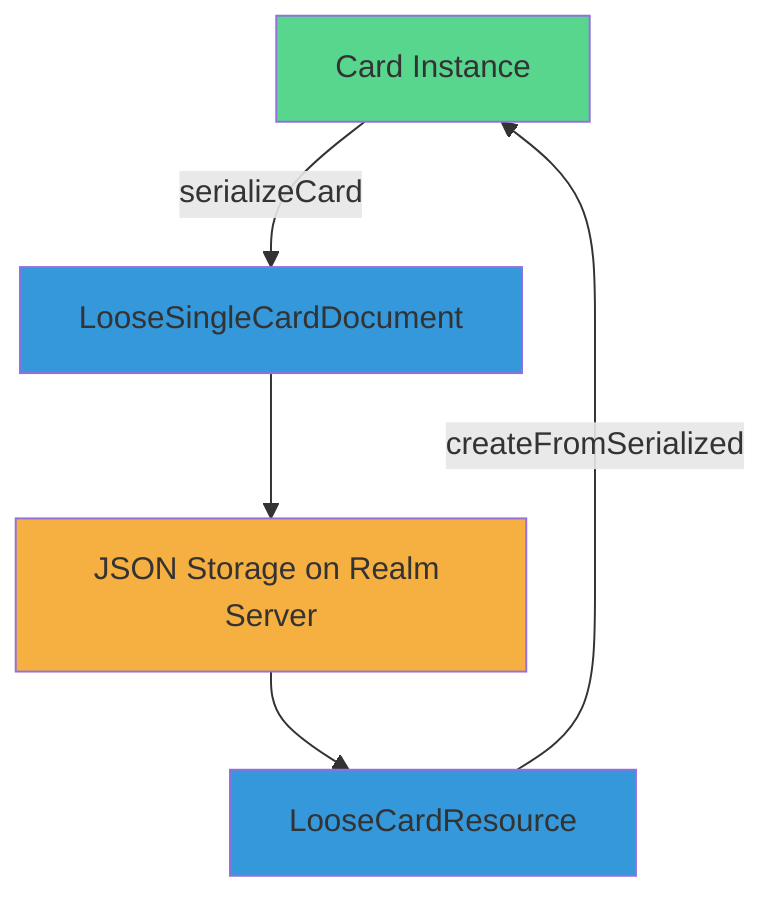

# Card Serialization and Deserialization



Card Serialization and Deserialization are crucial processes that enable smooth conversion of card data between JSON format and actual card instances. This transformation is necessary to save card data persistently on the realm server in JSON format, while also facilitating its presentation to users through browser-rendered card instances. The following is an illustration of the JSON structure of a card:

```
{
  "data": {
    "type": "card",
    "attributes": {
      "title": "Gore Mountain Ski Trip",
      "venue": "Gore Mountain",
      "startTime": "2023-02-18T10:00:00.000Z",
      "endTime": "2023-02-19T02:00:00.000Z",
      "hosts": [
        {
          "firstName": "Hassan",
          "lastName": "Abdel-Rahman",
          "isCool": false,
          "isHuman": false
        },
        {
          "firstName": "Mango",
          "lastName": "Abdel-Rahman",
          "isCool": false,
          "isHuman": false
        }
      ],
      "sponsors": ["Burton", "Spy Optics"]
    },
    "relationships": {
      "hosts.0.pet": {
        "links": {
          "self": null
        }
      },
      "hosts.1.pet": {
        "links": {
          "self": null
        }
      }
    },
    "meta": {
      "adoptsFrom": {
        "module": "../booking",
        "name": "Booking"
      }
    }
  }
}
```

Several key aspects need attention within the JSON structure above. Primarily, the `adoptsFrom` section holds the file path of the card definition, which subsequently initializes the card instance. Additionally, the `attributes` section contains values for the `contains`/`containsMany` fields within the card class, while the `relationships` section houses values for the `linksTo`/`linksToMany` fields.

## Card Serialization

As previously mentioned, the persistent storage of card data in JSON format on the realm server necessitates serialization. This process involves capturing two pivotal elements: the card type (or class) for constructing the `adoptsFrom` property, and the values associated with each field to assemble the `attributes` and `relationships`.

The mechanism employed for this procedure is facilitated by the `serializeCard` function. This function accepts a card instance as input and generates an output of the `LooseSingleCardDocument` type. The structure of the `LooseSingleCardDocument` slightly differs from the JSON format stored in the file. Within the `LooseSingleCardDocument`, there exists an `included` property. This property holds objects representing all cards referenced in the `relationships`, and it proves instrumental in the subsequent deserialization process. The serialization process entails traversing all card fields and extracting values from the data bucket. The representation of field values varies based on specific conditions. It's important to emphasize that only the values of non-computed fields will be extracted, as computed values will be computed anew during the deserialization process.

- `contains` Field: Values can be single primitive types or JSON objects. If the field comprises a non-primitive card, it will be represented as a JSON object within the `attributes` field.

Example:

```
{
  "data": {
    "type": "card",
    "attributes": {
        "title": "Gore Mountain Ski Trip",
    ...
    }
  }
}
```

```
{
  "data": {
    "type": "card",
    "attributes": {
        "host": {
            "firstName": "Hassan",
            "lastName": "Abdel-Rahman",
            "isCool": false,
            "isHuman": false
        },
    ...
    }
  }
}
```

- `containsMany` Field: Values can be arrays of primitive types or JSON arrays. Similar to `contains`, if the field involves a non-primitive card, it becomes a JSON array within the `attributes` field.

Example:

```
{
  "data": {
    "type": "card",
    "attributes": {
        "sponsors": ["Burton", "Spy Optics"],
    ...
    }
  }
}
```

- `linksTo` Field: Unlike `contains`/`containsMany` fields, the field value isn't stored directly. Instead, the JSON file's file path is saved. The file path is extracted from the ID of the field value. The `relativeTo` value is employed to determine whether the URL is relative or absolute.

Example:

```
{
  "data": {
    "type": "card",
    "relationships": {
      "friend": {
        "links": {
          "self": "../Friend/1"
        }
      }
    },
    ...
  }
}
```

- `linksToMany` Field: Similar to `linksTo` fields, the value of this field is displayed as a file path. However, the value is not an array; instead, it's an object where index numbers are included in the property names.

Example:

```
{
  "data": {
    "type": "card",
    "relationships": {
      "friends.0": {
        "links": {
          "self": "../Friend/1"
        }
      },
      "friends.1": {
        "links": {
          "self": "../Friend/2"
        }
      }
    },
    ...
  }
}
```

## Card Deserialization

Users interact with cards through a web browser, with the card components being rendered by the host application. The host application retrieves card components by deserializing JSON format into card instances and then storing the values of each field in the data bucket.

The process is facilitated by the `createFromSerialized` function. This function takes a `LooseCardResource` as input, creates a card instance based on the data in the `adoptsFrom` property, and determines the file's URL by combining it with the `relativeTo` value. Subsequently, the function extracts field values from both `attributes` and `relationships`, placing them into the data bucket. Computed fields, on the other hand, remain uncalculated until non-computed values are available.

- `contains` Field: Values are stored within the data bucket, which functions as a map linking field names to their respective values. The content of 'contains' fields comprises a singular value. This value can be either a primitive value or a card instance, contingent on the card type assigned to that field.
- `containsMany` Field: The values within this field consist of an array, which can encompass either an array of primitive values or an array of card instances.
- `linksTo` Field: The values associated with the `linksTo` field are exclusively card instances. This is because linked fields refer to other card instances. A crucial distinction between card instances in linked fields and those in contained fields lies in their identity – card instance values within linked fields possess identity.
- `linksToMany` Field: This field's value takes the form of an array of card instances.
