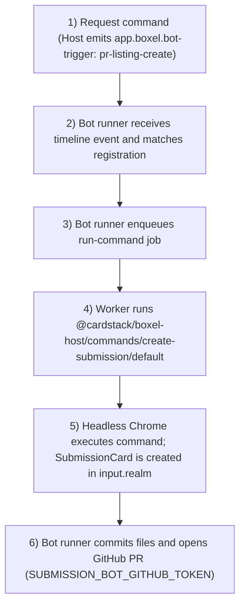

# Catalog Submission Flow

This document describes the end-to-end submission flow:

1. Request command
2. Bot runner receives timeline event
3. Bot runner enqueues run-command job
4. Worker executes `run-command`
5. Headless Chrome execution
6. Bot runner opens GitHub PR

## 1) Request Command

A user action emits a Matrix event with `type: app.boxel.bot-trigger`.

Typical event content:

```ts
{
  type: 'pr-listing-create',
  realm: 'http://localhost:4201/experiments/',
  userId: '@alice:localhost',
  input: {
    roomId: '!room-id:localhost',
    listingName: 'My Listing',
    listingDescription: '...',
    // active realm in interact mode
    // this is where SubmissionCard will be created
    realm: 'http://localhost:4201/experiments/',
    listingId: 'http://localhost:4201/catalog/AppListing/<id>',
  },
}
```

## 2) Bot Runner Receives Timeline Event

`packages/bot-runner/main.ts` wires Matrix timeline events into `onTimelineEvent(...)`.

`packages/bot-runner/lib/timeline-handler.ts`:

1. Filters for `app.boxel.bot-trigger`.
2. Resolves sender and bot registrations from `bot_registrations`.
3. Calls `CommandRunner.maybeEnqueueCommand(runAs, eventContent, registrationId)`.

## 3) Bot Runner Enqueues Run Command Job

`packages/bot-runner/lib/command-runner.ts`:

1. Looks up allowed commands from `bot_commands` for the registration id.
2. Matches `eventContent.type` to command mapping.
3. Enqueues `run-command` via `enqueueRunCommandJob(...)`.

For `pr-listing-create`, it also:

1. Ensures target branch exists.
2. Waits for run-command result.
3. Extracts file contents from command result and commits them.
4. Opens PR.

For the submission flow, the registered command for `pr-listing-create` is:

- `@cardstack/boxel-host/commands/create-submission/default`

That command is what `run-command` executes in headless Chrome.

## 4) Worker Executes `run-command`

`packages/runtime-common/tasks/run-command.ts`:

1. Verifies `runAs` has realm permissions.
2. Builds prerender auth payload.
3. Calls prerenderer `runCommand({ realm, auth, command, commandInput })`.

The job envelope is defined in `packages/runtime-common/jobs/run-command.ts`.

For `pr-listing-create` this means:

- `command` = `@cardstack/boxel-host/commands/create-submission/default`
- `commandInput.realm` = the interact-active realm provided by the host request command

`create-submission` then writes the `SubmissionCard` into that realm via `store.add(..., { realm: realmURL })`.

## 5) Headless Chrome Execution

Headless command execution details are documented here:

- [commands-in-headless-chrome.md](./commands-in-headless-chrome.md)

## 6) Open GitHub PR from Bot Runner

`packages/bot-runner/lib/create-listing-pr-handler.ts` handles PR workflow:

1. `ensureCreateListingBranch(...)`
2. `addContentsToCommit(...)`
3. `openCreateListingPR(...)`

GitHub client lives in `packages/bot-runner/lib/github.ts` and uses Octokit.

Credentials come from:

- `SUBMISSION_BOT_GITHUB_TOKEN`

If missing, PR operations fail with:

- `"SUBMISSION_BOT_GITHUB_TOKEN is not set"`

## Sequence Diagram


