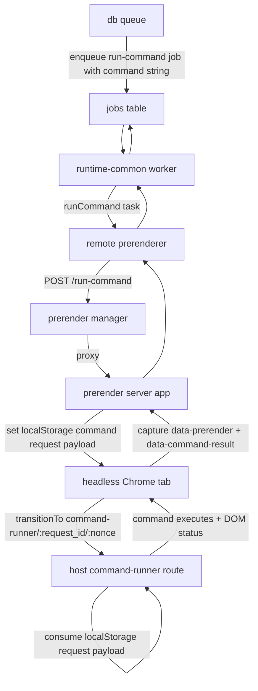

## Running Commands in Headless Chrome 


### Command runner architecture



## Matrix Event Payload (`app.boxel.bot-trigger`)

```ts
const event = {
  type: 'app.boxel.bot-trigger',
  content: {
    type: 'show-card',
    realm: 'http://localhost:4201/experiments/',
    input: {
      cardId: 'http://localhost:4201/experiments/Author/jane-doe',
      format: 'isolated',
    },
  },
};
```

## Bot Trigger Data Structures

```ts
type SendBotTriggerEventInput = {
  roomId: string;
  type: string;
  realm: string;
  input: Record<string, unknown>;
};

type BotTriggerContent = {
  type: string;
  realm: string;
  input: unknown;
};
```

## Submission Bot Commands (DB)

Moved to:
- [`packages/bot-runner/README.md#submission-bot-commands-db`](../packages/bot-runner/README.md#submission-bot-commands-db)
- [`packages/bot-runner/README.md#user-issuing-task`](../packages/bot-runner/README.md#user-issuing-task)

## Example: Triggering Headless Chrome Command from Bot Runner

1. Ensure bot registrations and command mappings exist:
  - `pnpm setup-submission-bot` (from `packages/matrix`)
  - This seeds `bot_commands.command` values such as `@cardstack/boxel-host/commands/show-card/default`.
2. Emit an `app.boxel.bot-trigger` event in the room:

```ts
const event = {
  type: 'app.boxel.bot-trigger',
  content: {
    type: 'show-card',
    realm: 'http://localhost:4201/experiments/',
    input: {
      cardId: 'http://localhost:4201/experiments/Author/jane-doe',
      format: 'isolated',
    },
  },
};
```

3. Bot runner receives the timeline event, matches `content.type` to a registered bot command, and enqueues `run-command`.
4. Worker calls prerender `/run-command`, prerender server writes request payload into headless Chrome localStorage, and transitions to `/command-runner/:request_id/:nonce`.

## Run Command Job Payload

`RunCommandArgs.realmURL` is derived from `event.content.realm`.

```json
{
  "realmURL": "http://localhost:4201/experiments/",
  "realmUsername": "@alice:localhost",
  "runAs": "@alice:localhost",
  "command": "@cardstack/boxel-host/commands/show-card/default",
  "commandInput": {
    "cardId": "http://localhost:4201/experiments/Author/jane-doe",
    "format": "isolated"
  }
}
```

### Command Normalization in `run-command` task

- Command stays a `string` across bot-runner, job queue, and prerender request.
- `runtime-common/tasks/run-command.ts` normalizes legacy realm-server URL forms (`/commands/<name>/<export>`) into a realm-local module specifier path when needed.
- String -> `ResolvedCodeRef` conversion happens in the host `command-runner` route when it parses the `command` field from the stored localStorage request.

## Host `command-runner` Route

```ts
route: /command-runner/:request_id/:nonce

type CommandRunnerRouteParams = {
  request_id: string;
  nonce: string;
};
```

### Request payload handoff via localStorage

```ts
const requestId = '6f5508cf-0f10-44a8-a288-0f11f74c4f20';
const command = '@cardstack/boxel-host/commands/show-card/default';
const input = {
  cardId: 'http://localhost:4201/experiments/Author/jane-doe',
  format: 'isolated',
};
const nonce = '2';

localStorage.setItem(
  `boxel-command-request:${requestId}`,
  JSON.stringify({
    command,
    input,
    nonce,
    createdAt: Date.now(),
  }),
);

const url = `http://localhost:4200/command-runner/${encodeURIComponent(requestId)}/${encodeURIComponent(nonce)}`;
```

```txt
http://localhost:4200/command-runner/6f5508cf-0f10-44a8-a288-0f11f74c4f20/2
```

### Host-side consumption behavior

- Host route reads and removes `boxel-command-request:${request_id}` from localStorage (one-time consume).
- Route validates nonce match before command execution.
- Route rejects stale entries using `createdAt` TTL checks.

## Manual Host Simulation (No Bot Runner)

Use this when you want to test `command-runner` directly in the browser.

1. Open host in a browser:
  - `http://localhost:4200`
2. Open browser devtools console and run:

```js
const requestId = '6f5508cf-0f10-44a8-a288-0f11f74c4f20';
const nonce = '2';

localStorage.setItem(
  `boxel-command-request:${requestId}`,
  JSON.stringify({
    command: '@cardstack/boxel-host/commands/show-card/default',
    input: {
      cardId: 'http://localhost:4201/experiments/Author/jane-doe',
      format: 'isolated',
    },
    nonce,
    createdAt: Date.now(),
  }),
);
```

3. Visit this URL (or refresh if already there):
  - `http://localhost:4200/command-runner/6f5508cf-0f10-44a8-a288-0f11f74c4f20/2`

Notes:
- `request_id` in the URL must match the localStorage key suffix.
- `nonce` in the URL must match the `nonce` in stored JSON.
- The entry is consumed once; set it again before another refresh.
