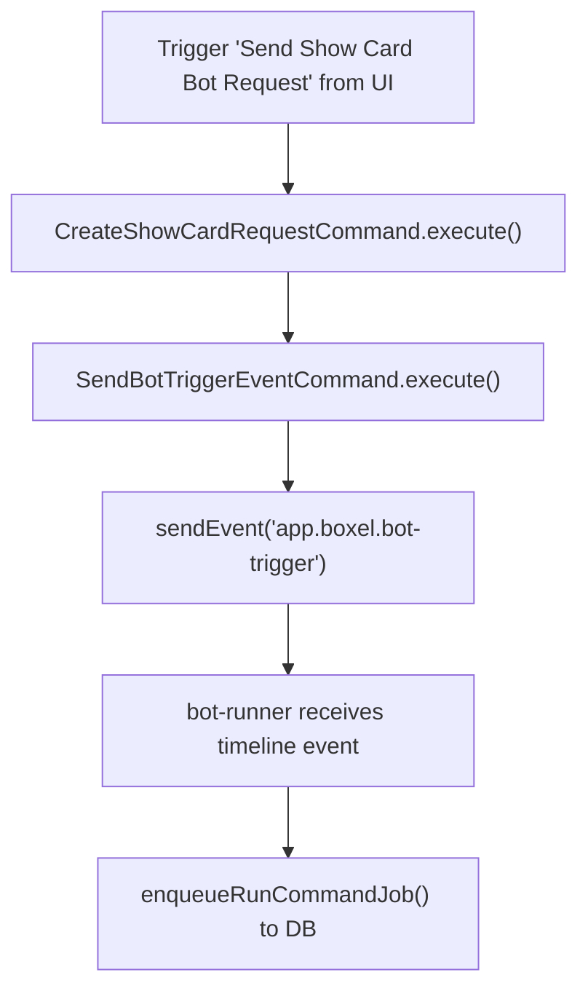
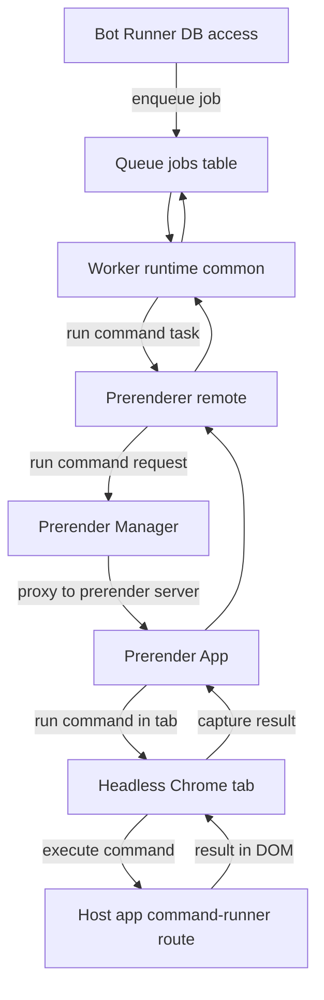

## Demo 

https://www.loom.com/share/2fe9a3e58a7c459ba574b2c0f747a667

## Testing Locally

1. Start `bot-runner` with `pnpm start:development`.
2. Start Realm server with `pnpm start:all`
2. Inside `packages/matrix`, `pnpm setup-submission-bot`
2. Open http://localhost:4200/experiments/BotRequestDemo/bot-request-demo.
3. Click **Send Show Card Bot Request** on the demo card.


## Flow Diagram

### User issuing task

Have made an example card in experiments to simulate but commands can be called from anywhere



### Command runner architecture



## Matrix Event Payload (app.boxel.bot-trigger)
```ts

const event = {
  type: 'app.boxel.bot-trigger',
  content: {
    type: 'show-card',
    realm: 'http://localhost:4201/experiments/',
    input: {
      cardId: 'http://localhost:4201/experiments/Author/jane-doe',
      format: 'isolated',
    },
  } 
};
```

## Bot Trigger Data Structures (with realm)

```ts
type SendBotTriggerEventInput = {
  roomId: string;
  type: string;
  realm: string;
  input: Record<string, unknown>;
};

type BotTriggerContent = {
  type: string;
  realm: string;
  input: unknown;
};
```

## Bot-runner filter

### Commands registered for submission-bot

The bot runner checks if the matrix events comes thru via the filter blob

```json
[
  {
    "name": "create-listing-pr",
    "command": "http://localhost:4201/commands/create-listing-pr/default",
    "filter": {
      "type": "matrix-event",
      "event_type": "app.boxel.bot-trigger",
      "content_type": "create-listing-pr"
    }
  },
  {
    "name": "show-card",
    "command": "http://localhost:4201/boxel-host/commands/show-card/default",
    "filter": {
      "type": "matrix-event",
      "event_type": "app.boxel.bot-trigger",
      "content_type": "show-card"
    }
  }
]
```

## Run Command Task

`RunCommandArgs.realmURL` is derived from `event.content.realm`.

```json
{
  "realmURL": "http://localhost:4201/experiments/",
  "realmUsername": "@alice:localhost",
  "runAs": "@alice:localhost",
  "command": {
    "module": "@cardstack/boxel-host/commands/show-card",
    "name": "default"
  },
  "commandInput": {
    "cardId": "http://localhost:4201/experiments/Author/jane-doe",
    "format": "isolated"
  }
}
```

## Command Runner Route on Host
```ts
route: /command-runner/:nonce

type CommandRunnerRouteParams = {
  nonce: string;
};

type CommandRunnerQueryParams = {
  command?: string;
  input?: string;
};
```

### Example (URL + queryParams)
```ts
const url = 'http://localhost:4200/command-runner/2';

// human-readable command id
const commandId = '@cardstack/boxel-host/commands/show-card/default';

// command-runner query param expects an encoded ResolvedCodeRef JSON object
const commandCodeRef = {
  module: '@cardstack/boxel-host/commands/show-card',
  name: 'default',
};

const queryParams: { command: string; input: string } = {
  command: encodeURIComponent(JSON.stringify(commandCodeRef)),
  input:
    encodeURIComponent(
      JSON.stringify({
        cardId: 'http://localhost:4201/experiments/Author/jane-doe',
        format: 'isolated',
      }),
    ),
};
```

```txt
http://localhost:4200/command-runner/2?command=%7B%22module%22%3A%22%40cardstack%2Fboxel-host%2Fcommands%2Fshow-card%22%2C%22name%22%3A%22default%22%7D&input=%7B%22cardId%22%3A%22http%3A%2F%2Flocalhost%3A4201%2Fexperiments%2FAuthor%2Fjane-doe%22%2C%22format%22%3A%22isolated%22%7D
```
