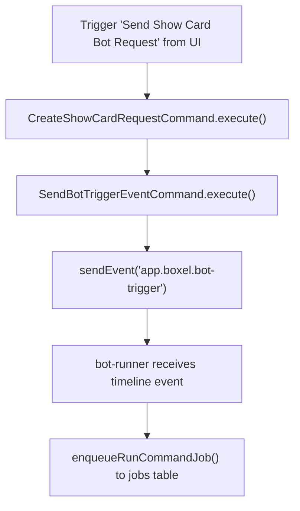
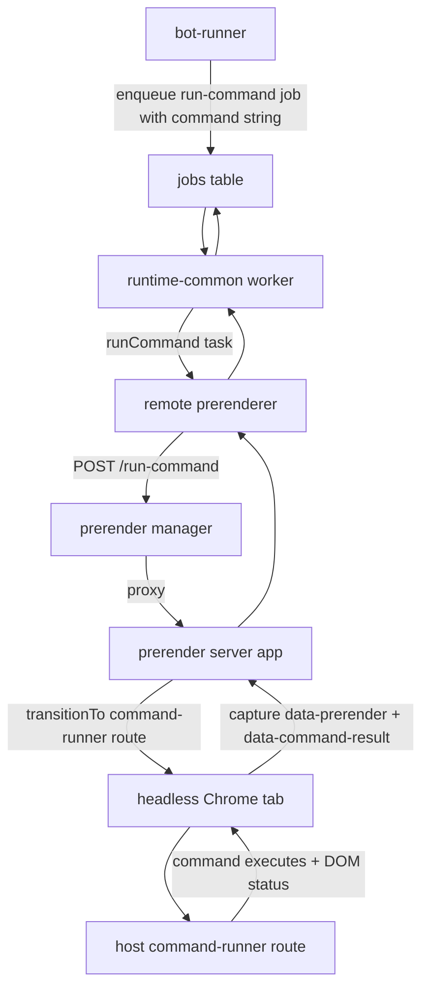

## Demo

https://www.loom.com/share/2fe9a3e58a7c459ba574b2c0f747a667

## Testing Locally

1. Start `bot-runner` with `pnpm start:development`.
2. Start realm server with `pnpm start:all`.
3. Inside `packages/matrix`, run `pnpm setup-submission-bot`.
4. Open http://localhost:4200/experiments/BotRequestDemo/bot-request-demo.
5. Click **Send Show Card Bot Request** on the demo card.

## Flow Diagram

### User issuing task

Example source is the experiments demo card, but the same flow is used for any `app.boxel.bot-trigger` event.



### Command runner architecture



## Matrix Event Payload (`app.boxel.bot-trigger`)

```ts
const event = {
  type: 'app.boxel.bot-trigger',
  content: {
    type: 'show-card',
    realm: 'http://localhost:4201/experiments/',
    input: {
      cardId: 'http://localhost:4201/experiments/Author/jane-doe',
      format: 'isolated',
    },
  },
};
```

## Bot Trigger Data Structures

```ts
type SendBotTriggerEventInput = {
  roomId: string;
  type: string;
  realm: string;
  input: Record<string, unknown>;
};

type BotTriggerContent = {
  type: string;
  realm: string;
  input: unknown;
};
```

## Submission Bot Commands (DB)

`setup-submission-bot` now writes canonical scoped command specifiers into `bot_commands.command`.

```json
[
  {
    "name": "create-listing-pr",
    "command": "@cardstack/boxel-host/commands/create-listing-pr/default",
    "filter": {
      "type": "matrix-event",
      "event_type": "app.boxel.bot-trigger",
      "content_type": "create-listing-pr"
    }
  },
  {
    "name": "show-card",
    "command": "@cardstack/boxel-host/commands/show-card/default",
    "filter": {
      "type": "matrix-event",
      "event_type": "app.boxel.bot-trigger",
      "content_type": "show-card"
    }
  },
  {
    "name": "patch-card-instance",
    "command": "@cardstack/boxel-host/commands/patch-card-instance/default",
    "filter": {
      "type": "matrix-event",
      "event_type": "app.boxel.bot-trigger",
      "content_type": "patch-card-instance"
    }
  }
]
```

## Run Command Job Payload

`RunCommandArgs.realmURL` is derived from `event.content.realm`.

```json
{
  "realmURL": "http://localhost:4201/experiments/",
  "realmUsername": "@alice:localhost",
  "runAs": "@alice:localhost",
  "command": "@cardstack/boxel-host/commands/show-card/default",
  "commandInput": {
    "cardId": "http://localhost:4201/experiments/Author/jane-doe",
    "format": "isolated"
  }
}
```

### Command Normalization in `run-command` task

- Command stays a `string` across bot-runner, job queue, and prerender request.
- `runtime-common/tasks/run-command.ts` normalizes legacy realm-server URL forms (`/commands/<name>/<export>`) into a realm-local module specifier path when needed.
- String -> `ResolvedCodeRef` conversion happens in the host `command-runner` route when it parses `:command`.

## Host `command-runner` Route

```ts
route: /command-runner/:command/:input/:nonce

type CommandRunnerRouteParams = {
  command: string;
  input: string;
  nonce: string;
};
```

### Example (`command` and `input` as path params)

```ts
const command = '@cardstack/boxel-host/commands/show-card/default';
const input = JSON.stringify({
  cardId: 'http://localhost:4201/experiments/Author/jane-doe',
  format: 'isolated',
});
const nonce = '2';

const url = `http://localhost:4200/command-runner/${encodeURIComponent(command)}/${encodeURIComponent(input)}/${encodeURIComponent(nonce)}`;
```

```txt
http://localhost:4200/command-runner/%40cardstack%2Fboxel-host%2Fcommands%2Fshow-card%2Fdefault/%7B%22cardId%22%3A%22http%3A%2F%2Flocalhost%3A4201%2Fexperiments%2FAuthor%2Fjane-doe%22%2C%22format%22%3A%22isolated%22%7D/2
```
