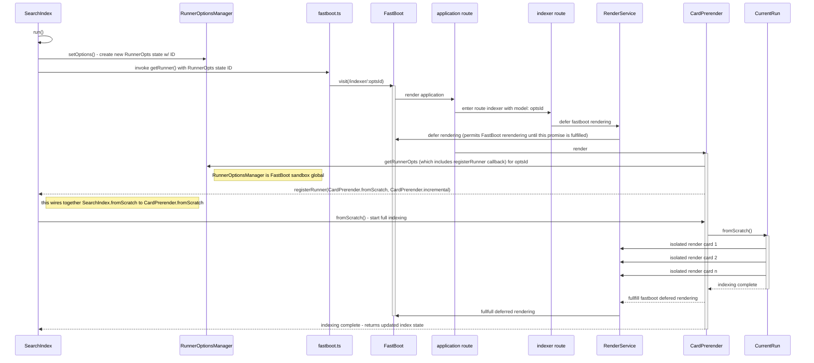

# Indexing
When cards are created or updated we index their data. The indexing that is performed is driven by the HTML rendering of the card. The idea is that the actual HTML render of the card will indicate to us the fields that are actually used in the card as well as to define the indexing boundary for a card. Consider a social graph that contains a "Person" card which in turn has a "friends" field that links to Person cards that are the friends of a particular person. When indexing a particular instance of a Person card, the rendered HTML can help us to know how deep to traverse the friends of a Person card when assembling an index for a particular person. Without any kind of guidance a particular index for a person might include the entire network of people that exist in a social graph. However, using the HTML render for a card, the isolated card for a person could contain all the friends for a particular person, but the embedded card for a Person (which is the way a card appears when it is included in the context of another card) might only display the persons's avatar and their name--the 2nd order friends, thereby are not rendered. Using this HTML rendering of a Person instance, then, would only display the direct friends of a person and provide a natural way in which to prevent over indexing a person instance.

Using an HTML render driven indexing requires a different approach depending on the environment the indexing is performed: node vs service worker. In the node environment we use Fastboot to perform the indexing. In the service worker environment we leverage postMessage to communicate with the host application which in turn performs in the indexing off screen. In both cases we are relying on the host application to perform the indexing. In both cases the indexing is kicked off from the `SearchIndex` class in the [`packages/runtime-common/search-index.ts`](../packages/runtime-common/search-index.ts) module via the `SearchIndex.run()` method and the `SearchIndex.update()` method.

At the time of this writing, the `CardPrerender` component in the [`packages/host/components/card-prerender.gts`](../packages/host/app/components/card-prerender.gts) module is the primary module for driving the indexing from the host application. There is a registration process that binds the host application's `CardPrerender.fromScratch()` and `CardPrerender.incremental()` methods to the runtime-common's `SearchIndex.#fromScratch` and `SearchIndex.#incremental` private properties that both environments use to perform indexing.

## Node Environment 
In the node environment we leverage FastBoot's ability to define custom globals in the FastBoot sandbox as a means to register the `CardPrerender.fromScratch()` and `CardPrerender.incremental()` methods with the `SearchIndex` class. One of the globals that is passed into the FastBoot sandbox is the `RunnerRegistration`. This is a callback that the host app can use to give the outer context (i.e. the `SearchIndex` instance running in node) access to the `CardPrerender.fromScratch()` and `CardPrerender.incremental()` methods. While each visit to the FastBoot instance will have its own memory space, the sandbox globals are shared across all the visits (since the root of the state comes from the node env). To accommodate this we use a Map to keep the `RunnerRegistration` callbacks from colliding into one another during subsequent calls to visit the FastBoot instance. This map is managed by the `RunnerOptionsManager` class which is instantiated in node and maps a module scoped sequential ID to each visit of the FastBoot instance.

The `makeFastBootIndexRunner()` in [`packages/realm-server/fastboot.ts`](../packages/realm-server/fastboot.ts) is responsible for instantiating the FastBoot instance (which is shared amongst all the indexing invocations), assigning the sandbox globals for the FastBoot app, as well as for calling the the `visit()` function on the FastBoot index with the supplied identifier that maps to a bucket of state (`RunnerOpts`) unique to this particular indexing invocation. All this work is encapsulated in the `getRunner` callback function that `makeFastBootIndexRunner` returns.

## Service Worker Environment

## SearchIndex Indexing process
When the `SearchIndex` class ([`packages/runtime-common/search-index.ts`](../packages/runtime-common/search-index.ts)) begins indexing, either `fromScratch()` or `incremental()`, the first thing it will do is to call the `getRunner` callback that was supplied from either node or service worker environment (via `SearchIndex.setupRunner()`). The `SearchIndex` calls the `getRunner` callback with it's own `registerRunner` callback as a parameter to the original `getRunner` callback. The provided `registerRunner` callback is invoked on the host when the `CardPrerender` component is instantiated. The provided `registerRunner` callback wires up the `SearchIndex.#incremental` and `SearchIndex.#fromScratch` private fields to the `CardPrerender.incremental()` and `CardPrerender.fromScratch()` methods, such that we provide a consistent interface for the `SearchIndex` class to be able to kick off indexing without having to deal with the intricacies of either `FastBoot` or service worker `postMessage`.
