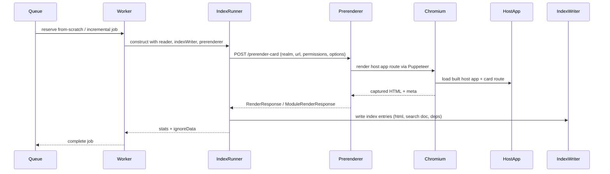

# Indexing with the headless prerenderer

Cards are indexed by rendering them and deriving search documents from the rendered output. Indexing goes through the headless prerenderer, which runs a pool of Chromium pages (via Puppeteer) and renders card routes in the built host app.

## Components involved
- `Worker` (`packages/runtime-common/worker.ts`): pulls indexing jobs from the queue and registers the indexing tasks.
- Indexing tasks (`packages/runtime-common/tasks/indexer.ts`): implement from-scratch and incremental jobs and create an `IndexRunner`.
- `IndexRunner` (`packages/runtime-common/index-runner.ts`): walks realm contents, asks the prerenderer to render cards/modules, records dependencies, and writes index entries with `IndexWriter`.
- Prerenderer service (`packages/realm-server/prerender`): HTTP API that drives headless Chrome through Puppeteer. It maintains a page pool and renders HTML for cards/modules.
- Remote prerenderer client (`packages/realm-server/prerender/remote-prerenderer.ts`): wraps the prerenderer HTTP API with retry/backoff logic for workers and the realm server.

## High-level flow

## From-scratch indexing
1. A job is queued to index an entire realm (usually at startup or after migration).
2. The worker task builds an `IndexRunner` with:
   - Authenticated fetch and a `Reader` for the realm
   - `IndexWriter` connected to the realm’s DB adapter
   - Permissions and user context for the realm user
   - The remote prerenderer client
3. `IndexRunner.fromScratch` walks realm files, renders each card/module through the prerenderer, collects dependencies, and writes entries into a new batch.
4. Results include `stats` and `ignoreData` (mtime hashes) to speed later incremental runs.

## Incremental indexing
1. A job is queued with the changed URLs and operation (`update` or `delete`).
2. The worker creates an `IndexRunner` with the previous `ignoreData` and runs `IndexRunner.incremental`.
3. Incremental runs:
   - Invalidates existing index entries that depended on the changed URLs.
   - Re-renders the affected cards/modules via the prerenderer.
   - Writes updated entries and returns `stats`, `invalidations`, and new `ignoreData`.

## What the prerenderer does
- Runs a dedicated HTTP service (see `packages/realm-server/prerender/prerender-app.ts`).
- Accepts `/prerender-card` and `/prerender-module` requests containing:
  - `realm`: fully qualified realm URL
  - `url`: card/module URL to render
  - `userId` and `permissions`: determine auth context for the render
  - Optional render options (e.g., cache clearing)
- Uses Puppeteer to:
  - Reuse or create a Chromium page from its pool
  - Navigate to the host app’s render route for the requested card/module
  - Wait for render completion and capture HTML plus render metadata
- Returns a JSON:API-style payload consumed by `IndexRunner`.
- Employs retry/backoff in the client (`remote-prerenderer`) when the service is draining or temporarily unavailable.

## Artifacts stored in the index
For each card instance we persist:
- Captured HTML for the requested render mode
- Search document (includes evaluated computed fields)
- Dependency graph (instances and modules referenced during render)
- JSON:API resource for the instance
- Adoption chain (types the card derives from)

## Operational notes
- The prerenderer URL is required for workers/realm-server; missing or unreachable URLs fail fast.
- `FROM_SCRATCH_JOB_TIMEOUT_SEC` controls the from-scratch indexing job timeout (seconds) and caps the queue worker runtime; default is 2400.
- For local testing helpers, see `packages/host/tests/helpers/index.gts` and `packages/realm-server/tests/helpers/index.ts` which start a test prerenderer and wire the same flow.
