# Lattice draft architecture

Lattice persists query-backed and computed card data at the owning card's
identity. A source change creates durable work; workers recompute affected
owners, commit guarded results, and notify readers. The browser applies a
publication to its existing instance. It does not repeat that publication's
query/computed graph merely to display the stored result.

This is an opt-in draft. It does not replace the entire Card Store, provide a
new general search-worker pool, or establish a production latency guarantee.
Demand scheduling, offline optimistic branches and multi-server validation are
outside this draft's acceptance claim.

## Enablement and execution

`LATTICE_ENABLED_REALMS` is a JSON array of exact HTTP realm roots, including
the trailing slash. The API server and its workers need matching configuration.
Missing configuration enables no realms. Neither authored metadata, a request
header nor `static materialized = true` can enable a realm. Previously queued
Lattice work also checks the current operator configuration before executing.

| Work                                                                 | Execution location                                 |
| -------------------------------------------------------------------- | -------------------------------------------------- |
| Source file operations, authorization and response coordination      | Existing realm server                              |
| Source indexing and secondary matching/materialization jobs          | Existing worker processes and PostgreSQL queue     |
| Reviewed BXL card-data computation                                   | Node worker path, using the official BXL evaluator |
| Card execution requiring the browser; HTML/CSS prerendering          | Existing Chrome prerender service                  |
| Reading stored publications and inventory replies                    | Realm query/read adapters                          |
| Applying publications, presenting cards and preserving local editors | Browser Store and card API                         |

Native execution requires the additional operator-installed
`LATTICE_NATIVE_REVIEW_FILE`. It is not a general Node loader for arbitrary GTS.
The review binds roots, definition metadata, implementation bytes, authority and
runtime revision. Static analysis classifies code; classification alone is not
permission to execute it. Unsupported or invalidated admission must not be
represented as a successfully computed empty object.

## Five seams

The contracts are in
[`lattice-adapters.ts`](../packages/runtime-common/lattice-adapters.ts).
They adapt the existing queue, index and Store rather than introducing a second
orchestrator.

1. **`recordChange`** captures old/new source-index facts and a pending generation
   in the same transaction as source promotion. It does not load definitions or
   recompute owners on that transaction's path.
2. **`registerProducer`** replaces an owner's query registrations with its
   publication. Empty query results still register a dependency. Retirement
   removes the owner's watches.
3. **Claim/publish** processes durable obligations with source, input, code,
   permission and job-reservation fences. An obsolete attempt cannot publish or
   clear newer work. Output, dependency updates and delivery obligations commit
   together.
4. **`read`** authorizes the request and returns a stored artifact with its
   freshness state. Missing coverage or failed work is not a complete snapshot.
5. **`applyPublication`** updates an existing instance through the Store/card API
   boundary. Notices and stale responses cannot overwrite a newer publication;
   applying peer data must preserve unrelated local editing state.

## Source change to publication

```mermaid
flowchart LR
  S[Source index commit] --> E[Durable old/new events]
  E --> M[Secondary query matching]
  M --> O[Dirty owner obligations]
  O --> C[Worker computes against validated inputs]
  C --> P[Guarded publication transaction]
  P --> D[Durable delivery outbox]
  D --> N[Matrix notice]
  N --> R[Authorized publication read]
  R --> A[Apply to existing browser instance]
```

The query registry stores Boxel search predicates. GIN routing tokens narrow
candidates; exact old/new predicate evaluation determines affected owners.
Matching both sides preserves entering and departing membership. Computation
remains within card identities, including reusable feeder owners. Arbitrary
computed functions are not transformed into counter increments.

Source indexing and secondary work remain separate jobs. Matching consumes at
most 250 events per turn, commits its checkpoint and schedules the successor.
An owner job captures current obligations instead of trusting an old queued
owner list. PostgreSQL notifications wake workers; durable rows are authoritative
when a notification is missed or a process stops.

## Freshness, delivery and retained data

The server's receipt is `meta.publication`. `outputRevision` identifies an
output body; `validatedThrough` records input progress. An unchanged body may
keep its output revision while validation advances. Authored card JSON cannot
mint a trusted publication receipt.

The Have contract can omit a body the reader proves it already has. Have is
inventory, not authorization or freshness. A missing body still needs fetching;
the Store must not treat a partial response as complete. Changed values update
mounted instances through ordinary data application, not a page reload.

Pending data remains visibly pending, with a reason where available. The draft
does not fall back to assembling the whole graph in the client after a deadline.
Notification delivery can repeat. Ordering and idempotent application protect
clients; transport acknowledgements do not replace publication guards.

## Storage and operating limits

- The source generation clock is logged; derived summaries can be reconstructed.
  Persistence changes take short, timeout-bounded exclusive locks. Clock repair
  runs after old revisions drain; loss of the unlogged index and summary can
  require a fleet-wide rebuild. See the [runtime contracts](lattice-runtime-contracts.md).
- There is no Lattice trigger on ordinary file writes. Enabled metadata writes
  perform explicit code invalidation atomically; disabled writes keep the
  ordinary path.
- Pending index events are capped at **100,000 rows per enabled realm**. The
  admission check rejects an overflowing source-index transaction before copying
  its events. It does not delete unmatched transitions. Drain existing work and
  retry the rejected index. A single full import larger than the cap also refuses.
  This is a row bound, not a byte quota or automatic retry guarantee.
- Successful enabled full indexes refresh PostgreSQL planner statistics after
  promotion. Ordinary full indexing does not issue this additional `ANALYZE`.
- Native review is manual in this draft; changing reviewed code requires renewed
  review. Existing source/code/authority fences remain mandatory on publication.

## Observed limits of the draft

Synthetic hosted write probes have observed about 2.8–3.1 s from PATCH dispatch
until fresh HTTP data, and about 3.2–3.3 s until two browser stores displayed the
value. These small warm samples used two stores of the same account and polling
observations; they establish neither p95 nor a controlled comparison with main.
The draft does not meet a 500–800 ms end-to-end target.

Cold definition caches must recover through normal module lookup under the same
reviewed-source, runtime and authority guards. Cache residency is not admission
authority. The recovery regression covers missing cached definitions; it does
not establish restart latency under load. Startup full indexes and bulk HTML
work have previously delayed a write beyond a 27 s observation window. Dedicated
secondary capacity prevents HTML from owning the materialization lane, but
shared database, source and browser capacity still need bounded admission.

Homeserver rate limits also affect visible freshness: one observed write took
about 9.2 s to reach both stores after three 429 responses. Coalescing reduces
notification volume; it does not guarantee a one-message-per-second limit or
remove provider quotas. Exhausted delivery becomes an explicit terminal failure,
not a successful acknowledgement. Operational limits and migration behavior are
specified in the [runtime contracts](lattice-runtime-contracts.md).

Key implementation entry points: the
[publication adapter](../packages/runtime-common/lattice-index-publication.ts),
[query registry](../packages/runtime-common/lattice-query-registry.ts),
[worker task](../packages/runtime-common/tasks/lattice.ts),
[native admission](../packages/realm-server/lib/lattice-postgres-admission.ts),
[read adapter](../packages/runtime-common/realm-index-query-engine.ts), and
[Store](../packages/host/app/services/store.ts).
