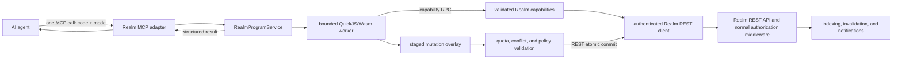

# Realm Program Tool: Specification and Building Guide

Status: proposed prototype

## Summary

Boxel should expose one MCP tool, `use_realm`, that executes a small JavaScript
program against an explicitly authorized Realm capability. The program can
discover, inspect, transform, and atomically update many Realm files in one
tool call.

The experience should feel to an AI agent as capable as working in a shell:

- glob and list files;
- grep file contents;
- read and write text or JSON;
- create, copy, move, and remove files;
- calculate arbitrary transformations with ordinary JavaScript;
- make a coordinated multi-file change;
- receive concise results, diagnostics, and diffs.

It must not provide a shell, Node.js, or ambient server authority. The program
runs in a separately bounded JavaScript runtime and can only call methods on
the `realm` object supplied by the Realm server. Every method is implemented on
top of the authenticated Realm REST API. The program never reads or writes EFS
or another storage adapter directly.

This turns JavaScript into a compression layer over Realm operations. Ten or
fifty filesystem operations can be expressed in one program and one MCP call,
without defining ten or fifty MCP tools. MCP tool definitions can then be
reserved for semantic operations where a distinct schema, approval boundary,
or interaction model is useful, such as making a live CRDT update to card
instances.

## Goals

1. Let an AI agent operate on a Realm with shell-like efficiency while all
   authority remains in the Realm server.
2. Present a programming model that current language models already know:
   modern JavaScript, promises, glob syntax, regular expressions, arrays, and
   JSON.
3. Replace repeated `list`, `read`, `search`, `edit`, `write`, and `move` tool
   calls with a single MCP call when those operations form one logical task.
4. Make every mutating invocation transactional: all validated changes commit,
   or none do.
5. Preserve Realm authorization, indexing, invalidation, notifications, size
   limits, and audit behavior.
6. Keep the public MCP schema small and stable while allowing the capability
   API behind it to evolve compatibly.
7. Establish a reusable program runner for future scoped capabilities without
   granting arbitrary Node.js execution.
8. Use BXL `Profile.mutation`—not raw JSON rewriting—as the schema-aware
   mutation language for loaded Cards and Fields.

## Non-goals

The first version does not provide:

- Bash, POSIX command parsing, subprocesses, pipes, or redirection;
- Node.js `fs`, `process`, `child_process`, `require`, or arbitrary imports;
- network access or ambient `fetch`;
- package installation;
- Git operations;
- arbitrary access to the Realm server's host filesystem;
- direct access to EFS, `RealmAdapter`, database adapters, or indexing tables;
- direct construction of unvalidated CRDT bytes or wire messages;
- general jq/BXL value evaluation as an ambient scripting escape hatch;
- long-running or background programs;
- persistent JavaScript state between invocations.

These are separate authorities. They should not become available merely
because JavaScript is used as the orchestration language.

## Design principle: compress mechanics, preserve semantics

MCP tools serve two different purposes:

1. **Mechanical primitives** such as read, glob, move, and replace. These
   compose naturally in a program, and defining each as a separate tool costs
   model context and round trips.
2. **Semantic operations** such as starting a live collaboration transaction,
   requesting an approval, publishing a Realm, or sending a message. These
   deserve explicit schemas because their meaning, side effects, and approval
   boundaries matter.

`use_realm` should absorb the first category. It should not indiscriminately
absorb the second.

The rule is:

> A program tool may compress operations, but it must not expand the caller's
> authority.

## User experience

An agent receives one tool definition resembling:

```text
use_realm
Execute JavaScript against an authorized Boxel Realm. The program receives
`realm.fs` for file operations and `realm.mutations` for schema-aware BXL Card
edits. Changes are validated and committed atomically. Return a small JSON
value.
```

The agent can perform a multi-file transformation in one call:

```js
const files = await realm.fs.glob('src/**/*.{ts,gts}', {
  ignore: ['**/*.d.ts', '**/generated/**'],
});

let changed = [];
for (const path of files) {
  const source = await realm.fs.readText(path);
  if (!source.includes('oldName')) {
    continue;
  }
  const replacements = await realm.fs.replace(path, 'oldName', 'newName', {
    all: true,
  });
  changed.push({ path, replacements });
}

return { inspected: files.length, changed };
```

The agent does not need to receive the contents of every file in its model
context. File contents remain inside the sandboxed program unless the program
explicitly returns or logs them.

## Architecture



The MCP adapter is transport glue. `RealmProgramService` owns the execution
contract. QuickJS owns guest JavaScript evaluation. The capability layer owns
argument validation and delegates every operation to a typed, authenticated
Realm REST client. Realm REST authorization middleware remains authoritative
for files, cards, listing, search, and writes.

The REST client may dispatch an in-process `Request` through the Realm router
to avoid a loopback socket. That is an optimization, not a permission bypass:
it must use the same authenticated request, route handler, authorization
middleware, response types, and status codes as an external REST call. Calling
`RealmAdapter`, EFS, database queries, or index engines from a guest capability
is forbidden.

### Why QuickJS/Wasm

SES is useful for removing ambient authority and Boxel already has a worker
capability-RPC precedent in `packages/host/workers/realm-isolation-spike.ts`.
However, SES in the same JavaScript agent cannot reliably stop memory
exhaustion or an infinite loop.

The server-side program runner should therefore use QuickJS compiled to Wasm,
with:

- a separate guest heap;
- an explicit memory limit;
- a stack limit;
- an interrupt handler and deadline;
- no Node.js globals;
- explicit host functions only;
- deterministic disposal after each invocation.

For defense in depth, the QuickJS runtime should run in a Node worker thread or
separate worker process. Terminating that outer worker is the final fallback if
the guest runtime fails to interrupt promptly.

SES remains a useful pattern source for hardened capabilities, principal
scoping, and serializable RPC. It is not the availability boundary for this
tool.

### Wasm compilation and latency

The submitted agent program is **not compiled to Wasm**. QuickJS itself is
compiled from C to a Wasm artifact when Boxel builds or packages the server.
At request time QuickJS parses the submitted JavaScript and executes it inside
that already-built runtime.

There are three distinct costs:

1. **Product build:** compile QuickJS to a `.wasm` artifact once. This has no
   per-request latency.
2. **Worker cold start:** load and compile/instantiate that Wasm artifact once
   in a server worker. This is platform-dependent and should be measured, but
   it must not happen for every MCP call.
3. **Invocation:** create a fresh QuickJS runtime/context, parse the small agent
   program, execute it, and dispose the context. For non-trivial programs,
   Realm I/O and indexing should dominate this cost.

Maintain a small pool of pre-warmed outer workers. Each worker caches the
compiled/instantiated QuickJS machinery but creates a fresh guest runtime and
context per invocation. Recycle workers after a configured number of calls,
after memory growth, or after any forced termination. A timeout or unresponsive
guest kills only that worker; the pool replaces it.

Do not invoke `WebAssembly.compile()` on the QuickJS binary for every tool call.
Pre-warm the pool during server startup or immediately after the first Realm
program feature is requested. Track cold-start and warm execution separately.
Suggested prototype performance gates are:

- warm sandbox setup plus program parsing below 10 ms at p95, excluding Realm
  capability I/O;
- cold worker readiness below 150 ms at p95 on the deployment target;
- no Wasm compilation on the normal warm invocation path.

These are goals to validate, not assumed library guarantees. The benchmark
must run on the same Node version and deployment shape used by the Realm
server.

## MCP tool contract

### Name

`use_realm`

The name follows the same mental model as Figma's programmatic tool: use the
domain, rather than run an unrestricted language.

### Input schema

```json
{
  "type": "object",
  "additionalProperties": false,
  "required": ["code"],
  "properties": {
    "code": {
      "type": "string",
      "description": "JavaScript function body executed with the authorized `realm` capability. Use explicit `return` for the result."
    },
    "realm": {
      "type": "string",
      "description": "Realm URL or RRI. Omit when the MCP session is already scoped to one Realm."
    },
    "mode": {
      "type": "string",
      "enum": ["commit", "preview"],
      "default": "commit",
      "description": "Commit staged changes atomically, or return the proposed diff without writing."
    }
  }
}
```

Only `code` is required for a Realm-scoped MCP session. Runtime limits are
server policy, not model-selectable input fields. A caller must not be able to
increase its own timeout, memory, byte, or operation quotas.

If `realm` is provided, it must resolve to a Realm already granted to the MCP
session. Supplying another URL never creates authority.

### Program form

`code` is an async function body. The runtime behaves as though it wraps it in:

```js
async function __realmProgram(realm, console) {
  // supplied code
}
```

This permits top-level `await` in the submitted body and requires an explicit
`return` for structured output.

The supported language is modern JavaScript. TypeScript syntax is not accepted
in version 1. Supporting TypeScript would add a compiler and source-map surface
without improving the core experiment.

### Output schema

Successful invocation:

```json
{
  "ok": true,
  "value": {
    "inspected": 42,
    "changed": 3
  },
  "changes": [
    {
      "operation": "update",
      "path": "src/example.ts",
      "beforeHash": "sha256:...",
      "afterHash": "sha256:...",
      "diff": "..."
    }
  ],
  "mutations": [],
  "logs": [],
  "stats": {
    "durationMs": 38,
    "capabilityCalls": 49,
    "filesRead": 42,
    "filesChanged": 3,
    "cardsPlanned": 0,
    "cardsChanged": 0,
    "bytesRead": 89120,
    "bytesWritten": 3102
  }
}
```

Failed invocation:

```json
{
  "ok": false,
  "error": {
    "code": "PATH_OUTSIDE_REALM",
    "message": "Path ../private.env escapes the authorized Realm",
    "line": 4,
    "column": 21
  },
  "changes": [],
  "mutations": [],
  "logs": [],
  "stats": {
    "durationMs": 2,
    "capabilityCalls": 1
  }
}
```

For MCP clients that support structured tool output, this object should be
returned in `structuredContent`. The text content should be a terse summary,
not a second full serialization of the result.

`changes` describes staged Realm files. `mutations` contains bounded per-Card
BXL results—Card ID, affected count, paths, intent kinds, and resulting
revision—without returning complete Card snapshots or sensitive before/after
values by default.

### Error codes

The stable error vocabulary should include:

- `SYNTAX_ERROR`
- `RUNTIME_ERROR`
- `TIME_LIMIT`
- `MEMORY_LIMIT`
- `STACK_LIMIT`
- `RESULT_LIMIT`
- `CAPABILITY_DENIED`
- `REALM_NOT_ACCESSIBLE`
- `PATH_OUTSIDE_REALM`
- `NOT_FOUND`
- `ALREADY_EXISTS`
- `MATCH_COUNT_MISMATCH`
- `OPERATION_LIMIT`
- `BYTE_LIMIT`
- `CONFLICT`
- `TARGET_COUNT_OUT_OF_RANGE`
- `ATOMIC_BATCH_LIMIT`
- `MUTATION_REJECTED`
- `MIXED_TRANSACTION_UNSUPPORTED`
- `VALIDATION_FAILED`
- `COMMIT_FAILED`
- `CANCELLED`

Errors from the wrapper must translate guest line numbers back to the submitted
program. BXL failures use `MUTATION_REJECTED` at the QuickJS boundary and
retain the stable BXL phase/code—such as `target-ambiguous`,
`authorization-denied`, or `revision-conflict`—in structured error details.

## JavaScript environment

The guest receives:

- standard inert JavaScript values such as `Array`, `Map`, `Set`, `JSON`, and
  `RegExp`;
- a constrained `console` whose output is captured and limited;
- one frozen `realm` capability object.

The guest does not receive:

- `process`, `Buffer`, `require`, Node.js modules, or environment variables;
- `fetch`, WebSocket, TCP, DNS, or other network APIs;
- timers or background-task APIs;
- a module loader or dynamic `import()`;
- host object references;
- the server's clock, random source, credentials, or filesystem.

`eval` inside the guest does not add authority, because evaluated code receives
the same guest globals. It may still be disabled to simplify auditing.

All data crossing the capability boundary must be copied as strings, bytes, or
validated plain JSON. Never pass a Node object or function reference into the
guest.

## Realm capability API

The root object is versioned independently from the MCP tool schema:

```ts
interface RealmCapability {
  readonly apiVersion: '1';
  readonly current: RealmGrant;
  readonly fs: RealmFileSystem;
  readonly mutations: RealmMutationCapability;

  listRealms(options?: ListRealmsOptions): Promise<RealmGrant[]>;
  search(
    query: RealmSearchQuery,
    options?: RealmSearchOptions,
  ): Promise<RealmSearchResult>;
  help(topic?: string): Promise<string>;
}

interface RealmGrant {
  readonly id: string;
  readonly url: string;
  readonly canRead: boolean;
  readonly canWrite: boolean;
}
```

`realm.help()` is a fallback for unfamiliar clients. The same declaration
should also be published as a cacheable MCP resource, for example
`realm://capabilities/use-realm/v1.d.ts`, so the full reference does not need to
be repeated in every tool description.

### Relationship to `boxel-cli`

The QuickJS capability should mirror the remote-Realm subset of
`BoxelCLIClient`, then add composition helpers rather than inventing a second
set of Realm semantics:

| `boxel-cli` / client operation | QuickJS capability                              |
| ------------------------------ | ----------------------------------------------- |
| realm list                     | `realm.listRealms()`                            |
| file list                      | `realm.fs.list()` / `realm.fs.glob()`           |
| file read                      | `realm.fs.readText()` / `readJSON()`            |
| file write                     | `realm.fs.writeText()` / `writeJSON()`          |
| file delete                    | `realm.fs.remove()`                             |
| touch                          | `realm.fs.touch()`                              |
| search                         | `realm.search()`                                |
| lint                           | `realm.fs.lint()`                               |
| read transpiled                | `realm.fs.readTranspiled()`                     |
| atomic operation               | private overlay plus trusted REST atomic commit |

Both adapters should share a typed Realm REST client and parity tests. The
QuickJS API does not wrap Commander, a local workspace, or `ProfileManager`.
It also does not expose CLI profile/token access, arbitrary authenticated
fetch, pull/push/sync/watch, Realm lifecycle administration, arbitrary
commands, or indexing cancellation. Those remain local CLI mechanics or
dedicated semantic tools with their own authority and approval boundaries.

### Realm discovery and selection

One invocation has exactly one **current Realm**. It is selected by the MCP
session's Realm scope or the optional `realm` tool argument. `realm.fs` is
always bound to this current Realm. A path cannot switch Realms.

The agent can discover its effective grants without receiving tokens or other
users' permission records:

```ts
interface ListRealmsOptions {
  permission?: 'read' | 'write';
}

realm.listRealms(): Promise<RealmGrant[]>;
realm.listRealms({ permission: 'write' }): Promise<RealmGrant[]>;
```

`listRealms()` is backed by the Realm server's authenticated Realm-discovery
REST behavior. It returns only Realms visible within the current MCP session's
scope. Each result is reduced to the information the agent needs:

- canonical Realm URL/RRI;
- `canRead`;
- `canWrite`.

It does not return JWTs, permission rows for other users, Matrix identities,
Realm secrets, or Realms outside the effective session scope. Results are
stable-sorted by the same ordering used by the Realm chooser, with URL as a
deterministic tie-breaker.

Selecting a Realm in the MCP input is not an authorization mechanism. The
server normalizes the identifier, checks it against the effective grants, and
then constructs the capability. An inaccessible or unknown Realm returns one
non-enumerating `REALM_NOT_ACCESSIBLE` error so probing identifiers does not
reveal whether a private Realm exists.

Mutating programs commit to exactly one current Realm. The first version does
not support a transaction spanning multiple Realms because the existing Realm
REST transaction boundary is per-Realm.

### Indexed Realm search

Filesystem grep and Realm search are distinct:

- `realm.fs.grep` finds matching source text and returns file locations in the
  current Realm.
- `realm.search` uses the Realm index and returns cards/files according to the
  existing entry query language.

```ts
interface RealmSearchOptions {
  realms?: string[]; // defaults to [realm.current.url]
  returning?: 'items' | 'mutation-targets'; // defaults to items
}

interface RealmSearchResult<T = unknown> {
  data: T[];
  meta?: Record<string, unknown>;
}
```

For one Realm, `realm.search` calls that Realm's `/_search` REST API. For more
than one, it calls the Realm server's `/_federated-search` REST API. It uses the
same authenticated principal as list and file reads.

Every requested Realm must be readable under the effective grant. If any one
is unauthorized, the entire search fails with `REALM_NOT_ACCESSIBLE`; the
implementation must not silently omit unauthorized Realms and return a
misleading partial result. Published and public-readable Realms follow the
same server rules as direct REST requests.

Search results never confer write authority. A card or file discovered in a
readable Realm remains read-only unless that Realm independently appears with
`canWrite: true`. Search only covers the explicitly requested Realms and each
one must independently pass the same effective `canRead` decision as a direct
REST request.

Realm discoverability is not itself read authority. A public or unlisted Realm
may be readable when its URL is explicitly supplied without belonging in the
workspace chooser. `listRealms()` follows the server's discovery rules;
`search` follows REST readability rules. The two remain consistent by using
the same principal and permission resolver, not by forcing every link-readable
Realm to be globally enumerable.

#### Search and listing freshness

Authorization must be consistent even though storage listing and indexed
search have different freshness:

- `realm.fs.list`, `glob`, and `grep` start from REST file listing/reads and
  merge the private invocation overlay, so they observe staged changes.
- `realm.search` queries the durable Realm index and does not observe
  uncommitted overlay changes.
- a successful agent commit should call the atomic REST endpoint with
  `waitForIndex=true` by default, so a later invocation can search the result
  without racing incremental indexing.

The API documentation must state this distinction. “Consistent” means the
same identity and Realm grants govern both paths; it does not mean an index can
see a change that has not committed yet.

### Filesystem API

```ts
interface RealmFileSystem {
  glob(patterns: string | string[], options?: GlobOptions): Promise<string[]>;

  grep(pattern: string | RegExp, options?: GrepOptions): Promise<GrepMatch[]>;

  list(path?: string, options?: ListOptions): Promise<DirectoryEntry[]>;
  stat(path: string): Promise<FileStat>;
  exists(path: string): Promise<boolean>;

  readText(path: string): Promise<string>;
  readJSON<T = unknown>(path: string): Promise<T>;
  readTranspiled(path: string): Promise<string>;
  lint(path: string): Promise<LintResult>;

  writeText(path: string, content: string): Promise<void>;
  writeJSON(
    path: string,
    value: unknown,
    options?: JSONWriteOptions,
  ): Promise<void>;
  appendText(path: string, content: string): Promise<void>;

  replace(
    path: string,
    search: string | RegExp,
    replacement: string,
    options?: ReplaceOptions,
  ): Promise<number>;

  mkdir(path: string): Promise<void>;
  copy(from: string, to: string, options?: CopyOptions): Promise<void>;
  move(from: string, to: string, options?: MoveOptions): Promise<void>;
  remove(path: string, options?: RemoveOptions): Promise<void>;
  touch(paths: string[]): Promise<void>;

  diff(path?: string): Promise<FileChange[]>;
}
```

The first build need not implement every method. The compatibility contract is
additive: methods may be added, but existing names and semantics should not be
silently changed.

### Path semantics

- Every path is Realm-relative and uses `/` separators.
- Paths beginning with `/`, URLs passed as paths, NUL characters, and any path
  that normalizes through `..` are rejected.
- Percent-encoded traversal is rejected after decoding and normalization.
- Symlinks are never followed outside the Realm. If an adapter supports
  symlinks, resolution must remain under the Realm root.
- Returned paths are normalized, relative, and lexically sorted.
- Paths beginning with `_` remain subject to the Realm's reserved-path rules.
- Cross-Realm reads or writes require a distinct explicitly granted capability;
  they are never inferred from a URL in a path argument.

### Glob semantics

```ts
interface GlobOptions {
  cwd?: string;
  ignore?: string | string[];
  onlyFiles?: boolean; // default true
  dot?: boolean; // default false
  maxResults?: number; // may lower, never raise, the server limit
}
```

Supported patterns should match the syntax models already associate with Bash
and Node glob libraries:

- `*`, `?`, and character classes;
- recursive `**`;
- brace alternatives such as `*.{js,ts}`;
- extglob alternatives.

Use `ignore` rather than leading `!` patterns for exclusion. Results are
deduplicated and sorted. Glob sees the invocation's current overlay: staged
creates and moves appear, and staged removals do not.

Boxel's realm-server already depends on `glob`, but Realm files are virtual and
may not live in the Node process's filesystem. Obtain the candidate filenames
through the authenticated Realm REST listing API (`/_mtimes` or directory
resources), then apply glob matching to those normalized REST results and the
invocation overlay. Do not point the npm glob package at EFS or an arbitrary
host directory.

### Grep semantics

```ts
interface GrepOptions {
  glob?: string | string[];
  ignore?: string | string[];
  cwd?: string;
  literal?: boolean;
  caseSensitive?: boolean;
  maxMatches?: number;
  contextLines?: number;
}

interface GrepMatch {
  path: string;
  line: number;
  column: number;
  text: string;
  before?: string[];
  after?: string[];
}
```

`grep` is a first-class capability because name discovery alone is not
shell-like. Reimplementing recursive grep by globbing and reading every file is
possible in JavaScript but wastes execution time and byte quota.

Matching and returned context must be bounded. Binary files are skipped in
version 1.

### Replace semantics

```ts
interface ReplaceOptions {
  all?: boolean; // default false
  expected?: number; // fail if the number of matches differs
}
```

`replace` operates on the staged version of a file and returns the number of
replacements. `expected` prevents an agent from silently editing the wrong
number of locations:

```js
await realm.fs.replace('src/config.ts', "mode: 'old'", "mode: 'new'", {
  expected: 1,
});
```

Regular expressions are compiled inside the guest wrapper and transferred as
validated `{ source, flags }` data. The host must not evaluate guest-provided
JavaScript to implement a regex.

### JSON semantics

`readJSON` parses JSON and reports the source path and line/column on failure.
`writeJSON` accepts only plain JSON-compatible data. The default formatting is
two-space indentation plus a final newline; an option may preserve detected
indentation in a later version.

JSON helpers are conveniences over files. They do not replace the card API and
must not be described as producing live collaborative card edits.

## Transaction and overlay semantics

Every invocation has a private overlay:

1. Reads initially come from the current authorized Realm state.
2. The first read records the file's content hash or version.
3. Writes, moves, copies, and removals change only the overlay.
4. Later reads, glob, grep, and stat calls observe the overlay.
5. When the program returns, the service validates the complete change set.
6. In `preview` mode, the service returns the change set and discards it.
7. In `commit` mode, the service checks recorded versions and commits under the
   Realm's write lock.
8. Any conflict or failure leaves the Realm unchanged.

Commit must use the authenticated Realm REST atomic endpoint rather than
writing through Node's filesystem, EFS, or `RealmAdapter`. This preserves the
same authorization, serialization, indexing, invalidation, Matrix events,
file-size rules, and deployment-specific behavior as every other Realm REST
client.

The existing Realm `/_atomic` path is a strong starting point. At present,
`AtomicOperationType` includes `remove`, but the endpoint validation and write
path accept only `add` and `update`. The prototype must either extend that
atomic implementation to cover removal or keep `remove` out of the committed
v1 API. It must not claim atomic deletion while implementing it as an
uncoordinated second phase.

For files read before mutation, commit uses optimistic conflict detection. If a
file changed after the program read it, the entire commit fails with
`CONFLICT`; the program is not silently re-run because re-execution could be
non-deterministic or expensive.

`preview` returns a diff but not a durable promise that the same diff can later
commit. An approval UI that needs preview-then-commit should retain a
server-side staged plan with version hashes and commit that exact plan after
approval, rather than asking the model to execute the code again.

## Authorization

The execution principal is derived from the authenticated MCP session and
Realm REST request context. Code cannot select, create, or strengthen a
principal. Authentication tokens remain on the trusted side of the capability
RPC and are never copied into QuickJS.

### Effective grants

The effective permission for a Realm is the intersection of:

1. the current user-to-Realm policy resolved by the Realm server;
2. the ceiling carried by the MCP/server/delegated session;
3. the Realms and capability namespaces granted to this agent run;
4. the operation being attempted (`read` or `write`).

Denying at any layer denies the operation. The `realm` tool argument and
program strings cannot add a Realm to this set.

Boxel's current per-Realm authorization semantics include:

- an exact Matrix user permission row;
- the public `*` grant;
- the `users` grant when the principal has a Matrix profile;
- published/public-readable Realm behavior;
- delegated sessions, which are read-only even when the underlying user has
  broader rights;
- current permission checks that can reject stale token claims after a policy
  change.

Create one canonical effective-grant resolver for the program tool and REST
discovery paths. Do not separately approximate these rules in `listRealms`,
`search`, and `fs`. In particular, `fetchUserPermissions`-style account
enumeration and `RealmPermissionChecker`-style per-Realm checks must not diverge
on `users`, public, published, archived, or delegated access.

The effective grant exposed to QuickJS contains only:

- canonical Realm URL/RRI;
- `canRead`;
- `canWrite`.

`canWrite` is true only when both read and write are effectively granted. An
unexpected write-only database row must fail closed rather than let listing,
reading, and writing disagree. `realm-owner` and `assume-user` are not exposed
through `use_realm` and do not automatically become general program
capabilities.

### Consistency matrix

| Operation                    | Required effective grant                                         | REST behavior used                                         |
| ---------------------------- | ---------------------------------------------------------------- | ---------------------------------------------------------- |
| `realm.listRealms()`         | authenticated session scope                                      | Realm discovery, filtered to effective grants              |
| `realm.fs.list/glob/stat`    | read on current Realm                                            | `/_mtimes` and/or directory resources                      |
| `realm.fs.readText/readJSON` | read on current Realm                                            | authenticated Realm file GET                               |
| `realm.fs.grep`              | read on current Realm                                            | REST listing/search candidates plus authenticated file GET |
| `realm.search`               | read on every requested Realm                                    | `/_search` or `/_federated-search`                         |
| `realm.mutations.target`     | read on current Realm                                            | authenticated Card load plus real revision                 |
| mutation preview             | read and write on current Realm plus intent-level authorization  | mutation REST planner; no durable write                    |
| mutation commit              | read and write on current Realm plus intent-level authorization  | mutation REST commit through Card/CRDT adapters            |
| filesystem preview           | read on current Realm; write required before approval is offered | REST reads plus private overlay                            |
| filesystem commit            | read and write on current Realm                                  | authenticated `/_atomic` or equivalent Realm REST write    |

The following invariants are mandatory:

1. If a Realm is returned by `listRealms({ permission: 'write' })`, a write to
   that Realm may still be rejected if permission changes, but it may not be
   accepted under a different identity.
2. If direct REST listing would return 401/403, `glob`, `grep`, and `stat`
   return no data and propagate a normalized authorization error.
3. If any Realm in a federated search is unreadable, the whole search fails;
   unauthorized Realms are never silently dropped.
4. Search results do not create permission to fetch or modify their source
   Realm.
5. A read-only or delegated session cannot stage a durable commit by selecting
   `mode: 'commit'`.
6. A public-readable grant (`*`: `read`) never implies write; write requires an
   independently effective write grant.
7. An invocation can commit to only its current Realm.
8. Archived/sealed Realm behavior matches direct REST behavior; the program
   layer cannot reopen it.

### Check timing and revocation

The initial grant check determines whether the invocation may start and which
capability metadata it sees. Every capability call then goes through the Realm
REST authorization path again. The final atomic commit rechecks write access
and version preconditions under the Realm write lock.

This prevents a five-second invocation from retaining permission that was
revoked after it started. `listRealms()` results are informational snapshots,
not bearer capabilities. They are not cached across invocations.

Read-only grants expose the same `realm.fs` API shape, but mutating methods
reject with `CAPABILITY_DENIED`. This keeps programs portable without
pretending that method presence is authority.

For inaccessible Realm identifiers, normalize 401/403/404 into
`REALM_NOT_ACCESSIBLE` at the MCP boundary unless the authenticated caller is
explicitly entitled to distinguish them. Server audit logs retain the actual
REST status for diagnosis.

### Credential routing

The MCP connection authenticates the user to the Realm server. The trusted
program service then uses that session to obtain or derive the existing
per-Realm REST credentials. Each REST request runs as the same user and within
the same session ceiling.

The implementation must not use a Realm-owner token, server service account,
indexer identity, or EFS credential to make a capability call succeed when the
user's REST request would fail. Delegated AI sessions remain delegated and
read-only. Correlation IDs should connect the MCP invocation, capability call,
REST request, and atomic commit without exposing credentials to logs or the
guest.

## Resource limits

Prototype defaults should be conservative and configurable by trusted server
policy:

| Resource                   | Suggested prototype limit |
| -------------------------- | ------------------------: |
| Wall-clock execution       |                 5 seconds |
| QuickJS heap               |                    64 MiB |
| QuickJS stack              |                     1 MiB |
| Capability calls           |                    10,000 |
| Files returned by one glob |                    10,000 |
| Grep matches returned      |                     2,000 |
| Total file bytes read      |                    32 MiB |
| Total staged bytes written |                    16 MiB |
| Files changed              |                     1,000 |
| BXL source                 |                    64 KiB |
| Cards in one atomic batch  |                       100 |
| BXL intents in one batch   |                     5,000 |
| Captured console output    |                    64 KiB |
| Returned JSON              |                   256 KiB |

These are policy starting points, not fields in the MCP schema. Limits should
be measured cumulatively across the invocation, including repeated reads.

`while (true) {}` must be interrupted. Guest allocation bombs must terminate
at the QuickJS heap limit. Excessive capability requests must fail before they
put unbounded work into Realm queues.

## Determinism and lifecycle

- Create a fresh guest context for each invocation.
- Do not preserve guest global state between calls.
- Freeze the capability object and method identities.
- Dispose guest handles, context, runtime, pending RPC calls, and worker in a
  `finally` path.
- Cancel pending Realm operations when the MCP request is cancelled.
- Do not permit capability calls after cancellation or program completion.
- Use stable path ordering and JSON formatting.
- Do not expose the host clock or nondeterministic random source by default.

Fresh contexts make authorization revocation, memory accounting, auditing, and
reproducibility substantially easier than a persistent REPL. A persistent
session can be reconsidered only after the one-shot tool is proven.

## Tool-definition and prompt efficiency

The MCP definition should stay short. Do not paste the complete TypeScript API
into its description. Publish the detailed declaration as:

- a versioned MCP resource;
- a Boxel skill or system-prompt fragment loaded once;
- the implementation source of `realm.help()`.

The same resource should include a compact BXL mutation reference: exact-one
selectors, explicit `[* predicate]` bulk intent, structural helpers, loaded
relationship semantics, and two short examples. Do not paste the complete BXL
language guide into the MCP tool description.

The tool description should name the highest-value operations and the atomic
behavior. Most models already understand JavaScript, promises, regex, JSON, and
glob syntax.

The tool should return only what the program explicitly returns, plus bounded
change metadata and diagnostics. It should not echo submitted code or every
file read. This is where much of the token saving comes from.

## Card mutation plane: BXL inside QuickJS orchestration

Durable Realm file writes and schema-aware Card mutations are different
semantics. The BXL `Profile.mutation` design supplies the missing Card mutation
plane.

The division of responsibility is:

```text
QuickJS
  -> search/list and freeze Card IDs + real revisions
  -> require explicit target-count bounds
  -> prepare one BXL mutation and apply it to each target
  -> request one bounded atomic batch

BXL mutation profile
  -> plan one already-loaded Card or Field at a time
  -> resolve readable field names and exact-one/bulk selectors
  -> preserve set/delete/insert/move/reorder/relationship intent
  -> return a pure mutation plan; perform no I/O

Trusted Realm mutation REST endpoint
  -> load Card Store models and derive CardDef/FieldDef schema
  -> authorize every concrete intent
  -> recheck revisions and schema versions
  -> commit through Card/Field, relationship, and CRDT APIs
```

QuickJS is the orchestration language. BXL is the data mutation language. BXL
must not gain Realm search, filesystem traversal, network, credentials, or
cross-Card loops. QuickJS must not replace BXL with arbitrary mutation of raw
JSON:API documents.

### Upstream status

The BXL mutation profile is still an evolving contract, but the BXL worktree
now contains a real pure planner and conformance tests rather than only a
fixture proposal. Its current sources of truth in the BXL repository are:

- `docs/mutation-profile.md`;
- `docs/mutation-language-guide.md`;
- `docs/mutation-language-comparison.md`;
- `src/mutation/types.ts`, `src/mutation/syntax.ts`, and
  `src/mutation/planner.ts`;
- `examples/bxl-mutation-examples.ts` and its fixture runner;
- `tests/unit/bxl-mutation-planner-cli.ts`.

The current API shape includes `PreparedBxlMutation`, pure `plan(snapshot,
options)`, `BxlMutationPlan`, concrete typed intents, returning projections,
revision preconditions, and an authorization hook. Schema-version checking is
host-side. It is not yet a production Boxel commit adapter. Boxel should
depend on an explicit executor interface until the planner export and
conformance contract are stable; it must not copy the fixture runner or create
a regex mutation parser.

The current BXL worktree exports the planner from both the package root and the
`./mutation` subpath. Its observed integration shape is:

```ts
import {
  prepareBxlMutation,
  type BxlMutationJson,
  type BxlMutationSchema,
} from '@cardstack/bxl/mutation';

const prepared = prepareBxlMutation(source, {
  schema: mutationSchema,
  targetKind: 'card',
  syntax: 'readable',
});

const plan = prepared.plan(loadedCardSnapshot as BxlMutationJson, {
  programId,
  targetId: cardId,
  baseRevision,
  currentRevision,
  returning: ['affected', 'paths', 'changes'],
  cards: loadedRelationshipCards,
  authorize(statementPlan) {
    authorizeConcreteIntents(statementPlan.intents);
  },
});
```

`prepareBxlMutation` requires host-derived `BxlMutationSchema` and target kind.
`plan` is pure: it returns the output snapshot plus statement-level and
flattened intents without mutating the supplied snapshot. The current planner
test covers the accepted corpus, stable BXL error codes, real revision
mismatch, concrete statement write-set authorization, and rejected atomic
planning purity.

Schema-version checking and durable commit remain Boxel host responsibilities
around this API. The BXL planner's `authorize` callback is useful early
rejection, but the Realm commit adapter must reauthorize every intent and
revision immediately before durability.

### QuickJS mutation capability

Version 1 should expose readable BXL through `realm.mutations`:

```ts
interface RealmMutationCapability {
  prepare(source: string): Promise<RealmMutationProgram>;
  target(cardId: string): Promise<RealmMutationTarget>;

  apply(
    target: RealmMutationTarget,
    program: RealmMutationProgram,
  ): Promise<RealmMutationResult>;

  execute(input: {
    program: RealmMutationProgram;
    targets: RealmMutationTarget[];
    expected: { min: number; max: number };
    transaction: 'atomic';
  }): Promise<RealmMutationBatchResult>;
}

interface RealmMutationProgram {
  readonly handle: string;
  readonly language: 'bxl-mutation/1';
  readonly sourceHash: string;
}

interface RealmMutationTarget {
  readonly cardId: string;
  readonly realm: string;
  readonly baseRevision: string;
  readonly schemaVersion?: string;
}

interface RealmMutationResult {
  readonly cardId: string;
  readonly affected: number;
  readonly paths: Array<Array<string | number>>;
  readonly changes: BoundedMutationChange[];
  readonly resultRevision?: string;
}

interface RealmMutationBatchResult {
  readonly matched: number;
  readonly planned: number;
  readonly changed: number;
  readonly skipped: number;
  readonly affected: number;
  readonly results: RealmMutationResult[];
}
```

Handles are invocation-local IDs into trusted state, not host object
references. Forging or replaying a handle outside its invocation fails. The
trusted service derives `programId`, actor, syntax, delivery, returning fields,
and policy context; the model does not supply them.

Version 1 defaults are fixed:

```ts
{
  language: 'bxl-mutation/1',
  syntax: 'readable',
  delivery: 'complete',
  transaction: 'atomic',
  returning: ['affected', 'paths', 'changes'],
}
```

Structured `bxl-mutation-ops/1`, statement-by-statement streaming commits, and
chunked jobs may be added later. They should not enlarge the first model-facing
surface.

### Single-Card example

```js
const target = await realm.mutations.target('https://example.test/invoices/42');

const mutation = await realm.mutations.prepare(`
  "Line Item"[SKU = "COPY-03"].Quantity += 1;
`);

return await realm.mutations.apply(target, mutation);
```

The target loader captures a real current revision and verifies that the Card
belongs to the current Realm. `apply` plans against the loaded Card model, not
its JSON:API serialization.

### Search-then-mutate example

```js
const search = await realm.search(
  {
    filter: {
      on: { module: './invoice', name: 'Invoice' },
      eq: { status: 'draft' },
    },
    page: { number: 0, size: 100 },
  },
  { returning: 'mutation-targets' },
);

const mutation = await realm.mutations.prepare(`
  Status = "review";
`);

return await realm.mutations.execute({
  program: mutation,
  targets: search.data,
  expected: { min: 1, max: 100 },
  transaction: 'atomic',
});
```

`returning: 'mutation-targets'` returns only frozen `{ cardId, realm,
baseRevision, schemaVersion }` records. The target set is fixed before any plan
is committed. A Card that begins matching during execution is not absorbed
into the batch.

Every batch requires explicit `min` and `max`. An empty migration cannot appear
successful, and an unexpectedly broad search cannot mutate an unbounded Realm.
The server imposes a lower maximum that the program cannot raise.

### Preparation and schema

BXL readable solidification and mutation planning are schema-aware. The guest
does not provide or maintain a parallel schema. The trusted endpoint derives
mutation metadata from the target's CardDef and FieldDefs.

`prepare(source)` validates the profile-level source and creates a handle. The
trusted executor prepares/caches the schema-specific form by source hash and
real `schemaVersion`. Version 1 should require all targets in one batch to have
the same compatible Card schema. A mixed-schema batch fails rather than
guessing that display labels and writable fields mean the same thing.

Preparation occurs once per source/schema version. Each target is then planned
independently against its loaded snapshot, preserving one-Card BXL semantics
and producing a per-Card concrete write set.

### Cardinality and structural intent

The QuickJS adapter must preserve BXL's safety rules:

- an ordinary selector must match exactly one location;
- `[* predicate]` is the visible opt-in to one-or-more bulk mutation;
- zero-match bulk mutation fails by default;
- value expressions produce exactly one JSON value;
- Card-root replacement is forbidden;
- numeric collection indexes require a matching revision or a
  position-addressed schema;
- insert, move, reorder, copy, relate, unrelate, and move-relation remain
  first-class intents;
- relationship fields expose loaded Cards, never raw JSON:API relationship
  objects;
- traversing through a relationship to mutate another Card is forbidden.

The commit adapter must not collapse a move or relationship operation into a
whole-array replacement. Those intents exist specifically so Yjs/CRDT, audit,
undo, and concurrent collaboration remain granular.

### Authorization and concurrency

Realm-level `canWrite` only permits the mutation attempt. The mutation REST
endpoint must additionally authorize every concrete BXL intent using the
actor, Card, field/relationship metadata, old value, new value, and current
policy epoch.

`baseRevision` and `schemaVersion` come from trusted target loading or search
results. The endpoint checks them before planning and immediately before
commit. Revision drift fails the batch; version 1 does not silently re-resolve
a selector against a newer Card. Mechanical CRDT mergeability does not prove
that the logical target remained correct.

All target plans in an atomic batch are loaded, planned, schema-validated, and
authorized before any commit. One stale, invalid, or denied Card commits none
of them.

### REST and transaction boundary

`realm.mutations` calls a typed, authenticated Realm mutation REST endpoint.
QuickJS never receives the BXL host adapter, Card Store, Yjs document, Matrix
client, or CRDT bytes.

The endpoint accepts the BXL source/handle, bounded target IDs and revisions,
and preview/commit mode. It returns bounded plan/result data. Internally it:

1. loads each Card through the Card Store;
2. derives mutation schema from CardDef/FieldDef metadata;
3. calls the real BXL planner;
4. authorizes concrete intents;
5. applies intents through normal Card, Field, and relationship APIs;
6. maps structural intents to granular CRDT operations;
7. records program/statement identities and resulting revisions;
8. waits for the Realm's required persistence/index handoff before success.

`apply()` and `execute()` do not make changes durable while guest JavaScript is
still running. They plan and stage one invocation-local mutation batch and
return its provisional affected/path summary. If the JavaScript later throws,
times out, is cancelled, or violates a limit, the staged batch is discarded.

Only after the program returns successfully does `RealmProgramService` ask the
REST endpoint to reauthorize and commit the exact staged plan. The final MCP
`mutations` result contains durable result revisions. A guest-visible
provisional result must not claim a `resultRevision`.

Version 1 permits one staged Card mutation batch per invocation. `apply()` is
syntax sugar for an exactly-one batch. This keeps the invocation's
all-or-nothing contract obvious and prevents a guest from progressively
committing several unrelated batches before its program completes.

The initial `use_realm` implementation supports only complete atomic mutation
batches within one current Realm and a trusted size limit. It must not silently
downgrade an oversized atomic batch to chunked commits.

Filesystem changes and Card mutation plans may not be mixed in one committing
invocation until Realm provides one real transaction spanning both adapters.
Version 1 returns `MIXED_TRANSACTION_UNSUPPORTED` instead of pretending that a
best-effort two-phase write is atomic.

Direct `realm.fs.writeJSON()` to a recognized Card instance file is not a
substitute for `realm.mutations`. In live/collaborative contexts it should be
denied by default or clearly treated as an administrative durable-source
replacement with a stronger grant. AI-authored Card edits should use BXL.

### Dedicated `updateCard` tool

A UI-focused `updateCard` MCP/Host tool may remain valuable beside
`use_realm`. It can constrain `cardId` with JSON Schema `const`, expose only
complete readable BXL source, preserve Boxel's attached/open/writable rule, and
show a manual approval preview.

That tool and `realm.mutations` must call the same BXL mutation executor and
Realm REST commit endpoint. The dedicated tool is an interaction and approval
surface, not a second mutation implementation.

## Building guide

### Phase 0: freeze the contract and fixtures

Before integrating QuickJS, create:

1. TypeScript interfaces for the request, result, errors, limits, filesystem
   capability, BXL mutation capability, and staged operations.
2. A typed Realm REST client interface plus an in-memory fake REST server used
   by unit tests.
3. A corpus of representative agent programs and expected file changes, plus
   a cross-Card QuickJS orchestration corpus aligned with BXL's one-Card
   mutation fixtures.
4. A compact `use_realm` MCP schema snapshot to detect accidental growth.

A suitable shared contract location is:

```text
packages/runtime-common/realm-program.ts
```

Keep runtime-common free of QuickJS, Wasm, Node worker, or MCP SDK imports.

### Phase 1: implement a read-only runner

Add a realm-server implementation along these lines:

```text
packages/realm-server/lib/realm-program/
  quickjs-runner.ts
  worker.ts
  capability-rpc.ts
  realm-rest-client.ts
  realm-fs-capability.ts
  realm-mutation-capability.ts
  mutation-handle-store.ts
  effective-realm-grants.ts
  path-policy.ts
  limits.ts
```

Start with:

- `realm.listRealms`;
- single- and multi-Realm `realm.search`;
- `glob`;
- `grep`;
- `list`;
- `stat`;
- `exists`;
- `readText`;
- `readJSON`;
- `realm.help()`;
- captured `console`;
- explicit return values;
- deadline, memory, result, and cancellation limits.

The public methods should return promises from the beginning, even if a test
adapter can resolve synchronously. Realm storage is asynchronous, and making
the public API synchronous would force snapshotting entire Realms or create a
breaking change later.

Use the asynchronous QuickJS/Wasm build or an RPC bridge that can resolve guest
promises. Every RPC message must contain only a request ID, operation name, and
plain serialized arguments. The trusted side dispatches from a fixed operation
table; never evaluate an operation name as code.

`realm-rest-client.ts` is the only implementation allowed to satisfy those
operations. It owns authenticated REST requests for Realm discovery,
`/_mtimes` or directory listing, `/_search`, `/_federated-search`, file GETs,
and later writes. Capability implementations must not import `RealmAdapter`,
database adapters, or EFS clients.

### Phase 2: add the staged overlay and preview mode

Implement:

- `writeText` and `writeJSON`;
- `replace`;
- `appendText`;
- `mkdir`;
- `copy` and `move`;
- `remove` only if atomic removal is available;
- overlay-aware glob, grep, read, and stat;
- deterministic unified diffs;
- version/hash capture on first read;
- complete change-set validation.

No operation in this phase writes to the real Realm. `mode: 'preview'` must be
fully functional before commit mode is connected.

### Phase 3: integrate atomic Realm commits

Create a `RealmProgramService` owned by the Realm server. It receives an
authenticated principal, runs the program, and hands the final overlay to a
typed Realm REST client for atomic commit.

Reuse these existing seams rather than bypassing them:

- authenticated Realm REST file reads and directory/`_mtimes` listing;
- `/_search` and `/_federated-search` with their existing authorization;
- the Realm `/_atomic?waitForIndex=true` endpoint and Realm path normalization;
- version/ETag preconditions added to the REST transaction contract;
- existing REST-side write lock, serialization, size validation, indexing,
  client request IDs, and invalidation events.

The REST endpoints may continue to use `RealmAdapter`, EFS, database adapters,
and `_batchWriteUnlocked` internally. The scripting layer must not. This keeps
the storage implementation behind the same API and authorization boundary used
by every other Realm client.

Extend `packages/runtime-common/atomic-document.ts` and the Realm atomic path
only if the semantics can remain truly all-or-nothing for the complete staged
change set. Add version preconditions to prevent lost updates.

If the current persistence layer cannot atomically combine writes and deletes,
ship the first commit-capable version without deletion. Do not implement a
best-effort rollback and call it atomic.

### Phase 4: integrate BXL Card mutations

Do not start this phase with a second mutation parser. Introduce a narrow
Boxel-side executor interface compatible with BXL's `PreparedBxlMutation` and
`BxlMutationPlan`:

```ts
interface RealmBxlMutationExecutor {
  prepare(input: {
    source: string;
    targetKind: 'card';
  }): Promise<{ handle: string; sourceHash: string }>;

  planAndCommit(input: {
    handle: string;
    targets: RealmMutationTarget[];
    expected: { min: number; max: number };
    mode: 'preview' | 'commit';
    invocationId: string;
  }): Promise<RealmMutationBatchResult>;
}
```

The production implementation belongs behind an authenticated Realm REST
endpoint and uses the real exported BXL planner. Until that export is stable,
tests may inject a deterministic recording executor to prove QuickJS routing,
target bounds, approval, and result handling. A fake must never become the
production language implementation.

The endpoint must:

1. resolve each target to the current loaded Card and real revision;
2. derive `BxlMutationSchema` from CardDef/FieldDef metadata;
3. prepare/cache source by source hash and schema version;
4. call pure BXL planning separately for every target;
5. reject revision/schema drift and incompatible mixed schemas;
6. authorize every concrete leaf and relationship intent;
7. validate all plans before committing any atomic batch member;
8. apply granular intents through Card/Field/relationship and CRDT APIs;
9. durably record invocation/program/statement identities for replay safety;
10. return bounded affected/path/change and revision data.

Create a separate QuickJS orchestration corpus covering target freezing,
minimum/maximum counts, exact-one and explicit bulk BXL, atomic success, empty
search, over-limit search, one stale target, one denied target, replay, and a
Card that begins matching after search.

The existing BXL mutation corpus remains authoritative for one-Card language
semantics. Boxel integration tests must not weaken its cardinality,
relationship, structural-intent, or concurrency rules.

### Phase 5: expose the MCP adapter

The software-factory already converts `FactoryTool` JSON Schemas to MCP tools
for both its opencode and Claude Code adapters:

```text
packages/software-factory/src/factory-agent/opencode.ts
packages/software-factory/src/factory-agent/claude-code.ts
packages/software-factory/src/factory-tool-schema-adapter.ts
```

Add one `FactoryTool` adapter whose handler calls an authenticated Realm-server
REST endpoint. Do not duplicate the sandbox in the MCP adapter and do not add a
direct EFS/workspace shortcut.

For a durable Realm MCP server, register the same schema and handler in its
tool registry. There should still be only one implementation of program
execution and capability validation.

If the Boxel host's existing CardDef-based tool system also needs this tool,
add a thin `HostBaseTool` and input/result CardDefs that call the same server
operation. The browser must not run the QuickJS program or commit the overlay.

### Phase 6: documentation and model guidance

Publish:

- the short tool description;
- a versioned `.d.ts` capability resource;
- examples for inspect, grep, mass replace, JSON migration, move plus import
  update, one-Card BXL mutation, bounded search-then-mutate, and preview;
- explicit warnings about small return values and Realm-relative paths;
- `realm.help()` generated from the same API metadata.

Generate these artifacts from one capability manifest so method names and
documentation cannot drift.

### Phase 7: evaluate before expanding authority

Benchmark `use_realm` against the current multi-tool workflow on at least these
tasks:

1. Find all files importing a symbol.
2. Rename that symbol across source and tests.
3. Migrate a field in many JSON files.
4. Create a module and update two consumers.
5. Move a file and repair relative imports.
6. Inspect a Realm and return a concise inventory without changing it.
7. Encounter malformed JSON halfway through a proposed batch.
8. Encounter a concurrent edit before commit.
9. Increase one nested contained-field value without reprinting its parent
   collection.
10. Search for 1–100 Cards and apply one prepared BXL mutation atomically.
11. Reorder a relationship collection while preserving granular move intent.
12. Encounter one stale or unauthorized Card in a multi-Card atomic batch.

Measure:

- task success;
- total model input and output tokens;
- number of MCP calls;
- retries and malformed tool inputs;
- execution latency;
- files and bytes transferred into model context;
- incorrect or partial mutations;
- complete Card/relationship subtrees unnecessarily emitted by the model;
- preserved versus collapsed structural/relationship intents.

Suggested prototype gates:

- all security and atomicity tests pass;
- a failed program produces zero durable mutations;
- at least 80% of representative tasks complete correctly;
- at least 30% fewer MCP calls than the multi-tool baseline;
- materially fewer file-content tokens enter model context;
- no regression in Realm authorization, indexing, or invalidation behavior.

Only after these gates should the team consider binary files, persistent
sessions, cross-Realm mutation transactions, Git, network proxies, structured
BXL operations, statement streaming, or chunked mutation jobs.

## Test plan

### Unit tests

- path normalization and encoded traversal;
- glob options, sorting, deduplication, and overlay visibility;
- grep caps and line/column reporting;
- exact-count replacement;
- JSON parse and formatting behavior;
- overlay reads after write, move, copy, and remove;
- change-set diff generation;
- cumulative quota accounting;
- guest-to-host serialization rejection;
- mutation-handle forgery, cross-invocation replay, and deterministic cleanup;
- search target freezing and exact min/max enforcement;
- rejection of mixed filesystem/Card mutation commits;
- error line-number mapping;
- worker and QuickJS disposal.

### Sandbox abuse tests

Programs should include:

```js
while (true) {}
```

```js
const values = [];
while (true) values.push(new Array(100_000));
```

```js
await realm.fs.readText('../../secrets.env');
```

```js
await realm.fs.writeText('/tmp/escape', 'no');
```

```js
return process.env;
```

Also test oversized logs, oversized return values, huge regex inputs,
capability calls after cancellation, guest thenables, prototype-polluted input,
and forged operation names.

### Realm integration tests

- exact-user, public `*`, `users`, published, and private Realm read grants;
- delegated sessions remain read-only;
- archived/sealed Realm behavior matches direct REST;
- `listRealms`, file listing, direct read, and search agree on the same
  principal's readable Realms;
- `listRealms({ permission: 'write' })` and commit agree on writable Realms;
- a federated search fails as a whole when any requested Realm is unauthorized;
- selecting an inaccessible and nonexistent Realm produces the same MCP error;
- authenticated read and denied read;
- read-only principal attempting a write;
- permission revoked between program start and final commit;
- add/update commit under the Realm lock;
- delete commit if supported;
- conflict after an intervening write;
- one-Card readable BXL planning against a loaded Card projection;
- exact-one selector failure and explicit `[* predicate]` bulk success;
- frozen target IDs/revisions from search are the only batch members;
- target-count underflow and overflow commit nothing;
- one stale, schema-incompatible, or unauthorized Card fails the whole atomic
  batch;
- concrete BXL field/relationship intents are authorized, not source text;
- insert/move/reorder and relationship intents remain granular through the
  CRDT adapter;
- replayed program/statement identity does not double-apply an update;
- mixed source and card files;
- indexing completion behavior;
- invalid card serialization;
- write-size failure leaves all files unchanged;
- cancellation leaves all files unchanged;
- Matrix/invalidation events are emitted once per committed change;
- capability implementations perform REST requests and never import or call
  `RealmAdapter`, EFS, or database adapters.

Place focused server tests under `packages/realm-server/tests/`, using the
existing atomic endpoint tests as behavioral precedent.

### MCP adapter tests

- exactly one `use_realm` tool is enumerated;
- schema snapshot remains compact;
- Realm/session identity is forwarded but cannot be overridden;
- structured results and errors survive MCP serialization;
- cancellation reaches the worker;
- unknown or additional input fields are rejected;
- text output is concise and does not duplicate structured content.

### Repository verification

- Run focused realm-server tests using `TEST_FILES=... pnpm test`.
- Run `pnpm lint` in every modified package.
- Use Glint through the package's configured scripts for type checking; never
  invoke `tsc` directly.
- If host tests are added, run a focused Ember filter and capture the complete
  output to a file before inspecting failures.

## Observability and audit

Record per invocation:

- invocation ID and MCP session ID;
- authenticated principal and Realm;
- capability policy version;
- hash of submitted code;
- mode and outcome;
- duration and termination reason;
- capability call counts;
- files/bytes read and changed;
- committed paths and before/after hashes;
- BXL source hash, schema version, target count bounds, and target Card IDs;
- BXL statement/operation identities, intent kinds, concrete paths, affected
  counts, policy epoch, and base/result revisions;
- conflict and validation failures.

Do not put full file contents or arbitrary console output into ordinary logs.
Submitted code may also contain user data; retain it only under an explicit,
access-controlled debugging policy.

Metrics should include timeout rate, memory-limit rate, average program size,
average files and Card targets per invocation, mutation-plan rejection rate,
target-bound rejection rate, average MCP calls per completed agent task, and
commit/revision conflict rate.

## Rollout and compatibility

1. Hide the tool behind a server feature flag.
2. Start with internal read-only sessions.
3. Enable preview mode for selected write-capable sessions.
4. Enable atomic filesystem commit after conflict and failure testing.
5. Add BXL preview, then one-Card commit, then bounded atomic multi-Card commit.
6. Compare agent traces against the existing file and Card patch tool sets.
7. Remove redundant mechanical tools from the default agent context only after
   the benchmark demonstrates parity.
8. Keep specialized semantic/approval tools available.

The capability API is versioned as `realm.apiVersion`. Additive methods do not
require a new MCP tool. Breaking semantics require a new capability version
and a migration period; silently changing glob, path, or transactional behavior
would make saved agent programs unsafe.

## Prototype completion checklist

- [ ] One compact `use_realm` MCP definition
- [ ] Async function-body JavaScript contract
- [ ] QuickJS/Wasm runtime in an outer worker
- [ ] No ambient Node or network authority
- [ ] Authenticated, operation-validated capability RPC
- [ ] Typed authenticated Realm REST client; no EFS/`RealmAdapter` access from
      the scripting layer
- [ ] Canonical effective-grant resolver used by Realm discovery, list, search,
      read, and write
- [ ] `realm.listRealms` and authorized single/federated `realm.search`
- [ ] Glob, grep, readText, and readJSON
- [ ] `realm.mutations` backed by the real BXL `Profile.mutation` planner
- [ ] Frozen Card IDs/revisions plus explicit mutation target bounds
- [ ] Concrete intent authorization and granular Card/relationship/CRDT commit
- [ ] Atomic one-Realm multi-Card batches with idempotent program identities
- [ ] Staged write, replace, copy, and move
- [ ] Atomic commit with conflict detection
- [ ] Remove only if it is truly atomic
- [ ] Preview diff and concise structured result
- [ ] Time, memory, stack, byte, operation, log, and result limits
- [ ] Cancellation and deterministic cleanup
- [ ] Versioned `.d.ts` MCP resource and generated examples
- [ ] Security, Realm integration, and MCP adapter tests
- [ ] Token/tool-call benchmark against the existing workflow
- [ ] Dedicated `updateCard` tool, if retained, reuses the same BXL executor

## Decision record

The prototype should use:

- **one MCP tool** named `use_realm`;
- **JavaScript function bodies** because models already write this language;
- **QuickJS/Wasm plus an outer worker** as the server execution boundary;
- **an explicit `realm` capability** rather than Node.js or a virtual shell;
- **the authenticated Realm REST API for every capability operation**, never
  direct EFS, `RealmAdapter`, database, or index-engine access;
- **one effective-grant resolver** shared by Realm discovery, list, search,
  read, preview, and commit;
- **asynchronous methods** so Realm files can be accessed lazily;
- **a private mutation overlay and atomic Realm commit**;
- **BXL `Profile.mutation` for loaded Card/Field edits**, with QuickJS limited
  to search, target freezing, bounds, and batch orchestration;
- **granular Card/relationship/CRDT intents**, never raw JSON:API tree
  mutation or model-authored CRDT bytes;
- **a compact schema plus versioned capability documentation**;
- **separate semantic tools or grants for CRDT/live collaboration**.

This provides the compositional power that makes a shell efficient while
retaining the authorization and semantic boundaries that make MCP and Realm
safe.
