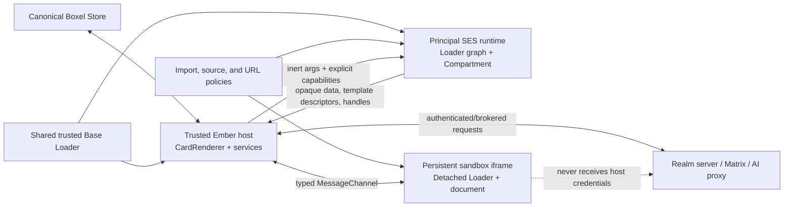
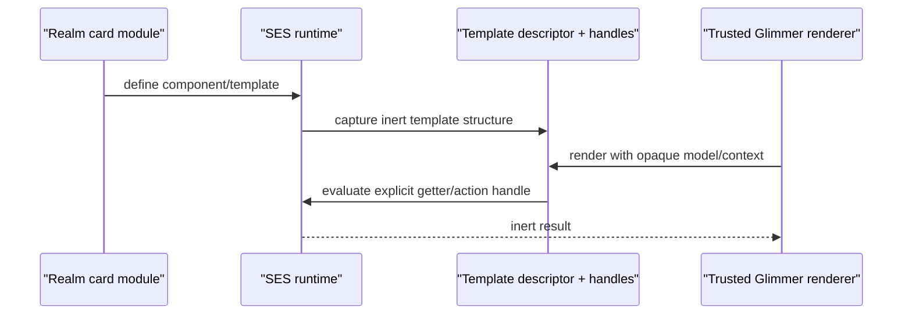

# Realm sandbox reviewer guide

## Why this guide exists

This branch is easier to understand as a sequence of architectural boundaries
than as a more-than-200-file diff. The implementation touches loading, card
materialization, rendering, Code mode, iframe hosting, and compatibility code,
but those changes all serve one idea:

> User-authored modules may share the Boxel application and card data model,
> but they must not inherit the host application's ambient authority merely
> because they render in the same browser.

This guide builds the system in dependency order. Each section introduces one
concept, explains the library or browser primitive involved, maps it to the
branch, and gives the reviewer a checkpoint. The final sections combine those
parts into complete Interact- and Code-mode flows.

This is a guide to the code currently present on
`codex/code-preview-instant-reload`. It also states the security and
compatibility work that the branch does **not** finish. It should be read with
[the consolidation plan](sandbox-branch-consolidation-plan.md), which records
scope, diligence, and the proposed commit/PR split, and the
[follow-up plan](realm-sandbox-follow-up-plan.md), which turns the remaining
reviewability, verification, cleanup, and hardening work into ordered
checklists. The companion
[card API compatibility ledger](realm-sandbox-card-api-compatibility.md) is the
canonical answer to “what must card authors learn or change?” This guide
explains the implementation; the ledger distinguishes net-new author APIs from
Host-owned shims and optional source conventions.

## How to review the branch

Do not begin with `RealmSandboxService`. It is the Ember-facing facade where
all the layers meet, so reading it first makes independent concerns look like
one large mechanism.

Use this order instead:

1. Understand the authority and identity invariants.
2. Review the Loader changes that separate a module graph from its evaluator.
3. Review SES evaluation and the trusted import surface.
4. Review the opaque card/type boundary and delegated rendering API.
5. Review how the host reconstructs a renderable component.
6. Review source classification and the iframe escalation path.
7. Review stable render islands and rehydration.
8. Review volatile Code-preview generations and acknowledgement.
9. Only then review the orchestration in `RealmSandboxService` and
   `CardRenderer`.
10. Finish with the compatibility migrations and acceptance matrix.

The code should be reviewable in roughly the same order as the proposed commit
sequence in the consolidation plan.

## 1. Start with the problem, not SES

### The old implicit trust model

Historically, a Boxel Loader imported card modules into the same JavaScript
environment as the Ember host. This is convenient: a card definition is a live
class, `getComponent(instance)` returns a live Glimmer component, imported Base
types share identity, and host services are close at hand.

It also means that user code which obtains `window`, `document`, host `fetch`,
storage, a loader, or a privileged service can observe or exercise authority
outside its realm. Server permissions still protect server requests, but they
do not stop one card from reading another card's in-memory data or a host-held
credential before a request is made.

### The boundary we want

The desired architecture distinguishes four kinds of execution:

1. **Official host/Base code** is trusted and may run in the ordinary Ember
   environment. Base modules use one shared app-wide graph; Catalog is also an
   allowed trusted realm surface, but is not delegated through `baseLoader`.
2. **Standard user card code** runs in an SES compartment associated with its
   realm principal. It receives explicit imports and capabilities.
3. **DOM-heavy user card code** may render in an iframe when its dependencies
   require a real document or global DOM environment. The parent still brokers
   authority through a protocol.
4. **Non-DOM commands** may eventually use Workers for availability isolation.
   Worker card rendering was removed from this branch because Ember/Glimmer DOM
   rendering in a Worker is the wrong abstraction.

The first three tiers are represented here. The fourth is future command
architecture, not a hidden card-rendering path.

### Invariants used throughout the branch

- The **Store remains canonical for card data**. Sandboxing changes which
  module executes and what representation crosses the execution boundary; it
  does not introduce a second database.
- A realm principal owns its user-module runtime. A change in one realm must
  not invalidate Base or unrelated realm loaders.
- Base/Catalog module identity is shared deliberately. User module identity is
  scoped deliberately.
- Data crosses an untrusted boundary as inert records and explicit metadata,
  not as arbitrary host objects or constructors.
- Authority crosses only as a narrow capability: for example, a brokered
  fetch, a delegated render request, or a safe modifier operation.
- The CardRenderer remains the common host entry point. Cards do not choose
  their sandbox with a URL query parameter and do not contain iframe or
  MessageChannel code.
- Source classification chooses a compatible rendering mechanism; it is not
  the security boundary. Evaluation and capability construction must still
  fail closed.
- A persisted server/index echo acknowledges an already-rendered generation.
  It must not be mistaken for a new edit and reload the preview.

### Vocabulary

| Term               | Meaning in this branch                                                                                                                                 |
| ------------------ | ------------------------------------------------------------------------------------------------------------------------------------------------------ |
| trusted loader     | The shared normal Base Loader, or a normal Loader for an explicitly trusted realm.                                                                     |
| realm principal    | The security identity used to key a user realm's SES runtime.                                                                                          |
| opaque card        | A host-visible inert representation of card data plus explicit type/presentation metadata. It is not the realm's live class instance.                  |
| delegated render   | An explicit request to render a card/field through the boundary instead of calling methods on its constructor.                                         |
| render island      | A stable host DOM boundary whose inner Glimmer render may be adopted or replaced.                                                                      |
| volatile module    | A source module currently being edited or externally rewritten, with generations tracked until it becomes quiet.                                       |
| last known good    | The most recent source generation that compiled and rendered successfully.                                                                             |
| acknowledgement    | Confirmation that the persisted/indexed source is the same generation already shown optimistically.                                                    |
| Direct             | The current format's GTS module executes in the trusted Ember Host. This is an execution result for one format, not a trust label for the entire card. |
| Capsule            | The current format's GTS module executes in an SES Compartment and renders through the trusted Host adapter.                                           |
| Sandbox            | The current format's GTS module executes in the isolated iframe document and communicates through MessageChannel.                                      |
| format-only import | An ordinary ESM binding used exclusively as the direct value of an iframe-capable static format slot, allowing that edge to be deferred per format.    |

## 2. Ideal architecture

The target is a small trusted host surrounding per-principal execution and
explicit crossings:



There are two related but distinct boundaries:

- The **module boundary** decides where source executes and which imports it
  receives.
- The **card boundary** decides which data, metadata, components, modifiers,
  and actions may cross between that execution environment and the host.

SES alone does not define the second boundary. A Compartment that is handed a
live Store, loader, DOM node, or card constructor is still overpowered. Most of
this branch is the work of making those previously implicit relationships
explicit.

## 3. Layer one: make Loader execution replaceable

### Library concept: module graphs and evaluators

Boxel's Loader is an AMD-style module graph. A fetched/transpiled module calls
`define`, the Loader records its dependencies and factory, and imports resolve
through the graph. Before this branch, evaluation and graph management were
effectively one trusted operation.

The branch adds `ModuleRegistration` and `ModuleEvaluator` to
`packages/runtime-common/loader.ts`. The default evaluator preserves the
ordinary trusted path. A sandbox can provide a different evaluator while
reusing the Loader's URL resolution, fetch, dependency graph, module cache,
and invalidation behavior.

That distinction is foundational:

```text
fetch/transpile -> evaluator registers module -> Loader links graph -> import
                       ^
                       |
             trusted eval or SES Compartment
```

The API seam is intentionally narrower than the Loader itself:

```ts
// packages/runtime-common/loader.ts — abridged
export interface ModuleRegistration {
  dependencyList: string[];
  implementation: Function;
}

export type ModuleEvaluator = (
  source: string,
  moduleIdentifier: string,
) => ModuleRegistration;

export class Loader {
  constructor(
    fetch: typeof globalThis.fetch,
    resolveImport?: (moduleIdentifier: string) => string,
    options?: {
      moduleEvaluator?: ModuleEvaluator;
      moduleDelegate?: (moduleIdentifier: string) => Promise<
        | {
            module: Record<string, unknown>;
            consumedModules?: Iterable<string>;
          }
        | undefined
      >;
    },
  ) {
    // ...
  }
}
```

`ModuleEvaluator` owns only the step that turns fetched/transpiled source into
an AMD registration. `moduleDelegate` lets a realm graph borrow canonical
trusted exports without evaluating their source again.

### Boxel-specific use

`packages/host/app/services/loader-service.ts` now owns:

- one app-wide `baseLoader` for trusted Base identity;
- ordinary loaders for explicitly trusted realms;
- detached loaders whose root fetch can be brokered, used by iframes;
- targeted `invalidateModule()` behavior; and
- module delegation so a sandbox Loader can consume canonical trusted Base
  exports without evaluating Base again inside every realm graph.

The Loader itself supports a `moduleDelegate`. The important property is not
just caching performance: all realms see the intended Base class/function
identity while user modules remain in their own graph and evaluator.

### Loader separation is required; targeted invalidation is an optimization

The important isolation property is the plural Loader topology. Replacing a
user or preview Loader cannot replace the app-wide trusted Base Loader or a
different realm's Loader. Therefore official Workspace/Base code does not need
targeted invalidation to remain immune to user-source churn. A private Loader
owned by one volatile preview graph may be discarded wholesale without
affecting those trusted modules.

This branch additionally implements targeted invalidation because its
canonical SES runtime is shared per principal and its ordinary trusted-realm
Loader is shared per trusted realm. Replacing either shared Loader for every
source change would discard unrelated same-principal module state, warm
templates, and long-running cards. The current implementation instead
invalidates the changed module and its known consumers within the affected
graph. That is a performance and continuity improvement over `main`, not the
mechanism that protects Base or unrelated realms.

Another valid architecture would retire the whole affected user-Loader
generation, route new/affected consumers to a replacement, and retain the old
generation until its existing consumers release it. That trades dependency-
targeted cache mutation for generation/lifetime management; it is not
automatically simpler. The invariant to review is blast-radius containment,
not that every implementation must expose `invalidateModule()`.

The implementation walks the dependencies already known to that Loader and
removes only the affected cache keys:

```ts
// packages/runtime-common/loader.ts — abridged
invalidateModule(moduleIdentifier: string): number {
  let target = this.moduleKey(moduleIdentifier);
  if (!target) {
    return 0;
  }

  let invalidated = new Set([target]);
  // Add loaded modules whose direct dependencies are already invalidated.
  // Then remove only those keys from this Loader's caches.
  return removed;
}
```

### Review these files

- `packages/runtime-common/loader.ts`
- `packages/host/app/services/loader-service.ts`
- `packages/host/tests/unit/loader-test.ts`
- `packages/host/tests/unit/services/loader-service-invalidation-test.ts`

### Reviewer checkpoint

- Can the same Loader graph use either the normal evaluator or an SES
  evaluator without changing import semantics?
- Is trusted Base identity delegated rather than copied into every realm?
- Can a user-module invalidation reach Base or a different realm?
- When a Loader is shared by multiple active user modules, does its update
  strategy refresh actual consumers without remounting unrelated cards?

Do not continue until the answers are clear. Every later layer relies on this
separation.

## 4. Layer two: execute a realm graph in SES

### Library concept: SES

This branch uses Endo SES (`ses` 2.2.0). Its relevant primitives are:

- `lockdown()` freezes/tames shared JavaScript intrinsics once for the page;
- `harden()` recursively freezes capability objects; and
- `Compartment` evaluates code with an explicit global object and explicit
  module/evaluation hooks.

`lockdown` is process-wide, so it is initialized once. The current host uses
`evalTaming: 'unsafe-eval'` and `overrideTaming: 'severe'`. The former is a
compatibility compromise for the existing host/Monaco toolchain, not a claim
that arbitrary realm code receives host `eval` authority. Reviewers should
evaluate the actual endowments and evaluator path, not infer isolation from
the word “SES.”

The runtime makes that compatibility choice at the host boundary, then gives
the realm Loader the Compartment-backed evaluator:

```ts
// packages/host/app/lib/realm-compartment-module-runtime.ts — abridged
lockdown({
  evalTaming: 'unsafe-eval',
  overrideTaming: 'severe',
});

let sandbox = createRealmSandboxCompartment(
  `Boxel realm principal ${principal}`,
  globals,
);

this.loader = new Loader(options.fetch, options.resolveImport, {
  virtualNetwork: options.virtualNetwork,
  moduleEvaluator: (source, moduleIdentifier) =>
    this.evaluateRegistration(source, moduleIdentifier),
  moduleMeta: (moduleIdentifier) => harden({ url: moduleIdentifier }),
});
```

### Boxel-specific use

`packages/host/workers/realm-isolation-module-evaluator.ts` creates the SES
Compartment and exposes a hardened AMD `define` registration to it. Despite
the historical `workers/` directory name, this module is used on the main
thread; it is not a Web Worker.

`packages/host/app/lib/realm-compartment-module-runtime.ts` supplies the
Boxel runtime on top:

- it installs the allowed trusted exports and runtime facades;
- it checks that ambient `window`, `document`, storage, `fetch`, and XHR are
  absent;
- it imports/evaluates realm modules through the sandbox Loader;
- it captures Glimmer template/component descriptors;
- it exposes explicit handles for sandbox-owned getters and actions; and
- it rejects an unscoped literal `<style>` that survives compilation.

The runtime also records the ambient global types from inside the Compartment.
The expected report says these browser authorities are absent unless a narrow
facade was deliberately supplied:

```ts
this.ambientReport = harden(
  this.compartment.evaluate(`({
    window: typeof window,
    document: typeof document,
    localStorage: typeof localStorage,
    fetch: typeof fetch,
    XMLHttpRequest: typeof XMLHttpRequest
  })`),
);
```

The runtime is shared per principal by
`packages/host/app/lib/realm-sandbox-runtime-registry.ts`. Consumers retain a
runtime while active; idle runtimes can be evicted. This avoids one Loader per
card while preventing unrelated principals from sharing user-module state.

### Import policy is part of the capability surface

`packages/host/app/lib/realm-sandbox-import-policy.ts` defines the imports a
sandbox module may consume. The broad groups are:

- official Base and Catalog modules;
- exact Ember/Glimmer/runtime helpers needed by compiled card modules; and
- presentation-only Boxel UI and icon modules.

An allowed import is not merely a dependency convenience. Every exported
function is authority. Review additions by asking what the export can reach,
not only whether existing cards happen to import it.

### Review these files

- `packages/host/workers/realm-isolation-module-evaluator.ts`
- `packages/host/app/lib/realm-compartment-module-runtime.ts`
- `packages/host/app/lib/realm-sandbox-import-policy.ts`
- `packages/host/app/lib/realm-sandbox-runtime-registry.ts`
- `packages/host/tests/unit/realm-compartment-module-runtime-test.ts`
- `packages/host/tests/unit/lib/realm-sandbox-runtime-registry-test.ts`
- `packages/host/tests/unit/realm-sandbox-runtime-lifecycle-test.ts`

### Reviewer checkpoint

- What exact globals and imports does realm code receive?
- Can a trusted facade return a host object that bypasses the intended
  boundary?
- Are principal runtimes shared and evicted at the right granularity?
- Does invalidation affect the canonical principal runtime rather than a stale
  closure or disposable copy?

## 5. Layer three: replace live card introspection with an explicit boundary

### The compatibility problem

Existing Boxel code often assumes that a card is a live instance of its realm
class. Patterns such as these are convenient in one JavaScript realm:

```ts
instance.constructor.getComponent(instance);
getFields(instance.constructor);
```

They are not a safe cross-realm protocol. A constructor is executable
authority, its identity depends on a Loader, and arbitrary properties can lead
back into the module environment.

### The explicit representation

`packages/host/app/lib/realm-sandbox-boundary.ts` defines the inert forms used
by the host:

- `OpaqueRealmCardState` carries serialized card data and presentation data;
- `OpaqueRealmCardTypeState` carries explicit type and field metadata;
- field descriptors state their field kind and referenced type;
- presentation metadata carries values such as theme and wide-format
  preference; and
- helper functions identify and serialize opaque cards without asking for
  their authored constructor.

“Opaque” does not mean encrypted. It means the host treats the value as a data
record with a known protocol instead of a live instance whose behavior it may
introspect.

The important API shape is data-only:

```ts
// packages/host/app/lib/realm-sandbox-boundary.ts — abridged
export interface OpaqueRealmCardState {
  typeRef: CodeRef;
  principal: string;
  document: LooseSingleCardDocument;
  snapshot: Record<string, unknown>;
  presentation: OpaqueRealmCardPresentation;
}

export interface OpaqueRealmCardTypeState {
  typeRef: CodeRef;
  displayName: string;
  fields: Record<string, OpaqueRealmCardFieldMetadata>;
  hasCustomEditTemplate: boolean;
  hasCustomIsolatedTemplate: boolean;
  headerColor: string | null;
  prefersWideFormat: boolean;
}
```

### Canonical Store state

The Store still owns the canonical card document and relationship state. The
boundary creates a representation for a particular execution/rendering
purpose. `createFromSerialized` accepts an explicit definition Loader so
materialization does not silently select the host's Loader. The branch also
distinguishes host-record materialization from realm-execution materialization.

Canonical ownership must not be confused with sandbox visibility. A sandboxed
card must never receive the Store's ambient authority merely because the Store
can see the user's data. Every sandbox-originated load, search, relationship
hydration, and mutation needs to be evaluated through a scoped Store facade
bound to an immutable sandbox execution identity and an explicit access grant.
The effective authority is always an intersection:

```text
user authority
  ∩ app/sandbox policy
  ∩ explicitly granted cards or relationship roots
  ∩ allowed operation (read, search, or write)
```

An app may receive an installation-level grant for its own realm. Access to a
small subset of another realm should use a Host-owned chooser, analogous to
iOS's selected-photos permission: the card asks the Host to select content,
the user chooses exact cards or resources, and the Host records a revocable
grant before returning inert links or opaque handles. Guessing a URL, receiving
a relationship, or knowing a card id must not mint authority to the target
realm, reverse relationships, or global search.

The execution identity is not the iframe origin, a realm URL, or
`prefersFullSandbox` alone. It needs to bind the current user session, app or
module identity, app installation/grant, and sandbox instance (or another
equally strong stable principal). The Host attaches that identity to Store and
broker requests; card code must not be able to construct or edit it. Search
filtering must happen in the Store/query path before results, counts, or
relationship objects are materialized—not as a UI post-filter.

This scoped Store authorization layer is a required follow-up. The current
boundary deliberately omits the live Store and broad query helpers from user
Capsules and iframe children, but that omission is not a complete authorization
model for future app-scoped data access.

This is why “one Store” and “multiple module runtimes” are compatible:

```text
realm document -> canonical Store record
                         |
                         +-> trusted host materialization
                         |
                         +-> scoped grant -> opaque state
                                                |
                                                +-> principal runtime materialization
```

### Delegated rendering

Some Base behavior intentionally renders another card or field with more
control than ordinary field delegation. Markdown is a representative case. It
already calls the ordinary `getComponent(instance)` helper, and deployed Base
code must not need a new symbol merely because the linked instance is opaque.

The Host therefore constructs the opaque type with a compatibility shim on the
static format slots Base already understands. An authored format returns the
trusted `RealmSandboxDelegatedRender`; an unauthored format inherits the normal
Base fallback. The opaque instance remains inert and the Host retains the
authority to choose SES or iframe rendering.

```ts
// packages/host/app/services/realm-sandbox.ts — abridged
for (let format of CARD_FORMATS) {
  Object.defineProperty(OpaqueCard, format, {
    get: () =>
      authoredTemplateFormats.includes(format)
        ? RealmSandboxDelegatedRender
        : Reflect.get(TrustedBase, format),
  });
}
```

Existing Base `getComponent(instance)` follows its unchanged constructor and
static-slot lookup. No delegation symbol, sandbox service, executable realm
constructor, or new authored-card API crosses the boundary. Existing card code
continues to express “render this card,” while the Host decides how the opaque
child is evaluated.

### Review these files

- `packages/host/app/lib/realm-sandbox-boundary.ts`
- `packages/base/card-api.gts`
- `packages/host/app/components/realm-sandbox-delegated-render.gts`
- `packages/host/app/lib/realm-sandbox-delegated-card-component.gts`
- `packages/host/app/services/card-type-service.ts`
- `packages/host/app/services/store.ts`
- `packages/host/tests/unit/lib/realm-sandbox-boundary-test.ts`

### Reviewer checkpoint

- Can host code render and inspect schema without receiving the user class?
- Is every tunneled property inert metadata, or is executable authority hiding
  inside it?
- Does delegated child rendering preserve the child's own realm boundary?
- Can the Store continue to reconcile relationships and updates without a
  parallel sandbox data store?
- Does every sandbox-originated Store entry point carry an immutable execution
  identity and an operation-specific grant?
- Can a guessed URL, relationship traversal, result count, or reverse lookup
  reveal anything outside that grant?
- Is the grant intersected with the user's current authority, revocable, and
  unable to amplify permissions?

## 6. Layer four: reconstruct rendering in the trusted host

### Why a template descriptor is needed

A Glimmer component class created inside a Compartment should not simply be
handed to the Ember host as if it were trusted. Conversely, returning HTML
would discard Glimmer reactivity, nested components, actions, and field
rendering.

The SES runtime therefore captures an explicit `SandboxTemplateDescriptor` and
component-instance description. The trusted host constructs the small adapter
that Glimmer renders. Dynamic values and actions refer back to sandbox-owned
handles rather than exposing the host component or DOM element to the
Compartment.

This is the central bridge:



### Presentation context is narrow

`packages/host/app/components/realm-sandbox-render.gts` remains a trusted host
wrapper. It provides only the presentation values needed by the card, uses the
ordinary host `CardContainer`, applies sandbox styles, and offers a realm-safe
`viewCard` operation. It does not tunnel the host's full CardContext or router.

Theme, `prefersWideFormat`, editability, and other implicit presentation
inputs have to be carried explicitly. This is why some apparently unrelated
UI regressions exposed missing boundary API rather than CSS bugs.

### Trusted Base field portals and inherited templates

A user component may delegate a field to an official Base renderer without
turning that renderer into user code. The Host creates a separate trusted
portal for the Base component and supplies only the capabilities that renderer
needs: `requestRender`, CodeRef validation, and a private `trustedUI` loader for
Host-bundled CodeMirror, KaTeX, and Mermaid. The realm component never receives
the `trustedUI` object, those module namespaces, or their ambient globals.

New bundled Base code prefers the explicit context capability:

```ts
let loadMermaid =
  this.cardContext?.trustedUI?.loadMermaid ?? globalThis.__loadMermaid; // compatibility for already-deployed Base
```

The global fallback is installed by the Host for older deployed Base modules;
it is not installed as an SES endowment. The portal also subscribes to trusted
UI completion so an independently owned Glimmer root rerenders when an async
editor or diagram becomes ready. `CORPUS-02` covers both Mermaid output and the
CodeMirror editor through this path.

Template inheritance is a separate compatibility case. A leaf card class may
extend a parent card that defined `static isolated` without defining another
template itself. The Compartment runtime walks the card prototype chain to
find the captured template, but instantiates the leaf component so overridden
getters and actions still run. Copying the parent's template into the child
would be an author-visible workaround and is specifically avoided.

### Safe modifiers

Ember modifiers normally receive a live DOM element, which would punch a hole
through SES. `packages/boxel-ui/addon/src/modifiers/safe-modifier.ts` offers a
small allowlist:

- `focus`;
- `scroll-into-view`; and
- `observe-size`.

For observation, the callback receives a frozen `{ width, height }` record,
not the Element. New operations should be added only when they can be expressed
as similarly narrow capabilities.

The modifier is implemented in the trusted renderer as an operation switch,
not as a callback that hands the Element to realm code:

```ts
// packages/boxel-ui/addon/src/modifiers/safe-modifier.ts — abridged
switch (operation) {
  case 'focus':
    element.focus({ preventScroll: options.preventScroll === true });
    return;
  case 'scroll-into-view':
    element.scrollIntoView({
      behavior: options.behavior ?? 'auto',
      block: options.block ?? 'nearest',
      inline: options.inline ?? 'nearest',
    });
    return;
  case 'observe-size': {
    let publishSize = () => callback(elementSize(element));
    let observer = new ResizeObserver(publishSize);
    observer.observe(element);
    return () => observer.disconnect();
  }
}
```

### Scoped styles

Sandbox-authored styles are transported separately and installed through a
ref-counted host stylesheet registry. This prevents one style element per
rerender and preserves identity across compatible HMR generations. The SES
compiler/runtime must scope selectors; an ordinary unscoped `<style>` is
rejected rather than inserted into the shared host document.

Selector scoping is not a complete CSS security boundary. Network-bearing CSS
syntax and global at-rules require additional hardening, called out later.

### Review these files

- `packages/host/app/components/realm-sandbox-render.gts`
- `packages/host/app/components/realm-sandbox-template-island.gts`
- `packages/host/app/lib/realm-sandbox-field-component.gts`
- `packages/host/app/lib/trusted-ui-runtime.ts`
- `packages/host/app/lib/realm-compartment-module-runtime.ts`
- `packages/host/app/modifiers/realm-sandbox-styles.ts`
- `packages/host/app/services/realm-sandbox-styles.ts`
- `packages/boxel-ui/addon/src/modifiers/safe-modifier.ts`
- `packages/host/tests/unit/realm-sandbox-styles-test.ts`
- `packages/boxel-ui/test-app/tests/integration/modifiers/safe-modifier-test.gts`

### Reviewer checkpoint

- Does a sandbox action ever receive an Element, service, or host component?
- Are presentation values explicit and stable across formats?
- Can authored CSS escape its render root or create duplicate style nodes over
  time?
- Does delegated rendering re-enter `CardRenderer`, or bypass the boundary?

## 7. Layer five: choose SES or iframe without letting the card choose

### Library concept: fast static source analysis

`packages/host/app/lib/realm-sandbox-source-policy.ts` uses two libraries:

- `content-tag` identifies the JavaScript and `<template>` regions of GTS; and
- `es-module-lexer` extracts module imports quickly from the masked JavaScript.

The classifier looks for dependencies and globals associated with DOM-heavy
libraries such as Three.js, Babylon, Cesium, Mapbox, and Pixi, plus direct DOM
access and incompatible unscoped styles. Malformed source stays on the SES
path as `source-parse-pending`, allowing the last-known-good preview to remain
while the user types.

The decision is then constrained by render format:

- `isolated`, `embedded`, and `edit` may use an iframe when required;
- `fitted`, `atom`, `head`, and `markdown` remain SES so galleries and
  lightweight composition do not become iframe farms.

The URL query parameter is not authoritative. A card cannot request a weaker
sandbox by editing its URL.

The format constraint is a second policy step after source classification:

```ts
// packages/host/app/lib/realm-sandbox-source-policy.ts — abridged
const iframeRenderFormats = new Set(['isolated', 'embedded', 'edit']);

export function sandboxDecisionForFormat(decision, format) {
  let effectiveFormat = format ?? 'isolated';
  if (decision.tier !== 'iframe' || iframeRenderFormats.has(effectiveFormat)) {
    return decision;
  }
  return {
    tier: 'compartment',
    reason: `ses-only-format:${effectiveFormat}`,
  };
}
```

The branch also recognizes one conservative source convention that avoids
making a whole card graph pay the iframe cost. If an imported binding is used
only as the complete value of `static isolated`, `static embedded`, or
`static edit`, the classifier records that edge as format-only:

```gts
import { PlanetEditor, PlanetScene } from './planet-3d';

export class PlanetCard extends CardDef {
  static isolated = PlanetScene;
  static embedded = PlanetScene;
  static edit = PlanetEditor;
  static atom = class Atom extends Component<typeof PlanetCard> {
    <template>
      <span>{{@model.name}}</span>
    </template>
  };
}
```

This is ordinary GTS and ESM—not a privileged annotation. The imported module
is still classified normally. Its result applies only to the formats that use
it, while compact formats can remain in Capsule. Any second use in schema,
module initialization, another renderer, or an ambiguous expression keeps the
import eager and therefore conservatively affects the whole graph.

### Why classification is not the security boundary

Static analysis is necessarily incomplete. Aliases, dynamic property access,
generated code, or a new library can evade a compatibility signal. A module
classified for SES is still evaluated with SES endowments and import policy.
If it attempts ungranted DOM access, it should fail. The classifier only says
whether known source needs the iframe compatibility tier.

### Browser concept: a persistent iframe and MessageChannel

For DOM-heavy eligible formats,
`packages/host/app/components/realm-sandbox-iframe.gts` creates a sandboxed,
credentialless iframe with no referrer. In deployment the frame should use a
dedicated, non-host origin. The current localhost wiring is development
infrastructure, not proof that the hosted origin architecture is complete.

After bootstrap, the parent transfers one end of a `MessageChannel`. The typed
protocol in `packages/host/app/lib/realm-iframe-sandbox-protocol.ts` carries:

- connect/readiness messages;
- render-format and presentation updates;
- volatile source drafts;
- intrinsic-size reports; and
- bounded fetch requests/responses brokered by the parent.

The frame stays mounted across compatible source and format updates. The query
string is bootstrap state; ongoing state moves over the port.

The parent creates one channel and transfers only its second port to the
already-loaded child document:

```ts
// packages/host/app/components/realm-sandbox-iframe.gts — abridged
channel = new MessageChannel();
channel.port1.addEventListener('message', receive);
channel.port1.start();

element.contentWindow?.postMessage(
  {
    protocol: realmIframeSandboxProtocol,
    type: 'connect',
    document: this.args.sandbox.document,
    presentation: this.args.sandbox.presentation,
    draft: this.args.sandbox.draft,
  },
  this.args.sandbox.targetOrigin,
  [channel.port2],
);
```

### The frame has its own Loader, not host credentials

`LoaderService.createDetachedLoader()` gives the frame runtime a Loader whose
root fetch uses the MessagePort broker. The child can load allowed modules and
realm resources, but it does not inherit the host's authenticated `fetch` or
cookies. Parent URL policy requires the target to remain under the allowed
realm origin/path.

Intrinsic height is also an explicit service. The child uses the safe
`observe-size` modifier and sends a numeric resize record; the parent clamps
and applies it. The card itself does not know it is in an iframe.

Before the iframe is interactive, the parent asks the Realm index for the
exact requested prerendered format. If indexed isolated HTML is temporarily
unavailable, it may use embedded HTML as a visual fallback; it never treats
that fallback as interactive. The inert placeholder stays visible until the
child has both reported readiness and, for intrinsic formats, supplied its
first bounded height. The existing card header shows the application loading
indicator during that interval. Once ready, the persistent iframe fades in
without requiring the card to implement hydration or MessageChannel code.

Height ownership is part of the private presentation protocol:

- `isolated`, `embedded`, `edit`, and `atom` are intrinsic by default: the
  child reports content height and the parent owns the iframe element size;
- `fitted` is allocated by default: the parent supplies the viewport and
  ignores child resize reports, allowing docked panels and internal overflow.

Prerender fetching is a Host optimization and uses the Host's authenticated
Store/network path. It is never exposed as a fetch capability available to the
iframe or SES card.

### Review these files

- `packages/host/app/lib/realm-sandbox-source-policy.ts`
- `packages/host/tests/unit/lib/realm-sandbox-source-policy-test.ts`
- `packages/host/app/components/realm-sandbox-iframe.gts`
- `packages/host/app/routes/realm-sandbox-frame.ts`
- `packages/host/app/templates/realm-sandbox-frame.gts`
- `packages/host/app/lib/realm-iframe-sandbox-protocol.ts`
- `packages/host/app/lib/realm-sandbox-url-policy.ts`
- `packages/host/tests/unit/lib/realm-iframe-sandbox-protocol-test.ts`
- `packages/host/tests/unit/lib/realm-sandbox-url-policy-test.ts`
- `packages/host/tests/unit/realm-sandbox-iframe-draft-test.ts`
- `packages/runtime-common/prerendered-html-format.ts`
- `packages/realm-server/tests/card-html-endpoints-test.ts`

### Reviewer checkpoint

- Can any source-controlled value select a weaker tier?
- Are all protocol messages validated and bounded before use?
- Does the parent broker enforce realm path as well as origin?
- Does the frame ever receive host credentials or an unrestricted fetch?
- Can format and height change without replacing the iframe?

## 8. Layer six: preserve identity with render islands

### Library concept: Glimmer serialization and rehydration

Glimmer can serialize render markers and later adopt them with a rehydration
builder. Boxel already needs this for server-rendered HTML. This branch uses the
same primitive for compatible live preview replacement.

`packages/host/app/lib/isolated-render.gts` wraps APIs from `@glimmer/node` and
`@glimmer/runtime` to:

- render or serialize a component with arguments;
- recognize and suspend serialized content;
- adopt serialized markers;
- replace an active render through rehydration; and
- tear down the active render drop.

This is not Vite HMR and it does not preserve arbitrary JavaScript component
instance state. It preserves the outer DOM/island identity and lets Glimmer
adopt or replace the authored subtree without blanking the whole preview.

Both server-to-client adoption and live template replacement use the same
Glimmer primitive:

```ts
// packages/host/app/lib/isolated-render.gts
export function rehydrateReplacingActiveWithArgs(
  component: RenderableComponent,
  element: SimpleElement,
  owner: Owner,
  args: IsolatedRenderArgs,
): void {
  releaseActiveRender(element);
  renderWithMode('rehydrate', component, element, owner, args);
}
```

### Two nested identities

There are two useful island levels:

1. `CardIsland` is the common host boundary for prerendered and client-rendered
   cards. `card-island-protocol.ts` versions the marker format and checks format
   compatibility before adoption.
2. `RealmSandboxTemplateIsland` is the stable SES preview boundary. It keeps
   the outer element mounted while the generated sandbox template changes.

`CardRenderer` owns these boundaries. `RealmSandboxRender` should not create a
fresh context/envelope on every getter evaluation; identities are keyed by the
card, format, component/template, and preview revision that actually matters.

### Warm format switching

Code mode keeps a two-format SES island LRU. Switching from isolated to fitted
and quickly back can reuse the warm island and module analysis instead of
recreating the realm runtime. Interact mode keeps one active slot to avoid
turning ordinary card composition into an unbounded hidden DOM cache.

### Review these files

- `packages/host/app/lib/isolated-render.gts`
- `packages/host/app/components/card-island.gts`
- `packages/host/app/lib/card-island-context.ts`
- `packages/host/app/lib/card-island-protocol.ts`
- `packages/host/app/components/realm-sandbox-template-island.gts`
- `packages/host/app/components/card-renderer.gts`
- `packages/host/tests/unit/lib/isolated-render-test.gts`
- `packages/host/tests/acceptance/prerender-html-test.gts`

### Reviewer checkpoint

- Which identity remains stable when source changes: route, CardRenderer,
  CardIsland, TemplateIsland, iframe, stylesheet, or component instance?
- Is an incompatibility detected before marker adoption?
- Is every active render drop destroyed exactly once?
- Are format caches bounded and destroyed when the card leaves the UI?

## 9. Layer seven: make Code preview a generation state machine

### Why ordinary server invalidation is insufficient

A Monaco edit has two timelines:

1. the local source buffer can compile and render immediately; and
2. autosave, lint, realm indexing, and SSE acknowledgement complete later.

If the server echo is treated as a new change, the preview briefly shows the
new source and then reloads from an older/canonical module graph. The result is
the “one generation behind” flash this branch was built to eliminate.

### Volatility

`packages/host/app/lib/code-preview-sandbox.ts` defines:

- a source hash for analysis caches and a canonical module key;
- `VolatileModuleRegistry` with a 90-second quiet period;
- generation phases for draft, evaluation, rendering, persistence, and
  acknowledgement;
- prepared commits and last-known-good state; and
- a bounded `CodePreviewAnalysisCache` keyed by source hash.

A module becomes volatile on the first source-changing operation, not merely
because the AI assistant happens to be in Act mode. Monaco edits, AI
search/replace blocks, and out-of-band Boxel CLI writes can all enter the same
pipeline. An already-displayed card remains volatile until unloaded or quiet.

The registry publishes source and revision as one frozen generation:

```ts
// packages/host/app/lib/code-preview-sandbox.ts — abridged
export class VolatileModuleRegistry {
  private modules = new Map<string, VolatileModuleGeneration>();

  publish(sourceURL: string, source: string): VolatileModuleGeneration {
    let key = codePreviewModuleKey(sourceURL);
    let previous = this.current(sourceURL);
    let generation = Object.freeze({
      sourceURL,
      source,
      revision: (previous?.revision ?? 0) + 1,
      expiresAt: this.now() + this.quietPeriodMs,
    });
    this.modules.set(key, generation);
    return generation;
  }
}
```

### The generation/acknowledgement rule

```mermaid
stateDiagram-v2
  [*] --> Canonical
  Canonical --> Draft: "first source change"
  Draft --> Evaluating: "classify + transpile"
  Evaluating --> Rendered: "local generation succeeds"
  Evaluating --> LastKnownGood: "compile/runtime failure"
  Rendered --> Persisting: "autosave / patch write"
  Persisting --> Persisted: "realm accepts source"
  Persisted --> Acknowledged: "request id + module invalidation match"
  Acknowledged --> Rendered: "same UI generation; no reload"
  LastKnownGood --> Draft: "next edit or repaired source"
  Rendered --> Draft: "explicit reload remounts current source"
  Rendered --> Canonical: "quiet/unloaded"
```



`LastKnownGood` is a conceptual visible state in this diagram, not a literal
`CodePreviewGenerationPhase`; the implementation records a failed phase while
retaining `lastKnownGoodRevision` and the mounted successful island.

For a local save, the matching SSE/index event is recognized by the commit's
client request id and an invalidation for the same canonical module. The
immutable draft retained by that commit identifies the generation being
acknowledged. An event without that local commit identity follows the external
change path: the host refetches the module source and publishes a new volatile
generation for any displayed consumers. When a source generation fails, the
UI keeps the last-known-good render and exposes the error/fix path. It does not
replace good content with a blank pane.

The acknowledgement path joins the server event to the prepared local commit
instead of treating the event as another source generation:

```ts
// packages/host/app/services/realm-sandbox.ts — abridged
isCodePreviewCommitAcknowledgement(clientRequestId, invalidations) {
  let commit = codePreviewCommitRegistry.get(clientRequestId);
  if (
    !commit ||
    !invalidations.some((url) =>
      sameCodePreviewModuleURL(url, commit.sourceURL),
    )
  ) {
    return false;
  }

  for (let sandbox of commit.sandboxes) {
    sandbox.markCommitAcknowledged(
      commit.drafts?.get(sandbox),
      clientRequestId,
    );
    sandbox.deferCanonicalRefresh();
  }
  return true;
}
```

### Analysis is reusable work

Classification and transpilation are cached together by source hash. The
preview may begin compiling while a diff is displayed, then reuse that result
when the block is applied. A bounded cache prevents rapid edits from causing
app-lifetime growth.

```ts
// packages/host/app/lib/code-preview-sandbox.ts — abridged
classificationFor(draft: CodePreviewDraft) {
  let analysis = this.analysisFor(draft);
  analysis.classification ??= classifyCardSourceForSandbox(draft.source);
  return analysis.classification;
}

compiledFor(draft: CodePreviewDraft) {
  let analysis = this.analysisFor(draft);
  analysis.compiled ??= compileCodePreviewDraftSource(draft);
  return analysis.compiled;
}
```

### Reload Card is an explicit escape hatch

Compatible generations should preserve the island. A reviewer or user still
needs a way to force a component remount when testing module lifetime or
escaping bad local state. Reload Card drops this card's render envelope and
bumps its explicit boundary revision. When a volatile preview exists it reloads
the current draft rather than silently replacing it with older canonical
source. It leaves Store identity and unrelated runtimes alone, and it should
not happen as a hidden time threshold after 15 seconds.

### Review these files

- `packages/host/app/lib/code-preview-sandbox.ts`
- `packages/host/app/resources/interactive-code-preview.ts`
- `packages/host/app/services/code-source-cache.ts`
- `packages/host/app/resources/code-diff.ts`
- `packages/host/app/tools/patch-code.ts`
- `packages/host/app/components/ai-assistant/code-block/apply-code-patch-button.gts`
- `packages/host/tests/unit/code-preview-sandbox-test.ts`
- `packages/host/tests/acceptance/code-submode/sandbox-live-reload-test.gts`
- `packages/host/tests/acceptance/code-patches-test.gts`

### Reviewer checkpoint

- Is a generation identified by canonical module URL, immutable revision, and
  commit request id rather than arrival order alone? Is the source hash used
  only where collision-safe full-source checks accompany it?
- Can a late acknowledgement overwrite a newer draft?
- Does invalid source keep last-known-good UI and a useful error?
- Are local, AI, and out-of-band changes normalized into the same pipeline?
- Does explicit Reload Card differ from ordinary acknowledgement?

## 10. The orchestration layer

After reviewing the independent mechanisms, the two main orchestration files
should be much less mysterious.

### `CardRenderer`

`packages/host/app/components/card-renderer.gts` remains the single entry point
for a card render. It decides among:

- trusted/head behavior;
- a sandbox loading/error surface;
- an SES render slot; and
- an iframe render slot.

It owns the stable islands and the Code-mode two-format cache. Base fallback
templates stay on the trusted fast path; a blank user GTS without an authored
template can therefore show the normal Base isolated/edit/schema experience
without booting an unnecessary iframe.

### `RealmSandboxService`

`packages/host/app/services/realm-sandbox.ts` is the Ember-facing facade. It
coordinates:

- trusted versus principal Loader selection;
- opaque-card materialization;
- runtime retention;
- source classification and analysis cache;
- template registration/revisions;
- interactive and Code-preview volatility;
- iframe render descriptions and brokered fetch;
- presentation/theme metadata; and
- metrics used by tests and diagnostics.

It is still large. This pass extracted principal runtime lifetime, source-hash
analysis, and realm URL policy. Iframe brokering and the template registry are
good later extractions, but doing another large naming/refactoring pass before
behavior and CI stabilize would increase review risk.

### Reviewer checkpoint

- Is policy decided once and represented in a stable render description?
- Does the service expose a narrow orchestration API, or are components
  reaching into its caches?
- Are loading/error surfaces owned by CardRenderer rather than authored card
  code?
- Are trusted Base paths immune to user preview revisions?

## 11. Complete system walkthroughs

These flows combine the layers in the order they execute.

### A. Interact mode: ordinary user card in SES

1. The Store loads the canonical card document.
2. CardRenderer asks the sandbox service for a render description.
3. LoaderService chooses the principal runtime and delegates trusted Base
   imports to the shared Base Loader. Other allowed trusted imports, including
   Catalog, are admitted by the sandbox import policy without being delegated
   through `baseLoader`.
4. The source policy selects the `compartment` tier, reported in the card menu
   as **Execution: Capsule** for this format.
5. The principal Loader fetches/transpiles; its `ModuleEvaluator` registers the
   module inside SES.
6. The runtime captures type metadata and a template descriptor.
7. The host creates an opaque card representation and trusted delegated-render
   component.
8. RealmSandboxRender supplies narrow CardContext/presentation args. If a
   trusted Base field is delegated, its separate Host portal receives only the
   private trusted-UI and validation capabilities it needs.
9. TemplateIsland renders through Glimmer and the stylesheet registry installs
   the scoped styles.
10. A nested card delegates back through CardRenderer, which applies the nested
    card's own realm boundary.

### B. Code mode: Monaco CSS/template edit in SES

1. File navigation updates Code mode and shows Monaco as soon as source is
   available; it does not wait for card analysis or preview.
2. The first edit marks the canonical module volatile and creates generation
   N with a source hash.
3. Classification/transpilation begin from the buffer and are cached by hash.
4. The principal runtime invalidates the target module/consumers, then evaluates
   generation N without replacing Base or unrelated realm loaders.
5. TemplateIsland adopts/replaces the authored subtree inside the same stable
   preview boundary. The stylesheet identity is updated, not multiplied.
6. Autosave, lint, and indexing run independently.
7. The matching request-id/module server event acknowledges N. It does not
   render N-1 or replace the island.
8. A syntax/runtime error records the error and keeps the last known good
   generation visible until the next repair.

### C. Code mode: Three.js-style card in an iframe

1. Static classification sees a known DOM-heavy import/global.
2. For isolated, embedded, or edit, CardRenderer selects the iframe tier.
3. The Host paints inert indexed HTML for the requested format immediately and
   marks the header as loading.
4. The stable frame boots on the configured sandbox origin and receives a
   MessagePort.
5. Its detached Loader fetches through the parent's realm-bounded broker.
6. Draft generations and presentation changes travel over the existing port;
   the iframe is not recreated for each keystroke.
7. The child renders with a real document. `observe-size` sends frozen numeric
   dimensions, and the parent adjusts the frame while authored CSS retains
   overflow control.
8. Once readiness and the first intrinsic size arrive, the iframe replaces the
   inert placeholder and the header spinner clears.
9. Switching to fitted, atom, head, or markdown selects SES instead; those
   formats never create a gallery of frames.

### D. Out-of-band AI or CLI edit while viewing a card

1. The card is already rendered in Interact or Code mode.
2. A source write/index event names a loaded module.
3. Because it is not a locally registered commit acknowledgement, the host
   refetches it and publishes the returned source as a volatile generation
   through the same preview pipeline as Monaco.
4. The first transition may visibly replace canonical with volatile execution.
   Subsequent compatible edits preserve the active island/runtime.
5. Matching echoes are acknowledgements; unrelated realm modules and trusted
   loaders are untouched.

## 12. Navigation and authoring are deliberately decoupled from preview

Sandbox work exposed places where Code mode waited for card analysis before
showing ordinary host UI. The intended dependency order is:

```text
route/file selection
  -> file tree + recent-file identity
  -> source fetch
  -> persistent Monaco model
  -> module analysis/schema/preview (asynchronous and secondary)
```

The file tree and Recent Files need realm index/file metadata, not a sandbox
runtime. Monaco needs source, not a rendered card. Preview and schema may show
the app's existing loading indicator while their work continues.

Relevant supporting code includes:

- `packages/host/app/resources/file-tree-from-index.ts`;
- `packages/host/app/services/file-tree-query-cache.ts`;
- `packages/host/app/services/code-source-cache.ts`;
- `packages/host/app/resources/module-contents.ts`;
- `packages/host/app/components/operator-mode/code-editor.gts`; and
- `packages/host/app/modifiers/monaco.ts`.

The comparison and latency audits explain the parity work in more detail:

- [Interact/Code navigation and loader comparison](interact-code-navigation-loader-comparison.md)
- [Code-mode navigation and patch latency audit](code-mode-navigation-and-patch-latency-audit.md)

## 13. Compatibility migrations: what changed in existing cards

The product goal is to sandbox regular existing realm cards without rewriting
their authored code. Runtime and host changes therefore carry most of the
compatibility burden.

Official Base/workspace code does need migration when it explicitly relied on
an unsafe implicit boundary. The main patterns are:

- `instance.constructor.getComponent(instance)` becomes the boundary-aware
  `getComponent(instance)` API;
- schema/type inspection goes through explicit card-type metadata;
- themes and `prefersWideFormat` use presentation metadata;
- deserialization receives the intended definition Loader;
- Markdown/child rendering uses delegated render rather than a realm
  constructor; and
- Base fallback templates remain trusted and do not pay sandbox startup cost.

Other compatibility work must remain invisible to existing card source:

- a child class inherits its parent's captured format template while retaining
  the child's getters/actions;
- trusted Rich Markdown fields receive Host-owned CodeMirror, KaTeX, and
  Mermaid loaders without projecting those libraries into realm code;
- opaque linked-card `getComponent()` calls terminate in the Host's synthetic
  format-slot shim; and
- compile/runtime errors appear as a floating bottom overlay over the still
  mounted last-known-good preview, rather than displacing or blanking it.

Use [the compatibility audit](pr-5663-compatibility-audit.md) to review those
edits, and use the
[canonical card API ledger](realm-sandbox-card-api-compatibility.md) to decide
whether an apparent new API is author-facing, an internal bridge, or a source
convention. A compatibility change should either have a focused regression test or
be exercised by an unchanged existing test. It should not silently reintroduce
live constructor access merely to make a card pass.

## 14. Test map

The tests are easier to evaluate when grouped by invariant rather than package
directory.

| Invariant                                                     | Primary tests                                                                                                   |
| ------------------------------------------------------------- | --------------------------------------------------------------------------------------------------------------- |
| evaluator and graph semantics                                 | `tests/unit/loader-test.ts`                                                                                     |
| trusted loader immunity/targeted invalidation                 | `tests/unit/services/loader-service-invalidation-test.ts`                                                       |
| absent ambient authority, allowed imports, templates, handles | `tests/unit/realm-compartment-module-runtime-test.ts`                                                           |
| inherited template with leaf behavior                         | `tests/unit/realm-compartment-module-runtime-test.ts`                                                           |
| principal sharing and idle eviction                           | `tests/unit/lib/realm-sandbox-runtime-registry-test.ts`, `tests/unit/realm-sandbox-runtime-lifecycle-test.ts`   |
| opaque record/type boundary                                   | `tests/unit/lib/realm-sandbox-boundary-test.ts`                                                                 |
| static tier decision and format constraints                   | `tests/unit/lib/realm-sandbox-source-policy-test.ts`                                                            |
| conservative format-only import lifting                       | `tests/unit/lib/realm-sandbox-source-policy-test.ts`, `tests/unit/realm-compartment-module-runtime-test.ts`     |
| iframe message validation and bounds                          | `tests/unit/lib/realm-iframe-sandbox-protocol-test.ts`                                                          |
| brokered fetch stays under realm                              | `tests/unit/lib/realm-sandbox-url-policy-test.ts`                                                               |
| persistent iframe draft update                                | `tests/unit/realm-sandbox-iframe-draft-test.ts`                                                                 |
| iframe prerender/readiness/height handoff                     | `tests/integration/components/realm-sandbox-iframe-test.gts`, `tests/unit/realm-sandbox-iframe-draft-test.ts`   |
| exact isolated indexed HTML                                   | Realm Server `tests/card-html-endpoints-test.ts`                                                                |
| stylesheet identity/ref counts                                | `tests/unit/realm-sandbox-styles-test.ts`                                                                       |
| safe DOM operations                                           | Boxel UI `safe-modifier-test.gts`                                                                               |
| Glimmer marker adoption and teardown                          | `tests/unit/lib/isolated-render-test.gts`                                                                       |
| generation/hash/ack/last-known-good                           | `tests/unit/code-preview-sandbox-test.ts`                                                                       |
| SES + iframe live editing and recovery                        | `tests/acceptance/code-submode/sandbox-live-reload-test.gts`                                                    |
| trusted Rich Markdown/Mermaid/CodeMirror portal               | `tests/acceptance/code-submode/sandbox-live-reload-test.gts` (`CORPUS-02`)                                      |
| last-known-good error overlay geometry                        | `tests/acceptance/code-submode/sandbox-live-reload-test.gts` (`HMR-05`)                                         |
| server prerender adoption                                     | `tests/acceptance/prerender-html-test.gts`                                                                      |
| file tree invalidation and query cache                        | `tests/integration/resources/file-tree-from-index-test.ts`, `tests/unit/services/file-tree-query-cache-test.ts` |
| source cache bounds/identity                                  | `tests/unit/services/code-source-cache-test.ts`                                                                 |
| new-file and blank-template behavior                          | `tests/acceptance/code-submode/create-file-test.gts`, `card-playground-test.gts`                                |
| AI patch publication                                          | `tests/acceptance/code-patches-test.gts`, `tests/integration/tools/patch-code-test.gts`                         |

The acceptance matrix names rows with `NAV`, `HMR`, `IFR`, `ERR`, `LDR`, and
`CACHE` prefixes. Reviewers should reject test changes that only increase waits
or replace an existing assertion with an implementation detail. The broad
host suite must run in CI; repository instructions explicitly say not to run
the entire suite locally because it crashes.

For a fast first pass, assuming the host build and required realm services are
already running, run these from `packages/host`. Complete output is captured as
required by repository policy:

```bash
pnpm exec ember test --path dist --filter "loader targeted invalidation" 2>&1 | tee /tmp/host-loader-invalidation.log
pnpm exec ember test --path dist --filter "realm compartment module runtime" 2>&1 | tee /tmp/host-ses-runtime.log
pnpm exec ember test --path dist --filter "realm sandbox boundary" 2>&1 | tee /tmp/host-sandbox-boundary.log
pnpm exec ember test --path dist --filter "sandbox live reload" 2>&1 | tee /tmp/host-sandbox-live-reload.log
```

These are a compact review loop, not a replacement for the full focused,
manual, and CI matrix.

## 15. Security claims this branch must not make

### Main-thread SES is not availability isolation

A Compartment limits authority, but user code still runs on the browser's main
thread. An infinite loop or extreme allocation can freeze the app. CPU/memory
budgets require a Worker/process boundary or another execution architecture.

### Shared-document CSS has structural and visual host boundaries

Compartment styles are checked twice: a decoded-source preflight catches
escaped fetch-bearing grammar that CSSOM might discard, then the browser parser
verifies that every selector target retains its compiled scope and rejects
network-bearing values, document-global registrations, named layers, and
view-transition naming. Compiled templates also reject declarative popover and
dialog-command attributes because the browser top layer is outside ancestor
paint containment. The host CardContainer supplies the visual boundary:
layout/style/paint containment traps fixed and absolute descendants and clips
authored paint, while an isolated stacking context contains blending and
z-index.
Atom cards deliberately retain a shrink-to-fit principal box so those
guarantees are not lost through `display: contents`.

This is CSS confinement, not availability isolation: expensive animations,
filters, or pathological layout can still consume the shared main thread.
Sensitive authority must never be encoded into DOM/CSS-readable host state.

### Hosted iframe isolation needs deployment work

The secure deployment should use a dedicated sandbox origin, ideally an
uncredentialed origin with instance- or principal-specific isolation where
needed. Parent `targetOrigin`, child origin verification, CSP, frame headers,
and broker policy must match that deployment. Localhost working is not the
same claim. Until those pieces and hosted integration tests exist, iframe
execution must remain disabled outside the supported local/test environment.

### Parent-brokered fetch must remain narrow

Same-origin alone is too broad. The current URL policy also checks the realm
path. Header, method, response-size, redirect, and endpoint allowlists deserve
continued review before describing the iframe as a general authenticated
network client.

### Server rendering is a separate execution boundary

Headless Chrome provides a browser process/tab boundary, but the server
prerender path still needs explicit resource management, origin/network
policy, and the same trust classification. This branch improves host-mode
rehydration; it does not prove that server execution of arbitrary realm code is
fully isolated.

See [the architecture review](pr-5663-sandbox-architecture-review.md) for the
full limitation and recommendation record.

## 16. Reviewer questions by architecture quality

### Security and authority

- Is each host object crossing into realm execution deliberately endowed?
- Is each import reviewed as capability, not merely compatibility?
- Can nested/delegated rendering cross into a different realm without
  reapplying policy?
- Can URL, source, or card data select a weaker tier?
- Does failure preserve the last good UI while still failing closed on new
  authority?

### Identity and invalidation

- Which Loader owns each module?
- Which principal owns each SES runtime?
- What invalidates a template, a module, a consumer, and a render island?
- Are Base and unrelated realms immune?
- Are all app-lifetime caches bounded, ref-counted, or idle-evicted?

### UX parity

- Does file/route selection wait for preview work unnecessarily?
- Does a blank or broken GTS still show the Base fallback or last known good
  UI plus an actionable error?
- Does format switching reuse a warm module/island where safe?
- Does embedded/isolated/edit iframe height update without overriding authored
  overflow policy?
- Does one source change cause at most one canonical-to-volatile flash?

### Maintainability

- Is a new behavior implemented at the explicit boundary or as a card-specific
  exception?
- Are protocol types and validation colocated?
- Does a compatibility shim preserve the intended API, or conceal ambient
  authority?
- Can the next reviewer find the invariant in a focused test?

## 17. Suggested human review passes

### Pass 1: boundary correctness

Read Loader, SES runtime, import policy, opaque boundary, and URL/protocol
validation. Ignore Monaco UX. The question is: **can user realm code obtain
authority that was not deliberately granted?**

### Pass 2: rendering compatibility

Read delegated rendering, safe modifier, styles, CardRenderer, SES render, and
iframe render. The question is: **can existing cards render all formats and
nested fields without reopening implicit constructor/DOM access?**

### Pass 3: identity and HMR

Read isolated render, CardIsland, TemplateIsland, volatility, analysis cache,
and acknowledgement. The question is: **does a compatible edit preserve the
right DOM/module/style identities while a real incompatibility rebuilds
safely?**

### Pass 4: navigation and authoring

Read source/file caches, file tree, Monaco, new-file flow, AI patch flow, and
last-known-good UI. Compare against `main`. The question is: **did sandboxing
remain secondary to ordinary host navigation instead of making the whole UI
wait?**

### Pass 5: blast radius and tests

Read compatibility edits and changed old tests. The question is: **is every
change necessary for the explicit boundary or UX parity, and did the branch
retain the spirit of the existing regression suite?**

## 18. Exit criteria for this architecture

The branch is ready for final human approval only when:

- the focused boundary/runtime/HMR tests pass from a fresh host build;
- CI runs the unchanged broad host suite and failures are triaged honestly;
- representative existing Base, SES, delegated, Markdown, edit, fitted,
  embedded, and iframe-required cards pass manual staging-backed checks;
- rapid file navigation and Monaco editing remain responsive while preview
  work is pending;
- a long cross-realm run shows runtime/cache eviction without unbounded heap or
  stylesheet growth;
- the hosted iframe origin/fetch limitations and server-execution gap remain
  explicit follow-ups; and
- the branch is split into dependency-ordered commits/PRs described by the
  consolidation plan.

The important result is not merely “cards render inside SES.” It is a system
where module identity, card data, rendering authority, DOM compatibility, and
source generations are separate concepts with explicit contracts. That is the
structure that makes sandboxing compatible with Boxel's existing card model
and makes the next boundary review possible.
