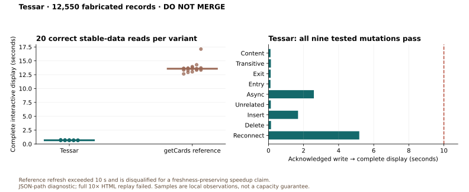

# Tessar performance checkpoint — DO NOT MERGE

Tessar's materialized JSON path passes the tested 10× read, mutation, reconnect,
concurrent-reader and worker-recovery cases. It displays a complete dashboard
without input-card or query-search requests. The equivalent getCards reference
produces correct initial output but fails the fixed write-freshness deadline.
The full 10× HTML pipeline also has a failed render. This is an implementation
checkpoint with measured results, **not a completed, production-ready POC or a
qualified freshness-preserving speedup claim**.

Remaining work includes a controlled 1× reference, increased matching cardinality,
write bursts and multiple writing clients, broader replica/lifecycle coverage,
completion of the application workflows, and the failed 10× HTML path. No
additional AI-generation capacity has been established.

## Contract and measurement correction

Every qualifying display must match independently derived statistics and every
row's membership, order and values. An acknowledged relevant write must reach
the complete view within **10,000 ms**. Pending output hides old results; failed
work must not appear current. Write acknowledgement latency is separate from
acknowledgement-to-display delay. Setup allowances do not extend this deadline.

The original browser harness could accept server HTML before Ember booted.
Historical version 1 browser timings and short graph-request observations are
therefore provisional. The version 2 harness requires a connected realm-event
subscription and removal of server markup, then validates the live DOM. It records
first content separately from interactive readiness. A Chromium regression
reproduces the old false positive and verifies its rejection. Results below use
the corrected gate; raw failures remain retained.

Final review also found that the HTML injection path could serve an older ready
dashboard while JSON was pending. It now checks both materialization readiness
and the HTML revision, suppressing old output for queued/failed writes or delayed
HTML. Realm pages with active materializations use `no-store`; a deployment ETag
cannot bypass those checks. A failing-before/passing-after Postgres regression
covers head and isolated HTML. This guard was added after the matched read series
below and is measured separately as a final validation.

The final guarded build passes another **20/20 connected reads and 9/9 writes**.
Interactive readiness is 800 ms median and 831 ms p95; the longest
acknowledgement-to-display delay is 5,222 ms, for reconnect. It makes zero
input-card/search requests and has zero page errors. This is a separate
regression run, not a new matched comparison with the reference.

## 10× stable-data reads

The fixture contains **12,550 fabricated instances**, seed 1729, distributed over
20 classroom keys with 40 saved views: 130 students, 260 staff, 1,730 slots,
1,640 observations, 440 reports, 630 activities and 7,660 references. The selected
view has 44 displayed rows. All 40 materialized owners pass the complete HTTP
oracle. No production records are inputs. The other presets are smoke (34) and
1× (1,255); 100× is unsupported.

Both variants ran sequentially on the same local runtime and disk-backed
PostgreSQL 16.3 container, with one all-priority worker and one index-only worker.
The machine is an Apple M5, 10 physical cores, 24 GiB RAM. Headless Chromium
149.0.7827.55 used pinned Node 24.17.0, without CPU or network throttling. Other
builds and tests were excluded from these read series. The private application
runtime remained idle during the final candidate series.

Each series has one new-context navigation and 19 reloads in that context.
Reloads recreate the client card store; this is not warm in-memory application
navigation. The database was warm. Variants were switched in place, so process
caches and allocator history were not reset between them. These are local
observations, not isolated-machine capacity estimates.

| Observation                            | Tessar materialized view |             Corrected getCards reference |
| -------------------------------------- | -----------------------: | ---------------------------------------: |
| Complete stable-data displays          |                    20/20 |                                    20/20 |
| Interactive readiness, median          |                   674 ms |                                13,576 ms |
| Interactive readiness, p95             |                   716 ms |                                14,287 ms |
| Input-card/search requests per display |                        0 |                                       86 |
| Total transferred bytes, median        |                7,693,455 |                               25,448,302 |
| Browser task duration, median          |                   308 ms |                                 1,801 ms |
| Browser DOM nodes, median              |                    4,042 |                                   28,703 |
| Browser JS heap, median                |                 78.5 MiB |                                 91.2 MiB |
| Page errors                            |                        0 |                                        0 |
| First content-edit freshness gate      |                     Pass | **Fail: still pending after 10 seconds** |

Transfer counts include application modules, styles and authentication traffic;
they are not just business-data JSON. The candidate's first-content median is
485 ms, distinct from its 674 ms interactive median. CDP task duration includes
the 250 ms post-read observation window. Heap samples depend on garbage
collection: the candidate's maximum sample was 116.5 MiB, above the reference's
91.7 MiB maximum. These samples do not establish a general memory reduction.

Earlier candidate HTTP samples returned approximately 29.7 kB each without
repeating query membership or input assembly. A bare getCards owner HTTP response
does not contain equivalent computed output and cannot be the baseline. The
browser reference pages all matching types in batches of 100 without a fixed
page-count cutoff.

The reference includes explicit pending handling and complete re-querying on
publication/reconnect. It is a **corrected reference**, not an untouched incumbent
page. Both its initial trial and repeated-read series failed the first mutation's
freshness gate. After acknowledgement the browser hid its statistics and issued
35 input/search requests, but had not finished within 10 seconds. The failure
disqualifies an overall speedup claim; it is not removed from a successful
throughput denominator.

## 10× writes and recovery

All nine candidate mutations passed in the already-open connected browser with
zero input-card/search requests. The independent oracle checks full output.

| Synthetic change            | Write acknowledgement | Acknowledgement → complete display |
| --------------------------- | --------------------: | ---------------------------------: |
| Matching content edit       |              2,901 ms |                             117 ms |
| Transitive reference label  |              2,561 ms |                             138 ms |
| Query exit                  |              3,403 ms |                             128 ms |
| Query entry                 |              3,338 ms |                             116 ms |
| Asynchronous source edit    |                 20 ms |                           2,588 ms |
| Unrelated reference edit    |                790 ms |                             134 ms |
| Matching insertion          |                 15 ms |                           1,686 ms |
| Matching deletion           |              2,223 ms |                             145 ms |
| Offline write and reconnect |                 35 ms |                           5,177 ms |

PATCH and DELETE wait for indexing before acknowledgement, so their small
subsequent display delays do not mean cheap writes. Source POSTs acknowledge
queued capture first. The unrelated edit leaves the selected owner's revision
unchanged. Before indexing classifies a change, the client conservatively marks
loaded realm snapshots pending; unrelated writes can still cause cheap owner
revalidation.

Two deterministic worker interruptions passed the full connected-client gate:
before publication recovered in **3,730 ms**, and after durable source publication
in **5,556 ms**, from acknowledgement. Both showed pending with no old statistics,
used a replacement worker to finish the interrupted reservation, and returned
correct HTTP/browser output without graph fetching or page errors. The existing
queue restart mechanism is reused.

Earlier crash trials sometimes missed pending while accepting prerendered HTML.
Those failures remain recorded. The corrected harness and first-sync
reconciliation pass the two tested crash points; this does not prove arbitrary
replica failures or silently lost notifications.

With the final HTML guard, a second test opened a separately authenticated browser
after the source acknowledgement and before the worker crash. Its initial response
had no old statistics and used `no-store`. The existing client recovered in
6,231 ms and the new client in **6,247 ms**, with zero graph requests and page
errors. The post-source-publication crash case also passed again in 6,121 ms.

## Readers during capture

Each row is one approximately 10-second interval with sequential source writes,
simultaneous HTTP readers and one already-open connected browser. Every complete
response passes its full oracle and acknowledged revision floor. All nine writes
across these intervals met the unchanged deadline.

| HTTP readers + one browser | Ready reads | Observed ready reads/s |   Read p95 | Maximum acknowledgement → display |
| -------------------------: | ----------: | ---------------------: | ---------: | --------------------------------: |
|                          1 |         392 |                   37.6 |    11.4 ms |                          2,478 ms |
|                         10 |       1,709 |                  151.7 |    32.7 ms |                          2,839 ms |
|                         50 |       2,292 |                  195.8 | 2,665.7 ms |                          2,833 ms |

There were zero invalid responses and no browser input/search requests. GETs
waiting for indexing account for the long read tail at 50 readers; they remain
in the distribution. Throughput uses the observed elapsed interval, including
draining in-flight work. This is neither a 50-browser simulation nor a sustained
maximum-capacity test. Reference throughput is unqualified because its
single-browser freshness case already fails.

## Cost moved to indexing, and the remaining HTML failure

The 10× source pass indexed every record and materialized all 40 owners with
zero errors. It reported **668,837 ms total**, including **37,329 ms** for one
Tessar materialization wave. Its Tessar publication-swap counter was 20,224 ms;
these counters overlap and must not be added as independent totals.

The following HTML pass exhausted the Node worker heap before its first file.
Prewarming chunked SQL parameters but retained dependency rows for the entire
realm, including millions of repeated dependency strings. The new implementation
processes 250 URLs at a time while preserving complete module coverage.

A read-only probe on the actual synthetic index, with a 512 MiB Node old-space
limit, aborts on the old collector and completes on the bounded collector
(51 reads, approximately 487 MiB maximum RSS). Its module-cache sink is inert:
this isolates collection memory and is not an indexing-throughput comparison.

The subsequent complete HTML replay avoided that heap failure but **still failed**:
one report's embedded render timed out with an unresponsive Chrome main thread.
It reported 12,550 files / 12,549 instances completed and one file / instance
error, after about 44 minutes. Other diagnostics overlapped that replay, so its
elapsed time is not controlled. The read/write benchmarks above cloned the
successful committed JSON index and explicitly skipped replay, recording
`setupMode: committed-json-index-only`. They do not turn this into a successful
full 10× setup.

Earlier retained setup failures include a full 3.9 GiB PostgreSQL tmpfs and a
600-second harness startup timeout. Moving the disposable database to disk and
extending setup allowance did not alter the freshness gate. The existing
dedicated indexing lane prevents a long HTML job occupying the only worker
available for foreground indexing; the harness changes no production defaults.

## Private application proof

Three private-fork definitions project the existing schedule, coverage and
classroom-day models into compact rows and computed statistics. A fresh build
of 153 definitions and 34 fabricated instances completed with **zero source-index
and HTML errors**. HTML-only visits now consume published snapshots; index
discovery and materialization still compute from their inputs.

All three connected browser displays pass exact row/statistic checks with no
input/search requests. Dashboard, schedule and coverage observations were 927,
756 and 878 ms, respectively. These three samples are correctness evidence,
not latency distributions.

| Source change through a feeder | Acknowledgement | Acknowledgement → complete dashboard |
| ------------------------------ | --------------: | -----------------------------------: |
| Capture status                 |           16 ms |                             5,929 ms |
| Distinct report coverage       |           11 ms |                             2,831 ms |
| Uncancelled schedule           |           18 ms |                             2,783 ms |

Every case passed in the open browser and after a reload, hid old rows while
pending, and restored the fabricated input afterward. Explicit drill-down loaded
the selected source record. Portable generator/read/write checks are saved with
the private fork. No deployment realm or shared staging runtime was modified.
Full capture/report-generation UI flows and personal overlays remain to integrate.

## Regression evidence and limits

- Seven focused Tessar browser tests / 80 assertions pass, including empty values,
  no getter/query/input work, nested computeds, edits, monotonic refresh, HTML
  snapshot consumption and first-sync reconciliation.
- Six focused Postgres cases pass: predicate parity, atomic watch/output
  publication, rollback, durable dirty state, generation guards, queued/failed
  writes, module epochs, bounded prewarm and the first-watch registration race.
  The new race test failed before the guard moved ahead of the no-watch fast
  path, then passed. Initial-HTML tests also reject queued/failed or older output.
  These are transaction interleavings, not multi-replica load.
- The existing sliding-sync regression passes four assertions. Earlier unchanged
  computed and index-writer paths passed 15/41 and 56/153 tests/assertions.
- Four generator/browser-oracle tests pass. Host, runtime-common, realm-server
  and harness lint/type checks pass, with two existing host RSVP warnings.
  The three new private views have no parse/type errors; 830 pre-existing errors
  remain among the other private definition files.

The 10× measurements record exact dirty-source and built-host hashes. The
first-watch generation and initial-HTML guards were added after the matched
series and validated by the new Postgres regressions and final 10× browser run.
The private application build also includes the first-watch guard. Historical smoke and 1× results
remain in the sanitized JSON, subject to the old DOM-only qualification and,
for 1×, a different tmpfs storage configuration.

The supported contract is opt-in saved views with same-realm Boxel query ASTs,
`computeVia`, and compact contained rows. Arbitrary iteration of query-backed
card instances can still hydrate their graph. Reverse watches supplement concrete
transitive dependencies and select owners for recomputation; they do not perform
arithmetic delta updates of arbitrary JavaScript. Large matching sets can still
cost heavily at index time. Cross-realm watches and cyclic feeders are outside
this POC.

Browser lifecycle checks use authenticated Matrix sessions. Anonymous published
pages are not validated by this checkpoint and need their own subscription and
freshness contract before enabling materialized views there.

Commands are in `scripts/tessar/README.md`; sanitized observations are in
`tessar-benchmark-results.json`. Large raw logs, traces, generated datasets and
failure diagnostics stay outside Git. The branch and PR remain DO NOT MERGE.
