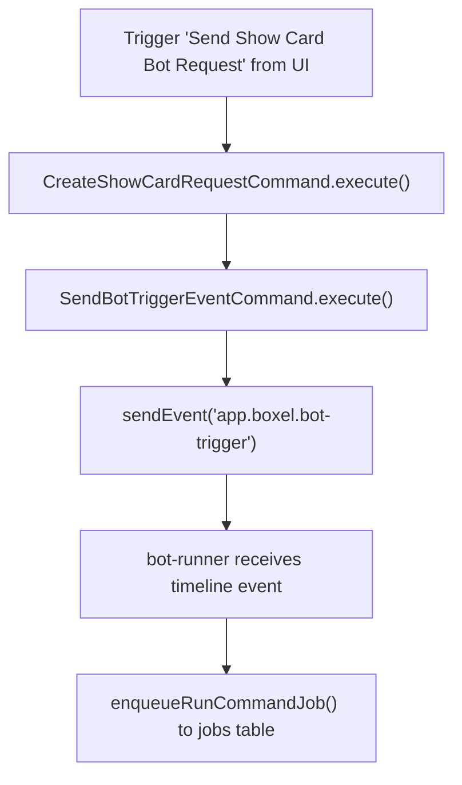

# Bot Runner

This doc describes the bot runner process, how it registers, and how it is invited into AI assistant rooms.

## Overview

The bot runner is a separate Node process that listens to Matrix room events and can enqueue work via the realm server queue.

The bot runner is a valid matrix user and has admin access.

In order to use it, a user must
- invite the bot runner admin to a room
- register the bot via the realm-server bot-registration endpoint
- register bot commands so the bot runner knows what matrix event to listen to and the corresponding command to fire


## How to Run Locally

Environment variables:
- `MATRIX_URL` (default: `http://localhost:8008`)
- `SUBMISSION_BOT_USERNAME` (default: `submissionbot`)
- `SUBMISSION_BOT_PASSWORD` (default: `password`)
- `SUBMISSION_BOT_GITHUB_TOKEN` (required for `pr-listing-create` workaround flow that opens PRs from bot-runner)
- `LOG_LEVELS` (default: `*=info`)
- `SENTRY_DSN` (optional)
- `SENTRY_ENVIRONMENT` (optional, default: `development`)

```
pnpm start:development
```


## Bot Registration

The realm server stores bot registration rows. This does not create a Matrix user; it records the Matrix user ID (e.g. `@user:localhost`, which is also validated against the users table) and assigns a bot registration `id`.

### Register

Register (JSON:API):
- POST `/_bot-registration`
- Body:
  {
    "data": {
      "type": "bot-registration",
      "attributes": {
        "username": "@submissionbot:localhost"
      }
    }
  }
- The request must be authenticated with a realm server JWT.
- The `username` is the Matrix user id and must match the authenticated user id.

### List

List registrations:
- GET `/_bot-registrations`
- Only returns bot registrations for the authenticated user.

### Register via script

Register via script
```sh
REALM_SERVER_URL="http://localhost:4201" \
REALM_SERVER_JWT="..." \
USERNAME="@submissionbot:localhost" \
./packages/realm-server/scripts/register-bot.sh
```

Defaults and requirements:
- `REALM_SERVER_URL` (default: `http://localhost:4201`)
- `REALM_SERVER_JWT` (required)
- `USERNAME` (default: `@user:localhost`, Matrix user id)

### Unregister

Unregister:
- DELETE `/_bot-registration`
- Body:
  {
    "data": {
      "type": "bot-registration",
      "id": "<botRegistrationId>"
    }
  }

## User Issuing Task

Example source is the experiments demo card, but the same flow is used for any `app.boxel.bot-trigger` event.



## Submission Bot Commands (DB)

`setup-submission-bot` writes canonical scoped command specifiers into `bot_commands.command`.

```json
[
  {
    "name": "create-listing-pr",
    "command": "@cardstack/boxel-host/commands/create-listing-pr/default",
    "filter": {
      "type": "matrix-event",
      "event_type": "app.boxel.bot-trigger",
      "content_type": "create-listing-pr"
    }
  },
  {
    "name": "show-card",
    "command": "@cardstack/boxel-host/commands/show-card/default",
    "filter": {
      "type": "matrix-event",
      "event_type": "app.boxel.bot-trigger",
      "content_type": "show-card"
    }
  },
  {
    "name": "patch-card-instance",
    "command": "@cardstack/boxel-host/commands/patch-card-instance/default",
    "filter": {
      "type": "matrix-event",
      "event_type": "app.boxel.bot-trigger",
      "content_type": "patch-card-instance"
    }
  }
]
```
