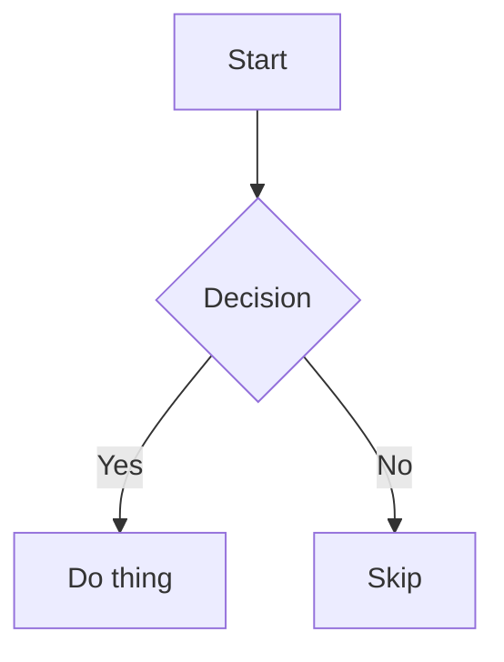

## BFM extensions beyond CommonMark/GFM

In addition to card directives, BFM enables several marked extensions. Anywhere BFM renders, these work:

### Mermaid diagrams

Fenced code blocks tagged `mermaid` render as SVG diagrams (lazily loaded client-side):

```md

```

Server-rendered output emits a `<pre class="mermaid">…source…</pre>` placeholder that the client replaces with rendered SVG on mount. If mermaid fails to parse the source, the placeholder stays visible as plain text — safe but ugly, so validate your diagram syntax.

### Math (KaTeX)

LaTeX-style math via `$...$` (inline) and `$$...$$` (block). Both use KaTeX under the hood.

```md
Inline math: the area is $\pi r^2$ square units.

Block math on its own lines:

$$
E = mc^2
$$
```

Inline rules:
- Must be bounded by `$` or `$$` with no whitespace immediately inside (`$ x $` won't match; `$x$` will)
- Must be followed by whitespace, punctuation, or end-of-string

Block rules:
- Opening `$$` and closing `$$` each on their own line
- Content between on one or more lines

Rendering is lazy: the parser emits a `.math-placeholder` element with the raw LaTeX in `data-math`, and KaTeX is loaded and invoked client-side on mount. Escape a literal `$` in prose as `\$` to prevent it being interpreted as math.

### GFM alerts

Blockquote-based callout syntax:

```md
> [!NOTE]
> Useful information.

> [!TIP]
> Helpful advice.

> [!IMPORTANT]
> Crucial context.

> [!WARNING]
> Caution required.

> [!CAUTION]
> Risk of harm.
```

### Footnotes

```md
Here's a claim.[^1]

[^1]: And here's the backing source.
```

### Syntax-highlighted code blocks

Fenced code blocks with a language tag (e.g. ``` ```ts ```) are highlighted via the Monaco editor's tokenizer when Monaco is available on the page. Falls back to plain `<pre>` when it isn't. The `mermaid` language is special-cased (see above).
