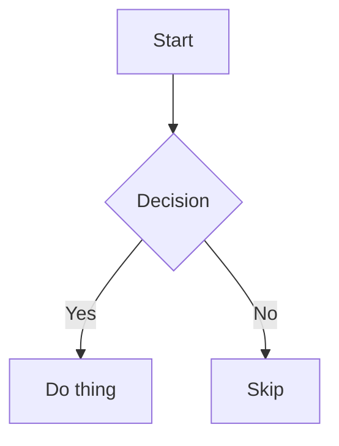

# Boxel Flavored Markdown (BFM)

BFM is the markdown dialect Boxel reads and writes. It extends CommonMark + GitHub Flavored Markdown with:

- Card directives (`:card[URL]`, `::card[URL | spec]`) for embedding cards
- Mermaid diagrams in fenced code blocks
- LaTeX math via `$...$` / `$$...$$` (KaTeX)
- GFM alerts (`> [!NOTE]`, `> [!WARNING]`, etc.)
- Footnotes, extended tables, heading IDs
- Monaco-powered syntax highlighting for fenced code blocks

## Where BFM is used

BFM is the same dialect everywhere Boxel parses or emits markdown:

- `.md` files stored in a realm (rendered by the base realm's MarkdownTemplate)
- `MarkdownField` values (inline markdown stored in a card's JSON)
- AI assistant messages in Boxel
- The `markdown` format output of any card (served via `Accept: text/markdown` or produced by "Copy as Markdown")
- The "Rendered" view of the code-mode markdown preview panel

The same text copies cleanly between these surfaces.

## Base syntax

Standard CommonMark plus GFM. The common subset you can rely on:

- ATX headings (`# H1` … `###### H6`) — marker and text must be on the **same line**. BFM auto-assigns `user-content-*` IDs to headings so they're anchorable.
- Paragraphs, hard breaks (two trailing spaces + `\n`), horizontal rules
- Emphasis (`*em*`, `**strong**`), inline code (`` `x` ``), fenced code blocks
- Lists (bullet `-`/`+`/`*`, ordered `1.` — note `.` not `)`)
- Links `[text](url)` and images ``
- GFM tables (`|`-separated), strikethrough (`~~x~~`), autolinks
- **Extended tables** — column alignment, colspan/rowspan, multi-line cells (via `marked-extended-tables`)

## BFM extensions beyond CommonMark/GFM

In addition to card directives, BFM enables several marked extensions. Anywhere BFM renders, these work:

### Mermaid diagrams

Fenced code blocks tagged `mermaid` render as SVG diagrams (lazily loaded client-side):

````md

````

````

Server-rendered output emits a `<pre class="mermaid">…source…</pre>` placeholder that the client replaces with rendered SVG on mount. If mermaid fails to parse the source, the placeholder stays visible as plain text — safe but ugly, so validate your diagram syntax.

### Math (KaTeX)

LaTeX-style math via `$...$` (inline) and `$$...$$` (block). Both use KaTeX under the hood.

```md
Inline math: the area is $\pi r^2$ square units.

Block math on its own lines:

$$
E = mc^2
$$
````

Inline rules:

- Must be bounded by `$` or `$$` with no whitespace immediately inside (`$ x $` won't match; `$x$` will)
- Must be followed by whitespace, punctuation, or end-of-string

Block rules:

- Opening `$$` and closing `$$` each on their own line
- Content between on one or more lines

Rendering is lazy: the parser emits a `.math-placeholder` element with the raw LaTeX in `data-math`, and KaTeX is loaded and invoked client-side on mount. Escape a literal `$` in prose as `\$` to prevent it being interpreted as math.

### GFM alerts

Blockquote-based callout syntax:

```md
> [!NOTE]
> Useful information.

> [!TIP]
> Helpful advice.

> [!IMPORTANT]
> Crucial context.

> [!WARNING]
> Caution required.

> [!CAUTION]
> Risk of harm.
```

### Footnotes

```md
Here's a claim.[^1]

[^1]: And here's the backing source.
```

### Syntax-highlighted code blocks

Fenced code blocks with a language tag (e.g. ` `ts ```) are highlighted via the Monaco editor's tokenizer when Monaco is available on the page. Falls back to plain `<pre>`when it isn't. The`mermaid` language is special-cased (see above).

## Card directives (the Boxel extension)

Two forms reference a card by its full URL:

### Inline: `:card[URL]`

Renders the target card in **atom** format, inline with surrounding text.

```md
Written by :card[https://my.realm/Author/jane] for the team.
```

Use inline form when the card should flow with the sentence.

### Block: `::card[URL]` or `::card[URL | spec]`

Renders the target card in a block slot, separated from surrounding prose. Default format is **embedded**.

```md
See the latest post:

::card[https://my.realm/BlogPost/first-look]
```

The optional `| spec` after the URL controls size/format. The grammar:

| Spec                            | Meaning                                                            |
| ------------------------------- | ------------------------------------------------------------------ |
| _(no spec)_                     | Default — embedded                                                 |
| `embedded`                      | Embedded format (explicit)                                         |
| `isolated`                      | Isolated format (full detailed view)                               |
| `fitted`                        | Fitted format at its container's natural size                      |
| `fitted <WxH>`                  | Fitted at an exact width × height in px, e.g. `fitted 400x200`     |
| `fitted <named>`                | Fitted at a named size constant, e.g. `fitted strip`               |
| `<WxH>`                         | Bare dimensions (fitted implied), e.g. `400x200`                   |
| `<named>`                       | Bare named constant (fitted implied), e.g. `strip`                 |
| `w:<N> h:<N>` (or either alone) | Explicit width/height in px. Width accepts `%`, e.g. `w:50% h:200` |

**Named size constants** map to preset dimensions:

| Category          | Constants                                                                                                                     |
| ----------------- | ----------------------------------------------------------------------------------------------------------------------------- |
| Shorthand aliases | `strip` (→ `single-strip`, 250×40), `tile` (→ `regular-tile`, 250×170), `grid-tile` (→ `cardsgrid-tile`, 170×250)             |
| Badges            | `small-badge` 150×40, `medium-badge` 150×65, `large-badge` 150×105                                                            |
| Strips            | `single-strip` 250×40, `double-strip` 250×65, `triple-strip` 250×105, `double-wide-strip` 400×65, `triple-wide-strip` 400×105 |
| Tiles             | `small-tile` 150×170, `regular-tile` 250×170, `cardsgrid-tile` 170×250, `tall-tile` 150×275, `large-tile` 250×275             |
| Cards             | `compact-card` 400×170, `full-card` 400×275, `expanded-card` 400×445                                                          |

```md
Featured authors:

::card[https://my.realm/Author/jane | fitted 300x120]
::card[https://my.realm/Author/mohammed | strip]
::card[https://my.realm/Essay/manifesto | isolated]
```

If a spec fails to parse, the renderer emits the directive with no format override, so the card falls back to embedded with no error — validate specs before shipping.

### Unresolved references

If the renderer can't resolve a card URL (deleted, permissions, offline), the directive falls back to a muted pill badge showing the URL. Don't rely on card directives for content that must render without the Boxel runtime — plain markdown links (`[text](url)`) are safe everywhere.

### Inside code blocks

Card directives inside fenced or inline code are **not** converted — they render as literal text. Use this when you need to show directive syntax in documentation.

## Authoring notes

- **Use full URLs in directives**, not relative paths — directives are resolved by the Boxel store, not by the surrounding document's base.
- **Escape user-supplied text** before interpolating it into a BFM string. `[`, `]`, `(`, `)`, `|`, `:`, `#`, `*`, `` ` ``, `_`, `~`, `!`, `<`, `>`, leading `+`/`-`, and line-start `1.` all have meaning. See the `dev-markdown-format` skill for `markdownEscape` and helper functions.
- **Prettier reflows markdown.** When a template's output must preserve column-zero placement (ATX headings, fence columns), protect it with `{{!-- prettier-ignore --}}`.

## Quick reference

````md
# Heading

A paragraph with **bold**, _italic_, `code`, and a [link](https://example.com).

Inline card: :card[https://my.realm/Author/jane]

Block card (embedded default):

::card[https://my.realm/BlogPost/first-look]

Block card with size:

::card[https://my.realm/Author/jane | fitted 300x120]

- bullet
- another

1. ordered
2. another

| col | col |
| --- | --- |
| a   | b   |

Inline math: $\pi r^2$

Block math:

$$
E = mc^2
$$

> [!NOTE]
> GFM alert.

Footnote reference.[^1]

[^1]: And its definition.


````

```ts
// highlighted by Monaco when available
const answer = 42;
```

```

```
