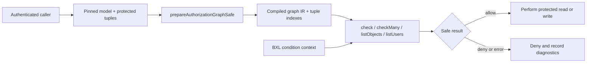

# Authorization kernel compatibility IR

> **Internal surface.** This document describes `bxl-authorization-ir/1`, the
> compatibility representation used by the graph kernel and pinned semantic
> fixtures. Application authors should use
> [`bxl-authorization/1`](./authorization.md), Resource links, Parties, Seats,
> Capabilities, and `prepareBxlAuthorizationSafe`. The encoded identifiers, tuples,
> and userset functions below are not the Boxel authoring language.

BXL Authorization is a synchronous relationship-based authorization extension
for BXL. It answers questions such as:

- Can a maintainer merge changes in Repository A?
- Which patient records may Dr. Rivera read?
- Who may change the pricing assumptions on this insurance policy?
- Which flight plans may this dispatcher edit?

It runs entirely in TypeScript. There is no authorization server call, WASM
module, subprocess, clock, network lookup, or asynchronous adapter in the
decision path.

OpenFGA matters here only because its test corpus supplied a mature semantic
specification. New production code uses the public BXL Authorization surface; this
low-level model remains available for compatibility, debugging, and semantic
conformance. BXL does not accept OpenFGA DSL or CEL at runtime.

## The five ideas to learn first

Relationship authorization becomes much easier when every decision is stated
with five nouns.

| Noun       | Meaning                                              | Example                                |
| ---------- | ---------------------------------------------------- | -------------------------------------- |
| Subject    | The person, service, or group asking                 | `user:maintainer`                      |
| Object     | The thing being protected                            | `repository:repository-a`              |
| Relation   | A stored relationship that may be assigned           | `maintainer`                           |
| Permission | A rule computed from relations and other permissions | `can_merge`                            |
| Tuple      | One stored subject–relation–object fact              | A user is a maintainer of Repository A |

A **check** asks one complete question:

```text
subject:  user:maintainer
relation: can_merge
object:   repository:repository-a
```

The answer is `allow` or `deny`, plus optional work metrics and an explanation
trace.

The distinction between relations and permissions is important:

- A relation is authored data. You may store a tuple saying a user is a
  `maintainer`.
- A permission is a rule. You do not store a tuple saying that user has
  `can_merge`; the kernel derives that answer from the model.

## Read a model in English

This model fragment uses a generalized repository example:

```ts
const model: AuthorizationGraphModel = {
  schema: 'bxl-authorization-ir/1',
  types: {
    user: {},
    repository: {
      relations: {
        administrator: ['user'],
        maintainer: ['user'],
        reviewer: ['user'],
        security_reviewer: ['user'],
      },
      permissions: {
        contributor: 'userset("maintainer") or userset("reviewer")',
        can_view_repository:
          'userset("contributor") or userset("administrator")',
        can_merge: 'userset("maintainer") or userset("administrator")',
        can_publish_release: 'userset("contributor")',
      },
    },
  },
};
```

In English:

- `administrator: ['user']` means a user may be directly
  assigned as a repository administrator.
- `maintainer: ['user']` means a user may be directly
  assigned as a maintainer.
- `contributor` means anyone who is a maintainer **or** reviewer.
- `can_view_repository` means any contributor or administrator.
- `can_merge` is narrower: only a maintainer or administrator.
- `can_publish_release` includes contributors but not administrators merely because
  they are administrators.

That last point is deliberate. Authorization should express the domain rule,
not assume that one impressive-sounding role automatically includes every
permission.

The corresponding tuples are plain data:

```ts
const tuples: RelationshipTuple[] = [
  {
    subject: 'user:User/administrator',
    relation: 'administrator',
    object: 'repository:Repository/repository-a',
  },
  {
    subject: 'user:User/maintainer',
    relation: 'maintainer',
    object: 'repository:Repository/repository-a',
  },
  {
    subject: 'user:User/reviewer',
    relation: 'reviewer',
    object: 'repository:Repository/repository-a',
  },
  {
    subject: 'user:User/security-reviewer',
    relation: 'security_reviewer',
    object: 'repository:Repository/repository-a',
  },
];
```

Identifiers use `type:id`. A subject may also be:

- a userset such as `group:release-reviewers#member`, meaning every member of
  the release-reviewers group;
- a typed wildcard such as `user:*`, meaning every concrete user unless a rule
  subtracts some of them.

## Graph expressions

Most of BXL works over one JSON value. Authorization additionally needs to
follow relationship edges. Four reserved graph calls provide that ability.

| BXL authorization expression         | Meaning                                                                            |
| ------------------------------------ | ---------------------------------------------------------------------------------- |
| `direct()`                           | Read tuples stored directly on this object and relation                            |
| `userset("editor")`                  | Resolve another relation or permission on the same object                          |
| `userset_from("folder"; "can_read")` | Follow the object in the `folder` relation, then resolve its `can_read` permission |
| `except(base; subtract)`             | Everyone in `base` except subjects in `subtract`                                   |

Use BXL `or` and `and` for union and intersection:

```bxl
userset("owner") or userset("editor")
```

```bxl
userset("employee") and userset("assigned_to_case")
```

```bxl
except(
  direct() or userset_from("parent"; "member");
  userset("blocked")
)
```

These calls are not ordinary recursive jq helpers. During preparation, the
authorization compiler validates their literal relation names and lowers them
to a closed relationship-graph intermediate representation. Cycles are
detected and bounded by the kernel instead of becoming general-purpose BXL
recursion.

Userset recursion is implicit in the graph, following Zanzibar and OpenFGA.
When a direct relation tuple names a userset such as `group:change-a-reviewers#member`,
the resolver expands that userset and continues through any nested userset
tuples. The synchronous TypeScript port of OpenFGA's
`breadthFirstRecursiveMatch` traversal handles that expansion. Policy authors
name the relationship; they do not select a traversal algorithm.

Ordinary bounded BXL predicates may be used as leaf rules. Graph rewrites use
the `authorization` execution profile; tuple conditions use the narrower
`policy` profile and therefore cannot invoke graph forms. Volatile,
side-effecting, error-masking,
unbounded, and collection-scanning expressions are rejected before requests
run.

## First complete example

Prepare the model once, then reuse it for many requests:

```ts
import {
  prepareAuthorizationGraphSafe,
  type AuthorizationGraphModel,
  type RelationshipTuple,
} from '@cardstack/bxl';

const model: AuthorizationGraphModel = {
  schema: 'bxl-authorization-ir/1',
  types: {
    user: {},
    group: {
      relations: {
        member: ['user'],
      },
    },
    document: {
      relations: {
        owner: ['user'],
        editor: ['user', 'group#member'],
        blocked: ['user'],
      },
      permissions: {
        can_read:
          'except(userset("owner") or userset("editor"); userset("blocked"))',
        can_edit: 'userset("owner") or userset("editor")',
      },
    },
  },
};

const tuples: RelationshipTuple[] = [
  { subject: 'user:alice', relation: 'owner', object: 'document:budget' },
  {
    subject: 'group:finance#member',
    relation: 'editor',
    object: 'document:budget',
  },
  { subject: 'user:bob', relation: 'member', object: 'group:finance' },
  { subject: 'user:mallory', relation: 'blocked', object: 'document:budget' },
];

const prepared = prepareAuthorizationGraphSafe(model, tuples);
if (!prepared.ok) {
  throw new Error(`${prepared.error.kind}: ${prepared.error.message}`);
}

const decision = prepared.value.check({
  subject: 'user:bob',
  relation: 'can_read',
  object: 'document:budget',
  trace: true,
});

if (!decision.ok) {
  // An invalid model/request or exhausted limit is a deny at an enforcement boundary.
  throw new Error(`${decision.error.kind}: ${decision.error.message}`);
}

decision.value.allowed; // true
decision.value.metrics; // { steps, tupleReads, maxDepth }
decision.value.trace; // ordered relationship-resolution events
```

Why Bob is allowed:

1. `document:budget#can_read` includes `editor`.
2. `group:finance#member` is assigned as an editor of the document.
3. Bob is a member of `group:finance`.
4. Bob is not in the document's `blocked` relation.

The safe API never turns an error into an allow. It returns either
`{ ok: true, value }` or `{ ok: false, error }`. The caller decides how to log
the error, but an enforcement caller should deny.

## What preparation does

`prepareAuthorizationGraphSafe(model, tuples)` is the boundary between model
setup and request-time work.

Preparation performs:

1. Schema and identifier validation.
2. BXL parsing with the bounded `authorization` profile.
3. Graph-call lowering to authorization IR.
4. Relation, permission, and type-edge validation.
5. Condition compilation and parameter validation.
6. Tuple validation and construction of object/relation indexes.

Request-time methods perform no I/O and return synchronously:



Prepare once per model-and-tuple snapshot. Do not rebuild the model for every
check unless you intentionally want cold-path behavior.

## Request APIs

### Check one permission

```ts
const result = prepared.value.check({
  subject: 'user:alice',
  relation: 'can_edit',
  object: 'document:budget',
});
```

Set `trace: true` for an explanation. Keep tracing off on a hot enforcement
path unless the explanation is needed.

### Check a batch

```ts
const results = prepared.value.checkMany([
  { subject: 'user:alice', relation: 'can_read', object: 'document:budget' },
  { subject: 'user:alice', relation: 'can_edit', object: 'document:budget' },
]);
```

`checkMany` preserves request order and returns one safe result per request.

### List objects a subject may access

```ts
const result = prepared.value.listObjects({
  subject: 'user:bob',
  type: 'document',
  relation: 'can_read',
});

if (result.ok) {
  result.value.objects; // ['document:budget', ...]
}
```

`listObjects` enumerates objects known to the prepared tuple snapshot. It is
useful for bounded navigation, test assertions, and candidate filtering. A
large database should still narrow candidates in its query/index layer instead
of asking an in-memory kernel to discover every object in the system.

### List users who have a permission

```ts
const result = prepared.value.listUsers({
  object: 'document:budget',
  relation: 'can_read',
  filters: ['user', 'group#member'],
});
```

Filters declare the subject forms that should be returned. A userset result
such as `group:finance#member` and its expanded concrete users may both be
useful to an administrator inspecting why access exists.

## Conditions and request context

Relationships are often necessary but not sufficient. A clinician may be
assigned to a patient but allowed to use an emergency path only when a trusted
request supplies an incident ticket. A service account may be eligible only
from a known network.

Conditions are BXL expressions over `.context`:

```ts
const conditionalModel: AuthorizationGraphModel = {
  schema: 'bxl-authorization-ir/1',
  conditions: {
    approved_emergency: {
      expression: '.context.breakGlass == true and present(.context.ticketId)',
      parameters: {
        breakGlass: 'bool',
        ticketId: 'string',
      },
    },
    on_hospital_network: {
      expression: 'ip_in_cidr(.context.address; .context.cidr)',
      parameters: {
        address: 'ipaddress',
        cidr: 'string',
      },
    },
  },
  types: {
    clinician: {},
    patient_record: {
      relations: {
        emergency_viewer: {
          subjects: [{ type: 'clinician', condition: 'approved_emergency' }],
        },
        network_viewer: {
          subjects: [{ type: 'clinician', condition: 'on_hospital_network' }],
        },
      },
    },
  },
};
```

A conditioned tuple must name the matching condition:

```ts
const tuples: RelationshipTuple[] = [
  {
    subject: 'clinician:rivera',
    relation: 'emergency_viewer',
    object: 'patient_record:patient-42',
    condition: { name: 'approved_emergency' },
  },
  {
    subject: 'clinician:rivera',
    relation: 'network_viewer',
    object: 'patient_record:patient-42',
    condition: {
      name: 'on_hospital_network',
      context: { cidr: '192.168.0.0/24' },
    },
  },
];
```

The request supplies the remaining trusted facts:

```ts
prepared.value.check({
  subject: 'clinician:rivera',
  relation: 'emergency_viewer',
  object: 'patient_record:patient-42',
  context: {
    breakGlass: true,
    ticketId: 'INC-2048',
  },
});
```

Tuple-bound context overrides request context for the same key. That lets a
protected tuple pin facts such as an approved CIDR or contractual limit so a
caller cannot replace them.

Supported parameter types are `any`, `bool`/`boolean`, `int`/`integer`,
`double`/`number`, `string`, `ipaddress`, and ISO timestamp strings. Missing or
invalid parameters return an error; they do not become truthy by accident.

The host must still audit emergency access. BXL can decide whether the supplied
facts satisfy the rule, but it cannot create the incident, verify the human's
intent, or persist an audit event.

## Contextual tuples

Requests may include temporary relationship facts without changing the
prepared tuple store:

```ts
prepared.value.check({
  subject: 'user:reviewer',
  relation: 'can_read',
  object: 'document:draft',
  contextualTuples: [
    {
      subject: 'user:reviewer',
      relation: 'editor',
      object: 'document:draft',
    },
  ],
});
```

This is useful for a trusted what-if preview or a transaction that has not yet
committed. Contextual tuples are authority-bearing input. Do not accept them
directly from an untrusted client and then treat the answer as enforcement.

## BXL runtime functions

The `authorization` builtin library exposes the same kernel inside a BXL
program:

| Function                                    | Result                                              |
| ------------------------------------------- | --------------------------------------------------- |
| `auth_check(model; tuples; request)`        | Boolean; errors fail closed to `false`              |
| `auth_check_result(model; tuples; request)` | Structured safe result, including traces and errors |
| `auth_list_objects(model; tuples; request)` | Structured `ListObjects` result                     |
| `auth_list_users(model; tuples; request)`   | Structured `ListUsers` result                       |
| `ip_in_cidr(address; cidr)`                 | Boolean IPv4/CIDR condition helper                  |

```ts
import { prepareNativeJq } from '@cardstack/bxl';

const program = prepareNativeJq('auth_check(.model; .tuples; .request)', {
  libraries: ['core', 'authorization'],
  readableSyntax: false,
});

const allowed = program.run({ model, tuples, request }).outputs[0];
```

The direct TypeScript API is preferred for a service that will reuse a prepared
model. The BXL function shape is convenient when authorization is one step in
a larger deterministic expression, but each `auth_*` call prepares the supplied
model and tuples again.

### Using `auth_check` in `computeVia`

The authorization functions are permitted in the `derive` profile, so a realm
can calculate preview evidence:

```ts
@field mayView = contains(BooleanField, {
  computeVia: expression(
    'auth_check(.model; .tuples; .request)',
    {
      libraries: ['core', 'authorization'],
      readableSyntax: false,
    },
  ),
});
```

This does **not** make the computed field an enforcement boundary. A
`computeVia` value may be authored, indexed, cached, serialized, or evaluated
in a client-visible context. It also normally lacks a freshly authenticated
request identity. Use it for playgrounds, policy previews, explanations, and
test evidence. Perform real authorization in a trusted read/write/command path
before protected data or mutation capability is released.

## Relationship authorization and ordinary BXL policy

These solve related but different problems.

| Question                                                                 | Best tool                                               |
| ------------------------------------------------------------------------ | ------------------------------------------------------- |
| Is Alice an editor directly or through a group?                          | Authorization graph                                     |
| Does a repository reviewer inherit repository-view permission?           | Authorization graph                                     |
| Is the bid above the current bid and before the deadline?                | BXL `policy` expression over a trusted request envelope |
| Which fields should an account owner, auditor, or anonymous visitor see? | BXL projection/view expression after authorization      |
| May this write change only the `preferredName` field?                    | BXL `policy` expression over old/new values             |
| Which records match a bounded indexed search predicate?                  | BXL `predicate` profile or host query language          |

A common application flow combines them:

1. The relationship kernel establishes the audience or capability.
2. A BXL policy checks request-local state such as transition shape, amount,
   purpose, or trusted time facts.
3. A BXL view expression projects only the fields that audience may receive.
4. The host performs the read or write atomically and records the decision.

The authorization examples demonstrate the reusable relationship layer in
step 1. Projection, mutation validation, and atomic persistence remain host
responsibilities and are intentionally outside this kernel.

## Domain patterns

The following examples use domains already represented by BXL's committed
example corpus. They are modeling sketches, not universal policy rulings.

### Software release governance

The synthetic release-governance fixture distinguishes organization-wide
release roles from a security reviewer assigned to individual change requests.

```ts
change_request: {
  relations: {
    repository: ['repository'],
    review_team: ['group#member'],
  },
  permissions: {
    viewer: 'userset_from("repository"; "can_view_repository") or userset("review_team")',
    security_reviewer: 'userset("review_team")',
    merger: 'userset_from("repository"; "can_merge")',
  },
}
```

In English:

- A repository contributor may view change requests linked to that repository.
- A security reviewer may review only a change request whose `review_team`
  userset contains that reviewer.
- Merge authority is inherited from the repository's narrower `can_merge`
  permission.

This prevents the tempting but incorrect rule “every security reviewer may
review every change.”

Common checks:

| Question                                            | Subject | Permission          | Object         |
| --------------------------------------------------- | ------- | ------------------- | -------------- |
| May a maintainer merge this change?                 | user    | `merger`            | change request |
| May an assigned reviewer inspect security findings? | user    | `security_reviewer` | change request |
| May a release manager approve a release?            | user    | `approver`          | release        |
| May a contributor view the release dashboard?       | user    | `viewer`            | dashboard      |

### Hospital: care teams, patient self-access, and break glass

The hospital BXL example already models patient records, severity, admission,
and clinical facts. A relationship model can sit in front of those records:

```ts
patient_record: {
  relations: {
    patient: ['patient'],
    attending: ['clinician'],
    care_team: ['care_team#member'],
    emergency_viewer: {
      subjects: [{ type: 'clinician', condition: 'approved_emergency' }],
    },
  },
  permissions: {
    can_read: 'userset("patient") or userset("attending") or userset("care_team") or userset("emergency_viewer")',
    can_update_clinical: 'userset("attending") or userset("care_team")',
  },
}
```

The graph answers who is connected to the record. A separate BXL projection
should still remove staff-only notes from the patient view, and a separate
write policy should restrict which fields each clinician may change.

### Insurance: policyholders, brokers, underwriters, and claims teams

The insurance examples compute premium, loss development, reinsurance, and
profit. Those financial formulas should not imply access by themselves.

```ts
policy: {
  relations: {
    policyholder: ['customer'],
    broker: ['broker'],
    assigned_underwriter: ['employee'],
    claims_team: ['team#member'],
  },
  permissions: {
    can_view: 'userset("policyholder") or userset("broker") or userset("assigned_underwriter") or userset("claims_team")',
    can_edit_pricing: 'userset("assigned_underwriter")',
    can_edit_claims: 'userset("claims_team")',
  },
}
```

Common separation of duties:

- The policyholder and broker may see a mediated policy view.
- The assigned underwriter may change pricing assumptions.
- The claims team may change claim facts but not pricing assumptions.
- A finance or actuarial projection worker can receive an explicitly granted
  service relation rather than borrowing a human role.

### Airline: operations versus profitability

BXL's formula bundles include airline profitability calculations. An airline
authorization layer can separate operational control from financial analysis:

```ts
flight: {
  relations: {
    dispatcher: ['employee'],
    captain: ['employee'],
    crew: ['crew#member'],
    finance_team: ['team#member'],
  },
  permissions: {
    can_view_operations: 'userset("dispatcher") or userset("captain") or userset("crew")',
    can_edit_plan: 'userset("dispatcher") or userset("captain")',
    can_view_profitability: 'userset("dispatcher") or userset("finance_team")',
  },
}
```

Crew access to a flight plan does not automatically grant access to ownership
cost, route margin, or finance scenarios. Conversely, a finance analyst need
not receive operational edit capability.

### Realm collaboration: membership before command policy

The realm-collaboration corpus models auctions, ticketing, trivia, presence,
and ledgers. Those examples already use BXL policy expressions for stateful
questions such as “is the auction open?” and “is this amount above the current
bid?”

Put relationship checks before those rules:

```text
authorization graph:
  Is actor a participant, moderator, or authorized service for this room?

BXL policy envelope:
  Is this command valid for the current state, amount, turn, and trusted time?

host transaction:
  Persist the accepted state and ledger event atomically.
```

This avoids encoding room membership repeatedly in every bid, chat, move, or
trivia expression. It also avoids asking the relationship graph to act like a
state machine.

### Customer accounts and mediated records

Authorization is often only the first question. Anonymous visitors, account
owners, support agents, and auditors may receive different projections of the
same canonical account record after the host has authorized access.

Use the graph to select the audience:

```text
user:me is owner of account:me
group:support#member is support_viewer of account:me
user:auditor is auditor of account:me
```

Then use a BXL view expression to remove or derive fields:

```jq
{
  type: "account-summary",
  id: .record.id,
  attributes: {
    displayName: .record.attributes.displayName,
    plan: .record.attributes.plan,
    status: .record.attributes.status
  }
}
```

Relationship authorization decides **which view contract applies**. The view
expression decides **what data crosses the boundary**.

## Runtime limits and failure behavior

Every request can tighten its work budget:

```ts
prepared.value.check({
  subject: 'user:alice',
  relation: 'can_read',
  object: 'document:budget',
  limits: {
    maxDepth: 12,
    maxSteps: 2_000,
    maxTupleReads: 10_000,
    maxTraceEvents: 100,
  },
});
```

Enumeration also supports `maxCandidates` and `maxResults`.

Default ceilings are intentionally finite:

| Limit                  | Default |
| ---------------------- | ------: |
| Graph depth            |      25 |
| Resolution steps       |  10,000 |
| Tuple reads            | 100,000 |
| Trace events           |   1,000 |
| Enumeration candidates | 100,000 |
| Enumeration results    | 100,000 |

Limit exhaustion returns `evaluation-limit-exceeded` or
`resolution-depth-exceeded`. Other stable error kinds distinguish invalid
models, identifiers, tuples, unknown types/relations, unsafe expressions, and
unsupported expressions.

The enforcement rule is simple:

```ts
const result = prepared.value.check(request);
const allowed = result.ok && result.value.allowed;
```

Do not write `result.ok ? result.value.allowed : true` and do not hide an error
with a permissive fallback.

## Security boundary

The kernel is a decision engine, not a complete access-control system.

| Kernel owns                                 | Trusted host owns                                      |
| ------------------------------------------- | ------------------------------------------------------ |
| Model validation and graph compilation      | Authentication and subject binding                     |
| Tuple validation and indexing               | Protected tuple custody and mutation rules             |
| Synchronous bounded checks                  | Pinning the enacted model/version                      |
| Cycle-safe userset recursion                | Loading authoritative object state                     |
| Conditions over supplied context            | Supplying trusted time, network, and transaction facts |
| Structured errors, metrics, and traces      | Denying on error and writing audit records             |
| ListObjects/ListUsers over known candidates | Database/query planning and pagination                 |

A secure request path should:

1. Authenticate the caller outside BXL.
2. Convert that identity to a canonical subject owned by the host.
3. Load an enacted, version-pinned model and protected tuple snapshot.
4. Prepare or retrieve the cached prepared model.
5. Run the authorization check with bounded trusted context.
6. Deny on `false` **or** any error.
7. Only then return protected data or perform the mutation.
8. Record the model version and decision metadata when the domain requires an
   audit trail.

The browser playgrounds are executable evidence and educational tools. They
are not enforcement because the browser user can inspect or replace everything
in the page.

## What was implemented

The implementation ports OpenFGA's relationship semantics into the synchronous
BXL execution model without porting its production syntax.

Production additions:

- `src/authorization/graph-model.ts` — `bxl-authorization-ir/1` model and tuple types;
- `src/authorization/compiler.ts` — BXL expressions to relationship-graph IR;
- `src/authorization/tuple-index.ts` — validated tuple indexes;
- `src/authorization/resolver.ts` — bounded Check with cycle detection, metrics,
  contextual tuples, and traces;
- `src/authorization/enumerate.ts` — ListObjects and ListUsers;
- `src/authorization/conditions.ts` — typed BXL condition preparation;
- `src/bxl/bridge/authorization-native.ts` — `auth_*` BXL functions;
- eager registration in the realm bundle so synchronous `computeVia` can use
  the library without a dynamic import.

Test and learning surfaces:

- a pinned upstream OpenFGA semantic corpus;
- a test-only OpenFGA DSL/CEL-to-BXL importer;
- zero-skip conformance accounting;
- a synthetic software-release fixture with decision and capability-list
  regression tests;
- a Node benchmark;
- a dark, high-contrast authorization playground;
- a browser conformance observatory that shows upstream YAML, OpenFGA DSL, the
  translated BXL model, all test names, results, and end-to-end timing.

The compatibility claim is semantic:

| Supported behavior                   | Production BXL representation          |
| ------------------------------------ | -------------------------------------- |
| Direct relationship                  | `direct()`                             |
| Computed userset                     | `userset("relation")`                  |
| Tuple-to-userset traversal           | `userset_from("tupleset"; "computed")` |
| Union and intersection               | BXL `or` and `and`                     |
| Difference                           | `except(base; subtract)`               |
| Userset subjects and typed wildcards | `group#member`, `user:*`               |
| Conditions                           | Typed BXL `policy` expressions         |
| Check, ListObjects, ListUsers        | Prepared synchronous APIs              |
| Cycles, limits, invalid inputs       | Fail-closed structured results         |

OpenFGA model DSL, CEL, its server API, storage protocol, and network runtime do
not ship in the production BXL bundle.

## Verification and performance

Run fixture integrity verification:

```sh
npm run fixtures:authorization:verify
```

Run the full semantic gate:

```sh
npm run test:authorization:conformance
```

The pinned corpus at OpenFGA commit
`2c19e265fc73858fc0a5468fc517dc3bbf727e94` contains:

| Operation   | Assertions |
| ----------- | ---------: |
| Check       |        491 |
| ListObjects |        348 |
| ListUsers   |        388 |
| **Total**   |  **1,227** |

The command fails while any assertion is wrong, cannot be imported, is
unsupported, or is omitted from accounting. There is no passing skip category.

Run the focused benchmark:

```sh
npm run bench:authorization
```

It separates cold model preparation from warm Check, CheckMany, ListObjects,
and ListUsers work. Treat benchmark output as a local comparison, not a service
latency promise.

Run the generalized authorization browser playground:

```sh
npm run demo:authorization
```

Run the complete browser conformance observatory:

```sh
npm run demo:authorization-conformance
```

The observatory times the full path in the current browser: YAML parsing,
test-only DSL translation, BXL compilation, tuple indexing, and all 1,227
assertions.

## Modeling guidance

Prefer these patterns:

- Name relations after stable domain relationships: `owner`, `attending`,
  `assigned_underwriter`, `dispatcher`, `member`.
- Name permissions after capabilities: `can_read`, `can_merge`,
  `can_edit_pricing`, `can_publish_release`.
- Model reusable groups as userset subjects such as `team:claims#member`.
- Keep request-local business state in BXL policy expressions, not relationship
  tuples.
- Keep field redaction/projection in view expressions after the relationship
  decision.
- Prepare once and reuse the model for a stable snapshot.
- Keep tuple mutation behind the same or a stricter trusted boundary than the
  protected resource.
- Test meaningful denies, not only successful access.

Avoid these traps:

- Do not store computed permissions as tuples.
- Do not interpret every job title as a global super-role.
- Do not grant a service account a human administrator role for convenience.
- Do not let a client invent contextual tuples or trusted condition context.
- Do not use `computeVia`, a card field, or a browser decision as enforcement.
- Do not prepare the same large model inside every hot check when it can be
  cached by version.
- Do not assume `ListObjects` replaces database indexes or pagination.
- Do not return protected data and then attempt to redact it after the fact.
- Do not permit on parser, model, limit, or runtime errors.

## Choosing the next test

For every permission, start with one expected allow and at least three denies:

1. A subject with the right direct relationship.
2. A similar subject with no relationship.
3. A subject related to the wrong object.
4. A subject with a nearby but insufficient role.

Then add the graph-specific cases your model uses:

- indirect group membership;
- parent-object inheritance;
- intersection where only one side matches;
- exclusion where the subject is explicitly blocked;
- wildcard membership;
- missing and invalid condition context;
- cycle behavior;
- contextual tuple behavior;
- candidate and result limits for enumeration.

This test shape teaches the policy more clearly than a long list of only happy
paths.

## Related documentation

- [`profiles.md`](./profiles.md) explains the bounded `policy`, `predicate`,
  `derive`, and `compute` execution contracts.
- [`realm-collaboration-use-cases.md`](./realm-collaboration-use-cases.md)
  shows stateful gateway policies and durable event patterns.
- [`../tests/authorization/README.md`](../tests/authorization/README.md)
  documents the pinned fixture and zero-skip test contract.
