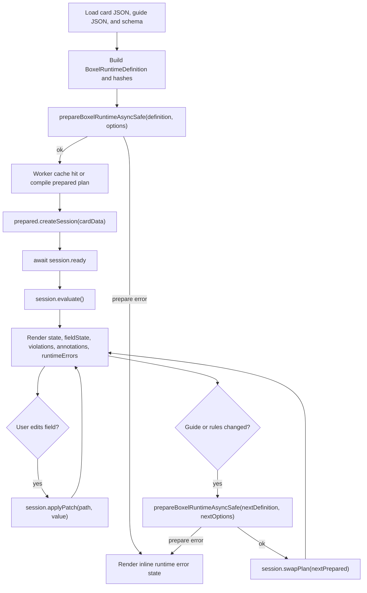

# Browser Runtime Guide

BXL can run directly in the browser for two main cases:

1. Small, local expressions where a component just needs a computed value.
2. Guide- or schema-driven form runtimes where many expressions need shared
   compilation, incremental recompute, and worker offload.

This guide covers both patterns and the APIs that keep browser usage responsive.

## Import Paths

Use the root package for the public browser-safe APIs:

```ts
import {
  evaluateBxl,
  evaluateBxlSafe,
  invalidateBoxelRuntimeAsyncCache,
  prepareBxl,
  prepareBxlSafe,
  prepareBoxelRuntime,
  prepareBoxelRuntimeAsync,
  prepareBoxelRuntimeAsyncSafe,
} from 'bxl';
```

If you want the Boxel runtime surface directly, the package also exports:

```ts
import {
  invalidateBoxelRuntimeAsyncCache,
  prepareBoxelRuntime,
  prepareBoxelRuntimeAsync,
  prepareBoxelRuntimeAsyncSafe,
} from 'bxl/boxel-runtime';
```

## 1. Prepared Expressions For Local UI Logic

Use `prepareBxl()` when the same expression will run more than once. It
compiles readable syntax once, reuses the parsed jq AST, and gives you a cheap
`evaluate()` path.

```ts
import { prepareBxl } from 'bxl';

const prepared = prepareBxl('IF(Recurring, Amount * 12, Amount)', {
  readableSyntax: true,
});

const annualized = prepared.evaluate({
  amount: 250,
  recurring: true,
}).value;
```

Use `evaluateBxl()` only for one-off execution:

```ts
import { evaluateBxl } from 'bxl';

const result = evaluateBxl('Amount * 2', { amount: 40 });
console.log(result.value); // 80
```

### Non-Throwing Variants

If the caller should not throw on bad expressions, use the `*Safe` wrappers.

```ts
import { prepareBxlSafe } from 'bxl';

const prepared = prepareBxlSafe('when(Recurring, )');

if (!prepared.ok) {
  console.error(prepared.error.phase);   // compile | tokenize | parse | evaluate | prepare | runtime | unknown
  console.error(prepared.error.message); // structured message for UI/logging
}
```

All safe APIs return:

```ts
type BxlSafeResult<T> =
  | { ok: true; value: T }
  | {
      ok: false;
      error: {
        phase: string;
        name: string;
        message: string;
        stack?: string;
      };
    };
```

## 2. Boxel Runtime In The Browser

For cards, guides, annotations, suggestions, and formula fields, use the Boxel
runtime APIs instead of evaluating many isolated expressions yourself.

## Browser Application View

From a browser app perspective, BXL should behave like a runtime service with
three phases:

1. Prepare a content-addressed plan for a guide/schema pair.
2. Bind a live session to one card or one mutable form state object.
3. Stream user edits through `applyPatch()` and render the returned result.

The app should treat compilation and recompute as runtime infrastructure, not
something a component does inline during render.

### Main Thread vs Worker

In a browser application, the recommended split is:

- Main thread:
  - fetch card data, guide data, and schema data
  - build the `BoxelRuntimeDefinition`
  - call `prepareBoxelRuntimeAsyncSafe(...)`
  - create sessions, forward input changes, and render results
- Worker:
  - compile the prepared plan
  - cache prepared plans
  - run incremental recompute for sessions

That keeps the UI layer focused on rendering while the worker owns expensive
expression work.

## Runtime Lifecycle

This is the intended runtime flow for a browser-hosted form or card editor:



### Synchronous Prepared Runtime

`prepareBoxelRuntime()` is useful for tests, Node, or very small browser cases.
It prepares a rule set and returns a session API for incremental recompute.

```ts
import { prepareBoxelRuntime } from 'bxl';

const prepared = prepareBoxelRuntime(definition, {
  schema,
});

const session = prepared.createSession(initialCardData);
const first = session.evaluate();
const next = session.applyPatch('.amount', 1200);
```

### Async Runtime With Worker Offload

`prepareBoxelRuntimeAsync()` is the preferred browser path for real UI usage.

When workers are available, it:

- prepares the runtime plan off the main thread
- keeps a worker-owned prepared-plan cache
- reuses that cache across multiple sessions with the same content-addressed
  plan identity
- runs recompute through async sessions

When workers are unavailable, it falls back to a local async wrapper.

```ts
import { prepareBoxelRuntimeAsync } from 'bxl';

const prepared = await prepareBoxelRuntimeAsync(definition, {
  schema,
  guideUrl: 'https://example.com/realms/procurement-guide',
  cacheKey: 'procurement-guide',
});

const session = prepared.createSession(initialCardData);
await session.ready;

const first = await session.evaluate();
const next = await session.applyPatch('.amount', 1200);
```

For guide-authoring or live rule-editing flows, you can prepare a revised plan
and swap the session onto it without dropping the current card source:

```ts
const nextPrepared = await prepareBoxelRuntimeAsync(nextDefinition, {
  schema,
  guideUrl,
  cacheKey: guideUrl,
  contentHash: nextGuideHash,
});

const rebound = await session.swapPlan(nextPrepared);
```

`swapPlan()` keeps the current `session.source`, rebinds the session to the new
prepared runtime, and immediately recomputes the result under the new plan.

## Recommended Application Shape

For a browser app, the cleanest integration is usually a small runtime service
that sits between your data store and your UI components.

```ts
import {
  prepareBoxelRuntimeAsyncSafe,
  type BoxelRuntimeAsyncSession,
  type BoxelRuntimeDefinition,
  type BoxelRuntimeResult,
} from 'bxl';

export class BrowserBxlRuntime {
  #session: BoxelRuntimeAsyncSession | null = null;
  #result: BoxelRuntimeResult | null = null;

  get result() {
    return this.#result;
  }

  async mount(
    definition: BoxelRuntimeDefinition,
    cardData: unknown,
    options: {
      guideUrl?: string;
      guideHash?: string;
      schema?: BoxelRuntimeDefinition['schema'];
    },
  ) {
    const prepared = await prepareBoxelRuntimeAsyncSafe(definition, {
      schema: options.schema,
      guideUrl: options.guideUrl,
      cacheKey: options.guideUrl ?? 'inline-guide',
      contentHash: options.guideHash,
    });

    if (!prepared.ok) {
      return {
        ok: false as const,
        error: prepared.error,
      };
    }

    this.#session = prepared.value.createSession(cardData);
    await this.#session.ready;
    this.#result = await this.#session.evaluate();

    return {
      ok: true as const,
      result: this.#result,
      session: this.#session,
    };
  }

  async update(path: string, value: unknown) {
    if (!this.#session) {
      throw new Error('BXL runtime session is not mounted.');
    }
    this.#result = await this.#session.applyPatch(path, value);
    return this.#result;
  }

  async swap(definition: BoxelRuntimeDefinition, options: {
    guideUrl?: string;
    guideHash?: string;
    schema?: BoxelRuntimeDefinition['schema'];
  }) {
    if (!this.#session) {
      throw new Error('BXL runtime session is not mounted.');
    }

    const prepared = await prepareBoxelRuntimeAsyncSafe(definition, {
      schema: options.schema,
      guideUrl: options.guideUrl,
      cacheKey: options.guideUrl ?? 'inline-guide',
      contentHash: options.guideHash,
    });

    if (!prepared.ok) {
      return {
        ok: false as const,
        error: prepared.error,
      };
    }

    this.#result = await this.#session.swapPlan(prepared.value);
    return {
      ok: true as const,
      result: this.#result,
    };
  }
}
```

The main point is to centralize:

- prepare/cache behavior
- session lifecycle
- patch application
- authoring-time plan swaps
- error handling

That keeps components dumb: they receive a `BoxelRuntimeResult`, render it, and
send edits back as `(path, value)` events.

### Content-Addressed Plan Keys

`prepareBoxelRuntimeAsync()` now resolves the actual prepared-plan cache key
from both stable identity and content:

- `cacheNamespace` comes from `cacheKey ?? guideUrl ?? "inline"`
- `contentHash` comes from the runtime definition and compile options, unless
  you pass one explicitly
- `cacheKey` on the returned prepared runtime is the resolved plan key:
  `boxel-runtime::<cacheNamespace>::<contentHash>`

That means:

- same namespace + same content => cache hit
- same namespace + changed content => new prepared plan
- callers can reuse a stable namespace without pinning stale compiled output

You can inspect those values directly:

```ts
const prepared = await prepareBoxelRuntimeAsync(definition, {
  schema,
  guideUrl,
  cacheKey: 'procurement-guide',
});

console.log(prepared.cacheNamespace); // "procurement-guide"
console.log(prepared.contentHash);    // stable content hash
console.log(prepared.cacheKey);       // resolved content-addressed plan key
```

### Recommended Cache Inputs

In browser apps, do not create a fresh namespace for every render. Reuse a
stable namespace for the same guide family, and let the content hash separate
revisions.

Good namespace/hash inputs:

- guide URL
- guide content hash
- schema hash
- BXL runtime version

Example:

```ts
const prepared = await prepareBoxelRuntimeAsync(definition, {
  schema,
  guideUrl,
  contentHash: guideHash,
  cacheKey: guideUrl,
});
```

If you already have a durable guide identifier, use that as the namespace and
pass the guide hash separately:

```ts
const prepared = await prepareBoxelRuntimeAsync(definition, {
  schema,
  cacheKey: 'procurement-guide',
  contentHash: guideHash,
});
```

### Cache Invalidation

Use `invalidateBoxelRuntimeAsyncCache()` when the browser needs to drop cached
prepared plans explicitly.

```ts
import { invalidateBoxelRuntimeAsyncCache } from 'bxl';

// Drop one exact resolved plan key.
await invalidateBoxelRuntimeAsyncCache(prepared.cacheKey);

// Drop all revisions under one namespace.
await invalidateBoxelRuntimeAsyncCache('procurement-guide');

// Drop every cached async runtime plan.
await invalidateBoxelRuntimeAsyncCache();
```

The argument can be:

- an exact resolved `prepared.cacheKey`
- a stable namespace such as `cacheKey` / `guideUrl`
- omitted, to clear the whole async prepared-plan cache

### Async Safe Variant

Use `prepareBoxelRuntimeAsyncSafe()` when the browser should surface an inline
error state instead of letting a rejected prepare path bubble out.

```ts
import { prepareBoxelRuntimeAsyncSafe } from 'bxl';

const prepared = await prepareBoxelRuntimeAsyncSafe(definition, {
  schema,
  guideUrl,
  cacheKey: guideUrl,
});

if (!prepared.ok) {
  renderRuntimeError(prepared.error);
  return;
}

const session = prepared.value.createSession(initialCardData);
await session.ready;
```

## Browser Usage Rules

### Do

- Prepare expressions once and reuse them.
- Cache Boxel runtimes by stable content identity.
- Use `prepareBoxelRuntimeAsync()` for real browser forms.
- Create one session per live card/input object.
- Use `applyPatch(path, value)` for incremental updates instead of full replace
  when you know the changed root.
- Use the `*Safe` wrappers when broken expressions should become UI state rather
  than exceptions.

### Don’t

- Compile in render.
- Rebuild the runtime on every keystroke.
- Use one-off `evaluateBxl()` calls for every field in a large form.
- Expect yielding alone to fix main-thread stalls if compilation still happens
  on the UI thread.

## Integration Pattern

This is the recommended browser flow for a card or form component:

1. Load the card JSON and guide JSON.
2. Build a `BoxelRuntimeDefinition`.
3. Call `prepareBoxelRuntimeAsync()` once per guide family/version boundary.
4. Create a session for the current card data.
5. On input changes, call `session.applyPatch(path, value)`.
6. Render:
   - `result.state` for computed field values
   - `result.fieldState` for visibility, requiredness, notes, and suggestions
   - `result.violations` for guide constraints
   - `result.annotationCards` for annotation drafts
   - `result.runtimeErrors` for per-rule execution failures

## Common Browser Flows

### Cold Load

Use this when a card or form first opens:

1. Fetch the card data, guide data, and schema.
2. Build `definition`.
3. Resolve a stable namespace and content hash.
4. Call `prepareBoxelRuntimeAsyncSafe(...)`.
5. If prepare succeeds, create a session and evaluate once.
6. Render from `BoxelRuntimeResult`.

### User Typing

Use this for ordinary field edits:

1. Update the local form field value immediately in the UI.
2. Call `session.applyPatch(path, value)`.
3. Re-render from the returned `result`.

Do not rebuild the definition or re-prepare the runtime for ordinary typing.

### Guide Authoring / Rule Editing

Use this when the guide itself changes:

1. Build a revised `definition`.
2. Prepare the revised plan with `prepareBoxelRuntimeAsyncSafe(...)`.
3. If prepare succeeds, call `session.swapPlan(nextPrepared)`.
4. Re-render from the recomputed result.

That preserves the current card data while swapping the compiled rule set.

## Example

```ts
const prepared = await prepareBoxelRuntimeAsyncSafe(definition, {
  schema,
  guideUrl,
  cacheKey: guideUrl,
  contentHash: guideHash,
});

if (!prepared.ok) {
  return {
    type: 'runtime-error',
    error: prepared.error,
  };
}

const session = prepared.value.createSession(cardData);
await session.ready;

let result = await session.evaluate();

async function onFieldChange(path: string, value: unknown) {
  result = await session.applyPatch(path, value);
  render(result);
}
```

## What The Runtime Returns

`BoxelRuntimeResult` contains the browser-facing outputs:

- `state`: computed object state after formula patches
- `fieldState`: per-field labels, visibility, requiredness, suggestions, notes,
  and field-level violations
- `violations`: guide constraint failures
- `annotationCards`: annotation drafts emitted by matching rules
- `runtimeErrors`: execution failures tied to individual rules
- `delta`: changed roots, evaluated rule ids, and evaluated formula patches

That makes it suitable for:

- dynamic constraint evaluation
- computed form fields
- field-level guidance
- browser-side suggestions and annotations
- incremental recompute against mutable card-store state
