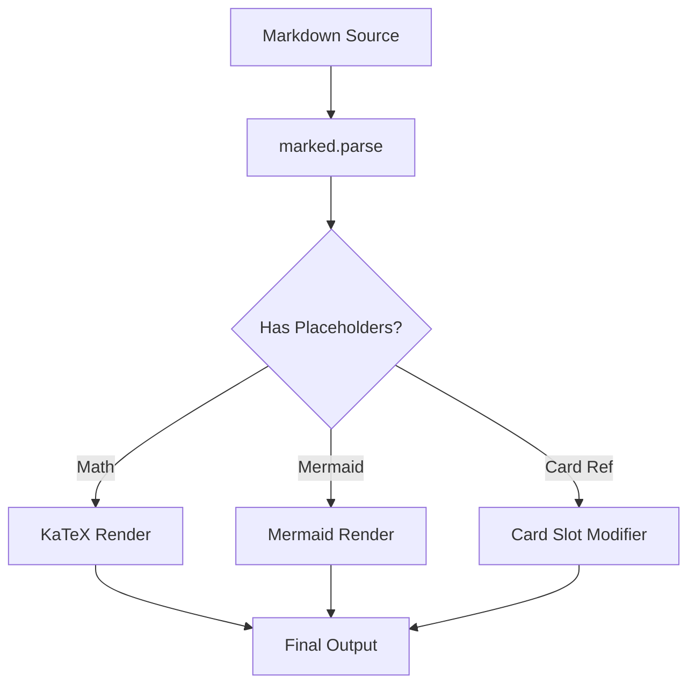
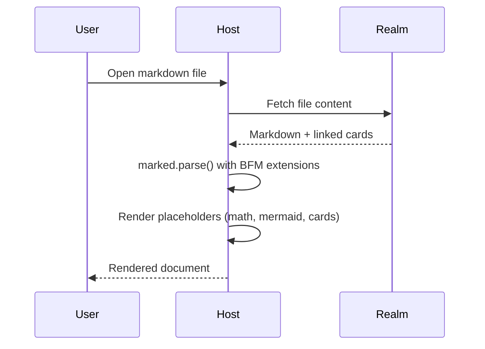

# BFM Showcase

This document exercises the Boxel Flavored Markdown features added in the Layer 3 extensions.

## Card References

Inline reference to an author: :card[./Author/alice-enwunder] — renders in atom format.

Block reference renders in embedded format:

::card[./Author/jane-doe]

### Fitted Sizes

A card rendered as a strip (250 x 40):

::card[./Author/jane-doe | strip]

A double-wide-strip (400 x 65):

::card[./Author/jane-doe | double-wide-strip]

A tile (250 x 170, the default fitted size):

::card[./Author/jane-doe | tile]

A compact-card (400 x 170):

::card[./Author/jane-doe | compact-card]

### Custom Dimensions

Exact dimensions using WxH syntax (300 x 150):

::card[./Author/jane-doe | 300x150]

Height-only constraint (width fills container):

::card[./Author/jane-doe | h:200]

Percentage width (50%, auto height):

::card[./Author/jane-doe | w:50%]

### Isolated Format

::card[./Author/jane-doe | isolated]

## File References

`FileDef` instances embed with the `:file` keyword. Inline references render in atom format; block references render in embedded format.

Inline file reference to an image: :file[./test-images/red-mango.jpg] — renders in atom format.

A block image reference renders in embedded format:

::file[./test-images/green-mango.png]

A CSV data file:

::file[./sample-data.csv]

A linked markdown document:

::file[./FileLinksExample/mango-news.md]

## GFM Alerts

> [!NOTE]
> This is a note callout. Use it to highlight important information.

> [!WARNING]
> This is a warning. Be careful when editing production data.

> [!TIP]
> You can nest **bold**, _italic_, and `code` inside alerts.

## Math / LaTeX

The quadratic formula is $x = \frac{-b \pm \sqrt{b^2 - 4ac}}{2a}$ and appears inline.

Euler's identity in a display block:

$$
e^{i\pi} + 1 = 0
$$

A summation:

$$
\sum_{n=1}^{\infty} \frac{1}{n^2} = \frac{\pi^2}{6}
$$

## Mermaid Diagrams



A sequence diagram:



## Footnotes

Boxel Flavored Markdown[^1] extends standard GFM with additional features for rich document rendering.

The math rendering uses KaTeX[^2] for typesetting, while diagrams use Mermaid.js[^3].

[^1]: BFM is documented at [bfm.boxel.site](https://bfm.boxel.site/).

[^2]: KaTeX is a fast math typesetting library for the web.

[^3]: Mermaid lets you create diagrams using a markdown-like syntax.

## Extended Tables

| Feature          | Status      | Bundle Impact       |
| ---------------- | ----------- | ------------------- |
| GFM Alerts       | Static HTML | None                |
| Heading IDs      | Static HTML | None                |
| Footnotes        | Static HTML | None                |
| Extended Tables  | Static HTML | None                |
| Math / LaTeX     |             | Lazy KaTeX (~268KB) |
| Mermaid Diagrams |             | Lazy Mermaid (~2MB) |

## Heading IDs

Each heading on this page has an auto-generated slug ID (inspect the DOM to see `id="bfm-showcase"`, `id="math--latex"`, etc.). These enable anchor links and table-of-contents navigation.

## Code Blocks

Standard fenced code blocks still work as expected:

```typescript
import { marked } from 'marked';
import { markedKatexPlaceholder } from './bfm-math';

marked.use(markedKatexPlaceholder());

const html = marked.parse('The formula $E = mc^2$ is famous.');
```
