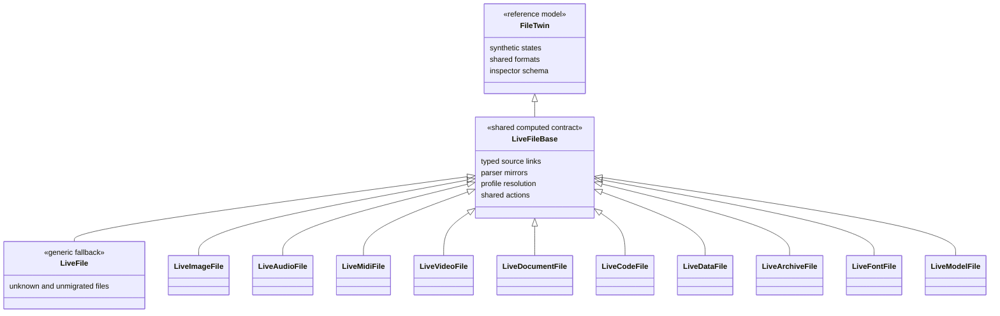
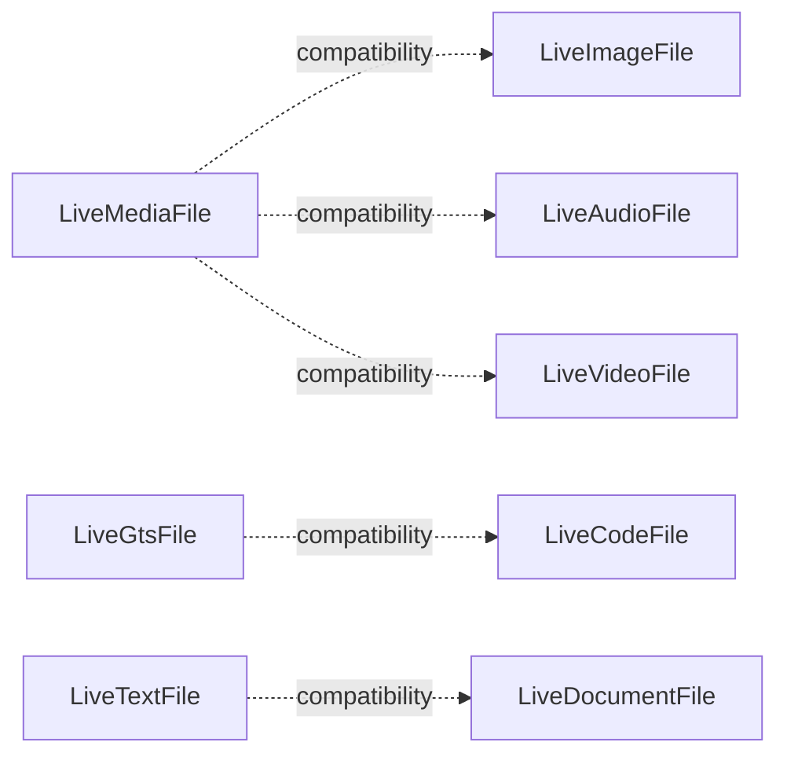
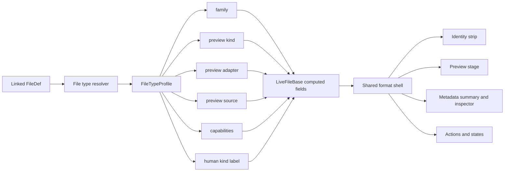
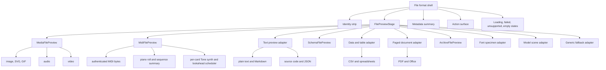
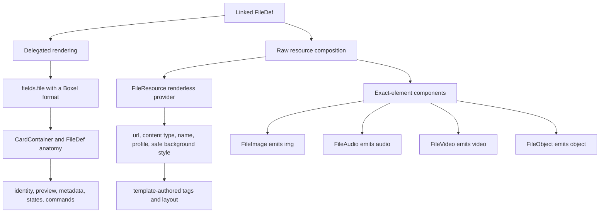
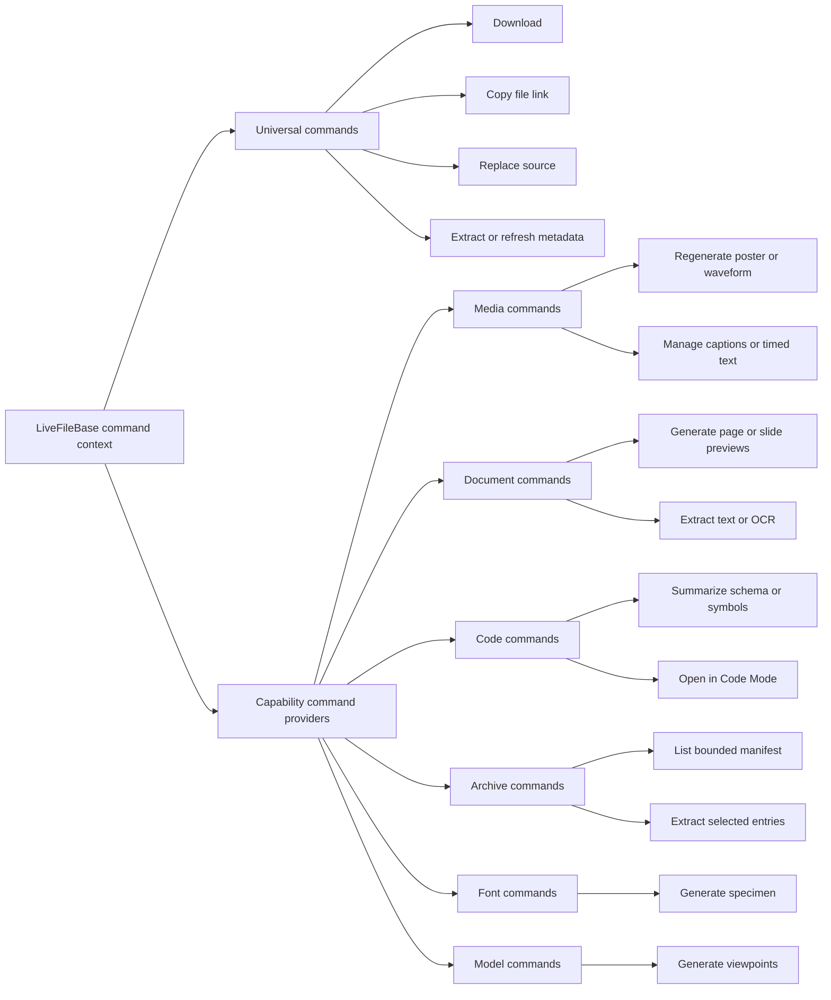
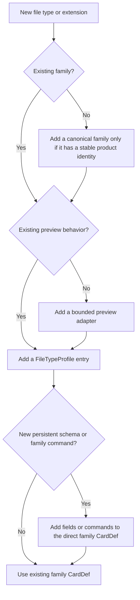
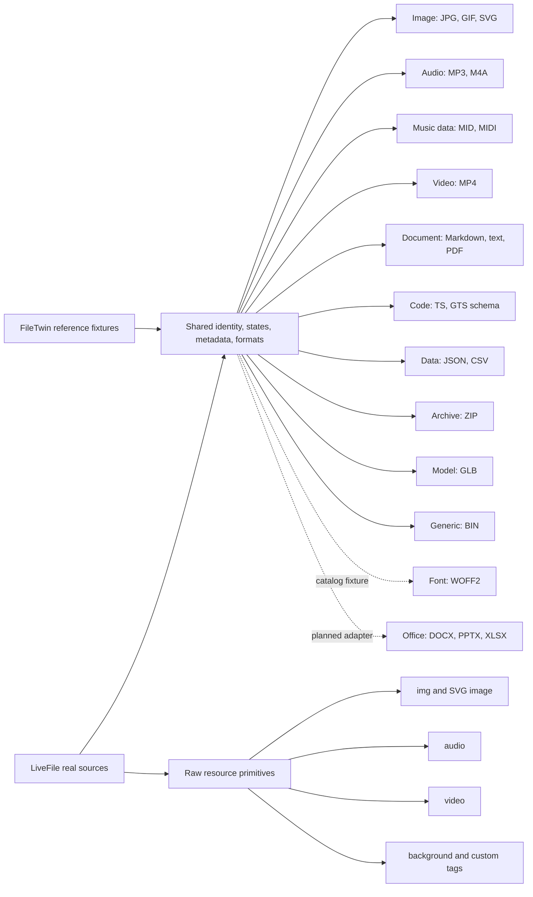

# FileDef taxonomy and composition architecture

> Decision record for the FileTwin reference model and the LiveFile implementation family.

## Decision

Use a **composition-first hybrid**:

- Keep inheritance shallow and semantic: one shared `LiveFileBase`, then direct family CardDefs used for search, schema, and family-owned commands.
- Do not create a CardDef subclass for every extension.
- Resolve extension and MIME differences through a declarative file-type profile.
- Compose rendering from preview adapters and capabilities.
- Expose a second, wrapper-free resource API for templates that need the file URL rather than delegated card rendering.
- Add a deeper subclass only when a file family gains persistent schema or commands that truly apply to every member of that subclass.

This separates three questions that should not be forced into one class tree:

1. **What is it?** Image, audio, video, document, code, data, archive, font, model, or generic.
2. **How can Boxel preview it?** Native media, bounded text, schema summary, table, paged document, manifest, specimen, scene, or fallback.
3. **What can Boxel do with it?** Play, paginate, inspect a manifest, edit native metadata, extract a schema, regenerate a preview, or only download/replace it.

## 1. Canonical CardDef inheritance

The CardDef hierarchy is deliberately shallow. Family CardDefs are direct children of `LiveFileBase`; they are not chained through broad technical superclasses such as `LiveMediaFile`.



`FileTwin` remains the art-directed reference and state laboratory. `LiveFileBase` adapts real FileDef parser output to that contract. Canonical family CardDefs exist only where a stable product family needs a searchable type and a future home for family schema or commands.

### Compatibility aliases

The first migration introduced `LiveMediaFile`, `LiveGtsFile`, and `LiveTextFile`. They remain temporarily as compatibility aliases while instances move to the canonical family types.



These dotted relationships describe migration targets, not multiple inheritance. Compatibility classes still extend `LiveFileBase` directly so the canonical hierarchy does not acquire legacy depth.

## 2. Orthogonal type-profile composition

A `FileTypeProfile` is selected from MIME type first and extension second. It describes behavior; it is not another CardDef.



The profile axes are intentionally independent. For example:

| File | Family | Preview adapter | Important capabilities |
| --- | --- | --- | --- |
| `photo.jpg` | image | media | native preview, dimensions, embedded metadata |
| `loop.gif` | image | media | native preview, dimensions, animation |
| `episode.m4a` | audio | media | playback, duration, timed text, native tags |
| `beat.mid` | music | midi | authenticated parse, sequence, synthesis, tracks, tempo |
| `tour.mp4` | video | media | playback, duration, dimensions, timed text, poster set |
| `brief.md` | document | text | rich text, frontmatter, references, source editing |
| `profile.gts` | code | schema | text, syntax, symbols, CardDef schema |
| `rows.csv` | data | table | structured rows, columns, diagnostics |
| `report.pdf` | document | paged | pages, searchable text, thumbnail set |
| `slides.pptx` | document | paged | generated previews, slides, notes |
| `model.xlsx` | data | table | sheets, formulas, charts, generated previews |
| `brand.zip` | archive | archive | bounded manifest, compression, encryption warning |
| `font.woff2` | font | font | specimen, axes, glyph coverage |
| `chair.glb` | model | model | scene, viewpoints, geometry, materials |
| `firmware.bin` | generic | fallback | download, replace, checksum |

The table demonstrates why a single inheritance tree cannot express the system accurately. Family, renderer, and capability overlap but are not equivalent.

## 3. Preview component composition

All formats retain the shared FileTwin anatomy. Only the bounded content inside the preview stage varies.



### Progressive renderer providers

The adapter is the stable boundary; renderer engines are replaceable providers behind it. Heavy engines load only when their adapter is present, and every adapter retains a bounded fallback so fitted boards never depend on a WebGL, PDF worker, or table runtime.

```mermaid
flowchart LR
    PS[FilePreviewStage] --> DA{Adapter}

    DA -->|document + PDF| PD[DocumentFilePreview]
    DA -->|data + CSV/sheet| DT[DataFilePreview]
    DA -->|model + GLB/glTF| MO[ModelFilePreview]
    DA -->|music + MID/MIDI| MI[MidiFilePreview]

    PD --> PF[Authenticated byte fetch]
    PF --> PJ[PDF.js 3.11.174]
    PJ --> PC[Canvas page + pagination]

    DT --> BP[Bounded delimiter parser]
    BP --> SG[Lazy Surfaces Grid]
    BP --> ST[Static fitted table]

    MO --> MF[Authenticated byte fetch]
    MF --> TH[Three.js + GLTFLoader]
    TH --> WC[WebGL canvas + OrbitControls]

    MI --> MB[Authenticated byte fetch + MThd validation]
    MB --> MX[@tonejs/midi parser]
    MX --> MS[Bounded piano roll + track facts]
    MB --> SS[SpessaSynth 4.3.10 sequencer]
    SF[Trimmed GeneralUser GS SF3] --> SS
    SS --> WA[AudioWorklet on user gesture]
    SS -. unavailable .-> OS[Bounded Web Audio fallback]

    PD -. unavailable .-> FB[Honest fallback]
    DT -. unavailable .-> FB
    MO -. unavailable .-> FB
    MI -. unavailable .-> FB
```

| Adapter | Provider | Isolated / embedded | Fitted | Source and portability |
| --- | --- | --- | --- | --- |
| PDF | PDF.js `3.11.174` | Real paged canvas with previous/next controls | First-page bounded canvas | Pinned cdnjs script + worker; authenticated `fetch → Uint8Array` avoids protected-realm range failures |
| CSV / table | Boxel Surfaces Grid | Read-only TanStack-backed grid, sticky headers, horizontal overflow, bounded rows | Lightweight semantic grid | `ctse/common-libs/surfaces`; lazily imported so the 928 KB grid bundle is absent from unrelated fitted cards |
| GLB | Three.js `0.160.0` | WebGL scene with orbit/zoom | Low-DPR passive scene | Pinned `esm.sh` modules; authenticated `fetch → GLTFLoader.parse`; full GPU/control/RAF cleanup |
| MIDI | `@tonejs/midi` `2.0.28` + SpessaSynth `4.3.10` | Piano roll, facts, play/pause/seek with sampled General MIDI | Bounded piano-roll summary | Realm-local engine + matching AudioWorklet + byte-perfect trimmed GeneralUser GS SF3; authenticated MIDI fetch; bounded oscillator fallback only when the SoundFont engine is unavailable |

The current 3D provider guarantees self-contained `.glb`. A `.gltf` document with external buffers or textures needs an authenticated dependency-aware `LoadingManager`; until that exists it must fall back rather than partially render. XLSX likewise remains a generated/extracted rendition: the realm cache contains a strong spreadsheet control but no genuine workbook parser. The taxonomy advertises table behavior only after rows have been extracted.

Adapter selection comes from the type profile. A new extension that behaves like an existing type needs only a registry entry. A new adapter is warranted only when the user job or rendering behavior is materially different.

### Catalog reuse boundary

The catalog is an origin for reusable presentation components, not the owner of File Twin resource acquisition. Its Audio field contributes waveform, time, volume, mini-player, album-cover, playlist, and trim-editor ideas. File Twin keeps its authenticated realm fetch/blob layer because the catalog player's direct URL loading cannot reliably carry protected-realm credentials. Presentational components can be imported when their argument contract is resource-agnostic; fetch, persistence, and command behavior remain local capability providers.

The same rule applies to the catalog's image-source, featured-image, and aspect-ratio controls: reuse URL resolution and framing concepts, but keep one canonical FileDef link and do not duplicate the file inside a contained catalog field.

MIDI makes the three-stage provider boundary explicit:

1. An authenticated resource loader acquires and validates bytes.
2. `@tonejs/midi` parses an ephemeral symbolic projection; it never receives the URL and nothing is persisted as base64.
3. `MidiFilePreview` renders facts and the piano roll while SpessaSynth owns sequencing, controllers, program changes, channel 10 percussion, and sampled playback.
4. The SpessaSynth browser bundle and AudioWorklet are pinned together at `4.3.10`. The GeneralUser GS bank is trimmed to the sample's used presets and key/velocity ranges, keeping authentic timbres under the realm's binary size ceiling.
5. The previous bounded oscillator engine remains an explicit failure fallback; it is never presented as General MIDI playback.

### Two rendering paths: delegated card or raw resource

A linked FileDef has two legitimate consumers. Product surfaces usually want the complete FileDef experience: Boxel delegates a format, owns CardContainer boundaries, and preserves shared identity, metadata, states, and commands. Template authors sometimes want the underlying HTTP resource instead: an image inside a custom hero, audio or video inside a bespoke player, an SVG referenced by an `<image>` element, or a URL used as a CSS background.

These are separate APIs. Raw-resource components never impersonate a card format and never add CardContainer chrome.



`FileResource` is headless: it yields values and emits no element. The exact-element components emit only their named native element, spread `...attributes`, and contribute no class, style, metadata row, action, or wrapper. Audio and video accept a default block for author-owned `<source>` and `<track>` children, including source-only use with no component-level `@src`. Resolution follows one rule everywhere: explicit `@src` or `@url`, then the FileDef's `url`, then its card URL, then `sourceUrl` as a final fallback. Missing media URLs are omitted as attributes; they never become `src=""` or `data=""`.

```gts
import {
  FileAudio,
  FileImage,
  FileResource,
  FileVideo,
} from './file-resource-components';

<FileImage
  @file={{@model.heroImage}}
  @alt={{@model.heroAlt}}
  class='hero__image'
  loading='eager'
/>

<FileResource @file={{@model.heroImage}} as |resource|>
  <section class='hero' style={{resource.backgroundStyle}}>
    <h1>{{@model.title}}</h1>
  </section>
</FileResource>

<FileVideo @file={{@model.demoVideo}} @controls={{true}} @playsInline={{true}} class='demo-player'>
  <track kind='captions' src={{@model.captions.url}} srclang='en' />
</FileVideo>

<FileResource @file={{@model.logo}} as |resource|>
  <svg viewBox='0 0 200 80' role='img' aria-label='Brand mark'>
    <image href={{resource.url}} width='200' height='80' />
  </svg>
</FileResource>

<FileAudio @file={{@model.soundtrack}} @controls={{true}} @preload='metadata' />
```

SVG remains a resource, not trusted template source. Use `FileImage` for the safe image behavior, `FileObject` when document-style SVG behavior is required, or `FileResource` with a caller-authored SVG `<image>` tag. The component layer does not fetch and inject arbitrary SVG markup because scripts, external references, IDs, and CSS require an explicit sanitization policy.

The ownership rule is simple:

- **Delegate the FileDef** when the file should behave like a Boxel object with shared anatomy and commands.
- **Use an exact-element component** when the parent owns layout but a conventional native element is sufficient.
- **Use `FileResource`** when the parent owns both markup and layout, including backgrounds, `<picture>/<source>`, custom players, canvas, WebGL, or SVG references.
- **Do not nest delegated fitted rendering inside bespoke media markup.** It imports container chrome and an extra layout contract that the parent did not ask for.

## 4. Command composition and ownership

Commands follow the same rule: universal file actions live on the base; specialized commands are contributed by a family or capability and receive a shared file context.



Family CardDefs should not copy universal commands. A specialized command should be introduced only when its input, side effect, or authorization differs from the universal file contract.

## 5. How to extend the system



Practical rules:

- **New extension, same behavior:** add one profile entry.
- **New MIME alias:** add routing to an existing profile.
- **New rendering behavior:** add a preview adapter and profile key.
- **New extracted metadata shape:** add a typed contained FieldDef; do not create an extension-specific CardDef.
- **New safe write behavior:** add a capability command backed by a codec.
- **New searchable product family:** add one direct `LiveFileBase` subclass.
- **Unknown or malformed content:** fall back to `LiveFile`; never fail identity, download, replace, or diagnostics.

## 6. Current FileTwin and LiveFile coverage



The synthetic FileTwin fixtures remain valuable for states that cannot be reliably induced from real files: queued, generating, stale, failed, unsupported, malformed, and empty. LiveFile cards prove parser and binary behavior against actual realm files. Both feed the same presentation contract and component system.

## 7. Invariants

1. The filename, extension, and type signal survive every format and preview failure.
2. A preview adapter is bounded and cannot redefine the outer card anatomy.
3. Family CardDefs extend `LiveFileBase` directly.
4. Extensions do not create subclasses by default.
5. Capability checks determine available commands; nominal type alone is insufficient.
6. Native metadata editing requires a safe round-trip codec and rewrites the actual file.
7. Generated preview bytes are separate realm files; a wrapping business CardDef owns durable rendition graphs.
8. `LiveFile` remains the compatibility and unknown-file fallback.
9. Raw-resource primitives add no wrapper, CardContainer, styling, metadata, or commands.
10. A template author chooses exactly one owner for media layout: the delegated FileDef or the parent template.
