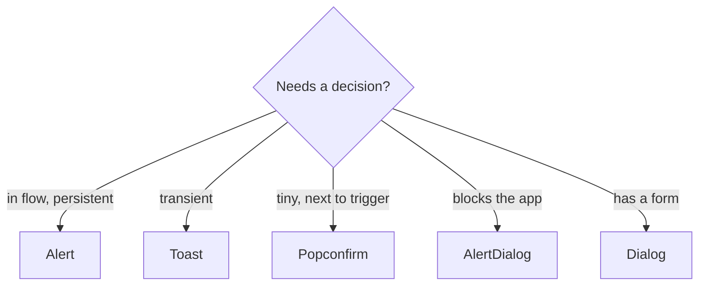

## What it is

A **decision**, not a notification. The user must confirm or cancel before the app continues: delete a record, overwrite a file, leave a dirty form. It is a **Dialog** with a locked contract: a question, its consequence, Cancel and Confirm. Confirm defaults to `@tone='danger'`, because the pattern exists for destructive actions.

If the question is tiny and can sit next to its trigger, use **Popconfirm**. If the message informs rather than asks, and stays in flow, use **Alert**. If it is transient, **Toast**. If the answer needs a form, it is a **Dialog**, not an AlertDialog.



## The contract

```
@open?, @defaultOpen?, @onOpenChange?
@title?, @description?
@confirmLabel? ('Continue'), @cancelLabel? ('Cancel')
@tone? (default 'danger' — the confirm button's tone)
@busy?, @size? ('s' | 'm' | 'l'), @dismissOnEscape? (default true)
@onConfirm?, @onCancel?
<:trigger as |open toggle|>   — renders the opener, uncontrolled
<:header>                     — replaces @title with markup
<:default>                    — replaces @description with markup
<:footer as |confirm cancel|> — replaces the Cancel / Confirm pair
Element: HTMLDialogElement
```

**Controlled or not.** Pass `@open` and it is controlled. Omit it and `@defaultOpen` sets the starting state, with `<:trigger>` toggling it. `@onOpenChange` fires on every transition either way.

**An outside click never answers.** Dialog's one dismissible flag covers both the scrim and Escape, so AlertDialog turns it off and handles Escape itself. It listens in the capture phase and only while open, so one keypress cannot also reach a host shortcut. `@dismissOnEscape={{false}}` removes even that, leaving the two buttons as the only way out. Outside-click dismissal is not a knob.

**Confirm can wait for the work.** Confirm calls `@onConfirm` and closes, unless `@busy` is true once the handler returns. Then the dialog stays open and the confirm button goes pending through Button's own `@busy`: a spinner, `aria-busy="true"` and `aria-disabled`, never the native `disabled` attribute, so focus stays on it. A second activation while busy is ignored. When the caller clears `@busy` it closes the dialog through `@open` (or `@onOpenChange`), or leaves it open to report a failure in place.

Cancel calls `@onCancel`, then closes. A platform-level close routes through the same path.

## Prior art

**shadcn AlertDialog** is Radix AlertDialog: Root / Trigger / Portal / Overlay / Content, plus Header / Footer / Title / Description / Action / Cancel, with Content `size` `default | sm`. **Ant `Modal.confirm`** is imperative: `Modal.confirm({ title, onOk })`, and agents will emit that shape. **MUI** composes a plain Dialog with `aria-labelledby`. **React Spectrum** `AlertDialog` has a `variant` and focuses the primary button.

Where Pretui is better: **a failed confirm has somewhere to go.** Radix's `AlertDialogAction` closes the dialog on click whether or not the work succeeded. `@busy` holds it open with the button pending and still focused, so the result can be announced where the user is looking. **Focus lands on Cancel** with no script: Cancel is first in DOM order, and the native `<dialog>` focusing steps pick the first focusable. Spectrum focuses the destructive button, and that is the wrong default for this pattern.

Where it is thinner: **no imperative helper.** There is no promise-returning `confirm()` for the Ant shape. The caller renders the component and wires `@open`. **No media slot** for an icon or illustration beside the question.

## Accessibility

APG **Alert and Message Dialogs**. The element is the native `<dialog>` opened modally, with `role="alertdialog"`, `aria-labelledby` on the question and `aria-describedby` on the consequence. The ids are generated per instance, and the tests assert all three.

- **Initial focus is Cancel**, the least destructive choice. That comes from the native focusing steps, and the tests assert the precondition: Cancel is the first button in the dialog, Confirm the second.
- **Escape cancels, never confirms.** An outside click does nothing. The tests assert both.
- **Pending is announced, not disabled.** `aria-busy="true"` keeps the confirm button in the accessibility tree and focused while the work runs. The tests assert it carries `aria-busy`, is not natively disabled, and ignores a second activation.
- **The labels are the caller's job.** "Continue" is a weak default for a destructive action. Say what happens (`@confirmLabel='Delete project'`), and put the consequence in `@description`, which becomes the accessible description.
- **A custom `<:footer>` gives up the defaults.** Keep Cancel first in DOM order if you want the focus behaviour.

## Theming

AlertDialog adds no tokens of its own. It wears **Dialog**'s: `--card`, `--foreground`, `--muted-foreground`, `--border`, `--radius-surface`, `--pretui-shadow-overlay`, `--pretui-overlay-scrim`, `--text-heading`, `--weight-heading`, `--track-heading`, `--text-body`, `--leading-body`, `--space-3`, `--space-4` and `--space-6`. The buttons are **Button**'s: the confirm tone reads `--destructive` / `--destructive-foreground` for `danger`, and `--pretui-button-*` for size and shape.

A season that retunes Dialog and Button retunes every AlertDialog with them. The Cancel-then-Confirm order and the outlined-then-accent pairing are fixed.

The styles sit in `@layer PretComponent`, so a caller's unlayered CSS overrides them without a more specific selector.

## React ecosystem

| Agent types                         | Give them                                   |
| ----------------------------------- | ------------------------------------------- |
| `<AlertDialog open onOpenChange>`   | `@open` / `@onOpenChange`                   |
| AlertDialogTitle / Description      | `@title` / `@description`, or the blocks    |
| AlertDialogAction / Cancel          | the default footer, or `<:footer>`          |
| `variant="destructive"`             | `@tone='danger'` (the default)              |
| Ant `onOk` / `onCancel`, `okText`   | `@onConfirm` / `@onCancel`, `@confirmLabel` |
| `Modal.confirm({...})` (imperative) | render the component; no helper             |
