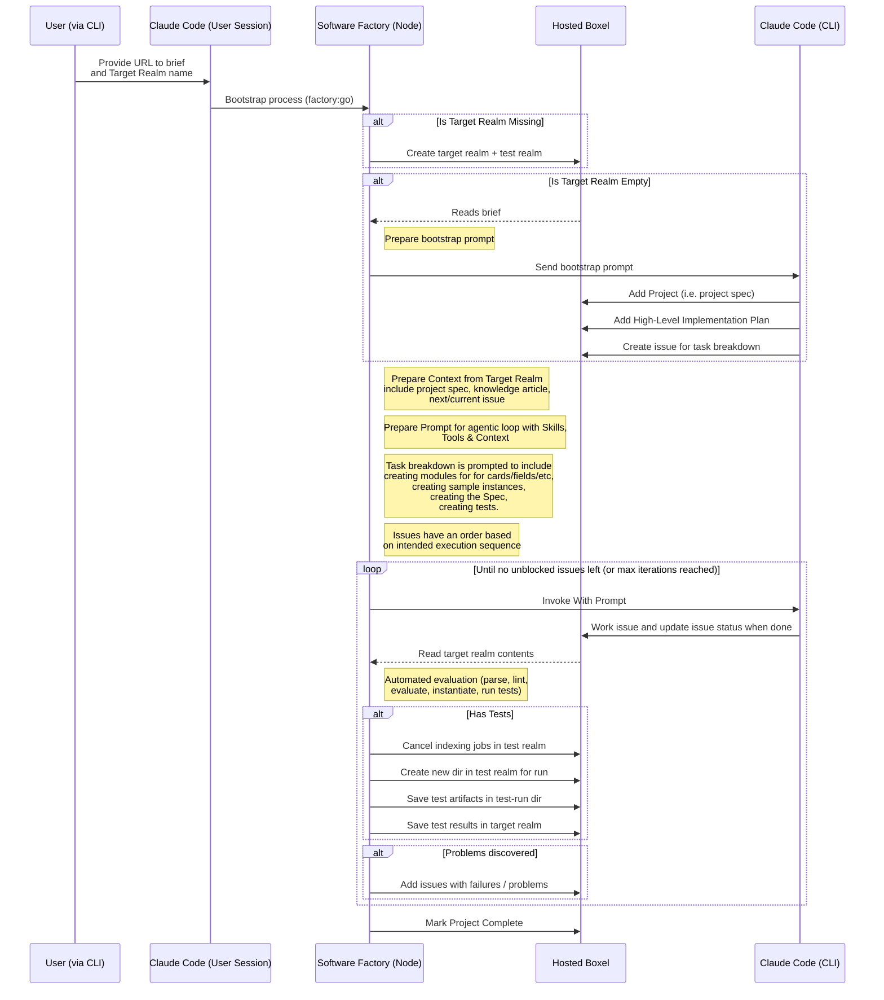

```mermaid
sequenceDiagram
    participant User as User (via CLI)
    participant UserClaudeCode as Claude Code (User Session)
    participant Factory as Software Factory (Node)
    participant HostedBoxel as Hosted Boxel
    participant ClaudeCodeCLI as Claude Code (CLI)

    User->>UserClaudeCode: Provide URL to brief<br>and Target Realm name
    UserClaudeCode->>Factory: Bootstrap process (factory:go)
    alt Is Target Realm Missing
        Factory->>HostedBoxel: Create target realm + test realm
    end
    alt Is Target Realm Empty
        HostedBoxel-->>Factory: Reads brief
        Note right of Factory: Prepare bootstrap prompt
        Factory->>ClaudeCodeCLI: Send bootstrap prompt
        ClaudeCodeCLI->>HostedBoxel: Add Project (i.e. project spec)
        ClaudeCodeCLI->>HostedBoxel: Add High-Level Implementation Plan
        ClaudeCodeCLI->>HostedBoxel: Create issue for task breakdown
    end
    Note right of Factory: Prepare Context from Target Realm<br>include project spec, knowledge article,<br>next/current issue
    Note right of Factory: Prepare Prompt for agentic loop with Skills,<br >Tools & Context
    Note right of Factory: Task breakdown is prompted to include<br>creating modules for for cards/fields/etc,<br>creating sample instances,<br>creating the Spec,<br>creating tests.
    Note right of Factory: Issues have an order based<br>on intended execution sequence
    loop Until no unblocked issues left (or max iterations reached)
        Factory->>ClaudeCodeCLI: Invoke With Prompt
        ClaudeCodeCLI->>HostedBoxel: Work issue and update issue status when done
        HostedBoxel-->>Factory: Read target realm contents
        Note right of Factory: Automated evaluation (parse, lint,<br>evaluate, instantiate, run tests)
        alt Has Tests
            Factory->>HostedBoxel: Cancel indexing jobs in test realm
            Factory->>HostedBoxel: Create new dir in test realm for run
            Factory->>HostedBoxel: Save test artifacts in test-run dir
            Factory->>HostedBoxel: Save test results in target realm
        end
        alt Problems discovered
            Factory->>HostedBoxel: Add issues with failures / problems
        end
    end
    Factory->>HostedBoxel: Mark Project Complete
```
